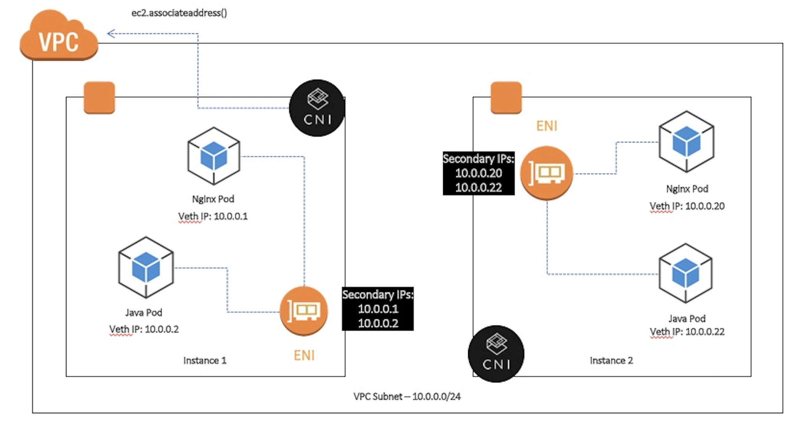
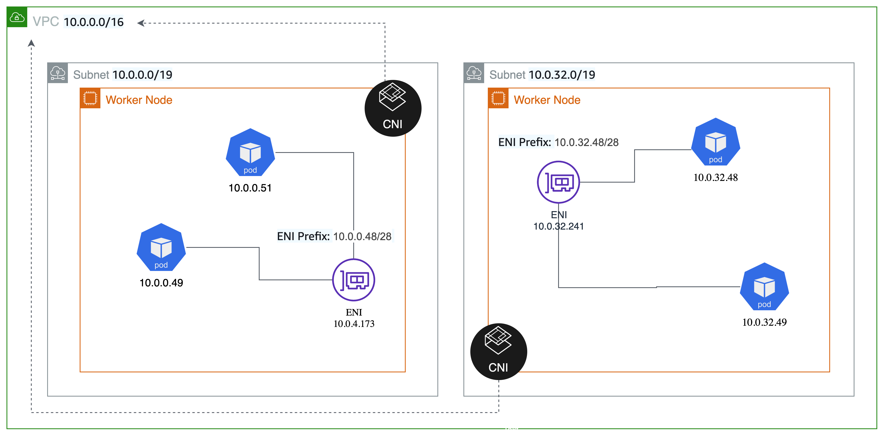
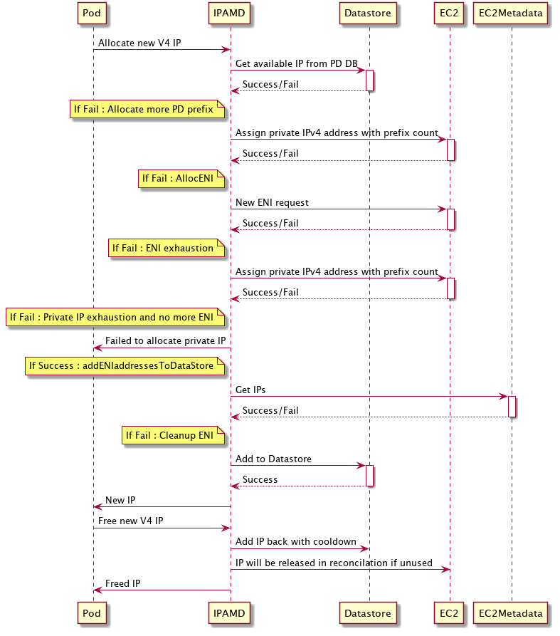

# [k8s] Amazon VPC CNI
> date - 2023.11.13  
> keyworkd - kubernetes, k8s, cni, aws  
> Amazon VPC CNI에 대해 정리  

<br>

## TL;DR
* Amazon EKS에서 Amazon VPC CNI를 통해 VPC IP를 Pod에 할당하여 사용할 수 있다
* EC2 instance type 마다 할당할 수 있는 IP 제한으로 인한 Pod 수 제한이 있고, nitro instance에서 prefix delegation mode를 통해 Pod 수 제한을 증가시킬 수 있다
* 미리 할당된 IP는 미사용으로 남을 수 있고, 이로 인해 subnet의 IP 부족 현상이 발생할 수 있지만 설정을 통해 완화 가능하다
* IP 부족 현상 완화하기 위한 설정은 EC2 API throttling 발생 가능성 + Pod 시작 시간을 희생한다
* 제약 사항이 있지만 가장 간단하고 성능이 우수한 AWS native solution인 Amazon VPC CNI를 사용 권장
* 아니면 Pod 수 제한이 없는 Calico를 사용


<br>

## Amazon VPC CNI?
<div align="center">
  
</div>

* Amazon EKS는 [Amazon VPC CNI(Container Network Interface)](https://github.com/aws/amazon-vpc-cni-k8s) plugin을 통해 기본 VPC networking 지원
  * [CNI(Container Network Interface)](https://github.com/containernetworking/cni)는 container가 어떻게 network에 접근하고, host는 container에 어떻게 network를 할당하고 해제하는지를 정의한 명세
  * EKS managed addon을 제공하지만 설정 수정을 위해 [advanced configuration](https://aws.amazon.com/ko/blogs/containers/amazon-eks-add-ons-advanced-configuration)을 지원하나 제한이 있어 편하진 않다
  * [helm chart](https://artifacthub.io/packages/helm/aws/aws-vpc-cni)는 EKS managed addon보다 자유도가 높다
* EC2 instance 하나에 다수의 IP를 지정할 수 있는데, 이를 이용해 VPC IP를 Pod에 할당해주는 CNI
* EC2 instance type에 따라 지정할 수 있는 IP 제한이 있어서 Node 당 최대 Pod 수가 instance type에 따라 제한이 있다
  * [node에서 사용 가능한 IP address 늘리기](#node에서-사용-가능한-ip-address-늘리기)에서 해결

<br>

### Components
| Component | Description |
|:--|:--|
| [CNI Plugin](https://kubernetes.io/docs/concepts/extend-kubernetes/compute-storage-net/network-plugins/#cni) | host와 pod의 network stack 연결 |
| ipamd | - IPAM(IP Address Management) daemon<br>- 사용 가능한 IP address의 warm-pool 유지<br>- Pod에 IP 할당<br>- ENI를 생성하여 node에 연결, prefix 할당 |


<br>

## EC2 instance와 IP
* [IP addresses per network interface per instance type](https://docs.aws.amazon.com/AWSEC2/latest/UserGuide/using-eni.html#AvailableIpPerENI)의 ENI 당 ip address 만큼 secondary ip가 EC2 instance에 할당된다

| Instance Type | Maximum network interfaces | Private IPv4 addresses per interface | Maximum IP addresses |
|:--|:--|:--|:--|
| m7g.large	| 3	| 10 | 30 |
| m5.xlarge | 4 | 15 | 60 |
| m7g.4xlarge | 8 |	30 | 240 |
| ... | ... | ... | ... |

* xlarge의 경우 15개가 할당되며 pod가 15개 이상 생성되면 ENI가 하나 더 생성되고, secondary ip는 15개 더 할당된다
* 미리 할당되기 때문에 사용하지 않을 가능성도 있고, 이로 인해 IP 부족 현상이 발생할 수 있다
  * e.g. 큰 사이즈의 instance에 3개의 Pod를 사용할 경우(300 GiB instance에 100 GiB Pod 3개 사용)
* VPC CNI의 ipamd가 AWS API를 통해 ENI & IP 부착, 이때 ENI & IP 숫자를 조절하기 위해 `WARM_ENI_TARGET`, `WARM_IP_TARGET`, `MINIMUM_IP_TARGET` 옵션 제공
  * node 당 미사용 IP address를 최소화하기 위해 약간의 pod 시작 시간을 희생

| Option | Description |
|:--|:--|
| ENABLE_PREFIX_DELEGATION | - nitro instance에서 prefix delegation mode 활성화<br>- ENI에 secondary ip를 할당하는 방식보다 빠르고 pod 수 제한이 증가 |
| WARM_PREFIX_TARGET | - prefix delegation mode에서 미리 할당할 prefix(/28) 개수<br>- 할당되는 ip 개수는 `WARM_IP_TARGET`, `MINIMUM_IP_TARGET`로 재정의 가능 |
| WARM_ENI_TARGET | - 여분의 ENI(default. 1)<br>- WARM_IP_TARGET이 설정되면 해당 값 무시 |
| WARM_IP_TARGET | - 한번에 늘릴 IP 수(default. None)<br>- 5로 설정된 경우 ipamd는 항상 5개의 IP를 사용 가능한 상태로 유지, 5개보다 적으면 추가로 ENI 할당<br>- `MINIMUM_IP_TARGET`와 함꼐 사용 권장<br>- 대규모 or Pod 변동이 많은(e.g. batch) cluster에서는 EC2 API throttling이 발생할 수 있으므로 설정을 피한다<br>- dynamic scaling 용도 |
| MINIMUM_IP_TARGET | - 초기화시 최소로 확보할 IP 수(default. None)<br>- pre-scaling 용도<br>- MINIMUM_IP_TARGET=30, WARM_IP_TARGET=2로 설정시 30개의 Pod를 배포하면 CNI는 추가로 2개의 IP를 할당하여 VPC IP 고갈을 방지하면서 scaling시 발생할 수 있는 EC2 API call을 줄이므로 throttling을 방지하여 cluster의 안정성 향상 |

* setting
```sh
$ kubectl set env ds aws-node -n kube-system WARM_IP_TARGET=2 or 5
$ kubectl set env ds aws-node -n kube-system MINIMUM_IP_TARGET=10
```


<br>

## node에서 사용 가능한 IP address 늘리기
* node 당 IP 제한이 있어 instance type에 따라 최대 Pod 수가 제한되지만 설정을 따라 수정 가능
```
instance type별 max pod 수 = ENI의 수 x (ENI 당 제공하는 IP의 수 - 1) + 2
```

<br>

### Prefix Delegation
<div align="center">
  
</div>

* `/28` prefix를 사용하여 ENI에 secondary IP를 할당하는 방식보다 **빠르고(EC2 API call 감소) 더 많은 Pod 배포 가능(Pod 수 제한 증가)**
  * ENI에 붙일 수 있는 최대 secondary IP의 개수만큼 prefix 할당 가능
  * 빠른 IP 할당을 위해 prefix를 pooling하는 **Warm Prefix** 기능 제공
* AWS Console에서 Node ENI에 `/28` CIDR가 할당된 것을 확인 가능
* 더 작은 instance type에서 Pod 실행 시간과 Pod의 밀도가 중요하고 security 요구사항이 node level security group으로 충족될 수 있는 경우 좋은 networking mode
  * 여러 Pod들이 해당 ENI와 연결된 security group에서 공유
  * Pod마다 security group 필요시 sgp(security group for pods) 사용

#### default mode vs prefix mode
| Instance Type | Maximum network interfaces | Private IPv4 addresses per interface | Maximum Pods with default mode | Maximum Pods with prefix mode |
|:--|:--|:--|:--|:--|
| m7g.large	| 3	| 10 | 29 | 110 |
| m5.xlarge | 4 | 15 | 58 | 110 |
| t3.xmall | 3 | 4 | 11 | 110 |

* 110 = default kubelet max pods
* prefix mode를 사용하면 EC2의 IP limit으로 Pod를 생성하지 못하는 경우는 없지만 충분한 subnet의 IP 확보 필요


#### Setting
```sh
$ kubectl set env ds aws-node -n kube-system ENABLE_PREFIX_DELEGATION=true

## check
$ kubectl describe ds aws-node -n kube-system | grep -i delegation
...
      ENABLE_PREFIX_DELEGATION:               true
```

* 적용 확인
```sh
$ kubectl describe node <node name> | grep 'pods\|PrivateIPv4Address'
```

* nitro instance만 사용하도록 설정 with karpenter
```yaml
apiVersion: karpenter.sh/v1beta1
kind: NodePool
...
spec:
  template:
    spec:
      requirements:
        - key: karpenter.k8s.aws/instance-hypervisor
          operator: In
          values: ["nitro"]
```

<br>

### Prefix Delegation Workflow
* prefix mode 활성화시 IP 할당 과정

<div align="center">
  
</div>

#### EC2 API call로 보는 VPC CNI 동작
* primary ENI에 prefix CIDR 할당
```sh
$ aws ec2 assign-priview-ipv4-addresses --network-interface-id eni-xxxxxx --ipv4-prefix-count 1 --secondary-private-ip-address-count 0
```

* IP 요청이 증가함에 따라 primary ENI에 더 많은 prefix 할당
```sh
$ aws ec2 assign-priview-ipv4-addresses --network-interface-id eni-xxxxxx --ipv4-prefix-count 1 --secondary-private-ip-address-count 0
```

* ENI가 할당할 수 있는 prefix의 수가 한계에 도달하면 새로운 ENI 할당
```sh
$ aws ec2 create-network-interface --subnet-id subnet-xxxx --ipv4-prefix-count 1
```

* `ipamd`는 prefix 내에서 사용되는 IP 수의 mapping을 관리, prefix 내에서 IP가 사용되지 않으면 해제
```sh
$ aws ec2 unassign-ipv4-addresses --ipv4-prefix --network-interface-id eni-xxxxxx
```

* prefix를 위해 subnet을 예약하는 것은 다른 AWS 서비스와의 충돌을 피하거나 subnet fragmentation을 최소화하기 위한 경우 유용
```sh
## VPC CNI가 호출하지 않기 떄문에 직접 호출 필요
$ aws ec2 create-subnet-address-reservation --subnet-id subnet-xxxx --type prefix --cidr 69.89.31.0/24
```


<br>

## VPC CNI 기반 Amazon EKS 추천 max pod 수 계산
* max-pods-calculator.sh 설치
```sh
$ curl -o max-pods-calculator.sh https://raw.githubusercontent.com/awslabs/amazon-eks-ami/master/files/max-pods-calculator.sh

$ chmod +x max-pods-calculator.sh
```

* max pod 수 계산
```sh
$ ./max-pods-calculator.sh --instance-type m5.2xlarge --cni-version 1.9.0 --cni-prefix-delegation-enabled
110

$ ./max-pods-calculator.sh --instance-type m5.2xlarge --cni-version 1.9.0
58
```


<br>

## Conclusion
* Amazon VPC CNI를 사용하면 EC2 host networking과 동일한 성능으로 VPC에서 실제 IP를 사용할 수 있고, VPC 내의 AZ 간 routing(cross zone traffic)에 추가 overlay가 필요하지 않은 장점이 있어 특별한 이슈가 없으면 간단하고 성능이 우수한 AWS native solution인 Amazon VPC CNI를 사용 권장
* Amazon VPC CNI는 ENI로 인해 Pod 수 제한이 있어 작은 instance의 경우 실행할 수 있는 Pod 수가 상당히 적을 수 있다
* EC2 API throttling으로 인해 IP 할당을 못해 Pod가 시작에 지연이 발생할 수 있으며 시작 시간에 민감한 배치 서비스라면 다른 CNI를 고려
* 이런 경우 instance type 당 Pod 수 제한이 없는 [Calico](https://www.tigera.io/project-calico)를 사용


<br><br>

> #### Reference
> * [aws/amazon-vpc-cni-k8s - GitHub](https://github.com/aws/amazon-vpc-cni-k8s)
> * [aws/amazon-vpc-cni-k8s Docs](https://github.com/aws/amazon-vpc-cni-k8s/tree/master/docs)
> * [Increase the amount of available IP addresses for your Amazon EC2 nodes](https://docs.aws.amazon.com/ko_kr/eks/latest/userguide/cni-increase-ip-addresses.html)
> * [Amazon VPC CNI plugin increases pods per node limits](https://aws.amazon.com/ko/blogs/containers/amazon-vpc-cni-increases-pods-per-node-limits)
