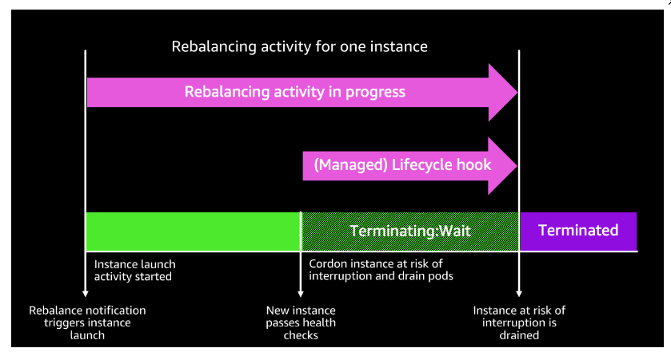
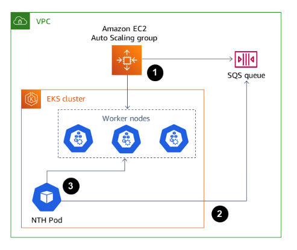

# [k8s] What is AWS Node Termination Handler?
> date - 2023.01.17  
> keyword - k8s, aws, eks, spot  
> AWS Node Termination Handler에 대해 정리  

<br>

## AWS Node Termination Handler(NTH)란?
* Gracefully handle EC2 instance shutdown within Kubernetes
* [EC2 maintenance events](https://docs.aws.amazon.com/ko_kr/AWSEC2/latest/UserGuide/monitoring-instances-status-check_sched.html), [EC2 Spot interruptions](https://docs.aws.amazon.com/ko_kr/AWSEC2/latest/UserGuide/spot-interruptions.html), [ASG Scale-in](https://docs.aws.amazon.com/ko_kr/autoscaling/ec2/userguide/ec2-auto-scaling-lifecycle.html#as-lifecycle-scale-in), [ASG AZ Rebalance](https://docs.aws.amazon.com/ko_kr/autoscaling/ec2/userguide/auto-scaling-benefits.html#AutoScalingBehavior.InstanceUsage) 같이 EC2 instance를 사용할 수 없게 만들어 가용성에 문제를 일으키는 event에 대해 Kubernetes control plane이 적절하게 대응하도록 하기 위해 사용
* EKS cluster 같은 AWS에서 실행되는 모든 Kubernetes cluster에서 사용할 수 있다
* self-managed node group 또는 self-managed node group에서 spot instance를 사용하는 경우 필요
  * [Spot - Managed node groups](https://docs.aws.amazon.com/eks/latest/userguide/managed-node-groups.html#managed-node-group-capacity-types-spot), [SPOT CONFIGURATION AND LIFECYCLE](https://www.eksworkshop.com/beginner/150_spotnodegroups/spotlifecycle/#interruption-handling-in-spot-managed-node-groups)를 보면 EKS managed node group은 ASG lifecycle hooks을 사용해 ASG termination event를 기반으로 drain하므로 필요 없다
  * AWS Fargate는 node가 없으니 당연히 필요 없다
* EC2 spot instance를 사용하면 AWS에서 미사용 EC2 용량을 활용할 수 있어서 on-demand 대비 최대 90% 할인된 가격으로 이용 가능
spot instance 종료 2분 전에 전달되는 `Spot Instance interruptions`을 통해 언제든 중지 될 수 있다
  * spot instance는 일시적으로 리소스를 많이 사용하는 배치 작업에 유용
* EC2 spot instance가 제공하는 비용 절감 및 성능 향상 효과를 손쉽게 활용하면서 EC2 spot instance의 단점인 종료(언제 종료될지 알 수 없음)를 정상적으로 처리할 수 있게 해준다
  * spot instance interupptions을 수신하여 Kubernetes API로 drain/cordon을 수행하여 Pod들을 다른 node로 옮겨 node의 graceful termination 처리
  * spot instance interupptions(spot instance 종료 알람 발생) -> cordon(node에 pod 배치 중지) -> drain(node의 pod 재배치) -> node termination


<br>

> #### EKS Managed node group에서 종료 처리
> <div align="center">
>   
> </div>


<br>

## NTH mode
* IMDS(Instance Metadata Service), Queue 2가지 모드로 동작
* `enableSqsTerminationDraining` 값에 따라 IMDS(false)와 Queue(true) processor 사용

| Feature | IMDS Processor | Queue Processor |
|:--:|:--:|:--:|
| [Spot Instance Termination Notifications(ITN)](https://docs.aws.amazon.com/AWSEC2/latest/UserGuide/spot-instance-termination-notices.html) | O | O |
| [Schduled Events](https://docs.aws.amazon.com/AWSEC2/latest/UserGuide/monitoring-instances-status-check_sched.html) | O | O |
| [Instance Rebalance Recommendation](https://docs.aws.amazon.com/AWSEC2/latest/UserGuide/rebalance-recommendations.html) | O | O |
| ASG Termination Lifecycle Hooks([ASG Scale-In](https://docs.aws.amazon.com/autoscaling/ec2/userguide/lifecycle-hooks.html), [Availability Zone Rebalance](https://docs.aws.amazon.com/autoscaling/ec2/userguide/ec2-auto-scaling-capacity-rebalancing.html), [Unhealthy Instances](https://docs.aws.amazon.com/autoscaling/ec2/userguide/ec2-auto-scaling-health-checks.html)...) | X | O |
| [Instance State Change Events](https://docs.aws.amazon.com/AWSEC2/latest/UserGuide/monitoring-instance-state-changes.html) | X | O |


<br>

## IMDS(Instance Metadata Service) Processor
* `DaemonSet`을 이용해 node마다 1개씩 실행
* [Instance Metadata Service](https://docs.aws.amazon.com/ko_kr/AWSEC2/latest/UserGuide/ec2-instance-metadata.html)의 `/spot`, `/events`를 모니터링하며 event에 따라 대응하여 node cordon/drain 수행

<br>

### 모니터링하는 IMDS path 세분화하기

#### enableSpotInterruptionDraining
* Spot interruptions(spot instance 종료) event를 받으면 drain node

#### enableRebalanceMonitoring
* Rebalance Recommendation event - spot instance가 종료될 가능성이 높아질 경우 미리 교체할 수 있도록 기회를 제공

* NTH는 Rebalance Recommendation event를 받으면 cordon node
  * Rebalance Recommendation event에 대해서만 기본 동작이 cordon이고, 나머지 event는 cordon/drain으로 동작
  * ASG가 사용되는지와 ASG가 rebalance event에 대해 instance를 교체하도록 설정되어 있는지 알 수 없기 때문
* ASG capacity rebalance(default. disable)를 활성화하면 해당 spot instance를 교체한다
  * 활성화하지 않으면 spot instance 종료 전까지 남아 있어 Rebalance Recommendation event를 비용 효율적으로 대응하지 않게된다
  * capacity rebalance로 인해 빈번한 instance 교체가 이슈가 된다면 EventDridge에서 EC2 Instance Rebalance Recommendation를 제외하여 NTH가 처리하지 못하게하고, spot interruption만 처리하게 할 수 있다
* ASG의 rebalance recommendations가 활성화되어 있으면 `enableRebalanceDraining`를 사용해 drain으로 동작하게할 수 있다

#### enableScheduledEventDraining
* instance 예약 event를 받으면 유지 관리 기간이 시작되기 전에 drain node


<br>

### Install
#### Deploy the AWS Node Termination Handler helm chart
> helm chart 설정은 [Configuration](https://github.com/aws/eks-charts/tree/master/stable/aws-node-termination-handler#configuration) 확인
```sh
$ helm repo add eks https://aws.github.io/eks-charts

$ helm upgrade --install aws-node-termination-handler \
               --namespace kube-system \
               --version 1.18.2 \
               --set enableSpotInterruptionDraining="true" \
               --set enableScheduledEventDraining="true" \
               --set enableRebalanceMonitoring="true" \
               --set enableRebalanceDraining="true" \
               --set nodeSelector.lifecycle=spot \  # specific nodes. or nodeSelector.type=self-managed-spot 
               --set webhookURL=https://hooks.slack.com/services/YOUR/SLACK/URL \
                eks/aws-node-termination-handler

$ kubectl get daemonsets --all-namespaces
```


<br>

## Queue Processor
<div align="center">
  
</div>

* `Deployment`을 이용해 cluster내에 최소 1개씩 실행
* ASG lifecycle events, EC2 status change events, Spot interruption Termination Notice events, Spot Rebalance Recommendation events에 대해 Amazon EventBridge에서 SQS queue를 모니터링하여 node cordon/drain 수행
* SQS와 EC2 API에 대한 AWS IAM 권한 필요
* IMDS processor보다 ASG에 대한 event를 더 처리하지만 SQS queue, EventBridge rules 등 AWS 서비스를 추가로 구성해야한다
* IMDS처럼 event에 대해 세분화된 설정이 불가능하며 event를 세분화하려면 SQS queue로 보내지 않도록 EventBridge rule을 수정
* Queue Processor에서 모든 event에 대해 cordon/drain으로 동작하며 `cordon-only=true`면 cordon으로 동작

<br>

### Install
* 여기서는 AWS CLI로 생성하지만 실제로는 IaC tool(e.g. [CloudFormation](https://docs.aws.amazon.com/ko_kr/AWSCloudFormation/latest/UserGuide/Welcome.html), [Terraform](https://www.terraform.io/), [AWS CDK](https://aws.amazon.com/ko/cdk/) 등)을 사용하는 것을 권장

#### Amazon Simple Queue Service (SQS) Queue
```sh
## Queue Policy
$ QUEUE_POLICY=$(cat <<EOF
{
    "Version": "2012-10-17",
    "Id": "MyQueuePolicy",
    "Statement": [{
        "Effect": "Allow",
        "Principal": {
            "Service": ["events.amazonaws.com", "sqs.amazonaws.com"]
        },
        "Action": "sqs:SendMessage",
        "Resource": [
            "arn:aws:sqs:${AWS_REGION}:${ACCOUNT_ID}:${SQS_QUEUE_NAME}"
        ]
    }]
}
EOF
)

## make sure the queue policy is valid JSON
$ echo "$QUEUE_POLICY" | jq .

## Save queue attributes to a temp file
$ cat << EOF > /tmp/queue-attributes.json
{
  "MessageRetentionPeriod": "300",
  "Policy": "$(echo $QUEUE_POLICY | sed 's/\"/\\"/g' | tr -d -s '\n' " ")"
}
EOF

$ aws sqs create-queue --queue-name "${SQS_QUEUE_NAME}" --attributes file:///tmp/queue-attributes.json
```

#### AutoScaling Group Termination Lifecycle Hook
* EventBridge를 사용할 때 ASG에 termination lifecycle hook을 추가
```sh
$ aws autoscaling put-lifecycle-hook \
                  --lifecycle-hook-name=my-k8s-term-hook \
                  --auto-scaling-group-name=my-k8s-asg \
                  --lifecycle-transition=autoscaling:EC2_INSTANCE_TERMINATING \
                  --default-result=CONTINUE \
                  --heartbeat-timeout=300
```

#### Node group ASG tagged with key=aws-node-termination-handler/managed
* `checkTagBeforeDraining(default. true)`로 인해 `key=aws-node-termination-handler/managed` tag가 설정된 instance만 관리
  * k8s cluster에 포함되지 않은 ASG도 있는 경우 NTH가 관리하지 않게 한다
  * [create rules that only manage certain ASGs](https://docs.aws.amazon.com/autoscaling/ec2/userguide/automating-ec2-auto-scaling-with-eventbridge.html), [supported ASG events](https://docs.aws.amazon.com/autoscaling/ec2/userguide/ec2-auto-scaling-event-reference.html)를 참고하여 EventBridge rule에 resource ARN을 추가하여 NTH가 관리하는 리소스를 제어할 수도 있다
* tag를 설정하지 않으려면 비활성화하면 되고, tag를 변경하고 싶으면 `managedTag(default. aws-node-termination-handler/managed)`로 수정
* instance 마다 tagging하지 않고, ASG tagging을 통해 instance로 propagation하는 것을 권장
```sh
$ aws autoscaling create-or-update-tags \
                  --tags ResourceId=my-auto-scaling-group,ResourceType=auto-scaling-group,Key=aws-node-termination-handler/managed,Value=,PropagateAtLaunch=true
```

#### Amazon EventBridge Rule
* ASG에서 SQS로 직접 event를 보내는 경우에는 skip
```sh
$ aws events put-rule \
  --name MyK8sASGTermRule \
  --event-pattern "{\"source\":[\"aws.autoscaling\"],\"detail-type\":[\"EC2 Instance-terminate Lifecycle Action\"]}"

$ aws events put-targets --rule MyK8sASGTermRule \
  --targets "Id"="1","Arn"="arn:aws:sqs:us-east-1:123456789012:MyK8sTermQueue"

$ aws events put-rule \
  --name MyK8sSpotTermRule \
  --event-pattern "{\"source\": [\"aws.ec2\"],\"detail-type\": [\"EC2 Spot Instance Interruption Warning\"]}"

$ aws events put-targets --rule MyK8sSpotTermRule \
  --targets "Id"="1","Arn"="arn:aws:sqs:us-east-1:123456789012:MyK8sTermQueue"

$ aws events put-rule \
  --name MyK8sRebalanceRule \
  --event-pattern "{\"source\": [\"aws.ec2\"],\"detail-type\": [\"EC2 Instance Rebalance Recommendation\"]}"

$ aws events put-targets --rule MyK8sRebalanceRule \
  --targets "Id"="1","Arn"="arn:aws:sqs:us-east-1:123456789012:MyK8sTermQueue"

$ aws events put-rule \
  --name MyK8sInstanceStateChangeRule \
  --event-pattern "{\"source\": [\"aws.ec2\"],\"detail-type\": [\"EC2 Instance State-change Notification\"]}"

$ aws events put-targets --rule MyK8sInstanceStateChangeRule \
  --targets "Id"="1","Arn"="arn:aws:sqs:us-east-1:123456789012:MyK8sTermQueue"

$ aws events put-rule \
  --name MyK8sScheduledChangeRule \
  --event-pattern "{\"source\": [\"aws.health\"],\"detail-type\": [\"AWS Health Event\"],\"detail\": {\"service\": [\"EC2\"],\"eventTypeCategory\": [\"scheduledChange\"]}}"

$ aws events put-targets --rule MyK8sScheduledChangeRule \
  --targets "Id"="1","Arn"="arn:aws:sqs:us-east-1:123456789012:MyK8sTermQueue"
```

#### IAM Role for the aws-node-termination-handler Queue Processing Pods
* [Amazon EKS IAM Roles for Service Accounts](https://docs.aws.amazon.com/eks/latest/userguide/iam-roles-for-service-accounts.html), [IAM Instance Profiles for EC2](https://docs.aws.amazon.com/IAM/latest/UserGuide/id_roles_use_switch-role-ec2_instance-profiles.html), [Kiam](https://github.com/uswitch/kiam), [kube2iam](https://github.com/jtblin/kube2iam) 같이 다양한 방법으로 아래의 IAM Policy를 aws-node-terminate-handler에 할당할
```json
{
    "Version": "2012-10-17",
    "Statement": [
        {
            "Effect": "Allow",
            "Action": [
                "autoscaling:CompleteLifecycleAction",
                "autoscaling:DescribeAutoScalingInstances",
                "autoscaling:DescribeTags",
                "ec2:DescribeInstances",
                "sqs:DeleteMessage",
                "sqs:ReceiveMessage"
            ],
            "Resource": "*"
        }
    ]
}
```

#### Deploy the AWS Node Termination Handler helm chart
> helm chart 설정은 [Configuration](https://github.com/aws/eks-charts/tree/master/stable/aws-node-termination-handler#configuration) 확인
```sh
$ helm repo add eks https://aws.github.io/eks-charts

$ helm upgrade --install aws-node-termination-handler \
               --namespace kube-system \
               --version 1.18.2 \
               --set enableSqsTerminationDraining="true" \
               --set queueURL=https://sqs.us-east-1.amazonaws.com/0123456789/my-term-queue \
               --set webhookURL=https://hooks.slack.com/services/YOUR/SLACK/URL \
                eks/aws-node-termination-handler

$ kubectl get daemonsets --all-namespaces
```


<br>

## Test
* ASG의 instance refresh를 통해 node를 교체해보면서 pod가 이동이 잘되는지 확인
* [Amazon EC2 Metadata Mock(AEMM)](https://github.com/aws/amazon-ec2-metadata-mock)으로 event trigger
  * AEMM - local test를 위해 Amazon EC2 metadata service를 simulate tool

### Amazon EC2 Metadata Mock으로 event trigger
* [aws/eks-charts/stable/amazon-ec2-metadata-mock](https://github.com/aws/eks-charts/tree/master/stable/amazon-ec2-metadata-mock) 설치
```sh
$ helm repo add eks https://aws.github.io/eks-charts

$ helm upgrade --install amazon-ec2-metadata-mock \
               --namespace default


                 --namespace default --set aemm.spot.action="stop",aemm.mockDelaySec=120

```

* NTH의 instance metadata url을 수정
```sh
$ helm upgrade --install aws-node-termination-handler \
               --namespace kube-system \
               ... \
               --instanceMetadataURL="http://amazon-ec2-metadata-mock-service:1338" \
                eks/aws-node-termination-handler
```

* event trigger
```sh
## local
$ kubectl port-forward service/amazon-ec2-metadata-mock-service 1338

$ curl http://localhost:1338/latest/meta-data/spot/instance-action
{
    "action": "terminate",
    "time": "2020-05-04T18:11:37Z"
}

## inside cluster
$ curl http://amazon-ec2-metadata-mock-service.default.svc.cluster.local:1338/latest/meta-data/spot/instance-action
{
    "action": "terminate",
    "time": "2020-05-04T18:11:37Z"
}
```


<br>

## Conclusion
* ASG Lifecycle Hook 처리시에는 [Amazon EKS Node Drainer](https://github.com/aws-samples/amazon-k8s-node-drainer) 같이 Lambda를 사용하는 방법도 있지만 Spot instance를 사용한다면 NTH를 사용하는게 더 좋다
* IMDS mode를 사용할 경우(DaemonSet) cluster에서 불필요하게 리소스를 차지하므로 DaemonSet으로 인한 리소스 비효율성이 올라가는 large cluster에서는 queue mode를 사용하는게 좋아 보인다
* CA(Cluster Autoscaler)가 ASG의 scaling을 처리(scale in시 drain)하므로 ASG Termination Lifecycle Hooks 처리만을 위해서 queue mode를 사용할 필요는 없어보인다


<br><br>

> #### Reference
> * [AWS Node Termination Handler](https://github.com/aws/aws-node-termination-handler)
> * [eks-charts/stable/aws-node-termination-handler](https://github.com/aws/eks-charts/tree/master/stable/aws-node-termination-handler)
> * [[Question] Graceful Node Shutdown in k8s 1.21 #548](https://github.com/aws/aws-node-termination-handler/issues/548)
> * [AWS Node Termination Handler - Amazon EKS Blueprints Quick Start](https://aws-quickstart.github.io/cdk-eks-blueprints/addons/aws-node-termination-handler)
> * [aws/amazon-ec2-metadata-mock](https://github.com/aws/amazon-ec2-metadata-mock)
> * [aws/eks-charts/stable/amazon-ec2-metadata-mock](https://github.com/aws/eks-charts/tree/master/stable/amazon-ec2-metadata-mock)
