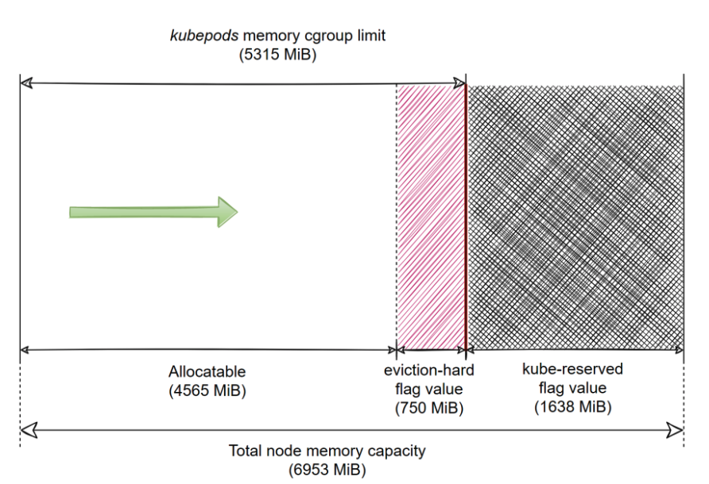
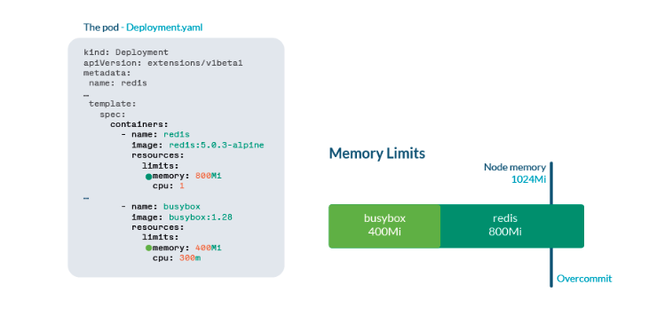
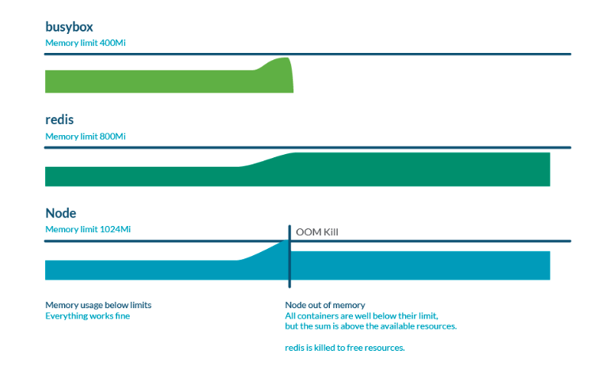
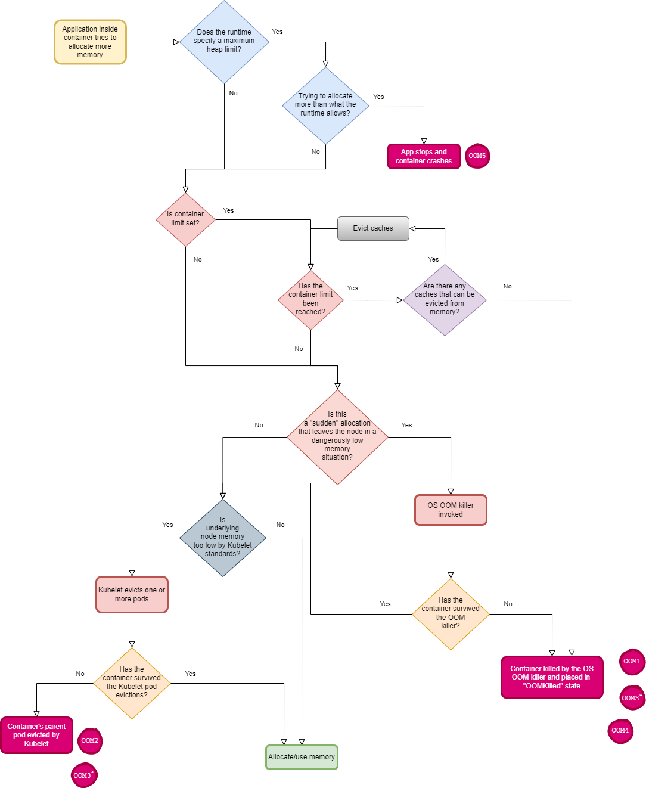
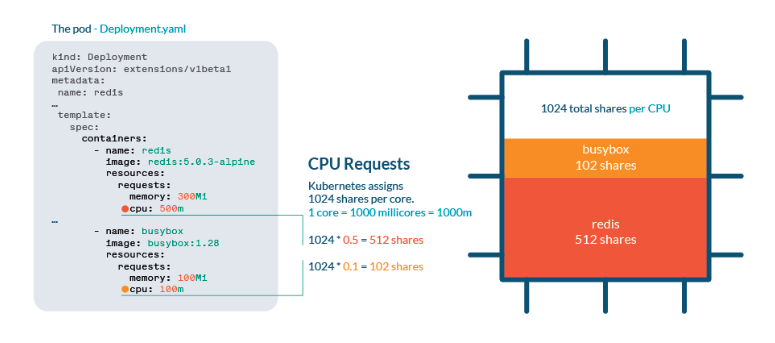
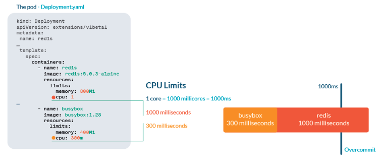
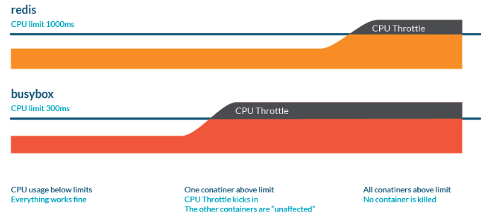
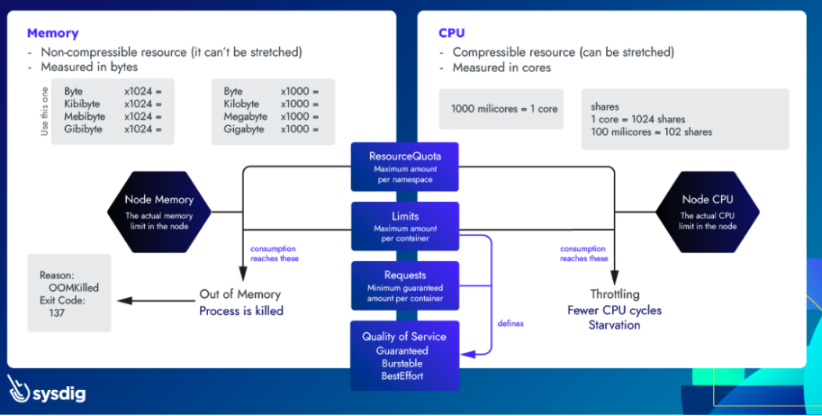

# [k8s] About Kubernetes OOM and CPU Throttle
> date - 2022.05.24  
> keyworkd - kubernetes, oom, cpu throttling  
> Kubernetes에서 OOM과 CPU throttling에 대해 정리

<br>

## What is OOMKilled (exit code 137)
* 허용된 memory보다 많이 사용해서 container가 죽었음을 의미
* memory는 incompressible resource로 limit를 초과하면 `OOM(Out Of Memory) Killer`가 process를 강제 종료되며 `dmesg`에서 아래와 같은 메시지를 볼 수 있다
```
[XXXXX] Out of memory: Kill process <PID> (java) score <SCORE> or sacrifice child
[XXXXX] Killed process <PID> (java) total-vm:XXXkB, anon-rss:XXXkB, file-rss:XXXkB, shmem-rss:XXXkB
```
* `oom_score`가 높을수록 OOM Killer에 의해 종료될 가능성이 높다
  * `oom_score_adj`를 사용해 OOM process를 정의하고 종료 시기를 정의할 수 있다


<br>

## QoS와 oom_score_adj
* Kubernetes는 QoS(Quality of Service)에 따라 `oom_score_adj`를 정의

| QoS | oom_score_adj |
|:--|:--|
| Guaranteed | -997 |
| BestEffort | 1000 |
| Burstable | min(max(2, 1000 - (1000* memoryRequestBytes) / machineMemoryCapacityBytes), 999) |

* `Guaranteed` - node에 memory가 부족해지면 낮은 `oom_score_adj`로 가장 마지막에 제거
* `BestEffort` - 가장 먼저 제거

<br>

### QoS class 확인
* 모든 Pod의 QoS class 확인
```sh
$ kubectl get pods -o custom-columns=Name:.metadata.name,QoS:.status.qosClass
```

* Pod의 QoS class 확인
```sh
$ kubectl get pods -o jsonpath='{.status.qosClass}' [pod name]
```


<br>

## Troubleshooting OOMKilled
| 현상 | 조치 |
|:--|:--|
| memory limit에 도달했고, application의 load가 높은 경우 | memory limit 증가 |
| memory limit에 도달했고, memory leak이 발생하는 경우 | memory leak 해결 |
| node is overcommitted<br>(Pod에서 사용하는 memory total이 node의 total memory보다 큰 경우) | memory request/limit 조절하여 절절한 scheduling 유도 |

<br>

### node에서 사용 가능한 memory
<div align="left">
  
</div>

<br>

### overcommit
<div align="left">
  
</div>

<br>

### OOMKilled가 발생하는 경우
<div align="left">
  
</div>

<br>

### OOM Flowchart
<div align="left">
  
</div>

<br>

> #### Java application의 memory 사용률
> ```
> Java process memory(RSS) = Java heap memory + metaspace + native memory
> ```
> * Java heap memory (set via `-Xms` and `-Xmx`)
> * Metaspace
> * Native memory


<br>

## CPU throttling
* CPU 사용은 system scheduler에게 위임
* compressible resource로 여유 resource가 있다면 추가로 사용 가능
* CPU request와 limit는 서로 다른 메커니즘 사용

<br>

### CPU request
<div align="left">
  
</div>

* shares system으로 관리
* 각 core는 1024개의 share로 나누어져 우선 순위 지정
* share가 더 많은 리소스는 더 많은 CPU time을 예약
* CPU가 고갈되는 순간에는 share가 CPU 리소스를 보장하지 않는다

<br>

### CPU limit
<div align="left">
  
</div>

* CPU quota system으로 관리
* CPU time을 100ms periods로 나누고 node의 total CPU를 동일한 %로 할당
  * limit.cpu: 100ms 면 period 당 10ms 사용
* 할당량보다 더 사용하려고 하면 throttling이 발생하여 성능 이슈가 발생하지만 container는 제거되지 않는다

<br>

### CPU Throttle이 발생하는 경우
<div align="left">
  
</div>


<br>

## Resource troubleshooting cheatsheet
<div align="left">
  
</div>


<br>

## Conclusion
* k8s에서 CPU와 memory는 서로 다른 메커니즘을 가지고 관리되므로 이해하고 적절하게 사용하는게 중요하다


<br><br>

> #### Reference
> * [How to troubleshoot Kubernetes OOM and CPU Throttle](https://sysdig.com/blog/troubleshoot-kubernetes-oom/)
> * [Out-of-memory (OOM) in Kubernetes – Part 4: Pod evictions, OOM scenarios and flows leading to them](https://mihai-albert.com/2022/02/13/out-of-memory-oom-in-kubernetes-part-4-pod-evictions-oom-scenarios-and-flows-leading-to-them/)
> * [Reserve Compute Resources for System Daemons](https://kubernetes.io/docs/tasks/administer-cluster/reserve-compute-resources/#kube-reserved)
> * [Memory Problem: Process killed by OOM Killer](https://support.cloudbees.com/hc/en-us/articles/115002718531-Memory-Problem-Process-killed-by-OOM-Killer)
> * [How to Configure the Linux Out-of-Memory Killer](https://www.oracle.com/technical-resources/articles/it-infrastructure/dev-oom-killer.html)
> * [Out of memory: Kill process or sacrifice child](https://plumbr.io/blog/memory-leaks/out-of-memory-kill-process-or-sacrifice-child)
> * [Taming the OOM killer](https://lwn.net/Articles/317814/)
> * [OOM Killer and Java applications in containers](https://medium.com/logistimo-engineering-blog/oom-killer-and-java-applications-c0dfd7f6b036)
> * [Chapter 13  Out Of Memory Management](https://www.kernel.org/doc/gorman/html/understand/understand016.html)
