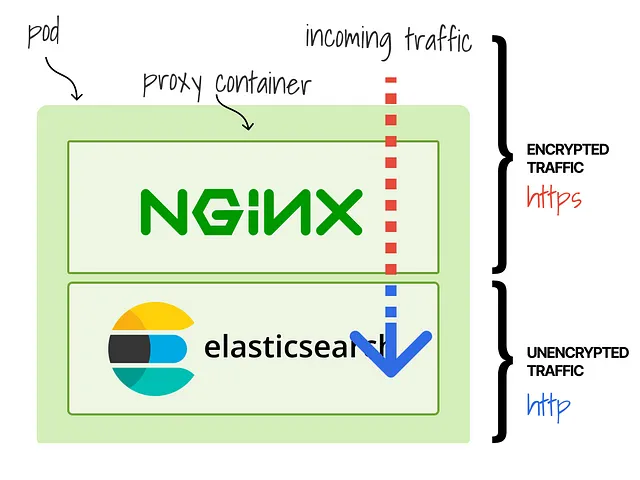
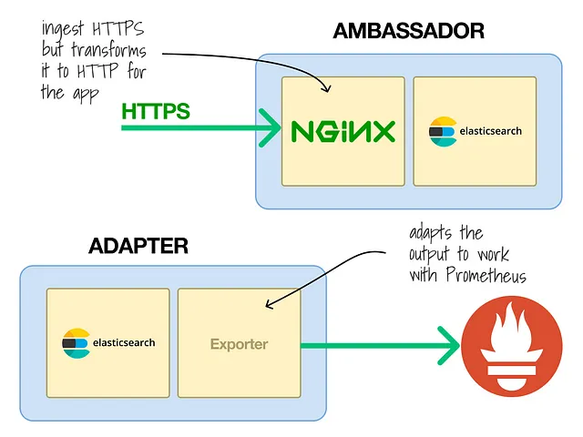

# [k8s] Container patterns
> date - 2022.03.01  
> keyworkd - kubernetes, container  
> stdout 대신 file에 logging, prometheus, HTTPS 미지원하는 legacy apps을 Kubernetes로 migration할 떄 사용할 수 있는 container pattern에 대해 정리

 

## Container pattern
* Ambassador
* Adapter
* Sidecar
* Init

 

## Ambassador
* Pod에 입력을 처리할 수 있는 추가 container가 있는 경우
* e.g. nginx, [Cloudflare tunnel](https://developers.cloudflare.com/cloudflare-one/tutorials/many-cfd-one-tunnel)로 https 처리

  
  

 

## Adapter
* container의 출력을 처리하는 container가 경우
* e.g. metrics을 prometheus metrics로 변환하여 출력

  
  

 

## Sidecar
* app을 향상시키는 모든 container
* e.g. file의 log를 stdout으로 출력, [Injecting secrets](https://developer.hashicorp.com/vault/docs/platform/k8s/injector), 변경 사항이 있으면 [Reloading ConfigMaps](https://github.com/jimmidyson/configmap-reload), [Caching](https://thenewstack.io/tutorial-apply-the-sidecar-pattern-to-deploy-redis-in-kubernetes)

  

 

## Init
* app이 실행하기 위한 초기 작업을 수행하는 container
* e.g. Elasticsearch의 mmap count(virtual memory) 설정

  

  

> #### Reference
> * [4 design patterns for containers kubernetes](https://itnext.io/4-container-design-patterns-for-kubernetes-a8593028b4cd)
> * [Design patterns for container-based distributed systems](https://static.googleusercontent.com/media/research.google.com//en/pubs/archive/45406.pdf)
