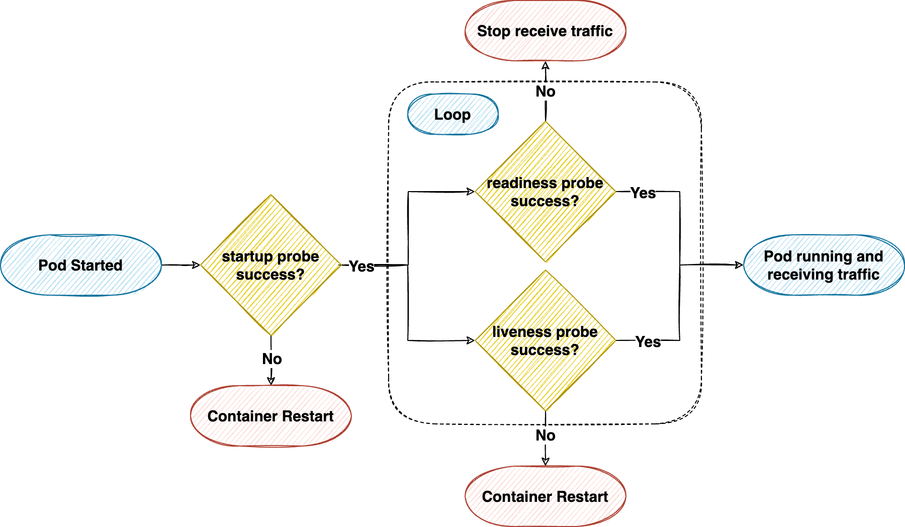

# [k8s] Pod health check with readiness probe and liveness probe
> date - 2018.05.06  
> keyword - kubernetes, k8s, health check  
> kubernetes에서 Pod의 container의 health check를 위해 사용하는 readinessProbe, livenessProbe에 대해 같이 정리  

<br>

## Probe
* `kubelet`이 주기적으로 container의 handler 호출
* 문제 발생시 container의 process가 자체적으로 중단될 수 있는 경우에는 `kubelet`이 Pod의 restartPolicy에 따른 동작을 수행하기 때문에 반드시 필요하지 않다

<div align="center">
  
</div>


<br>

## Liveness Probe
* container가 동작 중인지 확인할 때 사용
* `kubelet`은 liveness probe를 사용해 conatiner restart를 결정
* application은 실행되다가 broken state가 되어 restart를 제외하고 복구할 수 없는 경우 사용하면 유용
  * deadlock 등 발생시 kubernetes에서 자동으로 감지하여 restart
* readiness probe보다 실패할 떄까지 2배 정도 더 많은 시간을 허용해야한다
  * periodSeconds + failureThreshold의 조합으로 더 많은 시간 허용

<br>

### [ExecAction](https://kubernetes.io/docs/reference/generated/kubernetes-api/v1.14/#execaction-v1-core)
```yaml
apiVersion: v1
kind: Pod
metadata:
  name: exec-liveness
spec:
  containers:
    - name: exec-liveness
      ...
      livenessProbe:
        exec:  # here
          command:
            - cat
            - /tmp/health
        initialDelaySeconds: 5
        periodSeconds: 5
```
* container 내에서 지정된 command 실행
* 0이 return되면 성공, 0 이외의 값은 실패


<br>

### HTTPGetAction(https://kubernetes.io/docs/reference/generated/kubernetes-api/v1.14/#httpgetaction-v1-core)
```yaml
apiVersion: v1
kind: Pod
metadata:
  name: http-liveness
spec:
  containers:
    - name: http-liveness
      ...
      livenessProbe:
        httpGet:  # here
          path: /healthz
          port: 8080
          httpHeaders:
            - name: Custom-Header
              value: Awesome
        initialDelaySeconds: 5
        periodSeconds: 5
```
* `/healthz`에 대해 handler가 success code를 return하면 성공
  * `200 <= x < 400`면 success, 이외에는 failure

<br>

> 1.13 이전에는 Node의 환경변수 http_proxy(or HTTP_PROXY)가 설정된 경우 http liveness probe는 해당 proxy를 사용  
> 1.13 이후에는 liveness probe에 영향을 미치지 않는다  


<br>

### [TCPSocketAction](https://kubernetes.io/docs/reference/generated/kubernetes-api/v1.14/#tcpsocketaction-v1-core)
```yaml
apiVersion: v1
kind: Pod
metadata:
  name: tcp-liveness
spec:
  containers:
    - name: tcp-liveness
      ...
      livenessProbe:
        tcpSocket:  # here
          port: 8080
        initialDelaySeconds: 5
        periodSeconds: 5
      
```
* kubelet은 지정된 port의 socket을 열려고 시도
  * 연결할 수 없으면 실패


<br>

### Use a named port
* HTTP, TCP probe에 named container port 사용 가능
```yaml
ports:
  - name: liveness-port  # here
    containerPort: 8080
    hostPort: 8080
livenessProbe:
  httpGet:
    path: /healthz
    port: liveness-port  # here
```


<br>

## Readiness Probe
* `kubelet`은 readiness probe를 사용해 container가 traffic을 처리할 수 있는지 확인
* Pod의 모든 container가 ready되면 Pod Ready로 간주
* service의 backend로 사용되는 Pod의 traffic을 제어할 수 있다
  * Non Ready인 Pod는 service의 load balancing에서 제거
* application이 일시적으로 traffic을 처리할 수 없는 경우를 처리할 수 있다
  * 최초 config loading, 의존성을 가지고 있는 external service의 장애 등
* application과 연결된 dependency의 가용성도 확인 필요
  * dependency의 장애시 Pod restart는 거의 도움이 되지 않으니 readiness probe로 확인하는게 좋다

```yaml
apiVersion: v1
kind: Pod
metadata:
  name: exec-readiness
spec:
  containers:
    - name: exec-readiness
      ...
      readinessProbe:
        exec:
          command:
            - cat
            - /tmp/health
        initialDelaySeconds: 5
        periodSeconds: 5
```


<br>

## Configure Probes
* `initialDelaySeconds`
  * 1번째 probe 수행 전 기다릴 시간
* `periodSeconds`
  * probe 수행 빈도(s)
  * default - 10
  * min - 1
* `timeoutSeconds`
  * probe timeout
  * default - 1
  * min - 1
* `successThreshold`
  * probe 실패 후 성공으로 판단되기 위한 최소 연속 threshold
  * default - 1(liveness를 위해선 must 1)
  * min - 1
* `failureThreshold`
  * probe 실패로 판단되기 위한 최소 연속 threshold
  * default - 3
  * min - 1

### HTTP Probe의 additional fields
* `host`
  * host name
  * default - Pod IP
* `scheme`
  * host connection에 사용되는 scheme(HTTP or HTTPS)
  * default - HTTP
  * HTTPS면 `kubelet`은 **certficate verification skip**
* `path`
  * HTTP server의 access path
* `httpHeaders`
  * request에 설정할 custom header
* `port`
  * container에 access할 port name or number(1 ~ 65535)


<br>

## Startup Probe
* container가 시작되었는지 확인할 때 사용
* startup probe가 설정되어 있으면, 성공할 떄까지 다른 probe가 활성화되지 않는다
  * startup이 오래 걸릴 때(initialDelaySeconds + failureThreshold x periodSeconds 이후 시작) readiness/livenessProbe에 initialDelaySeconds를 설정하지 않아도 되므로 유용
* startup probe가 실패하면 liveness probe 같이 restart policy에 의해 restart


<br>

## Example
* spring boot application
* dependency의 가용성 확인을 위해 readiness group을 설정한다  
```yaml
management:
  port: 9090
  health:
    redis:
      enabled: false
    elasticsearch:
      enabled: false
  endpoint:
    health:
      probes:
        enabled: true
      show-details: always
      group:
        readiness:
          include:
            - readinessState
            - db
            - redis
            - elasticsearch
            - mongo
        liveness:
          include:
            - livenessState
```
```json
// GET /actuator/health/readiness
{
  "status": "UP",
  "components": {
    "db": {
      "status": "UP",
      "components": {
        "dataSource": {
          "status": "UP",
          "details": {
            "database": "MySQL",
            "validationQuery": "isValid()"
          }
        }
      }
    },
    "readinessState": {
      "status": "UP"
    },
    "redis": {
      "status": "UP",
      "details": {
        "version": "7.0.12"
      }
    }
    ...
  }
}

// GET /actuator/health/liveness
{
  "status": "UP",
  "components": {
    "livenessState": {
      "status": "UP"
    }
  }
}
```
```yaml
apiVersion: v1
kind: Pod
spec:
  containers:
    - name: 
      ports:
        - name: app-port
          containerPort: 8080
          hostPort: 8080
      readinessProbe:
        httpGet:
          path: /actuator/health/readiness
          port: app-port
        periodSeconds: 10
        timeoutSeconds: 3
        successThreshold: 1
        failureThreshold: 5
      livenessProbe:
        httpGet:
          path: /actuator/health/liveness
          port: app-port
        periodSeconds: 10
        timeoutSeconds: 1
        successThreshold: 1
        failureThreshold: 10
      startupProbe:
        httpGet:
          path:  /actuator/health/liveness
          port: app-port
        initialDelaySeconds: 60  
```


<br>

## Conclusion
* 언제 traffic을 보낼지에 대한 readinessProbe, 잘 살아있는지에 대한 livenessProbe, 잘 시작했는지에 대한 startupProbe 처럼 probe에는 상황에 맞는 역할이 있으니 적절히 설정하여 안정적인 서비스를 유지하는데 도움을 얻자

<br><br>

> #### Reference
> * [Configure Liveness and Readiness - k8s docs](https://kubernetes.io/docs/tasks/configure-pod-container/configure-liveness-readiness-probes/)
> * [Pod Lifecycle #Container probes - k8s docs](https://kubernetes.io/docs/concepts/workloads/pods/pod-lifecycle/#container-probes)
> * [The Art and Science of Probing a Kubernetes Container](https://dnastacio.medium.com/the-art-and-science-of-probing-a-kubernetes-container-db1f16539080)
