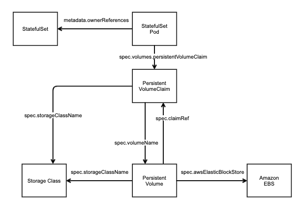

# [k8s] The relationship between StatefuleSet, PersistentVolumeClaim, PersistentVolume and Amazon EBS
> date - 2020.07.29  
> keyworkd - StatefuleSet, PersistentVolumeClaim, PersistentVolume, Amazon EBS  
> StatefulSet로 생성된 리소스들이 서로를 어떻게 인식하는지 궁금해서 확인한 내용을 정리  

<br>

## StatefulSet
```yaml
apiVersion: apps/v1
kind: StatefulSet
spec:
  volumeClaimTemplates:
  - metadata:
      name: test-storage  # StatefulSet과 PersistentVolumeClaim의 relation
    spec:
      accessModes:
      - ReadWriteOnce
      resources:
        requests:
          storage: 10Gi
      storageClassName: test-default-sc
```
* `StatefulSet의 spec.volumeClaimTemplates` 설정(`storageClassName` 등)으로 `PersistentVolume`을 생성
* `StatefulSet`에서는 `PersistentVolume`의 정보를 확인할 수 있다


<br>

## StatefulSet Pod
```yaml
apiVersion: v1
kind: Pod
metadata:
  generateName: test-
  ownerReferences:  # StatefulSet과 Pod의 relation
  - apiVersion: apps/v1
    blockOwnerDeletion: true
    controller: true
    kind: StatefulSet
    name: test
spec:
  volumes:
  - name: test-storage
    persistentVolumeClaim:  # StatefulSet Pod와 PersistentVolumeClaim의 relation
      claimName: test-storage-test-0
```
* `metadata.ownerReferences`에서 `StatefulSet`의 정보를, `spec.volumes.persistentVolumeClaim`에서 `PersistentVolume` 정보를 확인할 수 있다


<br>

## PersistentVolumeClaim
```yaml
apiVersion: v1
kind: PersistentVolumeClaim
metadata:
  name: test-storage-test-0
spec:
  accessModes:
  - ReadWriteOnce
  resources:
    requests:
      storage: 10Gi
  storageClassName: test-default-sc  # PersistentVolumeClaim와 StorageClass의 relation
  volumeName: pvc-xxxxxxxxxx  # PersistentVolumeClaim와 PersistentVolume의 relation
```
* `spec.storageClassName`에서 `StorageClass`의 정보를, `spec.volumeName`에서 `PersistentVolume`의 정보를 확인할 수 있다


<br>

## PersistentVolume
```yaml
apiVersion: v1
kind: PersistentVolume
metadata:
  name: pvc-xxxxxxxxxx
spec:
  accessModes:
  - ReadWriteOnce
  awsElasticBlockStore:  # PersistentVolume로 생성된 Amazon EBS의 relation
    fsType: xxx
    volumeID: aws://ap-northeast-1a/vol-xxxxxxxxxxx
  claimRef:  # PersistentVolume와 PersistentVolumeClaim의 relation
    apiVersion: v1
    kind: PersistentVolumeClaim
    name: test-storage-test-0
  persistentVolumeReclaimPolicy: Retain
  storageClassName: test-default-sc  # PersistentVolume와 StorageClass의 relation
```
* `spec.awsElasticBlockStore`에서 vendor의 storage의 정보를, `spec.claimRef`에서 `PersistentVolumeClaim`의 정보를, `spec.storageClassName`에서 `StorageClass` 정보를 확인할 수 있다


<br>

## RelationShip Diagram



<br>

## Conclusion
* StatefulSet으로 생성된 리소스간의 관계를 이해하고, troubleshooting시 활용하면 좋을듯하다
  * Amazon EBS를 교체해야 하는 상황에서 PVC, PV는 기존 리소스를 사용할 경우 등


<br><br>

> #### Reference
> * [StatefulSets - Kubernetes Docs](https://kubernetes.io/docs/concepts/workloads/controllers/statefulset/)
> * [StorageClass - Kubernetes Docs](https://kubernetes.io/docs/concepts/storage/storage-classes/)
> * [Persistent Volumes - Kubernetes Docs](https://kubernetes.io/docs/concepts/storage/persistent-volumes/)
