# [k8s] Best practices for Kubernetes
> date - 2022.08.10  
> keyworkd - k8s, anti pattern, best practices  
> kubernetes는 multi tenancy, high availability 등을 자동으로 해결해주지 않는다  
> 올바르게 kubernetes를 사용하지 않으면 높은 복잡성과 부하, 느린 control plane, DR(Disaster Recovery)이 제대로 이루어지지 않을 것이다  
> cloud native application을 만들기 위해 알아두면 좋을 내용을 정리해본다  

<br>

## resource request/limit 설정
* request, limit 설정의 정답은 없지만 CPU limit 설정은 anti pattern으로 아래와 같이 설정하는 것을 권장
```
- Always set memory limit == request
- Never set CPU limit
```
* CPU는 compressible resource로 여러 Pod가 CPU를 나눠서 사용하고, 부족하면 throttling 되어 처리 시간이 길어지지만 memory는 incompressible resource로 memory가 부족하면 OOM(Out Of Memory)으로 Pod restart 발생

<br>

### resource 사용량을 monitoring하며 VPA 사용
* 최적의 리소스 사용량을 찾는 것은 쉽지 않다
* metrics-server로 노출되는 resource 사용량을 Prometheus, Datadog 등으로 수집하면 시간별 사용량을 확인할 수 있다
* VPA([VerticalPodAutoscaler](https://github.com/kubernetes/autoscaler/tree/master/vertical-pod-autoscaler))는 cpu, memory 사용량을 지켜보다 자동으로 request를 설정해주므로 최적의 값을 설정하는데 도움이 된다
* 평균적으로 10% 미만의 낮은 사용률을 보이는데 리소스 사용량을 설정하는데 많은 시간을 보내고 있다면 serverless를 고려해보자
  * serverless의 이점과 사용량에 따른 과금 방식으로 더 싸고 운영 효율적인 대안이 될 수 있다
  * AWS Fargate, virtual kubelet을 지원하는 제품 등

<br>

### CPU Limit에 관하여
* 충분히 높은 limit는 좋으나 낮은 limit는 throttling이 발생하므로 대부분의 경우 CPU limit는 안좋은 점이 더 많다
* 아래와 같이 cpu request가 설정되어 있지 않거나 너무 낮게 설정되어 있으면 overcommited 상태가 되어 CPU를 많이 사용하게 되는 경우 CPU throttling 발생
```yaml
## 설정이 없거나
resources: {} 

## 너무 낮게 설정
resources:
  requests:
    cpu : "1m"
```
* **모든 Pod에 적절한 CPU request가 설정**되면 CPU limit가 제거되도 Pod 당 request만큼의 CPU는 보장된다

| all pods have... | cpu limits | no cpu limits |
|:--:|:--:|:--:|
| cpu requests | request ~ limit 만큼 사용 보장 | request 만큼 사용 보장<br>여유 cpu 사용 |
| no cpu requests | limit 만큼 사용 보장 | cpu 사용이 보장되지 않음 |

#### CPU throttling 발생시
CPU idle 대신 여유 CPU를 자유롭게 사용하도록 개선
1. cpu limit 제거
2. 적절한 cpu request 설정
3. cpu throttling이 계속 있다면 cpu request를 올린다

<br>

### resourceQuota & limitRange 설정
* cluster와 node의 안정성을 위해 cluster와 namespace level에서 resource를 제한할 수 있다


<br>

## 리소스 격리(Resource Isolation)를 위해 namespace 사용
* namespace를 사용하면 cluster 내에 logical partitions이 생성되어 resource isolation & access control 제공 가능
* project, product, team, environment 기반으로 분리시 유용


<br>

## 리소스 격리(Resource Isolation)를 위해 cluster 분리
* namespace level isolation보다는 cluster level isolation을 위해 cluster를 분리하자
* namespace은 완벽한 isolation을 제공하지 않는다
* develop, production 등 환경, workload가 다른 namespace에 영향을 미치지 않게 격리는 resoure QoS, quotas, priorityClasses, affinity, tolerations, taints, nodeSelector를 잘 이용하면 어느정도 가능하지만 복잡해지므로 cluster를 분리하는게 좋다


<br>

## 절절한 start/readiness/liveness probe 설정하기
* 서비스의 downtime은 비즈니스 손실로 이어지므로 이를 방지하기 위해 health check는 필수
* health check로 container가 실행 중이고, traffic을 처리할 준비가 되었는지 확인할 수 있다
* startProbe, livenessProbe, livenessProbe를 이해한 후 적절한 설정 필요
  * startProbe
    * application boot 확인
    * 1번만 실행
  * readinessProbe
    * application이 traffic에 응답할 수 있는지 확인
    * 항상 실행
    * 실패시 traffic routing 중지
    * 설정하지 않으면 traffic을 처리할 수 있는지 Load Balancer가 알지 못해 502 ~ 503 error가 발생
  * livenessProbe
    * application이 정상적으로 실행중인지 확인
    * 항상 실행
    * 실패하면 application이 중단된 것으로 판단하여 restart(self healing)
  * e.g. [Spring Boot Production-ready Features](https://docs.spring.io/spring-boot/docs/current/reference/html/production-ready-features.html#production-ready-kubernetes-probes)
* livenessProbe와 readinessProbe를 동일하게 설정하지 않는다
  * traffic 과부하(readinessProbe가 실패)로 인해 재시작된다면 매우 비생상적
  * healthy Pod가 일을 많이 한다고 재시작시키는 것은 바람직하지 않다
* 잘못 설정하는 것보다 설정하지 않는게 더 나을 수 있다
  * 위와 같이 livenessProbe를 잘못 설정하면 위험하므로 처음 시작한다면 readinessProbe부터 설정하는 것을 추천
* dependency가 있는 external service 죽더라도 livenessProbe/readinessProbe에 영향이 없도록 설정
  * 연쇄적 실패(cascading failure)가 발생하여 [스스로 문제가 악화 시킬 수 있다](https://blog.colinbreck.com/kubernetes-liveness-and-readiness-probes-how-to-avoid-shooting-yourself-in-the-foot)
  * liveness와 response를 분리할 수 있도록 circuit breaker 사용

```yaml
apiVersion: v1
kind: Pod
metadata:
  name: my-pod
spec:
  containers:
  - name: my-container
    image: my-image:tag
    ports:
    - name: http
      containerPort: 80
    readinessProbe:
      httpGet:
        path: /actuator/health/readiness
        port: http
    livenessProbe:
      httpGet:
        path: /actuator/health/liveness
        port: http
    startupProbe:
      httpGet:
        path: /actuator/health/liveness
        port: nd-port
      initialDelaySeconds: 60
      failureThreshold: 30
```


<br>

## preStop hook 사용
* Pod 종료시 container의 종료 기간과 Service에서 Pod를 detach하는 기간이 비동기로 수행되므로 Load Balancer에서 502, 504 error가 발생한다
* Pod가 먼저 detach되면 상관없지만 그렇지 않은 경우 종료된 Pod로 traffic이 유입되므로 적절한 preStop과 terminationGracePeriodSeconds를 설정하여 대응해야한다
* [Graceful Shutdown](../server/graceful_shutdown.md) 참고
```yaml
apiVersion: apps/v1
kind: Deployment
spec:
...
  template:
    spec:
      terminationGracePeriodSeconds: 75
      containers:
        ...
          lifecycle:
            preStop:
              exec:
                command: ["sh", "-c", "sleep 10"]
```


<br>

## 모든 서비스를 `type: LoadBalancer`로 만들어서 LoadBalancer를 생성하지 않는다
* endpoint별로 `LoadBalancer` type Service를 만들면 public IP, LoadBalancer 등으로 인한 비용이 발생하므로 비효율적
* 대신 ingress controller를 활용하여 비용 효율적으로 구성
  * nginx-ingress-controller 같은 ingress controller를 사용해 1개의 L4 LB를 사용해 L7 level에서 traffic routing
  * AWS LBC(Load Balancer Controller)의 ingress group을 사용해 1개의 ALB를 여러 Ingress가 공유
* cluster 내부 통신은 `ClusterIP` type Service + 내부 DNS(e.g. CoreDNS) 사용
  * 외부 DNS/IP를 이용하면 응답 시간 지연과 불필요한 비용이 추가될 수 있다


<br>

## Anti Affinity 설정
* high availability를 위해 2개 이상의 replica를 설정해도 Pod가 하나의 node에 몰려있으면 해당 node 장애로 인해 service downtime이 발생할 수 있다
* `podAntiAffinity`를 설정해 여러 node에 분산하여 high availability 보장

```yaml
apiVersion: apps/v1
kind: Deployment
spec:
  replicas: 3
  template:
    metadata:
      labels:
        app: my-app
    spec:
      affinity:
        podAntiAffinity:
          requiredDuringSchedulingIgnoredDuringExecution:
            - topologyKey: kubernetes.io/hostname
              labelSelector:
                matchExpressions:
                  - key: app
                    operator: In
                    values:
                      - my-app
```
* topologyKey에 따라 schedule이 다르다
  * kubernetes.io/hostname - node 기준으로 분산
  * topology.kubernetes.io/zone - AZ 기준으로 분산

<br>

### Pod Topology Spread Constraints
* [Pod Topology Spread Constraints](https://kubernetes.io/docs/concepts/scheduling-eviction/topology-spread-constraints)를 사용하면 [Anti Affinity](https://kubernetes.io/docs/concepts/scheduling-eviction/assign-pod-node/#affinity-and-anti-affinity)보다 더 세밀하게 설정 가능
* `Anti Affinity`는 node 당 1개의 pod를 제한할 수 있지만, `Pod Topology Spread Constraints`는 node 당 N개의 pod를 제한할 수 있다

#### Example
* 사용 가능한 node가 3개인 경우 각 node에 2개의 pod schedule
```yaml
apiVersion: apps/v1
kind: Deployment
spec:
  replicas: 6
  template:
    metadata:
      labels:
        app: my-app
    spec:
      topologySpreadConstraints:
        - maxSkew: 1
          topologyKey: kubernetes.io/hostname
          whenUnsatisfiable: DoNotSchedule
          labelSelector:
            matchExpressions:
              - key: app
                operator: In
                values:
                  - my-app
```
* 2개의 zone, zone당 2개의 node에 균등하게 배치
```yaml
apiVersion: apps/v1
kind: Deployment
spec:
  replicas: 4
  template:
    metadata:
      labels:
        app: my-app
    spec:
      topologySpreadConstraints:
        - maxSkew: 1
          topologyKey: topology.kubernetes.io/zone
          whenUnsatisfiable: DoNotSchedule
          labelSelector:
            matchExpressions:
              - key: app
                operator: In
                values:
                  - my-app
        - maxSkew: 1
          topologyKey: kubernetes.io/hostname
          whenUnsatisfiable: DoNotSchedule
          labelSelector:
            matchExpressions:
              - key: app
                operator: In
                values:
                  - my-app
```
* 다중 조건으로 인해 배치가 안될 경우 한가지 조건의 `maxSkew`를 증가시키거나, `whenUnsatisfiable: ScheduleAnyway`를 사용하도록 수정해서 조치할 수 있다
* scale in 같은 pod 제거시 분포가 불균형해질 수 있으니 [Descheduler](https://github.com/kubernetes-sigs/descheduler) 같은 도구를 사용해 분포를 균등하게 만들 수 있다


#### Pod Topology Spread Constraints 더 살펴보기
* Pod Topology Spread Constraints는 region, zone, node, user-defined topology domain같은 failure-domains간에 pod가 분배되는 방식을 제어
  * [cluster-level constraints](https://kubernetes.io/docs/concepts/scheduling-eviction/topology-spread-constraints/#cluster-level-default-constraints) or workload마다 설정

```yaml
...
spec:
  topologySpreadConstraints:
    - maxSkew: <integer>
      minDomains: <integer>  # optional v1.25 beta
      topologyKey: <string>
      whenUnsatisfiable: <string>
      labelSelector: <object>
      matchLabelKeys: <list>  # optional v1.27 beta
      nodeAffinityPolicy: [Honor|Ignore]  # optional v1.26 beta
      nodeTaintsPolicy: [Honor|Ignore]  # optional v1.26 beta
```
* maxSkew
  * 균등하지 않게 분산될 수 있는 정도로 whenUnsatisfiable에 따라 의미가 달라진다
  * maxSkew가 클수록 pod가 덜 분산되고, 너무 작으면 scheduling이 지연될 수 있으므로 node/pod의 규모를 고려해 적절한 값 설정 필요
  * whenUnsatisfiable: DoNotSchedule면 topology의 pod수와 global minimum 사이의 최대 허용치가 된다
    * 3개의 zone에 5개의 pod를 2, 2, 1로 배치하고 싶으면 maxSkew: 1로 설정, 이때 global minimum 1이 된다
  * whenUnsatisfiable: ScheduleAnyway면 skew를 줄이는데 도움이 되는 topology에 더 높은 우선순위 부여
* minDomains
  * 0보다 커야하며 whenUnsatisfiable: DoNotSchedule일때만 설정 가능
  * 설정하지 않으면 1
  * global minimum
    * 적합한 도메인(topologyKey에 매칭) 내의 최소 Pod 수
    * 적합한 도메인 수가 minDomains보다 적을 경우 0
  * 적합한 도메인 수가 minDomains 이상이면 이 값은 scheduling에 영향을 미치지 않는다
* topologyKey
  * `kubernetes.io/hostname`, `topology.kubernetes.io/zone` 같은 node label의 key
  * key와 동일한 값을 가진 label이 있는 node는 동일한 topology에 있는 것으로 간주
  * 도메인 - topology의 각 key-value 쌍
  * 적합한 도메인 - nodeAffinityPolicy, nodeTaintsPolicy의 요구 사항을 충족하는 도메인
* whenUnsatisfiable
  * 조건을 만족하지 않을 경우 처리 방법
    * e.g. topologyKey, maxSkew 등이 허용되는 node에 resource 부족으로 scheduling이 불가할 때
  * DoNotSchedule(default) - scheduling 하지 않는다
  * ScheduleAnyway - skew를 최소화하는 node에 우선순위를 부여하며 scheduling


<br>

## PodDisruptionBudget 사용
* [PodDisruptionBudget(pdb)](https://kubernetes.io/docs/concepts/workloads/pods/disruptions)는 node 제거, node drain 등 발생시 Pod의 최소 개수를 보증하여 high availability를 보장
  * node upgrade시 drain
  * cluster auto scaler에 의한 scale in시 drain
* 일정 성능을 요구하거나 quorum 유지가 필요한 application에는 설정 권장
* rolling update, delete pod, controller(e.g. Deployment, StatefulSet)에 의한 delete는 pdb를 무시
* maxUnavailable: 25% -> 최대 25%의 pod만 다운 가능, 최소 75%의 Pod 유지
* minAvailable: 10% -> 최소 10%의 Pod 유지

<br>

### Example
* 성능을 유지하기 위해 일정 수의 Pod를 유지
```yaml
apiVersion: policy/v1
kind: PodDisruptionBudget
metadata:
  name: my-app
spec:
  maxUnavailable: 25%  # 25%씩 drain 가능
  selector:
    matchLabels:
      app: my-app
```

* data의 안정성을 위해 quorum 값 만큼 Pod를 유지
```yaml
apiVersion: policy/v1
kind: PodDisruptionBudget
metadata:
  name: zookeeper
spec:
  minAvailable: 2  # 최소 2개는 유지 보장
  selector:
    matchLabels:
      app: zookeeper
---
apiVersion: policy/v1
kind: PodDisruptionBudget
metadata:
  name: zookeeper
spec:
maxUnavailable: 1  # 1개만 제거 가능
  selector:
    matchLabels:
      app: zookeeper
```

* replicas: 1이라면 pdb를 사용하면 안되지만 설정해야한다면?
```yaml
apiVersion: policy/v1
kind: PodDisruptionBudget
metadata:
  name: my-app
spec:
  maxUnavailable: 100%
  selector:
    matchLabels:
      app: my-app
```

* helm chart
```yaml
# templates/pdb.yaml
{{- if .Values.budget.minAvailable -}}
{{- if gt (int .Values.replicaCount) 1 -}}
apiVersion: policy/v1
kind: PodDisruptionBudget  
metadata:  
  name: {{ template "app.fullname" . }}  
  namespace: {{ .Values.namespace }}  
  labels:  
    app: {{ template "app.name" . }}  
    chart: {{ .Chart.Name }}-{{ .Chart.Version | replace "+" "_" }}  
    release: {{ .Release.Name }}  
    heritage: {{ .Release.Service }}  
spec:  
  selector:  
    matchLabels:  
      app: {{ template "app.name" . }}  
      env: {{ .Values.env.name }}  
  minAvailable: **{{ .Values.budget.minAvailable }}**
{{- end -}}
{{- end -}}
```


<br>

## externalTrafficPolicy: Cluster 대신 Local 사용 고려
<div align="center">
  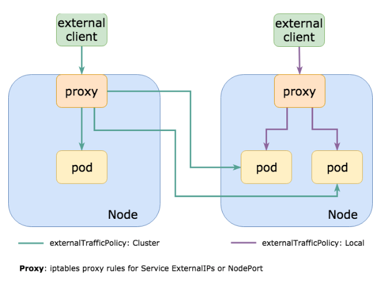
</div>

* **Pod network latency를 줄이기 위해 Pod가 있는 node의 port만 여는 `externalTrafficPolicy: Local` 사용하자**
* `externalTrafficPolicy`는 Service가 external traffic을 어떻게 routing할지 정의
* default로 모든 traffic이 `NodePort` Service를 통해 cluster 내부에서 전부 routing될 수 있게 `externalTrafficPolicy: Cluster`로 설정
  * NodePort가 모든 node에 동일하게 열려 있어서 어떤 node에서도 원하는 Pod에 도달할 수 있다는 의미
* Pod가 모든 node에 존재하는게 아니기 때문에 Pod가 존재하는 node로 request가 routing되지 않는 경우 추가적인 network hop이 발생하고, network latency(node가 서로 다른 AZ에 있을 경우 증가하며 추가적인 outbound network 비용 발생)를 발생시킨다
* `externalTrafficPolicy: Local`을 사용하면 Pod가 존재하는 node에만 port가 열린다
* AWS ELB는 Pod가 존재하는 node로만 request를 전달
  * target node의 health check를 수행하여 pod가 없으면 health check가 실패하여 request를 전달하지 않아 latench가 개선되고, outbound network 비용을 감소시킨다

```yaml
apiVersion: v1
kind: Service
metadata:
  name: my-app
  annotations:
    alb.ingress.kubernetes.io/healthcheck-path: /health  # app의 health check
spec:
  type: NodePort
  externalTrafficPolicy: Local
  ports:
    - name: http
      port: 80
      targetPort: 8080
      protocol: TCP
  selector:
    app: my-app
```

<br>

### externalTrafficPolicy: Cluster
<div align="center">
  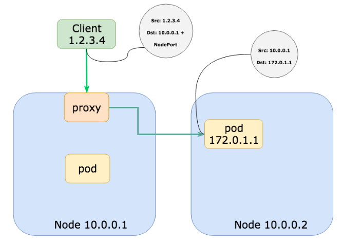
  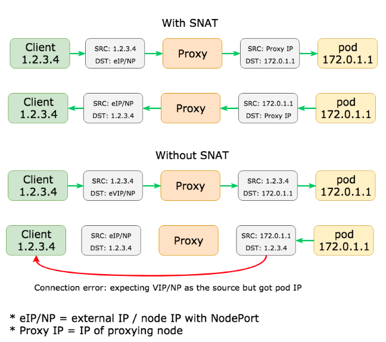
</div>

* 모든 node의 port가 open
  * kube-proxy는 모든 node의 NodePort(30000 ~ 32767) open
* client source ip 유실
  * 패킷이 다른 node의 pod로 라우팅되면 SNAT(source network address translation)되어 proxy node의 IP가 client ip가 된다
  * SNAT가 없으면 source, destination address 불일치로 연결 오류 발생
  * proxy의 original DNAT로 인해 다른쪽 끝의 대상은 Pod IP가 된다
* 다른 Node로의 network hop이 생길 수 있다
* load balancing에 유리

<br>

### externalTrafficPolicy: Local
<div align="center">
  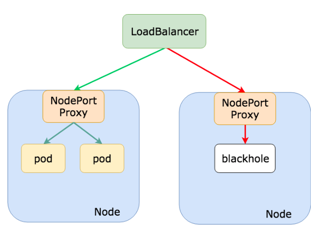
</div>

* Pod가 존재하는 node의 port만 open되어 라우팅
  * kube-proxy는 node에 Pod가 존재하면 NodePort(30,000 ~ 32,767) open
* LoadBalancer, NodePort type에서만 설정 가능
* client source ip 유지
  * LoadBalancer는 모든 node를 backend로 추가하지만 LoadBalancer의 health check에 의해 NodePort가 응답하는 node로만 트래픽을 보낸다
  * proxy node에서 SNAT가 발생하지 않으므로 client ip 보존
* 불필요한 network hop을 방지
  * network latency를 줄여야하는 application에 적합

<div align="center">
  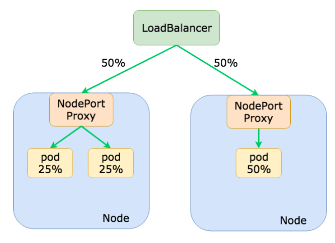
  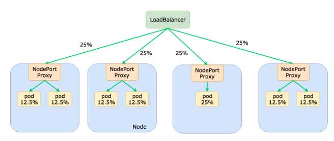
</div>

* 잠재적인 load balancing 불균형 위험이 있다
  * `podAntiAffinity`를 설정해 node에 고르게 분산 배치되도록 한다

```yaml
affinity:
  podAntiAffinity:
    preferredDuringSchedulingIgnoredDuringExecution:
    - weight: 100
      podAffinityTerm:
        labelSelector:
          matchExpressions:
           - key: k8s-app
             operator: In
             values:
             - my-app
        topologyKey: kubernetes.io/hostname
```


<br>

## Temporary credentials 사용
* 하드코딩되어 취약한 IAM User의 access key를 사용하지 말고 IAM Role이나 IRSA(IAM Roles for Service Accounts) 같이 임시 권한을 발급하는 형식을 사용
  * node보다는 ServiceAccount에 권한을 할당하는 것을 권장
* node로 AWS EC2를 사용한다면 [kube2iam](https://github.com/jtblin/kube2iam), [kiam](https://github.com/uswitch/kiam)으로 IAM Role 사용
* Amazon EKS(Elastic Kubernetes Service)라면 [AWS Identity and Access Management (IAM) roles for service accounts(IRSA)](https://docs.aws.amazon.com/eks/latest/userguide/enable-iam-roles-for-service-accounts.html) 사용
  * `eks.amazonaws.com/role-arn` annotations을 추가하는 것만으로 간단하게 사용 가능

```yaml
apiVersion: v1
kind: ServiceAccount
metadata:
  annotations:
    eks.amazonaws.com/role-arn: arn:aws:iam::<account id>:role/my-app-role
  name: my-serviceaccount
```


<br>

## Access Control을 위해 RBAC 사용
* user, group에게 fine-grained access control 제공을 위해 RBAC(Role-Based Access Control)을 사용
```yaml
apiVersion: rbac.authorization.k8s.io/v1
kind: Role
metadata:
  name: my-role
rules:
- apiGroups: [""]
  resources: ["pods"]
  verbs: ["get", "list", "create", "update", "delete"]
```
* 필요한 경우가 아니라면 admin, cluster-admin 권한 부여하지 않고, 일일이 권한을 부여하자
  * 권한 분리는 귀찮지만 충분히 가치가 있다


<br>

## Using latest tag
* 다양한 문제 발생 가능성이 있는 latest 대신 의미 있는 tag 사용
  * [Git hash](https://git-scm.com/book/ko/v2/Git-%EB%8F%84%EA%B5%AC-%EB%A6%AC%EB%B9%84%EC%A0%84-%EC%A1%B0%ED%9A%8C%ED%95%98%EA%B8%B0)
  * [Semantic Versioning 2.0.0](https://semver.org/)
  * build number/datetime 같은 연속된 숫자
* Amazon ECR은 [immutable tag](https://docs.aws.amazon.com/AmazonECR/latest/userguide/image-tag-mutability.html)로 한번 만들어진 tag에 overwirte가 불가능하게 설정 가능

<br>

### Example
* development - commit(short) hash
* production - semantic versioning


<br>

## image에 configuration 넣지 않기
<div align="center">
  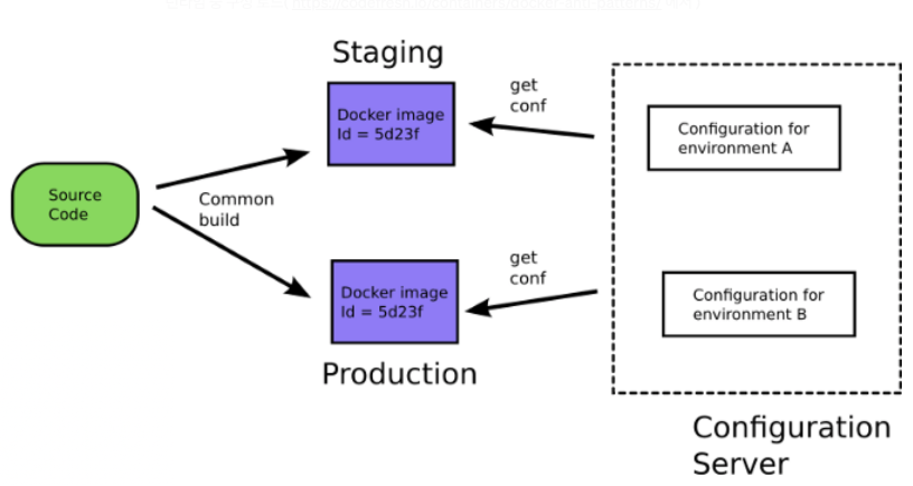
</div>

* IP address, other service URL, credentials, environment tags(dev, qa, production) 같은 configuration을 image 내부에 저장하지말고 [ConfigMap](https://kubernetes.io/docs/tasks/configure-pod-container/configure-pod-configmap/), [Secret](https://kubernetes.io/docs/concepts/configuration/secret/), external configuration service 사용하여 외부에서 주입하여 동일한 image를 여러 environment에 사용


<br>

## 민감 정보(Sensitive Data)를 위해 Secret 사용
* password, API key, certificate 같은 sensitive data를 Kubernetes manifest에 plane text로 저장하지 말고 Secret을 사용
```yaml
apiVersion: v1
kind: Secret
metadata:
  name: my-secret
type: Opaque
data:
  username: dXNlcm5hbWU=
  password: cGFzc3dvcmQ=
```


<br>

## secret 관리
<div align="center">
  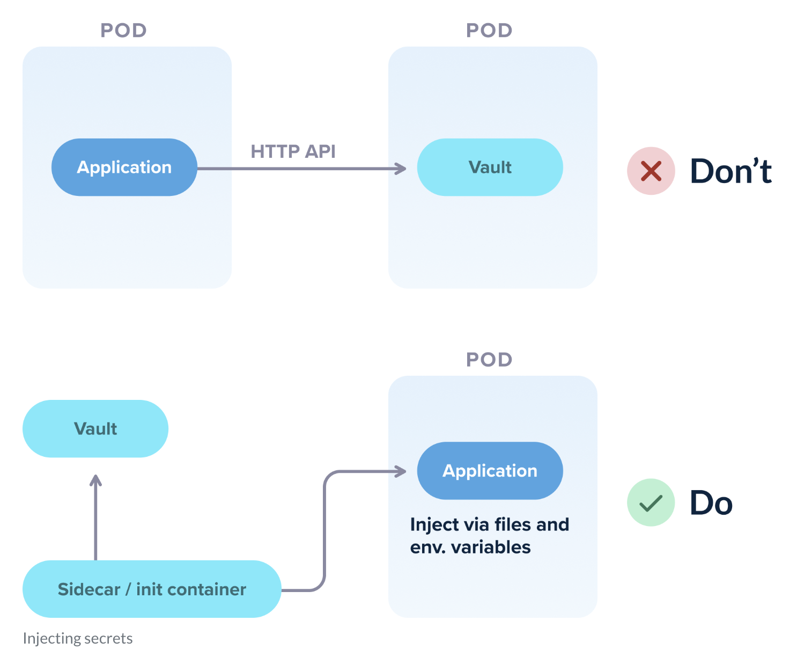
</div>

* bad use case
  * secret 처리를 위한 다양한 방법 사용
  * build, runtime secret 혼용
  * local development, testing을 어렵게, 불가능하게 만드는 복잡한 secret injection mechanisms
* 모든 팀/환경에서 동일한 secret strategy을 사용하는게 중요
* application에서 [HashiCorp Vault](https://www.vaultproject.io/) 같은 tool의 API를 직접 사용하면 안된다
  * 개발자가 local에서 Vault에 관련된 설정을 해야하므로 환경 구성이 복잡해진다


<br>

## 확장성(Scalability)을 위해 Pod 대신 Deployment, StatefulSet을 사용
* high availability & scalability을 위해 Deployment, StatefulSet을 사용하면 scaling을 자동으로 처리할 수 있게 된다


<br>

## 단일 책임 원칙(Principle of Single Responsibility)을 따르자
* 각 container는 하나의 작업이나 기능만을 수행
* 여러 application을 단일 container 묶으면 관리 및 확장이 더 복잡해질 수 있다
* e.g. frontend, backend로 multi container Pod
```yaml
apiVersion: v1
kind: Pod
metadata:
  name: my-app
spec:
  containers:
  - name: frontend
    image: frontend-image:tag
    ports:
    - containerPort: 80
  - name: backend
    image: backend-image:tag
    ports:
    - containerPort: 8080
```


<br>

## Container image 최적화

### Problem
* 최적화되지 않은 containerizing으로 인해 build 속도가 느려진다
  * 동시에 실행 가능한 build process가 제한되어 있는 경우, 느린 build가 누적되면 build가 밀린다
* image size는 service performance에 영향을 줄 수 있다
  * container registry의 용량을 차지하며 image download 속도 저하로 Pod startup 시간이 오래걸려 
  * image size 증가 -> container registry의 용량 차지 & image up/download 속도 저하 및 network bandwidth 사용 -> Pod startup 시간 증가 -> HPA로 인한 scaling 시간 증가 -> 적절한 시점에 scaling이 불가능하므로 성능에 영향

<br>

### Solution
* image layer를 줄이고, caching을 활용할 수 있도록 사용
* multi-stage build를 사용해 image 경량화
* dependency가 구성된 base image 사용
  * 매번 dependency를 구성하는 것은 불필요한 network I/O & build latency 증가
  * volume mount로 caching할 수 있으나 base image로 network caching 사용하는 것을 고려
* [Reduce Image size](../docker/dockerfile_best_pratices.md#reduce-image-size) 참고


<br>

## label과 annotation 사용
* metadata를 label, annotation로 지정하여 사용할 수 있다
```yaml
apiVersion: v1
kind: Pod
metadata:
  name: my-pod
  labels:
    app: my-app
    environment: production
  annotations:
    config: "https://my-config.com"
spec:
  containers:
  - name: my-container
    image: my-image:tag
```


<br>

## deployment models
* 다양한 deployment strategies 사용
  * Blue-Green
  * Rolling
  * Canary
  * A/B Testing
* 기본으로 제공하는 Rolling update는 충분하지 않다


<br>

## templating tool 사용
* yaml을 직접 수정하는게 번거롭고, human fault가 발생할 가능성이 있으므로 [Helm](https://helm.sh), [kustomize](https://kustomize.io) 같은 templating tool을 사용


<br>

## 특정 순서를 가지도록 배포하지 않기
* dependency 순서에 따라 배포하는 방식을 container orchestration에 적용하지 않는게 중요
* 모두 동시에 실행될 수 있으므로 self healing + retry 구현


<br>

## application과 infra 분리
* application은 infra보다 자주 배포되므로 같은 lifecycle에 포함되어 있으면 비효율적
* infra pipeline과 application pipeline을 분리하여 효율화한다


<br>

## dynamic environments 사용
<div align="center">
  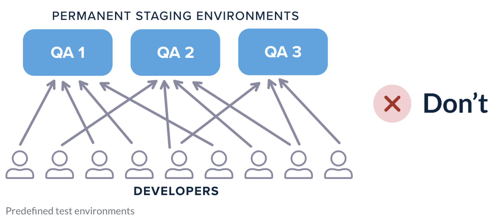
    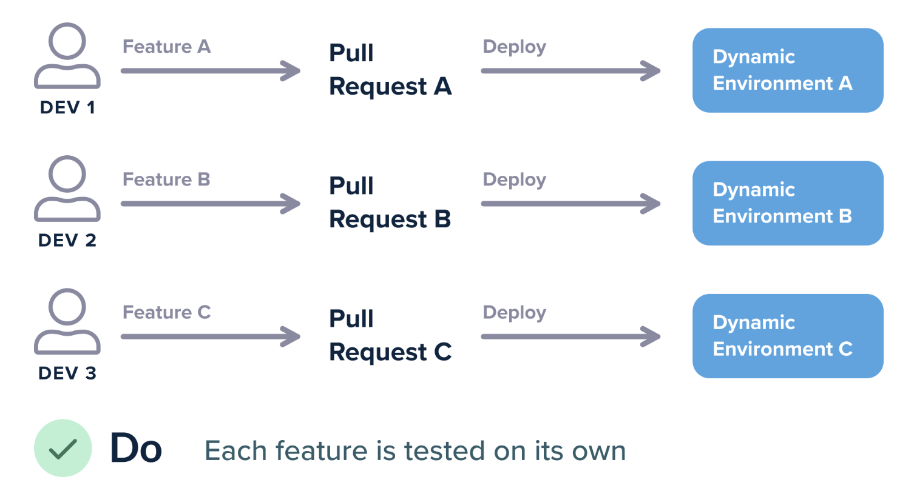
</div>

* predefined staging 환경보다 dynamic staging 환경을 사용해 필요할 때만 생성하여 비용 효율화하고, feature별로 생성하여 격리한다
* Pull Request open시 생성되고, merge/close시 제거
  * feature-a.staging.company.com or staging.company.com/feature-a가 생겨야한다


<br>

## deployment metrics 사용
<div align="center">
  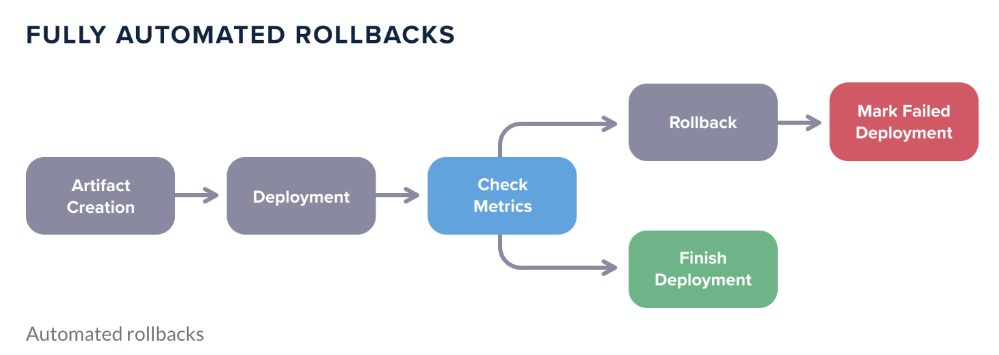
</div>

* logging, tracing, metrics을 기반으로 deployment에 사용할 metrics을 정의하고, automated rollback에 활용


<br>

## Kubernetes aware auto scaler 사용
* Kubernetes는 Pod를 cpu, memory, node affinity, taints & toleration, QoS 등 다양한 조건으로 schedule하기 때문에 이를 이해하지 못하면 문제가 발생할 수 있으므로 [cluster-autoscaler](https://github.com/kubernetes/autoscaler/tree/master/cluster-autoscaler) 사용하자


<br>

## PersistentVolume Retain Policy 설정
* PersistentVolume(PV)에는 중요한 데이터가 저장될 가능성이 높으므로 reclaim policy default를 delete -> retain으로 변경하여 데이터 손실을 방지한다

* PersistentVolume
```yaml
apiVersion: v1
kind: PersistentVolume
metadata:
  name: my-pv
spec:
  persistentVolumeReclaimPolicy: Retain  # here
```

* StorageClass
```yaml
apiVersion: storage.k8s.io/v1
kind: StorageClass
metadata:
  name: my-sc
provisioner: ebs.csi.aws.com
reclaimPolicy: Retain  # here
volumeBindingMode: WaitForFirstConsumer
allowVolumeExpansion: true
parameters:
  csi.storage.k8s.io/fstype: xfs
  type: gp3
```


<br>

## cluster를 애지중지하지 않기
* 주기적으로 cluster를 제거함으로써 재해 복구(Disaster Recovery)를 연습하고, 주기적으로 버전업을 연습하는 것을 권장


<br><br>
 
> #### Reference
> * [Kubernetes maintainers like Tim Hockin recommend not using limits at all](https://twitter.com/thockin/status/1134193838841401345)
> * [Compressible Resource Guarantees - Resource Quality of Service in Kubernetes](https://github.com/kubernetes/design-proposals-archive/blob/8da1442ea29adccea40693357d04727127e045ed/node/resource-qos.md#compressible-resource-guaranteess)
> * [CPUThrottlingHigh (Prometheus Alert)](https://github.com/robusta-dev/alert-explanations/wiki/CPUThrottlingHigh-(Prometheus-Alert))
> * [파드 및 컨테이너 리소스 관리](https://kubernetes.io/ko/docs/concepts/configuration/manage-resources-containers/)
> * [10 most common mistakes using kubernetes](https://blog.pipetail.io/posts/2020-05-04-most-common-mistakes-k8s/)
> * [Kubernetes anti-patterns: What NOT to do](https://cloudification.io/2022/04/19/kubernetes-anti-patterns/)
> * [Kubernetes Deployment Antipatterns – part 1](https://codefresh.io/blog/kubernetes-antipatterns-1/)
> * [Kubernetes Deployment Antipatterns – part 2](https://codefresh.io/blog/kubernetes-antipatterns-2/)
> * [Kubernetes Deployment Antipatterns – part 3](https://codefresh.io/blog/kubernetes-antipatterns-3/)
> * [15 Kubernetes Best Practices Every Developer Should Know](https://collabnix.com/15-kubernetes-best-practices-every-developer-should-know)
> * [Best practices to achieve Zero downtime on Kubernetes deployments](https://medium.com/@krishnendupatra/best-practices-to-achieve-zero-downtime-on-kubernetes-deployments-438f15cd811e)
> * [Kubernetes Failure Stories](https://k8s.af)
> * [LIVENESS PROBES ARE DANGEROUS](https://srcco.de/posts/kubernetes-liveness-probes-are-dangerous.html#id3)
> * [Kubernetes Liveness and Readiness Probes Revisited: How to Avoid Shooting Yourself in the Other Foot](https://blog.colinbreck.com/kubernetes-liveness-and-readiness-probes-revisited-how-to-avoid-shooting-yourself-in-the-other-foot)
> * [A Deep Dive into Kubernetes External Traffic Policies](https://www.joyk.com/dig/detail/1629094815559547)
> * [Attack of the mutant tags! Or why tag mutability is a real security threat](https://sysdig.com/blog/toctou-tag-mutability)
> * [Kubernetes in production — PodDisruptionBudget](https://blog.marekbartik.com/posts/2018-06-29_kubernetes-in-production-poddisruptionbudget)
