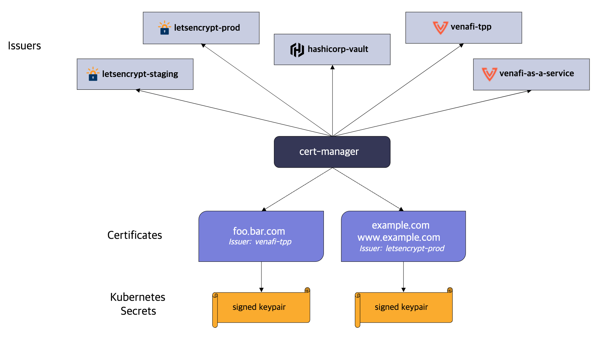

# [k8s] Cert Manager
> date - 2023.09.25  
> keyworkd - Kubernetes, certificate  
> cert-manager에 대해 정리  

<br>

## [cert-manager](https://cert-manager.io)
<div align="center">
  
</div>

* Cloud native certificate management
* Automatically provision and manage TLS certificates in Kubernetes
* certificate, issuer를 k8s resource로 추가하여 public/private issuer 등 다양한 issuer로 부터 인증서를 획득하고 유효한지 확인하며 만료 전에 갱신하는 process를 간소화

<br>

### Issuers
* cert-manager가 TLS certificate를 요청하는 방법 정의

| Scope | Kind | annotations |
|:--|:--|:--|
| cluster-wide | `ClusterIssuers` | cert-manager.io/cluster-issuer |
| namespace | `Issuers` | cert-manager.io/issuer |

<br>

### Certificates
* certificate의 세부 정보 지정


<br>

## Install

### Manifest
* CRD, cert-manager, cainjector, webhook components 포함되어 있는 manifest로 설치
```sh
## latest
$ kubectl apply -f https://github.com/jetstack/cert-manager/releases/latest/download/cert-manager.yaml

## vX.Y.Z
$ kubectl apply -f https://github.com/cert-manager/cert-manager/releases/download/vX.Y.Z/cert-manager.yaml
```

<br>

### Helm
* [Manifest](#manifest)보다 추천하는 방식
```sh
$ helm repo add jetstack https://charts.jetstack.io
$ helm repo update

$ helm install \
  cert-manager jetstack/cert-manager \
  --namespace cert-manager \
  --create-namespace \
  --version v1.13.0 \
  --set installCRDs=true
```

<br>

### Helm template
* ArgoCD가 사용하는 방식으로 Helm Chart로 rendering된 manifest를 사용
```sh
.
├── kustomization.yaml
├── namespace.yaml
└── values.yaml
```
* kustomization.yaml
```yaml
apiVersion: kustomize.config.k8s.io/v1beta1
kind: Kustomization

resources:
  - namespace.yaml

helmCharts:
  - name: cert-manager
    repo: https://charts.jetstack.io
    version: v1.13.0
    releaseName: cert-manager
    namespace: cert-manager
    valuesFile: values.yaml
    includeCRDs: true

```
* namespace.yaml
```yaml
apiVersion: v1
kind: Namespace
metadata:
  name: cert-manager
```
* values.yaml
```yaml
replicaCount: 1
installCRDs: true
```

* rendering + apply
```sh
$ kubectl kustomize --enable-helm  -o rendered.yaml .
$ kubectl apply -f rendered.yaml
```


<br>

## Usage - Securing Nginx-ingress
### Install ingress-nginx
```sh
$ helm repo add ingress-nginx https://kubernetes.github.io/ingress-nginx

$ helm install ingress-nginx ingress-nginx/ingress-nginx
```

<br>

### Deploy sample app
```yaml
apiVersion: apps/v1
kind: Deployment
metadata:
  name: kuard
spec:
  selector:
    matchLabels:
      app: kuard
  replicas: 1
  template:
    metadata:
      labels:
        app: kuard
    spec:
      containers:
        - image: gcr.io/kuar-demo/kuard-amd64:1
          imagePullPolicy: Always
          name: kuard
          ports:
            - containerPort: 8080
---
apiVersion: v1
kind: Service
metadata:
  name: kuard
spec:
  ports:
    - port: 80
      targetPort: 8080
      protocol: TCP
  selector:
    app: kuard
---
apiVersion: networking.k8s.io/v1
kind: Ingress
metadata:
  name: kuard
spec:
  ingressClassName: nginx
  tls:
    - hosts:
        - kuard.example.com
      secretName: quickstart-example-tls
  rules:
    - host: kuard.example.com
      http:
        paths:
          - path: /
            pathType: Prefix
            backend:
              service:
                name: kuard
                port:
                  number: 80
```

<br>

### Configure a Let's Encrypt Issuer
```yaml
apiVersion: cert-manager.io/v1
kind: Issuer
metadata:
  name: letsencrypt-staging
spec:
  acme:
    # The ACME server URL
    server: https://acme-staging-v02.api.letsencrypt.org/directory
    # Email address used for ACME registration
    email: user@example.com
    # Name of a secret used to store the ACME account private key
    privateKeySecretRef:
      name: letsencrypt-staging
    # Enable the HTTP-01 challenge provider
    solvers:
      - http01:
          ingress:
            ingressClassName: nginx
---
apiVersion: cert-manager.io/v1
kind: Issuer
metadata:
  name: letsencrypt-prod
spec:
  acme:
    # The ACME server URL
    server: https://acme-v02.api.letsencrypt.org/directory
    # Email address used for ACME registration
    email: user@example.com
    # Name of a secret used to store the ACME account private key
    privateKeySecretRef:
      name: letsencrypt-prod
    # Enable the HTTP-01 challenge provider
    solvers:
      - http01:
          ingress:
            ingressClassName: nginx
```

* Ingress에 `cert-manager.io/issuer` annotation 추가
```yaml
apiVersion: networking.k8s.io/v1
kind: Ingress
metadata:
  name: kuard
  annotations:
    cert-manager.io/issuer: "letsencrypt-staging"  # here
spec:
  ingressClassName: nginx
  tls:
    - hosts:
        - kuard.example.com
      secretName: quickstart-example-tls
  rules:
    - host: kuard.example.com
      http:
        paths:
          - path: /
            pathType: Prefix
            backend:
              service:
                name: kuard
                port:
                  number: 80
```


<br>

## Clean up
* `CustomResource`를 확인하고 미리 제거하면 cert-manager 제거시 매끄럽게 진행할 수 있다
```sh
$ kubectl get Issuers,ClusterIssuers,Certificates,CertificateRequests,Orders,Challenges --all-namespaces
```

* delete
```sh
## latest
$ kubectl delete -f https://github.com/jetstack/cert-manager/releases/latest/download/cert-manager.yaml

## vX.Y.Z
$ kubectl delete -f https://github.com/cert-manager/cert-manager/releases/download/vX.Y.Z/cert-manager.yaml

## troubleshooting - Namespace Stuck in Terminating State
$ kubectl delete apiservice v1beta1.webhook.cert-manager.io

## troubleshooting - deleting pending challenges
$ kubectl delete mutatingwebhookconfigurations cert-manager-webhook
$ kubectl delete validatingwebhookconfigurations cert-manager-webhook
$ kubectl patch challenge <challenge> -p '{"metadata":{"finalizers":[]}}' --type=merge
```

<br><br>

> #### Reference
> * [cert-manager/cert-manager - GitHub](https://github.com/cert-manager/cert-manager)
> * [cert-manager Docs](https://cert-manager.io/docs)
> * [Securing NGINX-ingress - cert-manager Docs](https://cert-manager.io/docs/tutorials/acme/nginx-ingress)
