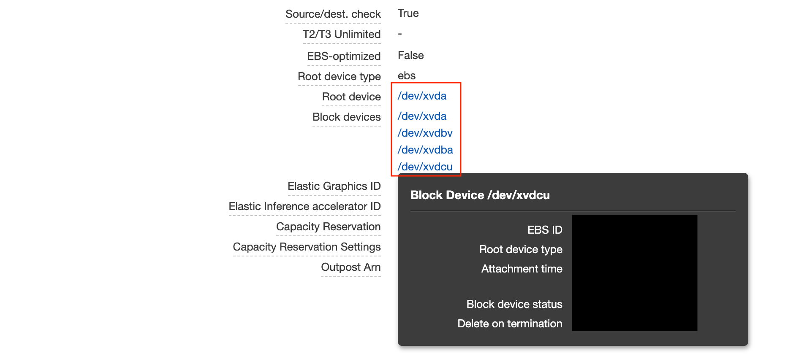

# [k8s] Change PersistentVolume type and size
> date - 2020.08.01  
> keyworkd - Kubernetes, Amazon EBS, PersistentVolume, PersistentVolumeClaim, StatefulSet  
> Kubernetes v1.14에서 Amazon EBS를 사용하는 PersistentVolume의 type, size를 수정하는 과정에서 시도한 방법을 정리  

<br>

## Background
* 비용 절감을 위해 io1에서 gp2로 변경
* 현재 사용하는 IOPS 유지를 위해 volume size 확장 필요


<br>

## Requirement
* 비용 이슈로 Amazon EBS tpye과 size를 변경 필요
* data migration cost를 고려하여 현재 사용하는 volume 유지

<br>

### As-is
* type - io1
* size - 300GiB
* IOPS - 9000
* pricing - 300 x 0.142 + 9000 * 0.074 = $708.6/month

<br>

### To-be
* type - gp2
* size - 1000GiB
* IOPS - 3000
* pricing - 1000 x 0.12 = $120/month

> * 약 7배 비용 차이 발생


<br>

## Environment
* Amazon EKS(Elastic Kubernetes Service)
* Kubernetes v1.14


<br>

## TL;DR
1. Amazon EBS를 직접 수정하기
2. PersistentVolumeClaim, PersistentVolume의 StorageClass 변경하기
3. Amazon EBS와 PersistentVolumeClaim의 volume size Sync
4. 변경된 내용을 반영하여 StatefulSet recreate

<br>

> * StatefulSet - StorageClass - PersistentVolumeClaim - PersistentVolume - Amazon EBS의 싱크가 맞지 않게 되므로 수동으로 맞추어야 하는 이슈가 있다
> * StatefulSet을 사용하고 있어서 PersistentVolumeClaim를 통해 변경을 해야 Container의 file system에 동기화가 이루어진다
> * 권한 이슈로 host의 file system에 접근 불가


<br>

## Persistent Volumes Expanding 방법
* 2가지 방법을 지원
* Storage Class의 allowVolumeExpansion: true 필요
* 간단하게 PersistentVolumeClaim의 spec.resources.requests.storage를 수정하면 끝
```sh
$ kubectl patch pvc [pvc name] -p '{"spec":{"resources":{"requests":{"storage":"xxGi"}}}}'
```

<br>

### 1. Expanding Persistent Volumes Claims
* support api
  * alpha - v1.8 ~ v1.10
  * beta - v1.11

<br>

### 2. Resizing an in-use PersistentVolumeClaim
* support api
  * alpha - v1.11 ~ v1.14
  * beta - v1.15 ~

<br>

> * PersistentVolumeClaim를 변경하면 PersistentVolume의 변경이 발생되고, 사용하는 storage api에 의해 volume에 반영된다
> * Amazon EBS(Elastic Block Store)의 volume 확장은 시간이 오래 걸리는 작업이고, 6시간에 1번 밖에 못한다

<br>

### 사용할 수 있는 feature 확인
* Kubernetes version에 따라 사용 가능한 기능이 다르므로 확인 필요

<br>

> * alpha feature는 Kubernetes API Server의 feature-gates flag로 enable 필요
> * beta feature는 default로 enable, feature-gates에서 disable 가능
> * 대부분의 managed cluster(Amazon EKS, GKE, AKS)는 beta feature만 enable 된다
> * ref - https://github.com/awslabs/amazon-eks-ami/issues/238

<br>

#### Amazon EKS cluster의 feature-gates flag 확인
* ref - https://docs.aws.amazon.com/ko_kr/eks/latest/userguide/api-server-flags.html
```sh
--feature-gates="ExternalKeyService=true"
```
* 현재 cluster에서 사용할 수 있는 방법은 **1. Expanding Persistent Volumes Claims이므로 Pod의 중단 발생**


<br>

## Try 1. StatefulSet의 spec.volumeClaimTemplates.spec.storageClassName 수정
* StatefulSet을 [Dynamic Volume Provisioning](https://kubernetes.io/docs/concepts/storage/dynamic-provisioning)방식으로 사용 중
  * StatefulSet에서 StorageClass를 사용하여 PersistentVolumeClaim와 PersistentVolume를 생성하는 방식
* PersistentVolumeClaim name으로 PersistentVolumeClaim 생성 여부를 결정하므로 해당 설정을 변경하면 PersistentVolumeClaim에도 변경이 일어날 것을 기대

<br>

* StatefulSet Pods
```sh
Volumes:
  pv-test-storage:
    Type:       PersistentVolumeClaim (a reference to a PersistentVolumeClaim in the same namespace)
    ClaimName:  pv-test-storage-pv-test-0
    ReadOnly:   false
```

* StatefulSet
```sh
Volume Claims:
  Name:          pv-test-storage
  StorageClass:  test-fast-sc
  Labels:        <none>
  Annotations:   <none>
  Capacity:      10Gi
  Access Modes:  [ReadWriteOnce]
```

<br>

> #### PersistentVolumeClaim name convention
> * [StatefulSet volumeClaimTemplates.metadata.name]-[pod name]

<br>

### Amazon EBS type 변경을 위하여 다른 StorageClass로 변경
```sh
$ kubectl edit sts [StatefulSet name]

apiVersion: apps/v1
kind: StatefulSet
spec:
...
  volumeClaimTemplates:
    - spec:
        accessModes: [ "ReadWriteOnce" ]
        storageClassName: to-be-storage-class // here
        resources:
          requests:
            storage: 10Gi

## or
$ kubectl patch sts [StatefulSet name] -p '{"spec":{"volumeClaimTemplates":{"spec":{"storageClassName": "to-be-storage-class"}}}}'

The StatefulSet "xxxx" is invalid: spec: Forbidden: updates to statefulset spec for fields other than 'replicas', 'template', and 'updateStrategy' are forbidden
```
* 생성된 StatefulSet에서 replicas, template, updateStrategy만 수정이 가능하지만 새롭게 생성될 Pod를 위해서는 spec.volumeClaimTemplates.spec.storageClassName 수정 필요

<br>

### StatefulSet recreate
* StatefulSet delete시 실행 중인 pod가 delete되지 않도록 `--cascade=false` 사용

```sh
## keep pods running
$ kubectl delete sts [StatefulSet name] --cascade=false

## 내용 수정 후
$ kubectl apply -f sts.yaml
```

<br>

### Result
```sh
$ kubectl get pvc -w

pv-test-storage-pv-test-0   Bound    pvc-xxx-1   10Gi       RWO            as-is-storage-class      98s
pv-test-storage-pv-test-1   Bound    pvc-xxx-2   10Gi       RWO            to-be-storage-class      35s
```
* 기존의 PersistentVolumeClaim는 수정되지 않지만, 새롭게 생성되는 PersistentVolumeClaim에는 반영되는 것으로 확인
* StatefulSet의 volumeClaimTemplates은 새로운 Pod 생성시, PersistentVolumeClaim를 생성하는데 사용되고, PersistentVolumeClaim가 존재한다면 새로 생성하지 않는다


<br>

## Try 2. PersistentVolumeClaim 수정
* PersistentVolume는 PersistentVolumeClaim에 영향을 받으므로 PersistentVolumeClaim를 수정하면 PersistentVolume에 반영될 것을 기대

```sh
$ kubectl patch pvc [PersistentVolumeClaim name] -p '{"spec":{"storageClassName": "to-be-storage-class"}}'

persistentvolumeclaims "resizing-pv-test-storage-resizing-pv-test-0" was not valid:
* spec: Forbidden: is immutable after creation except resources.requests for bound claims
```
* bound PersistentVolumeClaim에서는 `resources.requests` 밖에 수정할 수 없다


<br>

## Try 3. Amazon EBS를 직접 수정하기
* Amazon EBS에서 type, size를 직접 수정
* [볼륨 크기 조정 후 Linux 파일 시스템 확장](https://docs.aws.amazon.com/ko_kr/AWSEC2/latest/UserGuide/recognize-expanded-volume-linux.html)를 참고


### 1. Amazon EC2에서 확인
* Attached EBS는 총 5개인 것을 확인


* 그러나 EC2에 접속해서 확인하면 root device밖에 보이지 않는다
```sh
$ df -h

Filesystem      Size  Used Avail Use% Mounted on
devtmpfs         16G     0   16G   0% /dev
tmpfs            16G     0   16G   0% /dev/shm
tmpfs            16G  1.4M   16G   1% /run
tmpfs            16G     0   16G   0% /sys/fs/cgroup
/dev/nvme0n1p1   60G   50G   11G  83% /  # root devices
```

* Host의 file system에 mount되어 있지 않기 때문에 Host에서 아래의 file system 확장 명령어 실행 불가
```sh
$ sudo resize2fs [file system]

$ sudo xfs_growfs -d [mounted on path]

## example
$ sudo resize2fs /dev/xvda1

$ sudo xfs_growfs -d /
```

### 2. Container에서 확인
* Container에서 확인시 mount되어 있는 것을 알 수 있다
```sh
$ df -h
Filesystem                Size      Used Available Use% Mounted on
...
/dev/nvme3n1             10.0G    342.8M      9.7G   3% /home/busybox
```

* 여기서 file system 확장을 위한 명령어 실행하면?
```sh
$ xfs_growfs
sh: xfs_growfs: command not found
```

* command not found기 때문에 `hostPath`를 이용해 명령어를 실행할 수 있게 한다
```yaml
apiVersion: apps/v1
kind: StatefulSet
...
        - name: busybox
          image: amazonlinux:2.0.20200602.0
          imagePullPolicy: IfNotPresent
          securityContext:
            privileged: true
          command: ["sh", "-c", "echo The app is running! && sleep 3600"]
          volumeMounts:
            - mountPath: /home/busybox
              name: pv-test-storage  # resize target PersistentVolume(Amazon EBS)
            - mountPath: /usr/sbin/xfs_growfs
              name: host-xfs-growfs
            - mountPath: /usr/bin/sudo
              name: host-sudo
      volumes:
        - name: host-xfs-growfs
          hostPath:
            path: /usr/sbin/xfs_growfs
        - name: host-sudo
          hostPath:
            path: /usr/bin/sudo
```

* 단순 명령어를 실행할 수 있게 해주는 것만으로는 쉽지 않다
```sh
$ xfs_growfs -d /home/busybox
xfs_growfs: cannot open /dev/nvme3n1: Permission denied

$ sudo xfs_growfs -d /home/busybox
sudo: error while loading shared libraries: libaudit.so.1: cannot open shared object file: No such file or directory
```

<br>

## Resolve

### 1. Amazon EBS를 직접 수정하기
```sh
$ aws ec2 modify-volume \
          --volume-type gp2 \  # gp2, io1, sc1, st1
          --size 1000 \
          --volume-id vol-xxxxxxxx
```

### 2. PersistentVolumeClaim, PersistentVolume의 StorageClass 변경하기
* Amazon EBS type 변경으로 StorageClass와 sync

#### Backup PersistentVolume, PersistentVolumeClaim
```sh
$ kubectl get pvc [PersistentVolumeClaim name] -o yaml >> backup-pvc.yaml
$ kubectl get pv [PersistentVolume name] -o yaml >> backup-pv.yaml
```
* backup된 PersistentVolumeClaim, PV 설정에서 `StorageClass` 내용을 수정

#### Delete PersistentVolume, PersistentVolumeClaim
```sh
$ kubectl delete pvc [PersistentVolumeClaim name]
$ kubectl delete pv [PersistentVolume name]
```

* PersistentVolume가 Pod에 mount되어 있기 때문에 Pod도 제거
```sh
$ kubectl delete pod [StatefulSet Pod name]
```

* PersistentVolumeClaim, PersistentVolume가 제거된 상태이므로 Pod는 Running될 수 없다
```
$ kubectl get pods -w [pod name]
pv-test-0   0/2     Pending             0          65s
pv-test-0   0/2     ContainerCreating   0          65s

$ kubectl describe pod [pod name]
...
  Warning  FailedScheduling   23s               default-scheduler   persistentvolumeclaim "pv-test-storage-pv-test-0" is being deleted
  Warning  FailedScheduling   22s               default-scheduler   persistentvolumeclaim "pv-test-storage-pv-test-0" not found
  Normal   NotTriggerScaleUp  8s (x2 over 18s)  cluster-autoscaler  pod didn't trigger scale-up (it wouldn't fit if a new node is added): 4 node(s) didn't match node selector
```

#### Recreate PersistentVolume, PersistentVolumeClaim
* Recreate PersistentVolume
```sh
$ kubectl apply -f backup-pv.yaml

$ kubectl get pv -w

pvc-xxxxxxx   12Gi       RWO            Retain           Pending       default/pv-test-storage-pv-test-0       to-be-storage-class            0s
pvc-xxxxxxx   12Gi       RWO            Retain           Available     default/pv-test-storage-pv-test-0       to-be-storage-class            0s
```

* Recreate PersistentVolumeClaim
```sh
$ kubectl apply -f backup-pvc.yaml

$ kubectl get pvc -w

pv-test-storage-pv-test-0   Pending       pvc-xxxxxxx   0                         to-be-storage-class   0s
pv-test-storage-pv-test-0   Lost          pvc-xxxxxxx   0                         to-be-storage-class   0s
```

* 1개의 PersistentVolume에 2개의 PersistentVolumeClaim가 bound되기 때문에 **PersistentVolumeClaim의 status는 Lost**
```sh
$ kubectl describe pvc [pvc name]
...
Events:
  Type       Reason         Age    From                         Message
  ----       ------         ----   ----                         -------
  Warning    ClaimMisbound  2m10s  persistentvolume-controller  Two claims are bound to the same volume, this one is bound incorrectly
Mounted By:  pv-test-0
```

* PersistentVolume의 `spec.claimRef`를 수정하여 PersistentVolumeClaim가 bound되도록 한다
```sh
$ kubectl patch pv [pv name] -p '{"spec":{"claimRef":null}}'
persistentvolume/[pv name] patched

$ kubectl get pvc -w
pv-test-storage-pv-test-0   Lost          pvc-xxxxxxx   0                         to-be-storage-class   0s
pv-test-storage-pv-test-0   Bound         pvc-xxxxxxx   12Gi       RWO            to-be-storage-class   8m41s

$ kubectl get pv -w
pvc-xxxxxxx   12Gi       RWO            Retain           Available                                             to-be-storage-class            8m33s
pvc-xxxxxxx   12Gi       RWO            Retain           Available     default/pv-test-storage-pv-test-0       to-be-storage-class            8m35s
pvc-xxxxxxx   12Gi       RWO            Retain           Bound         default/pv-test-storage-pv-test-0       to-be-storage-class            8m35s
```

* Pod도 Running 된다
```sh
$ kubectl get pods -w

pv-test-0   0/2     ContainerCreating   0          65s
pv-test-0   2/2     Running             0          10m
```

<br>

### 3. Amazon EBS와 PersistentVolumeClaim의 volume size Sync
* Amazon EBS의 volume size가 container의 file system에 반영이 안돼어 있기 때문에 PersistentVolumeClaim의 size 변경 필요
```sh
$ kubectl patch pvc [pvc name] -p '{"spec":{"resources":{"requests":{"storage":"xxGi"}}}}'
```

* PersistentVolumeClaim의 Condition이 아래와 같이 변경된다
```sh
$ kubectl describe pvc [PersistentVolumeClaim name]
...
Conditions:
  Type       Status  LastProbeTime                     LastTransitionTime                Reason  Message
  ----       ------  -----------------                 ------------------                ------  -------
  Resizing   True    Mon, 01 Jan 0001 00:00:00 +0000   Sun, 26 Jul 2020 21:38:28 +0900
```

* 잠시 후 PersistentVolume의 size가 증가한다
```sh
## As-is
pvc-xxxxxxx   10Gi       RWO            Retain           Bound    default/pv-test-storage-pv-test-0       to-be-storage-class            17h

## To-be
pvc-xxxxxxx   11Gi       RWO            Retain           Bound    default/pv-test-storage-pv-test-0       to-be-storage-class            17h
```


* PersistentVolumeClaim의 size에는 변화가 없고, Condition이 아래와 같이 변경된다
```sh
$ kubectl describe pvc [PersistentVolumeClaim name]
...
Capacity:      10Gi
...
Conditions:
  Type                      Status  LastProbeTime                     LastTransitionTime                Reason  Message
  ----                      ------  -----------------                 ------------------                ------  -------
  FileSystemResizePending   True    Mon, 01 Jan 0001 00:00:00 +0000   Thu, 26 Jul 2020 21:45:38 +0900   Waiting for user to (re-)start a pod to finish file system resize of volume on node.
```
* Container의 file system에서 volume size 변경을 확인
```sh
$ kubectl exec -it [Pod name] -- df -h

Filesystem                Size      Used Available Use% Mounted on
/dev/nvme4n1             10.0G    367.2M     9.6G   1% /data
```
* 아직 file system에는 volume size가 반영되지 않음을 확인할 수 있다

* Pod를 restart하면 PersistentVolumeClaim에도 반영된다
```sh
## As-is
pv-test-storage-pv-test-0   Bound    pvc-xxxxxxx   10Gi       RWO            to-be-storage-class   17h

## To-be
pv-test-storage-pv-test-0   Bound    pvc-xxxxxxx   11Gi       RWO            to-be-storage-class   17h
```

<br>

> #### PersistentVolume와 PersistentVolumeClaim 사이의 bound issue가 발생할 경우 아래 명령어를 실행하면 정상적으로 bound된다
> ```sh
> $ kubectl patch pv [pv name] -p '{"spec":{"claimRef":null}}'
> ```
> * PersistentVolumeClaim 제거시 PV는 Released
> ```sh
> pvc-xxxxxxx   21Gi       RWO            Retain           Released              to-be-storage-class            11m
> ```
> * 위 명령어로 PVC의 reference를 끊어주면 Available이 된다
> ```sh
> pvc-xxxxxxx   21Gi       RWO            Retain           Available              to-be-storage-class            11m
> ```

<br>

### 4. StatefulSet recreate
* StatefulSet의 `spec.volumeClaimTemplates`을 수정하지 않으면 추후 생성되는 Pod는 잘못된 size의 PersistentVolumeClaim이 생성되기 때문에 수정 필요
* StatefulSet delete시 실행 중인 pod가 delete되지 않도록 `--cascade=false` 사용

```sh
## keep pods running
$ kubectl delete sts [StatefulSet name] --cascade=false

## 내용 수정 후
$ kubectl apply -f sts.yaml
```


<br>

## Conclusion
* **Resizing an in-use PersistentVolumeClaim**를 사용할 수 있는 Kubernetes v1.15에서는 조금 더 편하게 진행 가능
* `PersistentVolumeClaim`에서 Amazon EBS의 type 변경하는 기능은 아직 제공하지 않아서 위와 같이 번거로움이 필요하므로 type 선정을 잘하자


<br><br>

> #### Reference
> * [Expanding Persistent Volumes Claims - Kubernetes Docs](https://kubernetes.io/docs/concepts/storage/persistent-volumes/#expanding-persistent-volumes-claims)
> * [Feature Gates - Kubernetes Docs](https://kubernetes.io/docs/reference/command-line-tools-reference/feature-gates)
> * [Enable feature gates TTLAfterFinished #238 - Github awslabs/amazon-eks-ami](https://github.com/awslabs/amazon-eks-ami/issues/238)
> * [볼륨 크기 조정 후 Linux 파일 시스템 확장 - Amazon EC2 Docs](https://docs.aws.amazon.com/ko_kr/AWSEC2/latest/UserGuide/recognize-expanded-volume-linux.html)
