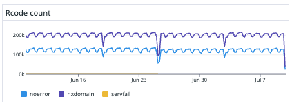
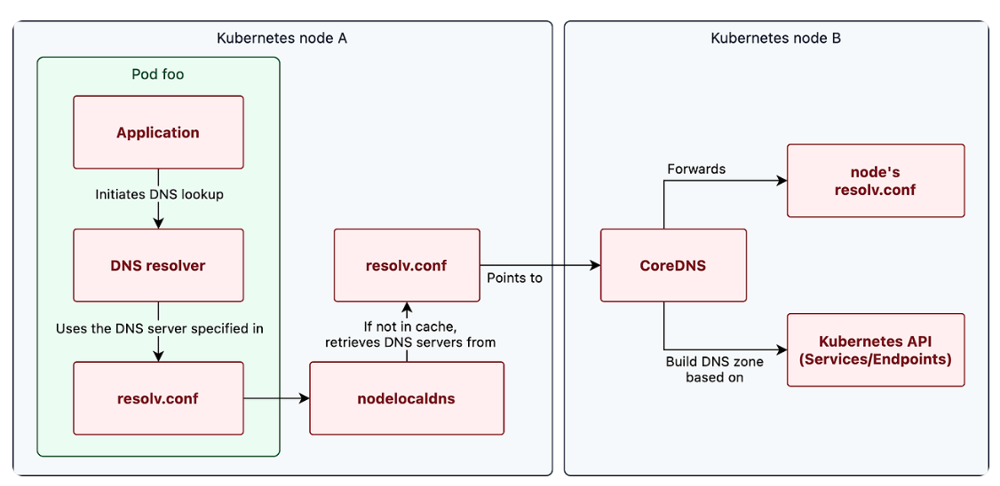

# [k8s] Fix NXDOMAIN occureence in CoreDNS
> date - 2024.07.09  
> keyword - k8s, coredns, rcode, ndots  
> NXDOMAIN이 발생하는 불필요한 DNS query로 인한 CoreDNS의 부하를 줄이기 위한 방법 정리

<br>

## Issue. CoreDNS에서 nxdomain이 다수 발생
* CoreDNS의 rcode 중 nxdomain이 다수 발생

<div align="left">
  
</div>


<br>

## Why?

### CoreDNS?
* [CoreDNS](https://coredns.io)는 DNS server로 k8s cluster 내의 DNS와 Service Discovery를 담당
* CoreDNS로 DNS query를 하여 k8s cluster 내의 Pod를 찾을 수 있으며, forward lookup(A, AAA record), port lookup(SRV record), reverse IP address lookup(PTR record) 지원
* CoreDNS는 표준 DNS error code인 rcode를 반환
  * NXDOMAIN(Non-existent internet domain name) - 존재하지 않은 도메인
  * NOERROR - error X
* NXDomain, FormErr 같은 error는 CoreDNS가 수신하는 request의 문제를 나타내고, ServFail은 CoreDNS의 문제를 나타낼 수 있다
* Service에는 다음과 같은 format으로 A record 할당
```
<service name>.<namespace>.svc.cluster.local
```
```
redis-1.redis.svc.cluster.local
------- -----
   |      |
   |      +—–> namespace
   +—–—–—–—–—–—––> service name
```

<br>

### ndots?
* [FQDN(Fully Qualified Domain Name)](https://en.wikipedia.org/wiki/Fully_qualified_domain_name)(`.`으로 끝나는 domain)으로 취급할 `.`의 최소 개수를 의미(default. 5)
* FQDN이면 1번의 DNS query 발생
* ElastiCache, Aurora MySQL의 도메인과 `.`의 갯수
  * ElastiCache - test-redis.xxxxxx.ng.0001.apn2.cache.amazonaws.com - .7개
  * Aurora MySQL - test-mysql.cluster-xxxxxxx.ap-northeast-2.rds.amazonaws.com - .5개
* Aurora MySQL의 경우 ndots의 범위에 포함되어 CoreDNS의 domain search list를 붙여가며 순차적으로 query 후 모두 nxdomain을 반환 받고, 외부 DNS server로 query
* ndots을 수정해서 불필요한 DNS query를 조절할 수 있다

| ndots | Domain | FQDN 여부 | DNS query count |
|:--|:--|:--|:--|
| 2 | www.example.com | `.` 2개로 FQDN | 1 |
| 2 | www.example.com. | FQDN | 1 |
| 5 | www.example.com | `.` 2개로 FQDN X | 여러번 |
| 5 | www.example.com. | FQDN | 1 |

<br>

### DNS Resolution flow
<div align="left">
  
</div>

* Pod의 /etc/resolv.conf 확인
```sh
$ kubectl exec -it <pod> -- cat /etc/resolv.conf

search <namespace>.svc.cluster.local svc.cluster.local cluster.local ap-northeast-2.compute.internal
nameserver 10.0.0.10
options ndots:5
```
* kubelet에서 제공하는 /etc/resolv.conf 파일은 모든 DNS query를 CoreDNS로 전달
  * 각 node마다 동작하고 있는 kubelet은 Pod를 실행할 때, /etc/resolv.conf에 CoreDNS의 ClusterIP를 nameserver로 등록하며 추가로 search domain, ndots option 설정
* /etc/resolv.conf는 client가 어디로 DNS query를 할지 판단하기 위한 용도로 사용

#### search domain
* short DNS name으로 query시 추가해서 query해야하는 domain suffix 설정
* search list의 순서대로 붙여가며 DNS query
  
1. `<query domain name>.<namespace>.svc.cluster.local`
2. `<query domain name>.svc.cluster.local`
3. `<query domain name>.cluster.local`
4. `<query domain name>.ap-northeast-2.compute.internal`

<br>

### Debugging DNS Resolution
* dnsutils Pod 생성
```sh
$ cat <<EOF > dnsutils.yaml
apiVersion: v1
kind: Pod
metadata:
  name: dnsutils
  namespace: default
spec:
  containers:
    - name: dnsutils
      image: registry.k8s.io/e2e-test-images/jessie-dnsutils:1.7
      command:
        - sleep
        - "infinity"
      imagePullPolicy: IfNotPresent
  restartPolicy: Always
EOF

$ kubectl apply -f dnsutils.yaml

## or
$ kubectl apply -f https://k8s.io/examples/admin/dns/dnsutils.yaml
```

* check local DNS configuration
```sh
$ kubectl exec -it dnsutils -- cat /etc/resolv.conf

search default.svc.cluster.local svc.cluster.local cluster.local ap-northeast-2.compute.internal
nameserver 10.0.0.10
options ndots:5
```

* [nslookup](https://linux.die.net/man/1/nslookup)으로 확인
```sh
$ kubectl exec -it dnsutils -- nslookup kubernetes.default

Server:		10.0.0.10
Address:	10.0.0.10#53

Name:	kubernetes.default.svc.cluster.local
Address: 10.0.0.1
```
* `nslookup: can't resolve 'kubernetes.default'`가 나오면 CoreDNS에 문제가 있다는 것이므로 CoreDNS Pod 확인
```sh
## check service
$ kubectl get service -l k8s-app=kube-dns
NAME       TYPE        CLUSTER-IP    EXTERNAL-IP   PORT(S)                  AGE
kube-dns   ClusterIP   172.20.0.10   <none>        53/UDP,53/TCP,9153/TCP   314d

## check pod
$ kubectl get pods -n kube-system -l k8s-app=kube-dns
NAME                      READY   STATUS    RESTARTS   AGE
coredns-7bffdcb7c-cnxp4   1/1     Running   0          32h
coredns-7bffdcb7c-jbq29   1/1     Running   0          32h

## check log
$ kubectl logs -n kube-system -l k8s-app=kube-dns
.:53
[INFO] plugin/reload: Running configuration SHA512 = 8a7d59126e7f114ab49c6d2613be93d8ef7d408af8ee61a710210843dc409f03133727e38f64469d9bb180f396c84ebf48a42bde3b3769730865ca9df5eb281c
...
```

* DNS query 수신/처리 확인을 위해 logging(ConfigMap을 수정하면 CoreDNS가 자동으로 reload)
```yaml
apiVersion: v1
kind: ConfigMap
metadata:
  name: coredns
  namespace: kube-system
  labels:
    eks.amazonaws.com/component: coredns
    k8s-app: kube-dns
data:
  Corefile: |
    .:53 {
        errors
        health {
            lameduck 5s
          }
        ready
        kubernetes cluster.local in-addr.arpa ip6.arpa {
          pods insecure
          fallthrough in-addr.arpa ip6.arpa
        }
        prometheus :9153
        forward . /etc/resolv.conf
        cache 30
        loop
        reload
        loadbalance
        log  # enable logging
    }
```


<br>

## Resolve
* 해결을 위한 몇가지 방법을 정리
* FQDN 인식을 최대한 빠르게하여 CoreDNS의 부하를 감소시킨다

<br>

### 1. FQDN 사용
* FQDN 및 마지막에 `.`을 붙이면 1번만 DNS query 발생하고, `.`이 없으면 찾을 때까지 DNS query 발생
* k8s cluster 외부 domain은 FQDN으로 설정하면 좋다
* 사용 중인 domain을 모두 수정해줘야하는 번거로움이 발생

<br>

#### 마지막에 `.` 있을 때
* 존재하지 않은 도메인 - 못찾아도 1번만 query 발생
```sh
$ nslookup not-exist-domain.

[INFO] 10.24.200.91:39018 - 21950 "A IN not-exist-domain. udp 30 false 512" NXDOMAIN qr,aa,rd,ra 105 0.000090617s
```

* 존재하는 도메인 - 찾아서 1번만 query 발생
```sh
$ nslookup exist-domain.default
[INFO] 10.24.200.91:59417 - 34304 "A IN exist-domain.default. udp 38 false 512" NOERROR qr,rd,ra 113 0.006835285s
```

#### 마지막에 `.` 없을 때
* 존재하지 않은 도메인- 찾을 때까지 `/etc/resolv.conf`의 search에 정의된 순서(<namesapce>.svc.cluster.local -> svc.cluster.local -> cluster.local -> ap-northeast-2.compute.internal -> 일반 도메인)로 query가 발생하며 결국 못찾는다
```sh
$ nslookup not-exist-domain.default

[INFO] 10.24.200.91:50407 - 21256 "A IN not-exist-domain.kube-system.svc.cluster.local. udp 62 false 512" NXDOMAIN qr,aa,rd 155 0.000179101s
[INFO] 10.24.200.91:60066 - 27670 "A IN not-exist-domain.svc.cluster.local. udp 50 false 512" NXDOMAIN qr,aa,rd 143 0.000311164s
[INFO] 10.24.200.91:36366 - 65518 "A IN not-exist-domain.cluster.local. udp 46 false 512" NXDOMAIN qr,aa,rd 139 0.000151621s
[INFO] 10.24.200.91:51563 - 32673 "A IN not-exist-domain.ap-northeast-2.compute.internal. udp 64 false 512" NXDOMAIN qr,rd,ra 187 0.002553742s
[INFO] 10.24.200.91:60354 - 21341 "A IN not-exist-domain. udp 32 false 512" NXDOMAIN qr,rd,ra 107 0.039108254s
```

* 존재하는 도메인 - 찾을 때 까지 반복
```sh
$ nslookup exist-domain.default

[INFO] 10.24.200.91:46943 - 8506 "A IN exist-domain.default.kube-system.svc.cluster.local. udp 68 false 512" NXDOMAIN qr,aa,rd 161 0.000165677s
[INFO] 10.24.200.91:52858 - 29532 "A IN exist-domain.default.svc.cluster.local. udp 56 false 512" NOERROR qr,aa,rd 110 0.000144212s
```

<br>

### 2. Customize ndots
* `dnsConfig`로 ndots 설정
```yaml
apiVersion: v1
kind: Pod
metadata:
  namespace: default
  name: dns-example
spec:
  containers:
    - name: test
      image: nginx
  dnsConfig:
    options:
      - name: ndots
        value: "2"
```

* disable dnsPolicy 
```yaml
  dnsPolicy: "None"
  dnsConfig:
    nameservers:
      - 192.0.2.1 # this is an example
    searches:
      - ns1.svc.cluster-domain.example
      - my.dns.search.suffix
    options:
      - name: ndots
        value: "2"
      - name: edns0
```

```sh
$ kubectl logs -f --tail=500 -l k8s-app=kube-dns | grep NXDOMAIN
```
로 확인 후 NXDOMAIN이 많이 발생하는 것 찾어서 Pod(AWS API 등 외부 API 사용이 많은 Pod)에 적용

#### cluster level config
* [kubedns-shepherd](https://github.com/eminaktas/kubedns-shepherd) 사용
  * [Allowing overwritable DNS options for ClusterFirst and ClusterFirstWithHostNet policy in the kubelet configuration #116117](https://github.com/kubernetes/kubernetes/issues/116117#issuecomment-2085604406)

<br>

### Etc. CoreDNS의 부하에 대응

#### Pod Anti Affinity, Pod Topology Spread Constraints 설정
* AWS NIC는 초당 1024 packet hard limit이 있어서 단일 node에 CoreDNS가 여러개 배포될 경우 문제가 될 수 있으므로 [Pod Anti Affinity](https://kubernetes.io/docs/concepts/scheduling-eviction/assign-pod-node/#inter-pod-affinity-and-anti-affinity) or [Pod Topology Spread Constraints](https://kubernetes.io/docs/concepts/scheduling-eviction/topology-spread-constraints)를 설정하여 NIC hard limit을 대응
  * https://aws.amazon.com/ko/premiumsupport/knowledge-center/eks-dns-failure

* Pod Topology Spread Constraints
```yaml
apiVersion: apps/v1
kind: Deployment
metadata:
  name: coredns
  labels:
    k8s-app: kube-dns
spec:
  template:
    spec:
      topologySpreadConstraints:
        - maxSkew: 1
          topologyKey: topology.kubernetes.io/zone
          whenUnsatisfiable: ScheduleAnyway
          labelSelector:
            matchLabels:
              k8s-app: kube-dns 
```

* Pod Anti Affinity
```yaml
apiVersion: apps/v1
kind: Deployment
metadata:
  name: coredns
  labels:
  labels:
    k8s-app: kube-dns
spec:
  template:
    spec:
      affinity:
        podAntiAffinity:
          preferredDuringSchedulingIgnoredDuringExecution:
            - podAffinityTerm:
                labelSelector:
                  matchExpressions:
                    - key: k8s-app
                      operator: In
                      values:
                        - kube-dns
                topologyKey: kubernetes.io/hostname
              weight: 100
```

<br><br>

> #### Reference
> * [How to change ndots option default value of dns in Kubernetes](https://stackoverflow.com/questions/70264378/how-to-change-ndots-option-default-value-of-dns-in-kubernetes)
> * [Pod's DNS Config](https://kubernetes.io/docs/concepts/services-networking/dns-pod-service/#pod-dns-config)
> * [Customizing DNS Service](https://kubernetes.io/docs/tasks/administer-cluster/dns-custom-nameservers)
> * [Cluster Services - EKS Best Practices Guides](https://aws.github.io/aws-eks-best-practices/scalability/docs/cluster-services)
