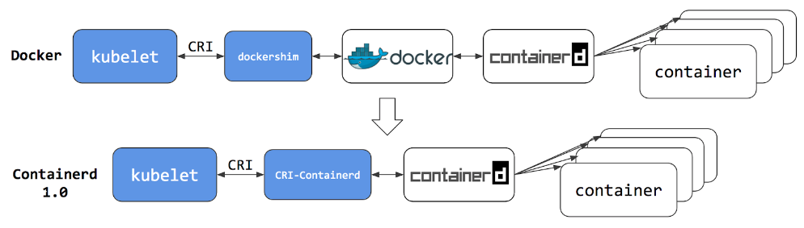

# [k8s] dockershim deprecated
> date - 2022.07.11  
> keyworkd - kubernetes, container, cri, dockershim  
> k8s에서 dockershim deprecated issue에 대해 정리  

<br>

## dockershim loadmap
* v1.20 - deprecated
* v1.24 - removed


<br>

## Why?
<div align="center">
  
</div>

<br>

* container runtime 표준화를 위해 [CRI & OCI](../container/container-interface/cri_and_oci.md) 탄생
* `Docker`는 OCI 탄생 전에 구현되었기 때문에 CRI를 준수하지 않아서 kubernetes에서 `dockershim`을 사용해 CRI 준수
* Docker는 하나의 기술 스택으로 kubernetes에 필요 없는 UX 기능도 포함
* `dockershim`으로 인해 유지 보수 및 오류 발생 가능성이 높아지는 문제가 있어 kubelet에서 `dockershim`을 제거하기로 함
* `Docker`는 container runtime으로 high-level container runtime인 [containerd](https://containerd.io)를 사용
  * container runtime으로 [containerd](https://containerd.io)를 사용하면 특별한 변화는 없음
* cgroups v2, user namespace와 같이 `dockershim`과 호환되지 않는 CRI runtime의 최신 기능을 사용 가능
* 제거시 `dockershim`으로 인해 발생한 overhead가 적어지며 더 나은 성능을 보여줌


<br>

## migration 고려 사항
Docker를 직접 사용한 모든 것에 대한 고려 필요
* `dockerd`를 이용한 Logging configuration
* podSpec을 사용하지 않은 runtime resource 제한
* docker command or `docker socket(/var/run/docker.sock)`을 사용 모든 것
  * DinD(Docker in Docker)
    * 보통 빌드 때문에 사용하므로 [kaniko](https://github.com/GoogleContainerTools/kaniko), [img](https://github.com/genuinetools/img), [buildah](https://github.com/containers/buildah)로 대체
  * telemetry
    * [Datadog](https://www.datadoghq.com)
    * [Dynatrace](https://www.dynatrace.com/)
  * security agent
    * [Aqua](https://www.aquasec.com)
    * [Falco](https://falco.org)
* Docker는 [OCI(Open Container Initiative)](https://opencontainers.org/) image를 생성하고, [containerd](https://containerd.io), [CRI-O](https://cri-o.io/)는 OCI image를 실행할 수 있으므로 container image의 변경은 필요하지 않다
* [kind](https://kind.sigs.k8s.io/)는 node internal에서 `dockershim`을 사용하지 않고, CRI/containerd를 사용하기 때문에 host에서 docker, podman을 사용해도 무방
* `Amazon EKS`는 v1.23부터 `containerd`를 사용
  * [Amazon EKS is ending support for Dockershim](https://docs.aws.amazon.com/ko_kr/eks/latest/userguide/dockershim-deprecation.html)

<br>

### docker socket 사용 여부 확인
* `/var/run/docker.sock` mount하는 Pod 찾기
```sh
$ kubectl get pods --all-namespaces \
-o=jsonpath='{range .items[*]}{"\n"}{.metadata.namespace}{":\t"}{.metadata.name}{":\t"}{range .spec.volumes[*]}{.hostPath.path}{", "}{end}{end}' \
| sort \
| grep '/var/run/docker.sock'
```
* [Detector for Docker Socket(DDS)](https://github.com/aws-containers/kubectl-detector-for-docker-socket) kubectl plug-in 사용
```sh
$ kubectl krew install dds

$ kubectl dds
NAMESPACE       TYPE            NAME                    STATUS
default         deployment      deploy-docker-volume    mounted
kube-system     daemonset       kube-proxy              not-mounted
```

### migration
* [cri-dockerd](https://kubernetes.io/docs/tasks/administer-cluster/migrating-from-dockershim/migrate-dockershim-dockerd/)
  * CRI로 Docker Engine 사용
* [containerd](https://kubernetes.io/docs/tasks/administer-cluster/migrating-from-dockershim/change-runtime-containerd/)
* [CRI-O](https://kubernetes.io/ko/docs/setup/production-environment/container-runtimes/#cri-o)


<br>

## Conclusion
* container runtime으로 [containerd](https://containerd.io)를 사용할 경우 [kaniko](https://github.com/GoogleContainerTools/kaniko), [CRI-O](https://cri-o.io/)를 사용할 경우 [buildah](https://github.com/containers/buildah) + [Podman](https://podman.io/) + [skopeo](https://github.com/containers/skopeo)를 고려


<br><br>

> #### Reference
> * [Don't Panic: Kubernetes and Docker](https://kubernetes.io/blog/2020/12/02/dont-panic-kubernetes-and-docker)
> * [Dockershim Deprecation FAQ](https://kubernetes.io/blog/2020/12/02/dockershim-faq/)
> * [Updated: Dockershim Removal FAQ](https://kubernetes.io/blog/2022/02/17/dockershim-faq/)
> * [Check whether dockershim removal affects you](https://kubernetes.io/docs/tasks/administer-cluster/migrating-from-dockershim/check-if-dockershim-removal-affects-you/)
> * [Kubernetes Containerd Integration Goes GA](https://kubernetes.io/blog/2018/05/24/kubernetes-containerd-integration-goes-ga/)
> * [containerd](https://containerd.io)
> * [cri-dockerd](https://kubernetes.io/docs/tasks/administer-cluster/migrating-from-dockershim/migrate-dockershim-dockerd/)
> * [Detector for Docker Socket(DDS)](https://github.com/aws-containers/kubectl-detector-for-docker-socket)
> * [Amazon EKS is ending support for Dockershim](https://docs.aws.amazon.com/ko_kr/eks/latest/userguide/dockershim-deprecation.html)
