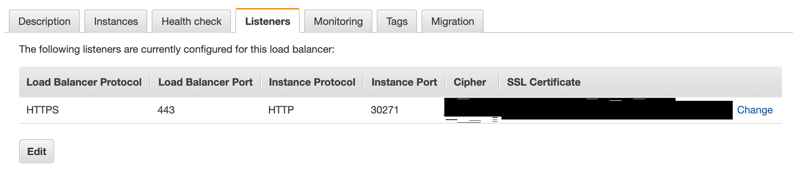
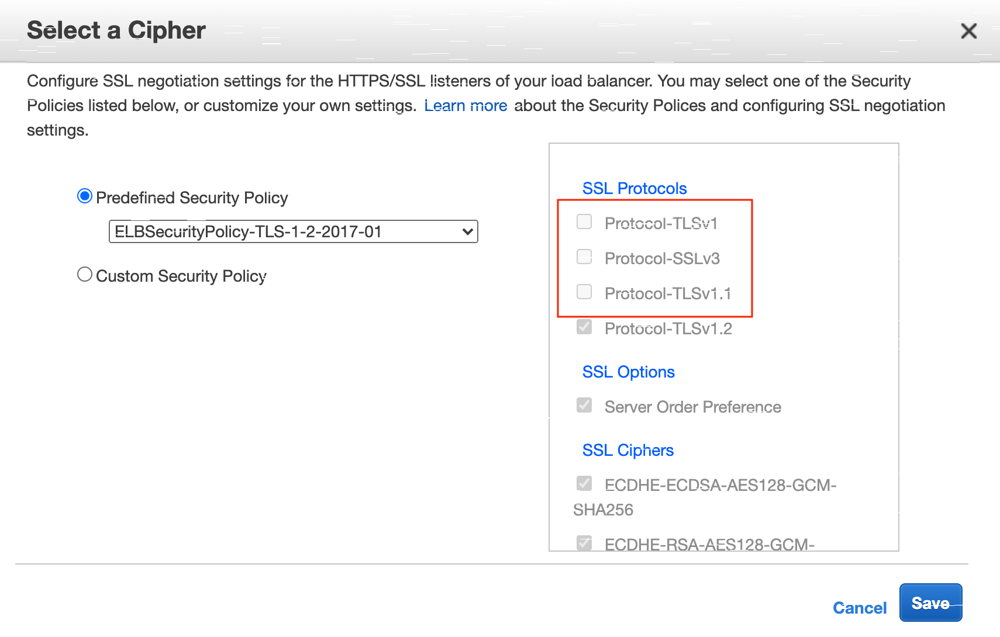
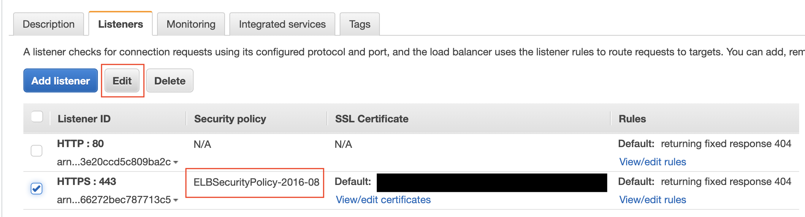
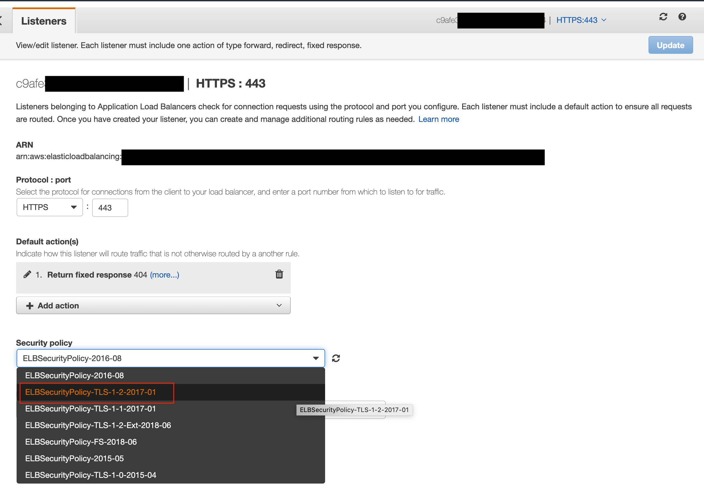

# [k8s] How to Disable TLS 1.0 on AWS
> date - 2020.08.09  
> keyworkd - TLS, AWS, ELB, Kubernetes  
> AWS, Kubernetes 환경에서 TLS 1.0 등을 disable하는 방법을 정리  


<br>

## TLS(Transport Layer Security) 1.0?
* SSL의 후속 버전으로 초기 SSL Protocol을 기반으로 개발되어 client와 server 간 통신 체널을 보호하고 암호화 하기 위해 사용
* TLS 1.0, 1.1, 1.2, 1.3 존재하고 이 중 TLS 1.0, 1.1은 POODLE(SSL), BEAST(SSL), man-in-the-middle attacks(TLS)와 같은 공격에 **취약하여 보안성이 낮다**
  * TLS 1.0 등으로 인한 보안 위험을 완화하는 방법은 SSLv3, TLS 1.0 등을 비활성화하는 것
* Chrome, IE, Edge 등 브라우저에서 2020년부터 TLS 1.0, TLS 1.1 암호화 protocol 지원 중단 예정

<br>

> #### POODLE(Padding Oracle On Downgraded Legacy Encryption) 취약점
> * 구식 암호화 기법을 악용할 수 있게 하는 protocol downgrad 취약점
> * 주요 Web Browser의 TLS는 downgrade negotiation process를 지원하기 때문에 server에서 최신 protocol을 지원하더라도 공격자가 취약한 protocol 사용 가능

<br>

> #### BEAST(Browser Exploit Against SSL/TLS) 취약점
> * Web Browser에서 HTTPS의 쿠키를 해독하고, 효과적인 타겟의 session을 하이제킹할 수 있는 취약점

<br>

> #### Man-in-the-middle attack
> * 공격자가 중간에 위치하여 packet을 조작하는 공격으로 Sniffing, Packet Injection, Session Hijacking, SSL Stripping 등이 있다


<br>

## AWS Web console에서 TLS Policy 적용하기
* AWS에서 구버전 TLS를 disable하는 방법은 간단하다

<br>

### Classic Load Balancer
#### 1. [EC2] - [Load Balancers] - [Listeners] tab에서 `Cipher Change` 클릭



#### 2. Security Policy 선택
* [Classic Load Balancer의 사전 정의 SSL 보안 정책](https://docs.aws.amazon.com/ko_kr/elasticloadbalancing/latest/classic/elb-security-policy-table.html)을 참고하여 원하는 Security Policy 선택하거나 `Custom Security Policy`로 변경



<br>

### Application Load Balancer

#### 1. [EC2] - [Load Balancers] - [Listeners] tab에서 `Edit` 클릭
* Security policy로 `ELBSecurityPolicy-2016-08(default)`를 사용하고 있는 것을 확인



#### 2. Security Policy 선택
* [HTTPS 리스너 생성 - 보안 정책](https://docs.aws.amazon.com/ko_kr/elasticloadbalancing/latest/application/create-https-listener.html#describe-ssl-policies)을 참고하여 원하는 Security Policy 선택



<br>

### 변경 결과 확인
* [Qualys SSL LABS](https://www.ssllabs.com/ssltest/analyze.html)
* [SSL Shopper](https://www.sslshopper.com)
* OpenSSL
```sh
$ openssl s_client -connect [endpoint] [protocol]

## example
$ openssl s_client -connect example.com:443 -tls1  # or tls1_1, tls1_2

### before
$ openssl s_client -connect example.com:443 -tls1
CONNECTED(00000006)
...
New, TLSv1/SSLv3, Cipher is ECDHE-RSA-AES128-SHA
...

### after
$ openssl s_client -connect example.com:443 -tls1
CONNECTED(00000006)
...
New, (NONE), Cipher is (NONE)
Secure Renegotiation IS NOT supported
...
```


<br>

## Kubernetes에서 TLS Policy 적용하기
* Kubernetes `Service` object로 AWS의 CLB(Classic Load Balancer), NLB(Network Load Balancer)를 생성할 수 있다
* [AWS ALB Ingress Controller](https://github.com/kubernetes-sigs/aws-alb-ingress-controller/)를 사용하면 Kubernetes `Ingress` object로 AWS의 ALB를 생성할 수 있다

### CLB
* [Classic Load Balancer의 사전 정의 SSL 보안 정책](https://docs.aws.amazon.com/ko_kr/elasticloadbalancing/latest/classic/elb-security-policy-table.html) 참고하여 Security Policy 선택

```yaml
apiVersion: v1
kind: Service
metadata:
  ...
  annotations:
    service.beta.kubernetes.io/aws-load-balancer-ssl-cert: ...
    service.beta.kubernetes.io/aws-load-balancer-backend-protocol: http
    service.beta.kubernetes.io/aws-load-balancer-ssl-ports: https
    service.beta.kubernetes.io/aws-load-balancer-ssl-negotiation-policy: "ELBSecurityPolicy-TLS-1-2-2017-01"
  ...
spec:
  type: LoadBalancer
...
```

### NLB
* [보안 정책 - Network Load Balancer를 위한 TLS 리스너](https://docs.aws.amazon.com/ko_kr/elasticloadbalancing/latest/network/create-tls-listener.html#describe-ssl-policies) 참고하여 Security Policy 선택

```yaml
apiVersion: v1
kind: Service
metadata:
...
  annotations:
    service.beta.kubernetes.io/aws-load-balancer-type: "nlb"

    service.beta.kubernetes.io/aws-load-balancer-ssl-cert: ...
    service.beta.kubernetes.io/aws-load-balancer-backend-protocol: tcp
    service.beta.kubernetes.io/aws-load-balancer-ssl-ports: "443"
    service.beta.kubernetes.io/aws-load-balancer-ssl-negotiation-policy: "ELBSecurityPolicy-TLS-1-2-2017-01"
spec:
  type: LoadBalancer
  ...
```

### ALB
* [HTTPS 리스너 생성 - 보안 정책](https://docs.aws.amazon.com/ko_kr/elasticloadbalancing/latest/application/create-https-listener.html#describe-ssl-policies) 참고하여 Security Policy 선택

```yaml
apiVersion: networking.k8s.io/v1beta1
kind: Ingress
metadata:
  ...
  annotations:
    kubernetes.io/ingress.class: alb
    alb.ingress.kubernetes.io/certificate-arn: ...
    alb.ingress.kubernetes.io/listen-ports: '[{"HTTP":80,"HTTPS": 443}]'
    alb.ingress.kubernetes.io/actions.ssl-redirect: '{"Type": "redirect", "RedirectConfig": { "Protocol": "HTTPS", "Port": "443", "StatusCode": "HTTP_301"}}'
    alb.ingress.kubernetes.io/ssl-policy: ELBSecurityPolicy-TLS-1-2-2017-01
...
```


<br><br>

> #### Reference
> * [How to Disable TLS 1.0 on Amazon Web Services (AWS)](https://www.chowles.com/how-to-disable-tls-1-0-on-aws/)
> * [웹 브라우저 TLS 1.0, TLS 1.1 프로토콜 지원 중단 예정](https://cert.crosscert.com/%EA%B3%B5%EC%A7%80%EC%9B%B9-%EB%B8%8C%EB%9D%BC%EC%9A%B0%EC%A0%80-tls-1-0-tls-1-1-%ED%94%84%EB%A1%9C%ED%86%A0%EC%BD%9C-%EC%A7%80%EC%9B%90-%EC%A4%91%EB%8B%A8-%EC%98%88%EC%A0%95/)
> * [Classic Load Balancer의 사전 정의 SSL 보안 정책](https://docs.aws.amazon.com/ko_kr/elasticloadbalancing/latest/classic/elb-security-policy-table.html)
> * [보안 정책 - Network Load Balancer를 위한 TLS 리스너](https://docs.aws.amazon.com/ko_kr/elasticloadbalancing/latest/network/create-tls-listener.html#describe-ssl-policies)
> * [HTTPS 리스너 생성 - 보안 정책](https://docs.aws.amazon.com/ko_kr/elasticloadbalancing/latest/application/create-https-listener.html#describe-ssl-policies)
> * [TLS support on AWS - Service - Kubernetes Docs](https://kubernetes.io/docs/concepts/services-networking/service/#ssl-support-on-aws)
> * [AWS ALB Ingress Controller](https://github.com/kubernetes-sigs/aws-alb-ingress-controller/)
> * [ssl-policy - Annotation - AWS ALB Ingress Controller](https://kubernetes-sigs.github.io/aws-alb-ingress-controller/guide/ingress/annotation/#ssl-policy)
