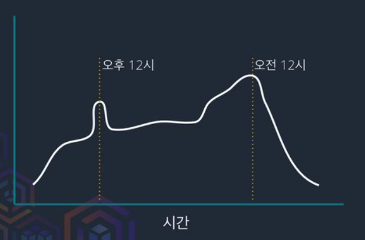
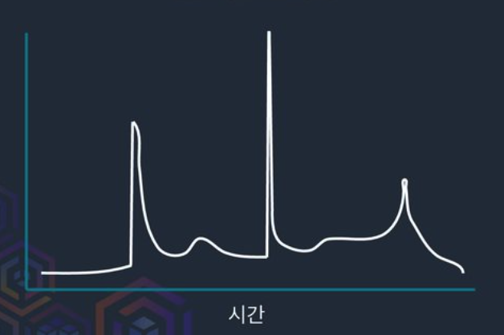
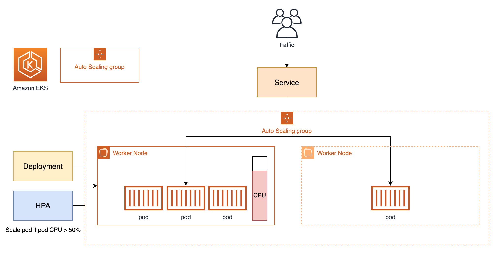
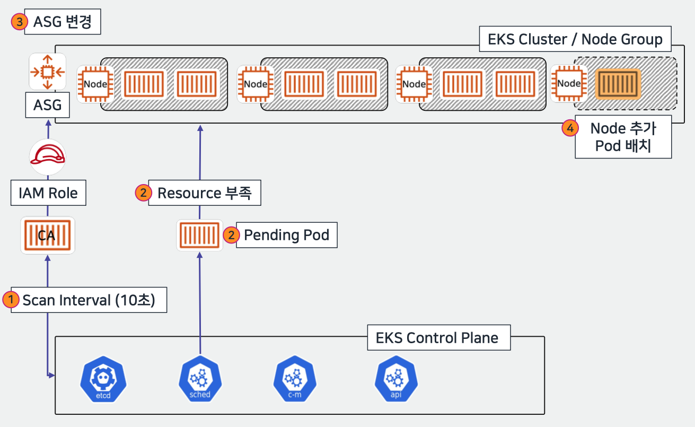
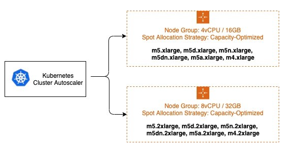

# [k8s] Auto Scaling in kubernetes
> date - 2023.08.27  
> keyworkd - kubernetes, auto scaling, aws  
> Kubernetes에서 auto scaling에 대해 정리  

<br>

## Auto scaling
* autoscaling은 사용자가 정의한 schedule & event에 따라 server를 자동으로 증가/감소시키는 기능
* autoscaling을 통해 application은 traffic에 탄력적으로 대응할 수 있다
* application 마다 CPU, memory 사용률이 다르므로 다양한 instance type을 사용
* scaling 속도가 빠르면서 적절한 instance를 비용 효율적으로 사용해야한다

<br>

### 일반적인 traffic pattern
<div align="center">
  
</div>

* 시간에 따라 증가하는 traffic pattern
* traffic 증가 폭이 완만
* traffic이 많이 들어오는 시간을 미리 예측할 수 있다
* CPU 사용률, request/sec 등을 기반으로 점진적으로 scaling

<br>

### Spike traffic pattern
<div align="center">
  
</div>

* 이벤트 오픈 시점에 traffic이 폭증하는 pattern
* 사전에 scale out 후 피크 타임이 지나면 scale in
* 사전에 인지를 못하는 경우에도 가능한 빨리 scaling


<br>

## Kubernetes의 auto scaling
| Name | Description |
|:--|:--|
| [CA(Cluster Autoscaler)](https://github.com/kubernetes/autoscaler/tree/master/cluster-autoscaler) | cluster의 사용 가능한 리소스와 Pod가 요청하는 리소스(resources.request)를 비교하여 Node를 증가/감소(scale in/out) |
| [HPA(Horizontal Pod Autoscaler)](https://kubernetes.io/docs/tasks/run-application/horizontal-pod-autoscale) | Pod가 사용 중인 리소스에 따라서 Pod의 수를 증가/감소(scale in/out)<br>CPU 사용량 or custom metrics(request count 등)을 기준으로 사용<br>[metrics server](https://github.com/kubernetes-sigs/metrics-server), [Prometheus](https://prometheus.io) 등의 metrics collector 필요 |
| [VPA(Vertical Pod Autoscaler)](https://github.com/kubernetes/autoscaler/tree/master/vertical-pod-autoscaler) | Pod가 사용 중인 리소스에 따라서 Pod에 할당된 resource를 증가/감소(scale up/down) |


<br>

## Amazon EKS auto scaling
* Cluster Autoscaler or Karpenter 이용

| Autoscaler | Description |
|:--|:--|
| [Cluster Autoscaler](https://github.com/kubernetes/autoscaler) | [AWS Auto Scaling Group](https://docs.aws.amazon.com/autoscaling/ec2/userguide/auto-scaling-groups.html) 사용 |
| [Karpenter](https://karpenter.sh) | [createFleet](https://docs.aws.amazon.com/ko_kr/AWSEC2/latest/APIReference/API_CreateFleet.html) API 사용 |


<br>

## Cluster Autoscaler(CA)
* cluster의 node scaling하는 역할
  * Pod에서 요청한 리소스(resources.request)보다 cluster의 resource가 부족한 경우 node 추가
  * 일정 시간 동안 사용률이 저조한 node를 제거(실행 중인 Pod가 없는 유휴 node)
* 현재 사용중인 resource 기반으로 동작하지 않으므로 Pod의 부하가 높더라도 request가 설정되어 있지 않으면 cluster auto scaling이 동작하지 않는다


<br>

## HPA + CA를 사용했을 때
* Cluster Autoscaler workflow
<div align="center">
  
</div>

* EKS + CA workflow
<div align="center">
  
  
</div>

### [Scale out](https://github.com/kubernetes/autoscaler/blob/master/cluster-autoscaler/FAQ.md#how-does-scale-up-work)
1. HPA(Horizontal Pod Autoscaler)에 의한 Pod의 증가가 한계에 다다르면, Pod는 적절한 node를 배정받지 못하고 pending 상태에 빠진다
2. CA(Cluster AutoScaler)는 10초마다(--scan-interval) pending 상태의 Pod가 생겼는지(`FailedScheduling` event 발생) 감시하며, pending 상태의 Pod가 생기면 AWS에서는 ASG(Auto Scaling Group)로 구성한 node group의 desired capacity 값을 수정하여 node를 추가할 수 있도록 설정(`TriggeredScaleUp` event 발생)
3. 이를 인지한 ASG(AWS Auto Scaling Group)가 새로운 node(EC2 instance)를 추가
4. node가 추가되어 여유 공간이 생기면 kube-scheduler가 Pod를 할당

> AWS ASG의 max 이하면 동작

<br>

### [Scale in](https://github.com/kubernetes/autoscaler/blob/master/cluster-autoscaler/FAQ.md#how-does-scale-down-work)
1. scale out이 필요하지 않은 경우 10초마다(--scan-interval) 유휴 node를 확인
2. node의 resource 사용률(cpu, memory request 합계 중 큰 값 사용)이 50%(--scale-down-utilization-threshold)미만일 경우
3. node를 10분(--scale-down-unneeded-time)동안 사용하지 않았을 경우
4. 지난 10분(--scale-down-delay-after-add)동안 scale out이 일어나지 않은 경우
5. 지난 3분(--scale-down-delay-after-failure)동안 scale in이 실패하지 않은 경우
6. 유휴 node(2 ~ 5 조건에 해당)가 있으면 node의 Pod를 evict
7. 최대 10분(--max-graceful-termination-sec) 동안 기다린 후 node를 종료

> AWS ASG의 min 이상이면 동작

<br>

## 문제점
* Upscaling lag
  * CA(Cluster AutoScaler)는 AWS ASG(Auto Scaling Group)를 이용하기 때문에 node 추가에 오랜 시간이 걸린다
  * 미리 확장하면 낭비되고, 늦게 확장하면 안정성에 문제가 생긴다
* Downscaling lag
  * 미래를 예측할 수 없으므로 spike traffic이 종료된 시점을 정확히 알 수 없기 때문에 scale down 전에 기다린다
  * scale down 지연은 안정성은 높아지지만 그동안 낭비된다
* Complexity
  * autoscaler를 복잡하며 tuning하기 어려울 수 있다
  * custom userdata 추가를 위해 Launch template 관리 필요
  * workload에 따라 필요한 instance type이 다르다면 여러 ASG 필요
* API Limit
  * ASG를 사용하기 때문에 AWS API limit에 도달할 수 있다
* [Karpenter](https://karpenter.sh)는 이런 문제를 해결하기 위해 탄생


<br>

## Usage

### IAM
* IAM Policy
```json
// $HOME/ca-policy.json
{
  "Version": "2012-10-17",
  "Statement": [
    {
      "Effect": "Allow",
      "Action": [
        "autoscaling:SetDesiredCapacity",
        "autoscaling:TerminateInstanceInAutoScalingGroup"
      ],
      "Resource": "*",
      "Condition": {
        "StringEquals": {
          "aws:ResourceTag/k8s.io/cluster-autoscaler/enabled": "true",
          "aws:ResourceTag/k8s.io/cluster-autoscaler/<my-cluster>": "owned"
          }
        }
    },
    {
      "Effect": "Allow",
      "Action": [
        "autoscaling:DescribeAutoScalingInstances",
        "autoscaling:DescribeAutoScalingGroups",
        "autoscaling:DescribeScalingActivities",
        "ec2:DescribeLaunchTemplateVersions",
        "autoscaling:DescribeTags",
        "autoscaling:DescribeLaunchConfigurations",
        "ec2:DescribeInstanceTypes"
        ],
      "Resource": "*"
    }
  ]
}
```

```sh
$ aws iam put-role-policy --role-name $ROLE_NAME --policy-name ca-policy --policy-document file://$HOME/ca-policy.json
```

<br>

### Helm install
```sh
$ helm repo add autoscaler https://kubernetes.github.io/autoscaler

$ helm upgrade cluster-autoscaler \
              --install \
              --create-namespace -n cluster-autoscaler \
              autoscaler/cluster-autoscaler \
              --values=values.yaml 
```

* values.yaml
```yaml
autoDiscovery:
  enabled: true
  clusterName: test-cluster
  roles:
    - worker

cloudProvider: aws
awsRegion: ap-northeast-2

extraArgs:
  logtostderr: true
  stderrthreshold: info
  v: 4
  skip-nodes-with-local-storage: false
  expander: least-waste
  balance-similar-node-groups: true
  skip-nodes-with-system-pods: false
  scale-down-utilization-threshold: 0.6

image:
  repository: registry.k8s.io/autoscaling/cluster-autoscaler
  tag: v1.27.2
  pullPolicy: IfNotPresent

podAnnotations:
  cluster-autoscaler.kubernetes.io/safe-to-evict: "false"

podDisruptionBudget:
  minAvailable: 1

additionalLabels:
  k8s-app: cluster-autoscaler

rbac:
  create: true
  pspEnabled: false
  clusterScoped: true
  serviceAccount:
    create: true
```

<br>

### Helmfile
```yaml
repositories:
  - name: autoscaler
    url: https://kubernetes.github.io/autoscaler

environments:
  develop:
    values:
      - env/develop.yaml
  prodution:
    values:
      - env/prodution.yaml

releases:
  - name: cluster-autoscaler
    namespace: kube-system
    chart: autoscaler/cluster-autoscaler
    version: 9.29.2 
    installed: true
    values:
      - values.yaml.gotmpl
```

```sh
## diff
$ helmfile -e develop diff

## install
$ helmfile -e develop apply

## clean up
$ helmfile -e develop destroy
```


<br>

## ASG 인식
* auto-discovery or manual 방식으로 인식

### [auto-discovery configuration](https://github.com/kubernetes/autoscaler/blob/master/cluster-autoscaler/cloudprovider/aws/README.md#auto-discovery-setup)
* tag 기반으로 auto discovery

* cluster autoscaler에 args로 전달된 tag가 모두 지정된 ASG를 찾는다
```
--node-group-auto-discovery=asg:tag=k8s.io/cluster-autoscaler/enabled,k8s.io/cluster-autoscaler/<cluster-name>
```
* key만 전달되면 value는 무시
```yaml
containers:
  - image: registry.k8s.io/autoscaling/cluster-autoscaler:v1.27.2
    command:
    - ./cluster-autoscaler
    - --v=4
    - --stderrthreshold=info
    - --cloud-provider=aws
    - --node-group-auto-discovery=asg:tag=k8s.io/cluster-autoscaler/enabled,k8s.io/cluster-autoscaler/<YOUR CLUSTER NAME>
```

### [manual configuration](https://github.com/kubernetes/autoscaler/blob/master/cluster-autoscaler/cloudprovider/aws/README.md#manual-configuration)
* cluster-autoscaler에 ASG를 추가
```yaml
containers:
  - image: registry.k8s.io/autoscaling/cluster-autoscaler:v1.27.2
    command:
    - ./cluster-autoscaler
    - --v=4
    - --stderrthreshold=info
    - --cloud-provider=aws
    - --nodes=1:10:k8s-worker-asg-1
    - --nodes=1:3:k8s-worker-asg-2
```


<br>

## Options
| Options | Description | Default |
|:--|:--|:--|
| scan-interval	| scaleing을 위해 cluster를 평가하는 주기 | 10초 |
| scale-down-delay-after-add | scale up 후 scale down 평가가 다시 시작되기 전까지 경과 시간 | 10분 |
| scale-down-delay-after-delete | 노드 삭제 후 scale down 평가가 다시 시작되기 전까지 경과 시간 | can-interval |
| scale-down-delay-after-failure | scale down 실패 후 scale down 평가가 다시 시작되기 전까지 경과 시간 | 3분 |
| scale-down-unneeded-time | 불필요한 노드를 scale down하기 전까지 경과 시간 | 10분 |
| scale-down-unready-time | 준비되지 않은 노드를 scale down하기 전까지 경과 시간 | 20분 |
| scale-down-utilization-threshold | 요청된 리소스의 합계를 용량으로 나눈 노드 사용률 수준으로, 이 수준 미만의 노드는 scale down 대상으로 고려할 수 있음 | 0.5 |
| max-graceful-termination-sec | 노드를 scale down하려고 할 때 cluster auto scaler가 Pod 종료를 위해 대기하는 최대 시간 | 600초 |
| balance-similar-node-groups | 비슷한 node group을 검색하고, node group의 노드 수 균형 맞추기 | false |
| expander | scaling에 사용할 node group expander type<br>allow value - most-pods, random, least-waste, priority | random |
| skip-nodes-with-local-storage | true인 경우 cluster auto scaler가 local storage를 사용하는 Pod가 있는 node를 scale down하지 않음(e.g. EmptyDir, HostPath)	| true |
| skip-nodes-with-system-pods | true인 경우 cluster auto scaler가 kube-system Pod가 있는 node를 scale down하지 않음 (DaemonSet, mirror Pod 제외) | true |
| max-empty-bulk-delete | 동시에 삭제할 수 있는 빈 노드의 최대 수 | 10개 |
| new-pod-scale-up-delay | Kubernetes scheduler가 모든 Pod를 예약하기 전에 CA가 작동하지 않도록 하려는 버스트/일괄 처리 규모와 같은 시나리오의 경우, 어느 정도 시간이 지나기 전에 예약되지 않은 Pod를 CA가 무시하도록 지시할 수 있습니다. | 0초 |
| max-total-unready-percentage | cluster에서 준비되지 않은 노드의 최대 비율, 이 비율을 초과하면 CA가 작업을 중단 | 45% |
| max-node-provision-time | node가 provisioning될 때까지 auto scaler가 대기하는 최대 시간입니다 | 15분 |
| ok-total-unready-count | max-total-unready-percentage에 관계없이 준비되지 않은 노드가 허용되는 수 | 노드 3개 |


<br>

## [Node Scale in 예외](https://github.com/kubernetes/autoscaler/blob/master/cluster-autoscaler/FAQ.md#what-types-of-pods-can-prevent-ca-from-removing-a-node)
다음의 경우 node 사용률이 저조해도 evict되지 않는다
* Controller(e.g. Deplyoment, StatefulSet)에 의해 제어되지 않는 경우
* PDB(PodDisruptionBudget)에 의해 제한된 Pod
  * Kafka, Elasticsearch 등 clustering이 필요한 경우 안정성을 위해 설정 필수
* hostPath, emptyDir(emptyDir.medium=memory가 아닌)인 local storage가 있는 Pod
* PDB가 없거나 PDB에 의해 제한된 kube-system pod
* affinity 등의 제약 조건으로 인해 다른 Node로 이동할 수 없는 Pod
* `cluster-autoscaler.kubernetes.io/safe-to-evict=false` annotation이 있는 Pod
  * big data 분석, ML 등의 Pod 같이 제거하는데 비용이 많이 필요한 경우 사용
* `cluster-autoscaler.kubernetes.io/scale-down-disabled=rue`가 있는 Node
```sh
$ kubectl annotate node <node> cluster-autoscaler.kubernetes.io/scale-down-disabled=true
```

<br>

### Scale in tuning
예외 조건에 따라 scale in이 발생하지 않을 경우 비효율적이므로 이를 tuning
* --skip-nodes-with-local-stroage=false
  * local storage 사용하는 경우 scale in 예외를 제외
* --scale-down-utilzation-threshold 증가
  * scale-down-utilization-threshold: 0.5 -> 0.6
  * cpu, memory 중 더 큰 값이 해당 값보다 작으면 scale in 대상이 된다
* PDB(PodDisruptionBudget)이 scale in을 막는 경우 수정
  * PDB로 인해 scale in 예외를 제외
* kube-system Pod도 scale in에 포함시키기
  * kube-system Pod에 PDB 설정
    * PDB가 없는 kube-sytem Pod에 의해 scale in 예외를 제외
  * skip-nodes-with-system-pods=false
    * kube-system Pod를 scale in에 포함


<br>

## 현재 scale이 적절한지 확인
* 리소스 활용률 = node의 total request / resoure capacity
* [kubectl-view-utilization](https://github.com/etopeter/kubectl-view-utilization) 같은 tool을 같이 사용하면 편하다
  * kubectl-view-utilization에서는 %Requests 값을 확인
* Prometheus + kube-state-metrics metrics 활용
  * cpu 활용률 평균 - `sum (kube_pod_container_resource_requests{resource="cpu"}) / sum (kube_node_status_capacity{resource="cpu"} )`
  * memory 활용률 평균 - `sum (kube_pod_container_resource_requests{resource="memory"}) / sum (kube_node_status_capacity{resource="memory"} )`


<br>

## [Multi-AZ](https://github.com/kubernetes/autoscaler/blob/master/cluster-autoscaler/FAQ.md#im-running-cluster-with-nodes-in-multiple-zones-for-ha-purposes-is-that-supported-by-cluster-autoscaler)
* node group마다 AZ별로 ASG를 1개만 사용하고 `--balance-similar-node-groups` 옵션을 사용하면 cluster autoscaler가 균형을 맞춘다
* Pod가 EBS를 사용하는 경우 AZ별로 ASG + Deplyoment를 사용


<br>

## Expander
* 조건을 만족하는 node group이 많은 경우 scaling 전략을 결정
* `--expander`로 지정한 사용자 지정 우선순위에 따라 scaling
  * e.g. spot node group scaling 선호
* 1.23.0 이후부터 multiple expander 사용 가능
  * `.cluster-autoscaler --expander=priority,least-waste`로 설정하면 least-waste가 fallback으로 사용
  * 1번째 expander의 결과가 다음 확장기에 전달되고 최종 결과에서 무작위로 하나를 선택

| Expander | Description |
|:--|:--|
| random | default |
| most-pods | 가장 많은 Pod를 scheduling할 수 있는 node group 선택<br>특정 node에 scheduling하기 위해 nodeSelector 사용시 유용<br>한번에 여러개의 작은 node를 추가할 수 있으므로 auto scaler가 더 크거나 작은 node를 선택하지 않는다 |
| least-waste | scale up 이후 유휴 CPU(동점인 경우 memory)가 가장 적은 node group 선택 |
| price | 비용이 가장 낮게 나오는 node group 선택<br>GCE, GKE, Equinix Metal에서만 동작 |
| priority | 사용자가 지정한 우선순위가 가장 높은 node group 선택 |

<br>

### Priority expander
* `--expander=priority`로 사용
* 양수인 우선순위가 가장 높은 값이 승리
* 각 우선순위 값에 정규식 리스트가 제공되야한다
* 우선순위가 가장 높은 regex과 일치하는 node group이 여러개라면 random 선택
* 일치하는 regex이 없으면 random 선택
* 1번째 node group을 scaling할 수 없는 경우 다음 node group 선택
```yaml
apiVersion: v1
kind: ConfigMap
metadata:
  name: cluster-autoscaler-priority-expander
data:
  priorities: |-
    10: 
      - .*t2-node-group.*
      - .*t3-node-group.*
    50: 
      - .*m5-node-group.*
```


<br>

## ASG MixedInstancesPolicy 사용
<div align="center">
  
</div>

* Launch Template의 MixedInstancesPolicy 사용하는 경우
  * on-demand + spot instance로 node group 구성하는 경우
  * spot instance 사용시 provisioning 확률을 높이기 위해 여러 instance type을 사용하는 경우
* cluster autoscaler의 scheduling이 정상 동작하기 위해 모두 동일한 spec의 instance type 사용
  * vCPU: 4, memory 16GiB라면 t3.xlarge, t4g.xlarge, m5.xlarge, m6g.xlarge, m6i.xlarge, m7i.xlarge, m7g.xlarge 사용
  * [amazon-ec2-instance-selector](https://github.com/aws/amazon-ec2-instance-selector)로 쉽게 찾을 수 있다
* Pod spec example
```yaml
spec:
  affinity:
    nodeAffinity:
      requiredDuringSchedulingIgnoredDuringExecution:
        nodeSelectorTerms:
        - matchExpressions:
          - key: node.kubernetes.io/instance-type
            operator: In
            values:
            - t3.xlarge
            - t4g.xlarge
            - m5.xlarge
            - m6g.xlarge
            - m6i.xlarge
            - m7i.xlarge
            - m7g.xlarge
```


<br>

## Optimizing

### Performance and Scalability
* [Vertically Autoscaling the Cluster Autoscaler](#vertically-autoscaling-the-cluster-autoscaler)
* [Reducing the number of Node Groups](#reducing-the-number-of-node-groups)
* [Reducing the Scan Interval](#reducing-the-scan-interval)
* [Sharding Across Node Groups](#sharding-across-node-groups)

#### Vertically Autoscaling the Cluster Autoscaler
* large scale cluster autoscaler는 memory를 많이 사용하므로 scale up 필요
* [Addon Resizer](https://github.com/kubernetes/autoscaler/tree/master/addon-resizer), [Vertical Pod Autoscaler](https://github.com/kubernetes/autoscaler/tree/master/vertical-pod-autoscaler) 사용을 고려

#### Reducing the number of Node Groups
* team, application별 node group은 cluster autoscaler의 scalability에 영향을 미치는 anti pattern
* 다음의 방법을 고려해 node group을 줄인다
  * pod isolation은 namespace 사용
  * resource 경합을 방지하기 위해 Pod resource request/limit 설정
  * large instance type을 사용할수록 bin packing이 최적화되고 system pod overhead가 감소
  * node taints/selector는 rule이 아닌 예외적으로 pod schedule하는데 사용
  * regional resource는 multi AZ가 있는 single EC2 auto scaling group으로 정의

#### Reducing the Scan Interval
* 작은 scan interval(e.g. 10s)은 pod를 scheduling 할 수 없을 때 cluster autoscaler가 최대한 빨리 응답하도록 보장
* 작은 scan interval로 인해 k8s API, EC2 Auto Scaling Group or EKS managed node group API에 많은 호출이 발생하고 throttling or 사용할 수 없을 수도 있다
* AWS에서 node를 시작하는데 오랜 시간이 걸리므로 scan interval을 증가시킬 수 있다
* e.g. node 시작에 2분이 걸릴 경우 scan interval을 1분으로 변경하면 API call이 6배 감소하고 확장 속도가 38% 느려지는 결과가 발생

#### Sharding Across Node Groups
* cluster autoscaler에 담당 node group을 지정
* 많은 node group을 사용해도 cluster autoscaler를 추가하는 것으로 확장성을 보장할 수 있다
* 성능 향상을 위한 최후의 수단으로만 사용 권장
* shard가 통신하지 않으므
* 여러 cluster autoscaler가 schedule할 수 없는 Pod를 schedule하려고 시도하여 불필요한 확장이 일어나는 부작용이 발생할 수 있다
* example
```yaml
metadata:
  name: cluster-autoscaler
  namespace: cluster-autoscaler-1
...
--nodes=1:10:k8s-worker-asg-1
--nodes=1:10:k8s-worker-asg-2
---
metadata:
  name: cluster-autoscaler
  namespace: cluster-autoscaler-2
...
--nodes=1:10:k8s-worker-asg-3
--nodes=1:10:k8s-worker-asg-4
```
* 각 shard는 고유한 ASG를 담당
* leader election conflicts 방지를 위해 별도의 namespace 사용

<br>

### Cost and Availability
* [Spot Instances](#spot-instances)
* [Prioritizing a node group / ASG](#prioritizing-a-node-group--asg)
* [Overprovisioning](#overprovisioning)
* [Prevent Scale Down Eviction](#prevent-scale-down-eviction)

#### Spot Instances
* on-demand 대비 최대 90% 할인된 Spot instance 사용
* Spot instance는 언제든 중지될 수 있으며 capacity 부족으로 scaling 실패가 발생할 수 있다
  * 다양한 type을 사용해 방지 가능
* spot instance을 사용한 Mixed Instance Policies는 node group을 늘리지 않고도 다양성을 높일 수 있는 좋은 방법
* [ASG MixedInstancesPolicy 사용](#asg-mixedinstancespolicy-사용) 참고
* on-demand와 spot instance를 별도의 node group으로 분리하고 `--expander=least-waste` 사용 추천

#### Prioritizing a node group / ASG
* [priority expander](#priority-expander) 사용

#### Overprovisioning
* node provisioning 시간으로 인한 지연을 단축시키기 위해 [overprovisioning](https://github.com/kubernetes/autoscaler/blob/master/cluster-autoscaler/FAQ.md#how-can-i-configure-overprovisioning-with-cluster-autoscaler) 사용
* overprovisioned capacity의 핵심은 성능(performance)과 비용(cost)간의 균형
  * 평균 scale up 빈도를 결정하고 scale up에 걸리는 시간으로 나눈다
  * 30초마다 new node가 필요하고, node provisioning에 30초 소요되는 경우 -> node 하나만큼 overprovisioning하면 scale up에 걸리는 시간을 30초만큼 줄일 수 있다
  * ASG의 AZ 수와 동일하게 overprovisioning하여 scheduler가 가장 적합한 AZ를 선택할 수 있게 한다

#### Prevent Scale Down Eviction
* big data 분석, ML 등과 같이 제거하는데 비용이 많이 필요한 Pod는 `cluster-autoscaler.kubernetes.io/safe-to-evict=false` annotation으로 보호


<br><br>

> #### Reference
> * [kubernetes/autoscaler - Autoscaling components for Kubernetes](https://github.com/kubernetes/autoscaler)
> * [Kubernetes Cluster Autoscaler - EKS Best Pratices Guides](https://aws.github.io/aws-eks-best-practices/cluster-autoscaling)
> * [Cluster Autoscaler - GitHub](https://github.com/kubernetes/autoscaler/tree/master/cluster-autoscaler)
> * [Horizontal Pod Autoscaling - k8s Docs](https://kubernetes.io/docs/tasks/run-application/horizontal-pod-autoscale)
> * [Vertical Pod Autoscaler - GitHub](https://github.com/kubernetes/autoscaler/tree/master/vertical-pod-autoscaler)
> * [Kubernetes Autoscaling 101: Cluster Autoscaler, Horizontal Pod Autoscaler, and Vertical Pod Autoscaler](https://levelup.gitconnected.com/kubernetes-autoscaling-101-cluster-autoscaler-horizontal-pod-autoscaler-and-vertical-pod-2a441d9ad231)
> * [How does scale-up/down work? - Cluster Autoscaler FAQ](https://github.com/kubernetes/autoscaler/blob/master/cluster-autoscaler/FAQ.md#how-does-scale-up-work)
> * [Priority based expander for cluster-autoscaler](https://github.com/kubernetes/autoscaler/blob/master/cluster-autoscaler/expander/priority/readme.md)
> * [Autoscaling and Cost Optimization on Kubernetes: From 0 to 100](https://kccnceu20.sched.com/event/Zemi)
> * [SIG-Autoscaling Deep Dive](https://youtu.be/odxPyW_rZNQ)
> * [Creating Kubernetes Auto Scaling Groups for Multiple Availability Zones](https://aws.amazon.com/ko/blogs/containers/amazon-eks-cluster-multi-zone-auto-scaling-groups)
