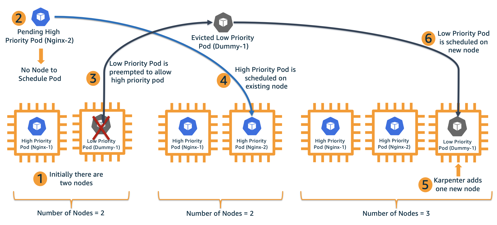
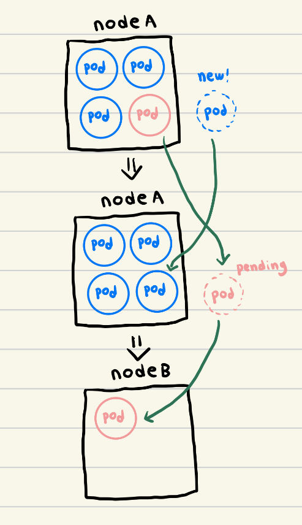

## Over Provisioning
* Cluster Autoscaler보다는 빨라졌지만 node가 뜨는데 약 2분 소요
node에 일정량의 여유 보장해 Pod를 즉시 뜨게하고 싶다

<div align="center">
  
</div>

* 신규 Pod는 over provisioning Pod를 개체하고 over provisioning Pod의 재배치로 인해 node가 증설된다
* scaling용 dummy pod를 만들어 여유 공간을 확보
* 대규모 scaling이 필요한 경우 dummy pod에 작은 request를 할당하고, pod anti affinity로 서로 다른 node에 뜨도록하면 dummy pod만큼 node가 확장되는 것을 보장
* [KEDA의 Cron](https://keda.sh/docs/2.11/scalers/cron)을 활용해 ASG처럼 특정 시간에 원하는 수만큼 node를 증설하여 spike traffic 대비 가능


PriorityClass와 PriorityClass가 적용된 dummy pod 필요


### PriorityClass
여러 제약 조건에도 불구하고 반드시 배포해야할 때 배포 우선 순위를 지정할 수 있다
값이 클수록 우선 순위가 높다
새로 배포해야하는 Pod의 우선순위가 높은데 리소스 부족 등의 이유로 배포할 수 없다면 낮은 우선 순위를 가지는 Pod를 eviction하고 배포한다
```sh
$ kubectl get priorityclass

NAME                                VALUE        GLOBAL-DEFAULT   AGE
system-cluster-critical             2000000000   false            61d
system-node-critical                2000001000   false            61d
```

이 원리를 이용해 우선 순위가 낮은 pod를 만들고, 우선 순위가 높은 pod가 배포되었을 때 밀어내도록 만들 수 있다

PriorityClass가 적용되지 않은 Pod
```yaml
...
spec:
  preemptionPolicy: PreemptLowerPriority
  priority: 0
```


<div align="center">
  
</div>


node를 scale out할때는 instace를 새로 띄우는거다보니 pod를 scale out하는 것보다 시간이 오래 걸림 이 scale out 시간 절약을 위해서 미리 프로비저닝할 수 있음.
node scale out시 EC2 추가 시간은 Pod 추가보다 오래걸려
node scale out 시간을 절약하기 위해 pod를 미리 provisioning하여 여유분을 확보


1. 아무 역할을 하지않는 pod를 미리 생성합니다. 이때 pod의 priority를 다른 일반 pod들보다 낮게 설정해줍니다.

```yaml
apiVersion: scheduling.k8s.io/v1beta1
kind: PriorityClass
metadata:
  name: overprovisioning
value: -1
globalDefault: false
---
apiVersion: apps/v1
kind: Deployment
metadata:
  name: overprovisioning
  namespace: kube-system
spec:
  replicas: 1
  selector:
    matchLabels:
      run: overprovisioning
  template:
    metadata:
      labels:
        run: overprovisioning
    spec:
      priorityClassName: overprovisioning
      containers:
      - name: reserve-resources
        image: k8s.gcr.io/pause
        resources:
          requests:
            cpu: 1600m
            memory: 550Mi
```
2. 일반 pod가 새롭게 생성될때 node에 자리가 부족하면 1의 pod를 내쫓고 그 자리를 차지합니다.
3. 내쫓김을 당한 pod는 scale out을 trigger합니다.


<div align="center">
  
</div>


이렇게 너무 간단하게 node를 over provisioning할 수 있는데요. 한가지 주의할점은 overprovisioning pod의 resource입니다.  
overprovisioning pod를 내쫓아도 node의 잔여 resource가 모자라는 경우에 당연하게도 overprovisioning이 정상적으로 작동하지 않습니다. 
이를 대비해서 overprovisioning pod의 memory, cpu의 resource request를 적정한 크기로 설정해야합니다.
overprovisioning pod를 Node 스펙의 90%로 설정하며 노드가 1대 정도의 여유를 가질수 있도록 선점 한다.


overprovisioning pod의 resource 주의
overprovisioning pod를 내쫓아도 node resource가 부족한 경우 overprovisioning이 정상적으로 동작하지 않는다
overprovisioning pod에 적절한 리소스 할당 필요


Cluster Autoscaler를 통한 인스턴스의 오버 프로비저닝

워커 노드가 scale-out되는 시간을 절약하기 위해 일정 갯수만큼의 인스턴스를 미리 오버 프로비저닝해 놓을 수 있다. 
이는 Pod의 priority class를 이용한 것인데, 미래에 사용할 워커 노드를 미리 reserve 해 놓기 위해서 아무런 역할도 하지 않는 Pod를 생성하되 priority를 매우 낮게 설정하면 된다. 
만약 프로덕션 용 Pod가 새로 생성되어야 한다면, 미리 오버 프로비저닝된 워커 노드에 존재하는 low-priority Pod를 내쫓고 (preemption) 그 자리를 차지하는 방식이다. 
그리고 내쫓김 당한 (preemption 당한) low-priority Pod는 cluster autoscaler를 통해 ASG의 scale-out을 trigger하므로, 결과적으로는 오버 프로비저닝이 가능한 셈이다.

단, 이 경우에는 reserve하기 위한 low-priority Pod의 갯수에 따라 오버 프로비저닝되는 인스턴수 갯수가 고정적으로 정해지게 되지만, [cluster-proportional-autoscaler](https://github.com/kubernetes-sigs/cluster-proportional-autoscaler)를 사용하면 클러스터 크기에 비례한 오버 프로비저닝을 구성할 수도 있다. 
전체 노드 갯수가 많을수록, 또는 코어 갯수가 많을수록 low-priority Pod의 replicas가 자동으로 늘어난다고 생각하면 이해하기 쉽다.


cluster autoscaler는 기본적으로 0 미만의 priority를 갖는 Pod는 스케줄링에 실패하더라도 ASG의 scale-out 대상으로 고려하지 않으며, scale-in 시에도 고려하지 않는다.
 보통 일반적인 Pod의 priority 값은 0이기 때문에 오버 프로비저닝을 위한 low-priority Pod의 priority는 음수 값으로 설정하게 될텐데, 그러한 경우에는 --expendable-pods-priority-cutoff 값을 적절히 수정함으로써 (ex. -10) cluster autoscaler가 고려할 Pod의 최소 priority 값을 조정해야만 한다.


------------------------------------------------------------------------------------------------------------

Q.EKS Overprovisioning 에 대하여 설명해줘

EKS Overprovisioning은 EKS 클러스터의 Worker Node에 대한 적절한 리소스 할당을 위해 사용됩니다. 일반적으로 EKS 클러스터의 Worker Node는 Kubernetes 파드에서 사용할 수 있는 리소스를 제한적으로 할당받습니다. 이는 Worker Node가 파드에 필요한 모든 리소스를 충분히 제공하지 못해 애플리케이션에 성능 문제가 발생할 가능성이 있습니다.

이 문제를 해결하기 위해 EKS Overprovisioning을 사용할 수 있습니다. 이를 통해 Worker Node는 예상 사용량 보다 충분한 리소스를 가지고 시작되게 할 수 있습니다. 이를 통해 파드의 리소스가 필요한 만큼 빠르게 제공되기 때문에 애플리케이션 성능 문제를 예방할 수 있습니다. 하지만, 이러한 타입의 Overprovisioning은 클러스터의 비용이 상승할 수 있습니다. 따라서, 이를 적용해 볼 경우 먼저 클러스터의 자원 사용량에 대한 평가가 필요합니다.

Q. 조심해야 할 장애포인트는 뭐가 있어?

EKS Overprovisioning을 적용할 때 조심해야 할 몇 가지 사항이 있습니다. 첫 번째는 클러스터에서 사용하는 EC2 인스턴스의 크기입니다. Overprovisioning을 지나치게 사용할 경우 클러스터 인스턴스가 크고 비싸질 수 있습니다. 또한 리소스를 효율적으로 사용하지 않고 높은 비용을 초래할 수 있습니다.

두 번째는 노드 기반으로 적정 수준의 Overprovisioning을 결정하는 것입니다. 이 작업은 클러스터의 파드 배치와 노드 리소스 사용률을 기반으로 수행됩니다. 적절한 Overprovisioning 비율을 결정하기 위해 각 노드와 파드의 리소스 사용량을 모니터링 해야 합니다.

세 번째는 클러스터의 확장성을 고려하는 것입니다. Overprovisioning을 사용하면 클러스터의 성능과 확장성이 저하될 수 있습니다. 따라서 클러스터의 요구 사항을 정확하게 고려해야 합니다.

마지막으로, 이러한 작업은 영구적인 문제 해결책이 아니며, 애플리케이션 개발 및 배포 전략을 정확하게 고려해야 합니다.


OnDemand + Spot 등으로 OverProvisioning해서 사용하는 경우도 있죠.
어플리케이션에서도 이런 부분을 고려해야 하고(세션 클러스터링 등), Spot의 경우 인스턴스가 중지될 수 있기 때문에 drain등으로 pod가 다른 노드로 배치될 수 있게 구성하는거도 중요할 거 같습니다.
https://github.com/awslabs/amazon-eks-serverless-drainer

https://github.com/aws/aws-node-termination-handler
이 서비스를 통하여 spot을 포함한 이벤트 같은걸 처리하려고 검토하고있습니다.
오버프로비저닝을 쓰면 스팟을 더 적극적으로 쓸 수 가 있겠네요.

[cluster-overprovisioner](https://github.com/opspresso/argocd-env-addons/blob/main/addons/cluster-overprovisioner.yaml)는 [cluster-proportional-autoscaler](https://github.com/opspresso/argocd-env-addons/blob/main/addons/cluster-proportional-autoscaler.yaml)와 함께 사용하면 좋다
전체 node 수에 따라 overprovisioner의 수를 조정해서 띄울 수 있다
설정 예시
```yaml
config:
  ladder:
    nodesToReplicas:
      - [ 1, 1 ]
      - [ 30, 7 ]
      - [ 60, 13 ]
      - [ 120, 19 ]
      - [ 240, 25 ]
      - [ 480, 30 ]
```

네 제 샘플 코드인데.. argocd 에서 helm 으로 설치 하고 있어요
https://github.com/kubernetes-sigs/cluster-proportional-autoscaler


cpa를 이번에 처음보는데 노드들의 상태에 따라 replica를 조절해주는 서비스이고 오버프로비저닝 전용 pod의 개수를 조절해주는 환경으로 보여집니다.

이 포스팅이 첫 시작으로 보여지내요.
https://medium.com/scout24-engineering/cluster-overprovisiong-in-kubernetes-79433cb3ed0e


[Eliminate Kubernetes node scaling lag with pod priority and over-provisioning](https://aws.amazon.com/ko/blogs/containers/eliminate-kubernetes-node-scaling-lag-with-pod-priority-and-over-provisioning)
