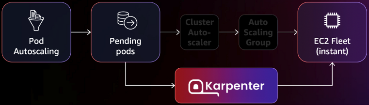
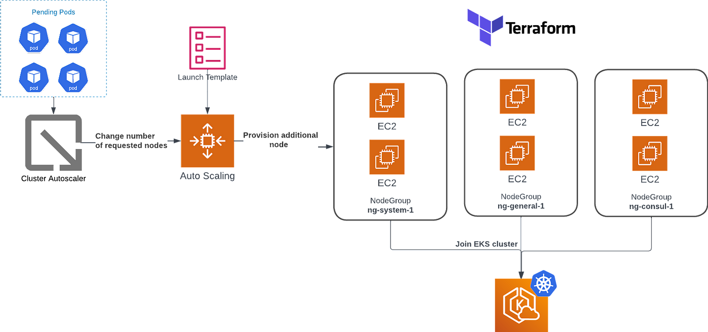
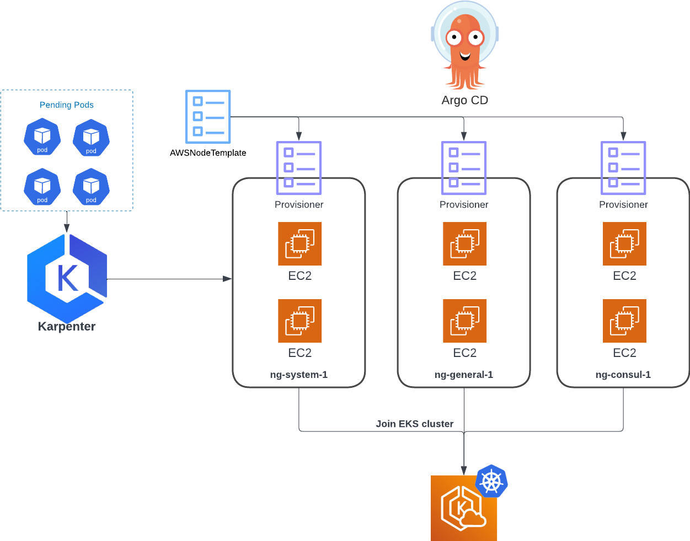

# [k8s] What is Karpenter?
> date - 2023.02.28  
> keyworkd - kubernetes, auto scaling, aws  
> EKS에서 빠르게 확장하며, 편리하게 관리하며, 유연성까지 갖춘 auto scaler인 karpenter에 대해 정리

<br>

## Karpenter
* application 가용성과 cluster 효율성을 개선하는데 도움이 되는 유연한 고성능 kubernetes cluster autoscaler
* AWS 환경에서 [Cluster Autoscaler](https://github.com/kubernetes/autoscaler/tree/master/cluster-autoscaler)와 [AWS Node Termination Handler(NTH)](https://github.com/aws/aws-node-termination-handler) 대체품
* 1분 이내에 application load 변화에 대응하여 적절한 컴퓨팅 리소스를 시작하며 활용도가 낮은 node를 제거하고, 비싼 node를 저렴한 node로 교체하여 효율적인 컴퓨팅 리소스 사용으로 컴퓨팅 비용을 낮춘다
* Cluster Autoscaler보다 AWS instance type을 효율적으로 처리
* AWS Auto Scaling Group이나 EKS managed node group 같은 orchestration mechanisms 없이 사용 가능
  * c type, r type, spot instance 등 리소스 활용 목적에 따른 수백개의 node group을 생성하지 않고도 다양한 instance type, AZ, purchase options 활용 가능
* Cluster Autoscaler는 node 추가 후 Pod scheduling을 scheduler에 의존하지만 Karpenter는 직접 scheduling하여 kubelet이 scheduler, node가 준비될 때까지 기다릴 필요가 없다
* 기본 값이 제공되어 추가 구성이 필요하지 않아 operational overhead 최소화
* load/performance testing시 더 나은 결과를 얻으려면 consolidation, spot 비활성화


<br>

## Cluster Autoscaler vs Karpenter
<div align="center">
  
</div>

| | Cluster Autoscaler | Karpenter |
|:--|:--|:--|
| Pors | CSP에 종속되지 않음 | - AWS AutoScaling Group에 의존적이지 않아 scaling 속도가 빠름<br>- AWS Node Termination Handler 불필요<br>- AutoScaling Group, LaunchTemplate, NodeGroup 등 node group을 위한 리소스는 CRD로 관리<br>- 다양한 instance type 중 적절한 type을 사용해 리소스 낭비를 막을 수 있다|
| Cons | - AWS AutoScaling Group에 의존적으로 인해 scaling 속도가 느리며 node는 1개씩 추가됨<br>- AWS Node Termination Handler 필요<br>- AutoScaling Group, LaunchTemplate, NodeGroup 등 node group을 위한 리소스 직접 관리 필요 | AWS Lock-in |

<div align="center">
  
  
</div>

<br>

## Workflow
<div align="center">
  
</div>

* Karpenter는 리소스가 부족하여 scheduler가 unschedulable로 표시한 Pod 감시
* Pod에서 요청한 resource requests, nodeselectors, affinities, tolerations 등의 제약 조건 평가
* Pod의 요구사항을 충족하는 node provisioning
* Pod를 새로운 node에 scheduling
* node가 더 이상 필요하지 않을 때 제거


<br>

## Key Features & Benefits
* Rapid node launch time
  * dynamic resource request에 대한 효율적인 응답으로 빠른 node 실행
* Cost saving
  * spot instance를 on-Demand fallback과 함께 사용
  * [Consolidation](https://karpenter.sh/preview/concepts/disruption/#consolidation)으로 workload를 더 저렴한 type의 node로 교체하여 cluster 비용 절감
* NodePool는 EKS managed node group(EKS mng)보다 flexible
  * instance type은 EKS mng에서 변경 불가능하지만 NodePool에서는 가능
  * node scale down, evict pod시에 pod disruption budgets 존중


<br>

## Limitation
* EKS에서만 사용 가능
* Karpenter는 self/eks managed node group or fargate에 배포 필요
* Karpenter가 생성하는 node는 ASG max 같은 값이 없어서 node에 대한 monitoring, alert 필요
  * prometheus metrics 제공
* Karpenter의 binpacking은 VPN CNI 사용을 가정하기 때문에 custom CNI를 사용한다면 제대로 동작하지 않을 수 있다


<br>

## Component
* Controller
  * k8s controller 형태로 구현되어 pod 상태를 감시하고 node scaling 담당
  * node selector 불일치 등으로 인한 node scaling 실패시 여기서 로그 확인
* Webhook
  * `NodePool` [CRD(Cursom Resource Definition)](https://kubernetes.io/docs/tasks/extend-kubernetes/custom-resources/custom-resource-definitions)에 대한 유효성 검사 및 기본값을 지정
* [NodePool](https://karpenter.sh/docs/concepts/nodepools)
  * Karpenter에 의해 생성되는 node와 pod에 대한 제약조건을 지정하는 CR(Custom Resource)
  * CSP에 종속되지 않는 일반적인 조건 설정
  * taints - Karpenter의 node에서 실행될 수 있는 pod를 제한
  * zone, instance type, OS, architectures(e.g. arm) 지정
  * node expiration default 지정
  * AutoScalingGroup, Launch Template 대체
  * CR이므로 ArgoCD 등으로 배포 가능
  * NodePool를 제거하면 모든 node가 제거되므로 제거하지말자
    * NodePool가 제거되도 유지하려면 `karpenter.sh/provision-name` EC2 tag 제거
    * `karpenter.sh/provision-name` EC2 tag가 제거되면 karpenter에서 관리할 수 없으므로 수동으로 draining, 제거 필요
  * antivirus, monitoring, auditing agent가 있는 경우 Pod에 영향을 주지 않도록 [Reserved Resources](https://karpenter.sh/preview/concepts/nodepools/#reserved-resources) 설정
  * NodePool 수정 후 이전에 생성된 node는 자동으로 교체되지 않기 때문에 바로 반영이 필요하다면 수동으로 rolling upgrade(drain -> delete) 필요
* [EC2NodeClass](https://karpenter.sh/docs/concepts/nodeclasses)
  * AWS specific node 설정을 위한 CR
  * subnet, security group, userdata 등을 설정
  * `spec.amiFamily`를 사용하면 AWS SSM을 통해 적절한 [EKS optimized AMI](https://docs.aws.amazon.com/eks/latest/userguide/eks-optimized-amis.html)을 사용
  * [spec.userdata](https://karpenter.sh/preview/concepts/nodeclasses/#specuserdata)로 node booting시 tool 설치 등 작업 수행


<br>

## Deprovisioning
* NodePool 제거
  * NodePool가 제거되면 NodePool에 의해 생성된 node가 deprovisioning
* Empty
  * empty node가 되고 NodePool에 `consolidateAfter(consolidationPolicy: WhenEmpty 일 때)`이 지난 이후 deprovisioning
* Interrupt
  * spot Interruption 등의 interruption event가 event bridge를 통해 SQS로 들어오면 받아서 deprovisioning
* Expire
  * node가 생성되고 NodePool에 `expireAfter`이 지난 이후 deprovisioning
* Consolidation
  * `consolidationPolicy: WhenUnderutilized` 일 때 비용 최적화를 위해 node의 비용을 비교하여 하나로 합치는 작업 수행


<br>

## Install

### EKS Cluster 생성
```sh
$ export KARPENTER_VERSION=v0.32.1
$ export K8S_VERSION=1.28

$ export AWS_PARTITION="aws" # if you are not using standard partitions, you may need to configure to aws-cn / aws-us-gov
$ export CLUSTER_NAME="${USER}-karpenter-demo"
$ export AWS_DEFAULT_REGION="us-west-2"
$ export AWS_ACCOUNT_ID="$(aws sts get-caller-identity --query Account --output text)"
$ export TEMPOUT=$(mktemp)

$ eksctl create cluster -f - <<EOF
---
apiVersion: eksctl.io/v1alpha5
kind: ClusterConfig

metadata:
  name: ${CLUSTER_NAME}
  region: ${AWS_DEFAULT_REGION}
  version: "${K8S_VERSION}"
  tags:
    karpenter.sh/discovery: ${CLUSTER_NAME}

iam:
  withOIDC: true

managedNodeGroups:
  - instanceType: t3.medium
    amiFamily: AmazonLinux2
    name: ${CLUSTER_NAME}-ng
    desiredCapacity: 1
    minSize: 1
    maxSize: 3

## Optionally run on fargate
# fargateProfiles:
# - name: karpenter
#  selectors:
#  - namespace: karpenter
EOF
```

### Karpenter worker node role 생성
* 아래의 policy를 포함하여 Karpenter가 생성한 node에서 사용할 role 생성
  * AmazonEKSWorkerNodePolicy
  * AmazonEKS_CNI_Policy
  * AmazonEC2ContainerRegistryReadOnly
  * AmazonSSMManagedInstanceCore

```sh
$ cat << EOF > node-trust-policy.json
{
    "Version": "2012-10-17",
    "Statement": [
        {
            "Effect": "Allow",
            "Principal": {
                "Service": "ec2.amazonaws.com"
            },
            "Action": "sts:AssumeRole"
        }
    ]
}
EOF

$ aws iam create-role --role-name "KarpenterNodeRole-${CLUSTER_NAME}" \
    --assume-role-policy-document file://node-trust-policy.json

$ aws iam create-instance-profile \
    --instance-profile-name "KarpenterNodeInstanceProfile-${CLUSTER_NAME}"

$ aws iam add-role-to-instance-profile \
    --instance-profile-name "KarpenterNodeInstanceProfile-${CLUSTER_NAME}" \
    --role-name "KarpenterNodeRole-${CLUSTER_NAME}"

## attach policy
$ aws iam attach-role-policy --role-name "KarpenterNodeRole-${CLUSTER_NAME}" \
    --policy-arn arn:${AWS_PARTITION}:iam::aws:policy/AmazonEKSWorkerNodePolicy
$ aws iam attach-role-policy --role-name "KarpenterNodeRole-${CLUSTER_NAME}" \
    --policy-arn arn:${AWS_PARTITION}:iam::aws:policy/AmazonEKS_CNI_Policy
$ aws iam attach-role-policy --role-name "KarpenterNodeRole-${CLUSTER_NAME}" \
    --policy-arn arn:${AWS_PARTITION}:iam::aws:policy/AmazonEC2ContainerRegistryReadOnly
$ aws iam attach-role-policy --role-name "KarpenterNodeRole-${CLUSTER_NAME}" \
    --policy-arn arn:${AWS_PARTITION}:iam::aws:policy/AmazonSSMManagedInstanceCore
```

* aws-auth에 추가
```yaml
# kubectl edit configmap aws-auth -n kube-system

apiVersion: v1
kind: ConfigMap
metadata:
  name: aws-auth
  namespace: kube-system
data:
  mapRoles: |
    ...
    - rolearn: arn:aws:iam::<aws account>:role/<Karpenter Node Role>
      username: system:node:{{EC2PrivateDNSName}}
      groups:
        - system:bootstrappers
        - system:nodes
```

### Karpenter controller role 생성
* role 생성 및 trust relationships 설정
```sh
$ cat << EOF > controller-trust-policy.json
{
    "Version": "2012-10-17",
    "Statement": [
        {
            "Effect": "Allow",
            "Principal": {
                "Federated": "arn:${AWS_PARTITION}:iam::${AWS_ACCOUNT_ID}:oidc-provider/${OIDC_ENDPOINT#*//}"
            },
            "Action": "sts:AssumeRoleWithWebIdentity",
            "Condition": {
                "StringEquals": {
                    "${OIDC_ENDPOINT#*//}:aud": "sts.amazonaws.com",
                    "${OIDC_ENDPOINT#*//}:sub": "system:serviceaccount:<namespace>:karpenter"
                }
            }
        }
    ]
}
EOF

$ aws iam create-role --role-name KarpenterControllerRole-${CLUSTER_NAME} \
    --assume-role-policy-document file://controller-trust-policy.json
```
* policy 생성 및 role에 부여
```sh
$ cat << EOF > controller-policy.json
{
   "Version":"2012-10-17",
   "Statement":[
      {
         "Sid":"AllowScopedEC2InstanceActions",
         "Effect":"Allow",
         "Resource":[
            "arn:${AWS_PARTITION}:ec2:${AWS_DEFAULT_REGION}::image/*",
            "arn:${AWS_PARTITION}:ec2:${AWS_DEFAULT_REGION}::snapshot/*",
            "arn:${AWS_PARTITION}:ec2:${AWS_DEFAULT_REGION}:*:spot-instances-request/*",
            "arn:${AWS_PARTITION}:ec2:${AWS_DEFAULT_REGION}:*:security-group/*",
            "arn:${AWS_PARTITION}:ec2:${AWS_DEFAULT_REGION}:*:subnet/*",
            "arn:${AWS_PARTITION}:ec2:${AWS_DEFAULT_REGION}:*:launch-template/*"
         ],
         "Action":[
            "ec2:RunInstances",
            "ec2:CreateFleet"
         ]
      },
      {
         "Sid":"AllowScopedEC2InstanceActionsWithTags",
         "Effect":"Allow",
         "Resource":[
            "arn:${AWS_PARTITION}:ec2:${AWS_DEFAULT_REGION}:*:fleet/*",
            "arn:${AWS_PARTITION}:ec2:${AWS_DEFAULT_REGION}:*:instance/*",
            "arn:${AWS_PARTITION}:ec2:${AWS_DEFAULT_REGION}:*:volume/*",
            "arn:${AWS_PARTITION}:ec2:${AWS_DEFAULT_REGION}:*:network-interface/*",
            "arn:${AWS_PARTITION}:ec2:${AWS_DEFAULT_REGION}:*:launch-template/*"
         ],
         "Action":[
            "ec2:RunInstances",
            "ec2:CreateFleet",
            "ec2:CreateLaunchTemplate"
         ],
         "Condition":{
            "StringEquals":{
               "aws:RequestTag/kubernetes.io/cluster/${ClusterName}":"owned"
            },
            "StringLike":{
               "aws:RequestTag/karpenter.sh/nodepool":"*"
            }
         }
      },
      {
         "Sid":"AllowScopedResourceCreationTagging",
         "Effect":"Allow",
         "Resource":[
            "arn:${AWS_PARTITION}:ec2:${AWS_DEFAULT_REGION}:*:fleet/*",
            "arn:${AWS_PARTITION}:ec2:${AWS_DEFAULT_REGION}:*:instance/*",
            "arn:${AWS_PARTITION}:ec2:${AWS_DEFAULT_REGION}:*:volume/*",
            "arn:${AWS_PARTITION}:ec2:${AWS_DEFAULT_REGION}:*:network-interface/*",
            "arn:${AWS_PARTITION}:ec2:${AWS_DEFAULT_REGION}:*:launch-template/*"
         ],
         "Action":"ec2:CreateTags",
         "Condition":{
            "StringEquals":{
               "aws:RequestTag/kubernetes.io/cluster/${ClusterName}":"owned",
               "ec2:CreateAction":[
                  "RunInstances",
                  "CreateFleet",
                  "CreateLaunchTemplate"
               ]
            },
            "StringLike":{
               "aws:RequestTag/karpenter.sh/nodepool":"*"
            }
         }
      },
      {
         "Sid":"AllowScopedResourceTagging",
         "Effect":"Allow",
         "Resource":"arn:${AWS_PARTITION}:ec2:${AWS_DEFAULT_REGION}:*:instance/*",
         "Action":"ec2:CreateTags",
         "Condition":{
            "StringEquals":{
               "aws:ResourceTag/kubernetes.io/cluster/${ClusterName}":"owned"
            },
            "StringLike":{
               "aws:ResourceTag/karpenter.sh/nodepool":"*"
            },
            "ForAllValues:StringEquals":{
               "aws:TagKeys":[
                  "karpenter.sh/nodeclaim",
                  "Name"
               ]
            }
         }
      },
      {
         "Sid":"AllowScopedDeletion",
         "Effect":"Allow",
         "Resource":[
            "arn:${AWS_PARTITION}:ec2:${AWS_DEFAULT_REGION}:*:instance/*",
            "arn:${AWS_PARTITION}:ec2:${AWS_DEFAULT_REGION}:*:launch-template/*"
         ],
         "Action":[
            "ec2:TerminateInstances",
            "ec2:DeleteLaunchTemplate"
         ],
         "Condition":{
            "StringEquals":{
               "aws:ResourceTag/kubernetes.io/cluster/${ClusterName}":"owned"
            },
            "StringLike":{
               "aws:ResourceTag/karpenter.sh/nodepool":"*"
            }
         }
      },
      {
         "Sid":"AllowRegionalReadActions",
         "Effect":"Allow",
         "Resource":"*",
         "Action":[
            "ec2:DescribeAvailabilityZones",
            "ec2:DescribeImages",
            "ec2:DescribeInstances",
            "ec2:DescribeInstanceTypeOfferings",
            "ec2:DescribeInstanceTypes",
            "ec2:DescribeLaunchTemplates",
            "ec2:DescribeSecurityGroups",
            "ec2:DescribeSpotPriceHistory",
            "ec2:DescribeSubnets"
         ],
         "Condition":{
            "StringEquals":{
               "aws:RequestedRegion":"${AWS_DEFAULT_REGION}"
            }
         }
      },
      {
         "Sid":"AllowSSMReadActions",
         "Effect":"Allow",
         "Resource":"arn:${AWS_PARTITION}:ssm:${AWS_DEFAULT_REGION}::parameter/aws/service/*",
         "Action":"ssm:GetParameter"
      },
      {
         "Sid":"AllowPricingReadActions",
         "Effect":"Allow",
         "Resource":"*",
         "Action":"pricing:GetProducts"
      },
      {
         "Sid":"AllowInterruptionQueueActions",
         "Effect":"Allow",
         "Resource":"<karpenter interruption SQS ARN>",  # FIXME
         "Action":[
            "sqs:DeleteMessage",
            "sqs:GetQueueAttributes",
            "sqs:GetQueueUrl",
            "sqs:ReceiveMessage"
         ]
      },
      {
         "Sid":"AllowPassingInstanceRole",
         "Effect":"Allow",
         "Resource":"arn:${AWS_PARTITION}:iam::${AWS_ACCOUNT_ID}:role/KarpenterNodeRole-${ClusterName}",
         "Action":"iam:PassRole",
         "Condition":{
            "StringEquals":{
               "iam:PassedToService":"ec2.amazonaws.com"
            }
         }
      },
      {
         "Sid":"AllowScopedInstanceProfileCreationActions",
         "Effect":"Allow",
         "Resource":"*",
         "Action":[
            "iam:CreateInstanceProfile"
         ],
         "Condition":{
            "StringEquals":{
               "aws:RequestTag/kubernetes.io/cluster/${ClusterName}":"owned",
               "aws:RequestTag/topology.kubernetes.io/region":"${AWS_DEFAULT_REGION}"
            },
            "StringLike":{
               "aws:RequestTag/karpenter.k8s.aws/ec2nodeclass":"*"
            }
         }
      },
      {
         "Sid":"AllowScopedInstanceProfileTagActions",
         "Effect":"Allow",
         "Resource":"*",
         "Action":[
            "iam:TagInstanceProfile"
         ],
         "Condition":{
            "StringEquals":{
               "aws:ResourceTag/kubernetes.io/cluster/${ClusterName}":"owned",
               "aws:ResourceTag/topology.kubernetes.io/region":"${AWS_DEFAULT_REGION}",
               "aws:RequestTag/kubernetes.io/cluster/${ClusterName}":"owned",
               "aws:RequestTag/topology.kubernetes.io/region":"${AWS_DEFAULT_REGION}"
            },
            "StringLike":{
               "aws:ResourceTag/karpenter.k8s.aws/ec2nodeclass":"*",
               "aws:RequestTag/karpenter.k8s.aws/ec2nodeclass":"*"
            }
         }
      },
      {
         "Sid":"AllowScopedInstanceProfileActions",
         "Effect":"Allow",
         "Resource":"*",
         "Action":[
            "iam:AddRoleToInstanceProfile",
            "iam:RemoveRoleFromInstanceProfile",
            "iam:DeleteInstanceProfile"
         ],
         "Condition":{
            "StringEquals":{
               "aws:ResourceTag/kubernetes.io/cluster/${ClusterName}":"owned",
               "aws:ResourceTag/topology.kubernetes.io/region":"${AWS_DEFAULT_REGION}"
            },
            "StringLike":{
               "aws:ResourceTag/karpenter.k8s.aws/ec2nodeclass":"*"
            }
         }
      },
      {
         "Sid":"AllowInstanceProfileReadActions",
         "Effect":"Allow",
         "Resource":"*",
         "Action":"iam:GetInstanceProfile"
      },
      {
         "Sid":"AllowAPIServerEndpointDiscovery",
         "Effect":"Allow",
         "Resource":"arn:${AWS_PARTITION}:eks:${AWS_DEFAULT_REGION}:${AWS_ACCOUNT_ID}:cluster/${ClusterName}",
         "Action":"eks:DescribeCluster"
      }
   ]
}
EOF

$ aws iam put-role-policy --role-name KarpenterControllerRole-${CLUSTER_NAME} \
    --policy-name KarpenterControllerPolicy-${CLUSTER_NAME} \
    --policy-document file://controller-policy.json
```

* spot instance 사용을 위한 role 생성
```sh
$ aws iam create-service-linked-role --aws-service-name spot.amazonaws.com || true
```

<br>

### Install Karpenter
* [karpenter/karpenter - Amazon ECR Public Gallery](https://gallery.ecr.aws/karpenter/karpenter)에서 version 확인
* NodePool 등의 CRD는 자동으로 생성된다
```sh
$ export KARPENTER_VERSION=v0.32.1

# Logout of helm registry to perform an unauthenticated pull against the public ECR
$ helm registry logout public.ecr.aws

$ cat << EOF > values.yaml
serviceAccount:
  create: true
  annotations: 
    eks.amazonaws.com/role-arn: arn:${AWS_PARTITION}:iam::${AWS_ACCOUNT_ID}:role/KarpenterControllerRole-${CLUSTER_NAME}

controller:
  resources:
    requests:
      cpu: 1
      memory: 1Gi
    limits:
      cpu: 1
      memory: 1Gi

logLevel: info

settings:
  clusterName: ${CLUSTER_NAME}
  interruptionQueue: ${CLUSTER_NAME}
EOF

$ helm upgrade --install \
  karpenter oci://public.ecr.aws/karpenter/karpenter \
  --version ${KARPENTER_VERSION} \
  --namespace karpenter \
  --create-namespace \
  -f values.yaml
  --wait
```
* sample values 확인
```sh
$ helm show values oci://public.ecr.aws/karpenter/karpenter --version ${KARPENTER_VERSION}
```
* chart rendering 확인
```sh
$ helm template karpenter oci://public.ecr.aws/karpenter/karpenter \
    --version ${KARPENTER_VERSION} \
    --namespace karpenter \
    -f values.yaml  > karpenter.yaml
```

<br>

### NodePool 생성
* NodePool 생성
```yaml
apiVersion: karpenter.sh/v1beta1
kind: NodePool
...
spec:
  template:
    metadata:
      annotations:
        custom-annotation: custom-value
      labels:
        team: team-a
        custom-label: custom-value
        role: worker-nodes
    spec:
      nodeClassRef:  # EC2NodeClass 연결
        apiVersion: karpenter.k8s.aws/v1beta1
        kind: EC2NodeClass
        name: <EC2NodeClass name>
      # capacity type, arch 등 다양한 요구사항을 In, NotIn으로 설정
      requirements:
      - key: topology.kubernetes.io/zone
        operator: In
        values: [ "ap-northeast-2a", "ap-northeast-2b" ]
      - key: karpenter.sh/capacity-type
        operator: In
        values: [ "on-demand", "spot" ]  # on-demand + spot 사용
      - key: kubernetes.io/arch
        operator: In
        values: [ "amd64", "arm64" ]  # multi-arch 사용
      - key: kubernetes.io/os
        operator: In
        values: [ "linux" ]
      - key: karpenter.k8s.aws/instance-category
        operator: In
        values: [ "c", "m", "r" ]
      - key: karpenter.k8s.aws/instance-size
        operator: NotIn
        values: [ "nano", "micro", "small", "medium", "large" ]
      - key: node.kubernetes.io/instance-type  # instance-category + instance-size를 사용하거나 instance type을 사용
        operator: In
        values: [ "c5a.4xlarge", "c5.4xlarge" ]
      taints:
        - key: example.com/special-taint
          effect: NoSchedule
      ...
      kubelet:
        systemReserved:
          cpu: 100m
          memory: 100Mi
          ephemeral-storage: 1Gi
        maxPods: 20
  # NodePool로 관리할 최대 리소스를 설정하여 과도한 scaling 방지
  # 해당 값을 초과하여 node provisioning 불가
  # 중간 instance type spec x 원하는 대수로 제한을 설정하는 것을 추천
  limits:
    resources:
      cpu: ${CPU}
      memory: ${MEMORY}
  disruption:
    # Expires the node after certain time period
    # 이후 자동으로 drain, delete를 통해 rolling update가 발생하므로 최신 AMI 사용을 보장하는데 유용
    expireAfter: 720h  # 30 * 24h = 720h
    # WhenUnderutilized - 사용률이 저조한 node 통합
    # WhenEmpty - pod가 없는 node 정리
    consolidationPolicy: WhenUnderutilized
    consolidateAfter: 30s
```
* EC2NodeClass 생성
```yaml
apiVersion: compute.k8s.aws/v1beta1
kind: EC2NodeClass
metadata:
  name: <EC2NodeClass name>
spec:
  amiFamily: AL2  # required
  role: KarpenterNodeRole-karpenter-demo  # required, IAM role to use for the node identity
  subnetSelectorTerms:  # required
    - tags:
        karpenter.sh/discovery: ${CLUSTER_NAME}
  securityGroupSelectorTerms:  # required, id or name or tags 이용 가능
    - id: abc-123
      name: default-security-group  # name tag가 아님
      tags:  # key: value
        karpenter.sh/discovery: ${CLUSTER_NAME}  
  amiSelectorTerms:  # optional
      tags:
        karpenter.sh/discovery: ${CLUSTER_NAME}
  # optional, overrides autogenerated userdata with a merge semantic
  userData: |                   
    echo "Hello world" 
  # optional, EC2 instance tags
  tags:
    test-tag: test-value
    team: team-a
  # optional, configures IMDS for the instance     
  metadataOptions:
    httpEndpoint: enabled
    httpProtocolIPv6: disabled
    httpPutResponseHopLimit: 2
    httpTokens: required
  # optional, configures storage devices for the instance
  blockDeviceMappings:
    - deviceName: /dev/xvda
      ebs:
        volumeSize: 100Gi
        volumeType: gp3
        iops: 3000
        throughput: 125
        deleteOnTermination: true
        encrypted: true
        kmsKeyID: "arn:aws:kms:us-west-2:111122223333:key/1234abcd-12ab-34cd-56ef-1234567890ab"
        snapshotID: snap-0123456789
  # optional, configures detailed monitoring for the instance
  detailedMonitoring: true
```
* node를 생성할 subnet과 node가 사용할 security group에 `karpenter.sh/discovery: <cluster name>` tag 설정 필요
  * 해당 subnet에 security group이 붙은 node provisioning
* subnet, security group 교체시 tag만 제거, 추가하면 새롭게 만든 node에 자동으로 적용된다
  * 생성된 node에는 영향 X

```sh
for NODEGROUP in $(aws eks list-nodegroups --cluster-name ${CLUSTER_NAME} \
    --query 'nodegroups' --output text); do aws ec2 create-tags \
        --tags "Key=karpenter.sh/discovery,Value=${CLUSTER_NAME}" \
        --resources $(aws eks describe-nodegroup --cluster-name ${CLUSTER_NAME} \
        --nodegroup-name $NODEGROUP --query 'nodegroup.subnets' --output text )
done
```
```sh
# If your EKS setup is configured to use only Cluster security group, then please execute -
SECURITY_GROUPS=$(aws eks describe-cluster \
    --name ${CLUSTER_NAME} --query "cluster.resourcesVpcConfig.clusterSecurityGroupId" --output text)

# If your setup uses the security groups in the Launch template of a managed node group, then :
SECURITY_GROUPS=$(aws ec2 describe-launch-template-versions \
    --launch-template-id ${LAUNCH_TEMPLATE%,*} --versions ${LAUNCH_TEMPLATE#*,} \
    --query 'LaunchTemplateVersions[0].LaunchTemplateData.[NetworkInterfaces[0].Groups||SecurityGroupIds]' \
    --output text)
```


<br>

## Usage
```sh
$ cat <<EOF > deployment.yaml
---
apiVersion: apps/v1
kind: Deployment
metadata:
  name: inflate
spec:
  replicas: 0
  selector:
    matchLabels:
      app: inflate
  template:
    metadata:
      labels:
        app: inflate
    spec:
      containers:
        - name: inflate
          image: public.ecr.aws/eks-distro/kubernetes/pause:3.9
          resources:
            requests:
              cpu: 1
EOF

$ kubectl apply -f deployment.yaml

$ kubectl scale deployment inflate --replicas 4

$ kubectl logs -f -n karpenter -l app.kubernetes.io/name=karpenter -c controller
```


<br>

## Upgrade
* CRD upgrade 후 [Upgrade Guide](https://karpenter.sh/docs/upgrading/upgrade-guide)에서 사용하는 버전에 맞춰서 진행

### Upgrade CRD
* manifest
```sh
$ kubectl apply -f https://raw.githubusercontent.com/aws/karpenter/${KARPENTER_VERSION}/pkg/apis/crds/karpenter.sh_nodepools.yaml
$ kubectl apply -f https://raw.githubusercontent.com/aws/karpenter/${KARPENTER_VERSION}/pkg/apis/crds/karpenter.sh_nodeclaims.yaml
$ kubectl apply -f https://raw.githubusercontent.com/aws/karpenter/${KARPENTER_VERSION}/pkg/apis/crds/karpenter.k8s.aws_ec2nodeclasses.yaml
```
* helm
```sh
$ helm upgrade --install \
  karpenter-crd oci://public.ecr.aws/karpenter/karpenter-crd \
  --version ${KARPENTER_VERSION} \
  --namespace karpenter \
  --create-namespace
```


<br>

## Cleanup
```sh
$ helm uninstall karpenter --namespace karpenter
$ eksctl delete iamserviceaccount --cluster ${CLUSTER_NAME} --name karpenter --namespace karpenter
$ aws cloudformation delete-stack --stack-name Karpenter-${CLUSTER_NAME}
$ aws ec2 describe-launch-templates \
    | jq -r ".LaunchTemplates[].LaunchTemplateName" \
    | grep -i Karpenter-${CLUSTER_NAME} \
    | xargs -I{} aws ec2 delete-launch-template --launch-template-name {}
$ eksctl delete cluster --name ${CLUSTER_NAME}
```


<br>

## Migration Cluster Autoscaler -> Karpneter 
* [Migrating from Cluster Autoscaler](https://karpenter.sh/docs/getting-started/migrating-from-cas) 참고
* Karpenter 구성 -> CA 제거 `kubectl scale deploy/cluster-autoscaler -n kube-system --replicas=0` -> CA가 생성한 node를 점진적으로 줄이면서 migration


<br>

## [Upgrading Kubernetes Cluster](https://karpenter.sh/docs/faq/#upgrading-kubernetes-cluster)
* EKS cluster upgrade 후 자동으로 control plane upgrade를 감지하여 동일한 버전을 사용하도록 동기화하려면 [drift feature](https://karpenter.sh/docs/concepts/disruption/#drift)와 [EC2NodeClass amiFamily](https://karpenter.sh/docs/concepts/nodeclasses/#specamifamily)를 사용
* custom AMI를 사용하는 경우 `amiSelector`와 일치하는 tag가 포함된 새로운 AMI를 만들거나, `amiSelector`를 변경하여 node rollout trigger 필요


<br>

## Best Practices

### karpenter 배포
* karpenter는 karpenter가 생성한 node가 아닌 managed node group, fargate에 배포
* managed node group은 karpenter로 인한 scaling이 되지 않기 때문에 미리 생성
* 모든 workload를 fargate에 실행하는건? EKS에서는 spot fargate를 지원하지 않아 spot node로 비용 절감 가능
  * Datadog 처럼 agent당 과금하는 서비스를 쓸 경우 node와 함께 사용하는게 유리

<br>

### Custom Launch Template 사용 X
* multi-arch, node 자동 업그레이드, security group discovery 검색이 안될 수 있으므로 대신 `EC2NodeClass` 사용

<br>

### workload에 맞지 않은 instance type 제외
* `node.kubernetes.io/instnace-type` key를 사용해 제외
```yaml
## e.g. large type gravition 제외
- key: node.kubernetes.io/instance-type
    operator: NotIn
    values:
      'm6g.16xlarge'
      'm6gd.16xlarge'
      'r6g.16xlarge'
      'r6gd.16xlarge'
      'c6g.16xlarge'
```

<br>

### Spot 사용시 Interruption Handling 활성화
* [Interruption Handling](https://karpenter.sh/docs/faq/#interruption-handling)이 활성화된 경우 interruption event 발생시 cordon, drain, terminate을 수행
* interruption event
  * Spot Interruption Warnings
  * Scheduled Change Health Events (Maintenance Events)
  * Instance Terminating Events
  * Instance Stopping Events
* 위의 event 처리를 위해 [AWS Node Termination Handler(NTH)](https://github.com/aws/aws-node-termination-handler) 대신 Karpenter 사용
  * 동일한 event를 처리하는 AWS NTH와 Karpenter가 충돌할 수 있으므로 같이 사용하지 않는다
  * Karpenter로만 처리 가능하니 AWS NTH를 관리할 필요가 없고, Karpenter의 다른 deprovisioning과 조정되므로 안정적
* Karpenter는 `Spot Rebalance Recommendations` event를 처리하지 않아 AWS NTH를 사용해 spot interrupt가 발생하기 전에 미리 처리 가능
  * AWS NTH는 `Spot Rebalance Recommendations` event만 처리하도록 설정하여 충돌 방지

<br>

### EKS private cluster 사용시 VPC endpoint 생성
```
com.amazonaws.<region>.ec2
com.amazonaws.<region>.ecr.api
com.amazonaws.<region>.ecr.dkr
com.amazonaws.<region>.s3 – For pulling container images
com.amazonaws.<region>.sts – For IAM roles for service accounts
com.amazonaws.<region>.ssm - If using Karpenter
```

<br>

### NodePool
#### 여러 NodePool 사용
* 여러 팀이 공유하고 서로 다른 workload를 실행하여 OS, instance type이 다른 경우 여러 NodePool 사용하여 workload에 적합한 리소스 사용

#### 일관된 scheduling을 위해 상호 배타적이거나 가중치가 부여된 NodePool 사용
* 여러 NodePool이 일치하는 경우 무작위로 선택되기 때문에 결과를 예상하기 어렵다
* e.g. gpu 사용
```yaml
# gpu 사용
apiVersion: karpenter.sh/v1beta1
kind: NodePool
metadata:
  name: gpu
spec:
  template:
    spec:
      requirements:
        - key: node.kubernetes.io/instance-type
          operator: In
          values: ["p3.8xlarge", "p3.16xlarge" ]   
      taints:
        - key: nvidia.com/gpu
          value: "true"
          effect: NoSchedule
---
apiVersion: apps/v1
kind: Deployment
metadata:
  name: inflate-gpu
spec:
  ...
    spec:
      tolerations:
      - key: "nvidia.com/gpu"
        operator: "Exists"
        effect: "NoSchedule"
---
# gpu 미사용
apiVersion: karpenter.sh/v1beta1
kind: NodePool
metadata:
  name: default
spec:
  template:
    metadata:
      billing-team: my-team
    spec:
      requirements:
        - key: node.kubernetes.io/instance-type
          operator: In
          values: ["m5.xlarge", "m5.2xlarge", "c5.2xlarge", "r5.2xlarge"]
---
# Deployment will have spec.affinity.nodeAffinity defined
kind: Deployment
metadata:
  name: workload-my-team
spec:
  replicas: 200
  ...
    spec:
      affinity:
        nodeAffinity:
          requiredDuringSchedulingIgnoredDuringExecution:
            nodeSelectorTerms:
              - matchExpressions:
                - key: "billing-team"
                  operator: "In"
                  values: ["my-team"]
```

#### TTL을 사용해 node 정리
* Pod가 없는 empty node거나 만료 시간에 도달한 node를 자동으로 교체하여 최신 버전으로 유지
```yaml
apiVersion: karpenter.sh/v1beta1
kind: NodePool
metadata:
  name: default
spec:
  disruption:
    consolidationPolicy: WhenEmpty
    consolidateAfter: 30s
    expireAfter: 336h  # =14 * 24h
```
* node drain -> node delete로 수동으로 교체 가능하지만 주기적인 `EKS optimized AMI` 보안 패치를 고려해 14일로 설정

#### Spot 사용시 최대한 다양한 instance type 사용
* Karpenter는 [price-capacity-optimized](https://docs.aws.amazon.com/AWSEC2/latest/UserGuide/ec2-fleet-allocation-strategy.html) allocation strategy을 사용하여 자동으로 최적화
* instance type을 제한하면 최적화가 정상적으로 되지 않을 수 있으니 최대한 많은 type을 설정
* 어떤 type을 설정해야할지 모르면 [ec2-instance-selector](https://github.com/aws/amazon-ec2-instance-selector)로 확인

<br>

### HA(High Availability) 보장
* Karpenter는 node의 비용 최적화를 위해 pod의 request에 따라 가장 비용이 저렴한 node로 적극적으로 변경한다
* 최적화 기간 동안 기존 pod는 제거되는데 이 과정에서 가용성을 보장하기 위해 TerminationGracePeriodSeconds, PodDisruptionBudget, PriorityClass 등 설정 필요

#### Graceful Shutdown
* 자세한 내용은 [여기](../../server/graceful_shutdown.md#kubernetes-environment)에서 확인 가능하며 application에서 graceful shutdown을 지원하고 `preStop hook`과 `terminationGracePeriodSeconds`을 설정
```yaml
apiVersion: apps/v1
kind: Deployment
spec:
...
  template:
    spec:
      terminationGracePeriodSeconds: 75
      containers:
        ...
          lifecycle:
            preStop:
              exec:
                command: ["sh", "-c", "sleep 10"]
          env:
            ...
            - name: SPRING_LIFECYCLE_TIMEOUT-PER-SHUTDOWN-PHASE
              value: "60s"
```

#### PodDisruptionBudget
* `PodDisruptionBudget`로 Pod의 가용성을 보장
```yaml
apiVersion: policy/v1
kind: PodDisruptionBudget
metadata:
  name: my-app
spec:
  minAvailable: 1
  selector:
    matchLabels:
      app: my-app
```

<br>

### Billing monitoring
* 과도한 node 확장을 제한하기 위해 [billing alarm](https://aws.amazon.com/ko/blogs/mt/setting-up-an-amazon-cloudwatch-billing-alarm-to-proactively-monitor-estimated-charges)을 생성하고 [monitoring](https://docs.aws.amazon.com/cost-management/latest/userguide/getting-started-ad.html)
* ASG의 max 값을 설정하듯 NodePoll에 limit 지정
* NodePool로 관리할 최대 리소스로 초과하는 값을 사용하는 instance type은 생성할 수 없다
* 중간 instance type spec x 원하는 대수로 제한을 설정하는 것을 추천
```yaml
apiVersion: karpenter.sh/v1beta1
kind: NodePool
metadata:
  name: default
spec:
  limits:
    cpu: "1000"
    memory: 1000Gi
```

<br>

### Long time task Pod 보호
* 중요한 batch job 등의 Pod에 `karpenter.sh/do-not-disrupt: true` annotation으로 scale in 방지 가능

<br>

### 모든 Pod에 request/limit 설정
* consolidation은 request만 고려하므로 consolidation이 정상적으로 동작을 위해 반드시 적절한 값 설정
* 적절한 limit가 설정되어 있어 OOM 등이 발생히지 않는다
* 모든 Pod에 지정하기 어렵다면 guardrail로 `LimitRanges`을 사용하여 기본 값을 지정


<br><br>

> #### Reference
> * [Karpenter - Just-in-time Nodes for Any Kubernetes Cluster](https://karpenter.sh)
> * [Karpenter vs Cluster Autoscaler](https://kubesandclouds.com/index.php/2022/01/04/karpenter-vs-cluster-autoscaler)
> * [EKS클러스터 Karpenter 적용기](https://devblog.kakaostyle.com/ko/2022-10-13-1-karpenter-on-eks)
> * [AWS re:Invent 2022 세션 후기 #29 – 쿠버네티스 2](https://www.megazone.com/reinvent2022-1130-29)
> * [Karpenter Best Practices - EKS Best Pratices Guides](https://aws.github.io/aws-eks-best-practices/karpenter)
> * [Optimizing your Kubernetes compute costs with Karpenter consolidation](https://aws.amazon.com/ko/blogs/containers/optimizing-your-kubernetes-compute-costs-with-karpenter-consolidation)
