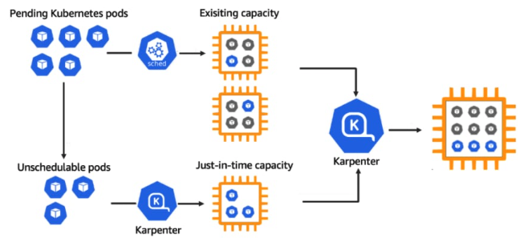

# [k8s] What is Karpenter?
> date - 2022.02.28  
> keyworkd - kubernetes, auto scaling, aws  
> karpenter에 대해 정리

 

## Karpenter
* application 가용성과 cluster 효율성을 개선하는데 도움이 되는 유연한 고성능 kubernetes cluster autoscaler
* AWS 환경에서 [Cluster Autoscaler](https://github.com/kubernetes/autoscaler/tree/master/cluster-autoscaler)와 [AWS Node Termination Handler(NTH)](https://github.com/aws/aws-node-termination-handler) 대체품
* 1분 이내에 application load 변화에 대응하여 적절한 컴퓨팅 리소스를 시작하며 활용도가 낮은 node를 제거하고, 비싼 node를 저렴한 node로 교체하여 효율적인 컴퓨팅 리소스 사용으로 컴퓨팅 비용을 낮춘다
* Cluster Autoscaler보다 AWS instance type을 효율적으로 처리
* AWS Auto Scaling Group이나 EKS managed node group 같은 orchestration mechanisms 없이 사용 가능
  * 수백개의 node group을 생성하지 않고도 다양한 instance type, AZ, purchase options 활용 가능
* Cluster Autoscaler는 node 추가 후 Pod scheduling을 scheduler에 의존하지만 Karpenter는 직접 scheduling하여 kubelet이 scheduler, node가 준비될 때까지 기다릴 필요가 없다
* 기본 값이 제공되어 추가 구성이 필요하지 않아 operational overhead 최소화

  

* Karpenter는 리소스가 부족하여 scheduler가 unschedulable로 표시한 Pod 감시
* Pod에서 요청한 resource requests, nodeselectors, affinities, tolerations 등의 제약 조건 평가
* Pod의 요구사항을 충족하는 node provisioning
* Pod를 새로운 node에 scheduling
* node가 더 이상 필요하지 않을 때 제거

 

## Cluster Autoscaler vs Karpenter
| | Cluster Autoscaler | Karpenter |
|:--|:--|:--|
| Pors | CSP에 종속되지 않음 | AWS AutoScaling Group에 의존적이지 않아 scaling 속도가 빠름 AWS Node Termination Handler 불필요 AutoScaling Group, LaunchTemplate, NodeGroup 등 node group을 위한 리소스는 CRD로 관리 |
| Cons | AWS AutoScaling Group에 의존적으로 인해 scaling 속도가 느리며 node는 1개씩 추가됨 AWS Node Termination Handler 필요 AutoScaling Group, LaunchTemplate, NodeGroup 등 node group을 위한 리소스 직접 관리 필요 | AWS Lock-in |

  

> #### Reference
> * [Karpenter - Just-in-time Nodes for Any Kubernetes Cluster](https://karpenter.sh)
> * [Karpenter vs Cluster Autoscaler](https://kubesandclouds.com/index.php/2022/01/04/karpenter-vs-cluster-autoscaler)
> * [EKS클러스터 Karpenter 적용기](https://devblog.kakaostyle.com/ko/2022-10-13-1-karpenter-on-eks)
> * [AWS re:Invent 2022 세션 후기 #29 – 쿠버네티스 2](https://www.megazone.com/reinvent2022-1130-29)
