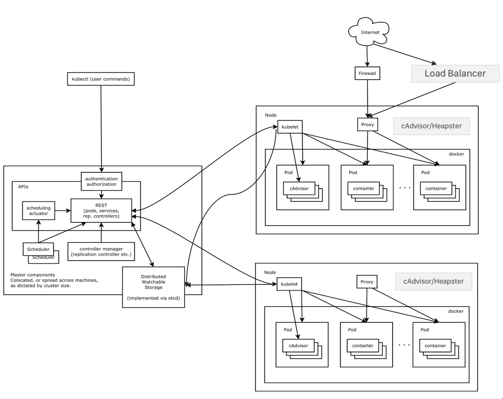

# [k8s] Kubernetes Basic
> date - 2018.10.18  
> keyword - kubernetes, k8s, container orchestration  
> [2017.11 Oracle meetup kubernetes](https://www.slideshare.net/OracleDeveloperkr/oracle-meetup-kubernetes171118)에서 들었던 내용을 기반으로 k8s에 대해 기초 내용 정리

<br>

## Container
* Legacy 


* MSA


* MSA & DevOps
* 다양한 runtime을 container로 추상화
  * 동일한 인터페이스를 제공하여 배포 및 관리 단순화

<br>

## Container Orchestration
* 적은 수의 container는 docker만으로 가능하지만 수백~천개가 되면 관리하기 어렵다
* Container Orchestration Tool 등장
  * [Kubernetes(k8s)](https://kubernetes.io/) - Production-Grade Container Orchestration
  * [Docker Swarm](https://github.com/docker/swarm) - Docker-native clustering system
  * [Mesosphere Marathon](https://mesosphere.github.io/marathon/) - Producation-proven Apache Mesos framework for container orchestration
    * [DC/OS](https://dcos.io/) - Marathon을 쉽게 사용할 수 있다
* Developer
  * Core Concepts
    * Cluster
    * Single container
    * Multi container
  * Service Discovery & Load Balancing
  * Persistent Volumes
  * Local development
* Ops
  * Multiple master
  * Scheduler
  * Rules and constraints
  * Monitoring
  * Rolling update
  * Cloud/commercial support


> 반만 지원되는건 ㊀로 표시


<br>

## Kubernetes
* Container Orchestration Tool
  * automating deployment
  * scaling
  * management of containerized application
* 많이 사용되는 tool이라는걸 알 수 있다

from CNCF Survey in 2018  

* Packaging
  * Helm(68%)
  * kubernetes offerings(19%)
* Autoscaling
  * stateless application(64%)
  * Java application(45%)
  * task/queue processing application(37%)
* Ingress Providers
  * nginx(64%)
  * HAProxy(29%)
  * F5(15%)
  * Envoy(15%)
* Exposing Cluster External Services
  * 인터넷, VM 같은 클러스터 외부 서비스 노출하는 방법으로는
  * Load Balancer(67%)
  * L7 ingress(39%)
  * 3rd party Load Balancer(33%)
* Separating Kubernetes in an Organization with Multiple Teams
  * 조직의 다양한 팀에서 k8s를 분리하는 방법으로는
  * namespaces(71%)
  * 개별 cluster(51%)
  * label만(15%) 사용
* Separating Kubernetes Applications
  * k8s에서 application을 분리하는 방법으로는
  * namespace(78%)
  * 개별 cluster(50%)
  * label만(21%) 사용


> Kubernetes를 설정, 운영하려면 인프라 지식 필요  
> infrastructure 추상화라고 생각하자  

<br>


kubernetes architecture v1.1

<br>


kubernetes architecture overview


<br>

## Node


### Master Node(Cluster control plane)
* Hosts cluster-level control services
  * 클러스터에 대한 관리 담
* Rest API로 Client, Worker Node와 통신
* Scheduler
* Replication Controller
  * pod의 lifecycle, replication 관리
* Controller Manager

### Worker Node
* docker host running kubelet
* proxy service
* 실제 Container가 실행되어 사용자가 사용할 수 있도록 서비스 제공

### [etcd](https://github.com/etcd-io/etcd) Node
* kubernetes system 상태를 저장하기 위한 distributed key-value store
  * k8s cluster의 모든 상태 저장
  * k8s API object 저장

### Kubelet
* Node에서 동작하는 Agent
  * Container Runtime(docker..) 연동
* Node level Pod management 담당
  * health check

### kube-Proxy
* 외부의 사용자 요청을 처리, Service들의 Load balancer
* L3(IP) Load balancing 지원
  * iptables 사용

### cAdvisor/Heapster
* Node의 리소스 모니터링

### Ingress Controller
* L7 기반의 Load balancing 지원
  * url 기반


<br>

## Pod


* 동일한 Lifecycle을 가지는 하나이상의 Container로 구성
* Pod당 하나의 dynamic IP 할당
* Container끼리 localhost 통신 가능
* Block Storage, Secret, Config 공유
  * Container가 재시작하더라도 Pod이 살아있는한 Shared volume 유지
  * Container는 휘발성 리소스
* 1 Container당 1 process

> #### 하나의 pod에 다수의 container를 띄우는 예 
> * nginx, nginx config, supervisor 등이 있을 때

## Scheduler
* Node에 할당되지 않은 pod를 감시하고 실행될 node에 할당하는 master node의 component
* Node의 리소스를 효율적으로 사용할 수 있도록 관리
  * 개별/집단 요구 리소스, HW, SW, 제약 정책, 선호/비선호도, 데이터 지역성, 작업 부하간 간섭 등을 기반으로 scheduling


<br>

## Service


* 여러개의 Pod을 관리
  * k8s의 모든 component는 Pod으로 등록


<!--  -->
* component communication 관리
  * pod간의 트래픽 라우팅
  * Load Balancer

### Service Discovery


<br>

## Secret

<br>

## ConfigMap

<br>

## PetSet
* stateful application 지원
  * clustering

<br>

## Labels


* pod, service 등을 동일한 label로 관리 가능
* component들을 group으로 관리할 수 있다

<br>

## Deployments
* rolling update, rollback 등을 지원하는 pod, replica set

<br>

## Namespace

<br>

## Volume
* emptyDir, NFS, iSCSI, GFS, CephFS...

<br>

## PersistentVolume


* networked storage 개념

<br>

## Kubernetes Tools

### kubectl
* k8s API의 CLI
* kubeconfig 파일에 정의된 정보 사용
  * cluster, context, security...
* example

```sh
# pod 생성
$ kubectl create -f my-pod.yml

# pod 조회
$ kubectl get pods
```

### [kubeadm](https://kubernetes.io/docs/reference/setup-tools/kubeadm/kubeadm/)
* `kubeadm init`, `kubeadm join`으로 k8s cluster를 생성의 best pratice를 제공하는 tool
* 최소 조건으로 cluster를 구성
* 표준 cluster를 쉽게 구성 가능
* provisioning machine이 아닌 bootstrapping만 고려
  * Kubernetes Dashboard, monitoring solution, cloud-specific addons은 고려 X

### [helm](https://github.com/helm/helm)
* The Kubernetes Package Manager

### [Helm Charts](https://github.com/helm/charts)
* Curated applications for Kubernetes

### [minikube](https://github.com/kubernetes/minikube)
* Run Kubernetes locally
* virtualbox 기반의 single node cluster 제공
* 가장 편하게 k8s 환경에서 개발/테스트 가능

### [CoreOS-Kubernetes-Vagrant](https://github.com/coreos/coreos-kubernetes)
* CoreOS Container Linux+Kubernetes documentation & Vagrant installers

### [Prometheus](https://prometheus.io/)
* metrics
* kubernetes는 logging이 어렵다

<br>

> #### 막간을 이용해 container native application development platform을 살펴보자
> 

<br>

> #### Reference
> * [Oracle meetup kubernetes_171118](https://www.slideshare.net/OracleDeveloperkr/oracle-meetup-kubernetes171118)
> * [Container Orchestration Wars (2017 Edition)](https://www.slideshare.net/KarlIsenberg/container-orchestration-wars-2017-edition)
> * [CNCF Survey: Use of Cloud Native Technologies in Production Has Grown Over 200% - 2018.08.29](https://www.cncf.io/blog/2018/08/29/cncf-survey-use-of-cloud-native-technologies-in-production-has-grown-over-200-percent/)


https://nodesource.com/blog/orchestrating-nodejs-containers-with-kubernetes/
-> 여기의 controlplane 이미지랑 k8s relation image 너무 좋은듯 사용해서 정리하자
https://wooono.tistory.com/116
이것도 좋음!


k8s basic


컨테이너

싱글 프로세스를 실행하는데 필요한 모든 것이 포함된 이미지가 있음을 의미
컨테이너는 싱글 프로세스로 동작하고 실행하는데 최적화되어 있다

container != virtual machine


Pod
k8s가 관리하는 가장 작은 단위

1개 이상의 컨테이너로 구성
영구 관리가 아닌 쉽게 재시작이 가능한 단위
수명이 매우 짧다

Pod의 모든 컨테이너는 동일한 노드에서 실행
Pod 내의 컨테이너들은
    네트워크에 포함되며 상호 통신 가능
    Pod에 연결된 볼륨을 통해 파일 공유 가능
    Pod는 lifecycle을 가지고 있으며 재시작시 같은 노드에서 실행

컨테이너 status
Running
Terminated
Waiting

Pod lifecycle
Phase
    Pending
    Running
    Succeed
    Fail
    Unkonwn
PodStatus
    ...
> https://kubernetes.io/docs/concepts/workloads/pods/pod-lifecycle/


namespace
다양한 목적별로 그룹화
CPU, memory 리소스 제한
DNS name, ACL(network) policy에서 사용

Node
k8s cluster에 추가된 머신(물리, 가상)

Network
동일한 Pod의 컨테이너는 노드의 network를 공유

Controller
사용자가 원하는 것을 말하고, k8s는 그것을 수행하기 위해 무엇을 해야할지 알고 있다는 개념으로 만들어짐
deployment, replica set controller…

ReplicaSet
Pod의 상위 개념
동시에 실행해야 하는 Pod의 수를 정의
Deployment의 하위 개념
horizontal scale에 중요한 역할
지속적으로 Pod의 상태를 검사해 정의된 수만큼 실행 상태를 유지하도록 한다


Pod Status phase는 매우 잘 그려졌네요. 지금까지 본 것 중에 가장 시각적으로 좋은거 같아요. Probe 계열만 따로 보면 될꺼 같아요.
https://spectrumstutz.com/k8s/kubernetes-pod/


https://kubernetes.io/ko/docs/concepts/overview/components 도 정리


<br><br>

> #### Reference
> * [reference link 1](http://xxx)

<br>

> #### Further reading
> * [Learn Kubernetes with Google](https://learnkubernetes.withgoogle.com)
