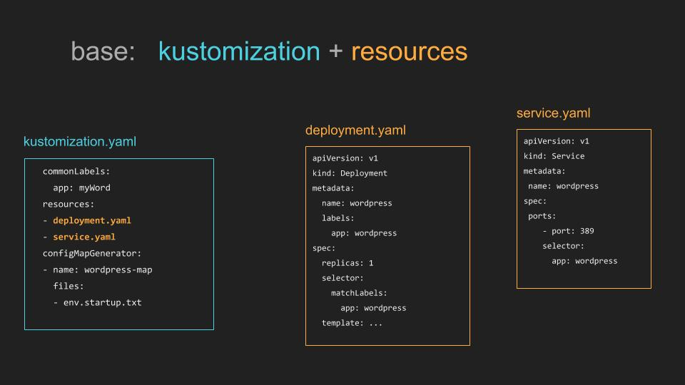
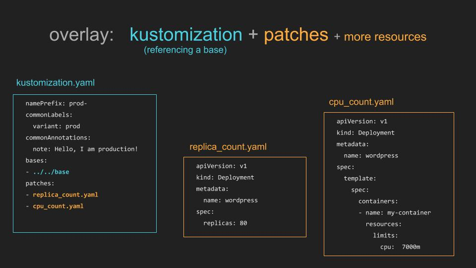

# [k8s] About kustomize
> date - 2021.11.18  
> keyworkd - kubernetes, k8s, kustomize  
> manifest의 재사용성을 높여주는 kustomize에 대해 정리

<br>

## Kustomize란?
* CLI for managing kubernetes style object with **declarative** way
  * 대표적인 kubernetes native tool
* raw, template-free yaml을 여러 목적에 따라 사용자 정의할 수 있어 original yaml을 유지하며 사용할 수 있다
* 별도로 설치하거나 `kubectl`로 사용
* kustomize에서는 helm의 template 치환 대신 generate, transform 사용
* kubernetes api로 호환 가능한 structured 변경들만 지원하여 안전함을 보장하기 위함
* kustomize에서 또다른 kustomization 파일을 base로 kustomization 파일을 생성
  * 반복, 추가적인 generate/transform 가능
* `kustomize build`로 단일 layer yaml로 생성하여 `kubectl apply`로 적용

<br>

### 장점
* original yaml에 대한 copy/paste가 없어져 manifest 관리에 용이
  * original yaml을 copy하면 variants별로 yaml을 관리하게 되자만 kustomize를 사용하면 original yaml과 patch yaml만 관리하면 된다
* `ConfigMap` 수정시 rolling update 가능
* Kubernetes API를 사용하기 때문에 **lower learning cost**


<br>

## Usage
### 1. Make a kustomization file

<div align="center">
  
</div>

```sh
.
├── deployment.yaml
├── kustomization.yaml
└── service.yaml
```

#### Build
```sh
$ kubectl kustomize [directory]
```

#### Deploy
```sh
$ kubectl kustomize [directory] | kubectl apply -f -

## or
$ kubectl apply -k [directory]
```

<br>

### 2. Create variants using overlays
<div align="center">
  
</div>

```sh
.
├── base
│   ├── deployment.yaml
│   ├── kustomization.yaml
│   └── service.yaml
└── overlays
    ├── development
    │   ├── cpu_count.yaml
    │   ├── kustomization.yaml
    │   └── replica_count.yaml
    └── production
        ├── cpu_count.yaml
        ├── kustomization.yaml
        └── replica_count.yaml
```
* base - original yaml 저장
* overlays
  * original yaml에서 variants별로 수정할 설정 저장
  * original yaml과 `metadata.name`이 같아야 한다

#### Build
```sh
$ kubectl kustomize ./overlays/production
```

#### Diff
```sh
$ diff \
  <(kubectl kustomize overlays/staging) \
  <(kubectl kustomize overlays/production) |\
  more
```

```diff
...
<   replicas: 2
---
>   replicas: 10
...
```

#### Deploy
```sh
$ kubectl kustomize ./overlays/production | kubectl apply -f -

## or
$ kubectl apply -k ./overlays/production
```


## Syntax
* [The Kustomization File](https://kubectl.docs.kubernetes.io/references/kustomize/kustomization/) 참고

<br>

### namePrefix, nameSuffix
* 생성되는 resource의 `metadata.name`의 prefix, suffix 설정

<br>

### commonLabels
```yaml
commonLabels:
  app: my-app
```
* 생성되는 resource의 공통 labels 설정
* `Deployment`라면 `metadata.labels`, `spec.selector.matchLabels`, `spec.template.metadata.labels`
* `Service`라면 `metadata.labels`, `spec.selector`

<br>

### resources
* base로 사용할 resource 지정
```yaml
resources:
  - ../../base
```

<br>

### patchesStrategicMerge
* base에서 변경할 설정이 담긴 resource 지정
```yaml
patchesStrategicMerge:
  - deployment.yaml
```

<br>

### configMapGenerator
* 파일 기반으로 `ConfigMap`을 생성하고 hash가 suffix로 사용되어 `Deployment`의 rolling update를 유발한다
```yaml
...
configMapGenerator:
  - name: gen-config
    files:
      - .env

## .env
KEY_A=A

## Deployment
...
  envFrom:
    - configMapRef:
        name: gen-config  # here
  volumes:
    - name: config
      configMap:
        name: gen-config  # here

## Result
kind: ConfigMap
name: gen-config-bgbtf5dmg7  # here
data:
  .env: |
    KEY_A=A
...
kind: Deployment
  envFrom:
    - configMapRef:
        name: gen-config-bgbtf5dmg7  # here
  volumes:
    - name: config
      configMap:
        name: gen-config-bgbtf5dmg7  # here
```

* `envs`를 사용할 경우 각 라인을 `ConfigMap`의 key로 사용
```yaml
...
configMapGenerator:
  - name: gen-config
    envs:
      - .env

## Result
kind: ConfigMap
name: gen-config-bgbtf5dmg7
data:
  KEY_A: A  # here
```
* 환경 변수에 대한 사용은 [Configure a Pod to Use a ConfigMap](https://kubernetes.io/docs/tasks/configure-pod-container/configure-pod-configmap/)를 참고


<br>

## Best Practices
### Resource file naming
* lower-case, `-` 사용
* 단일 리소스 파일 유지
* 여러 리소스를 사용할 경우 `[kind]-[name].yaml` 사용

```sh
└── base
    ├── README.md
    ├── cluster-role-binding.yaml
    ├── crd.yaml
    ├── deployment.yaml
    ├── kustomization.yaml
    ├── role-binding.yaml
    ├── role.yaml
    ├── service-account.yaml
    └── service.yaml
```

<br>

### Removing common attributes across resources
* namespace, labels, prefix 등의 commcon attributes는 `kustomization.yaml`에서 정의
```yaml
apiVersion: kustomize.config.k8s.io/v1beta1
kind: Kustomization
resources:
- crd.yaml
- service-account.yaml
- cluster-role-binding.yaml
- role.yaml
- role-binding.yaml
- service.yaml
- deployment.yaml
namespace: kubeflow
namePrefix: profiles-
commonLabels:
  kustomize.component: profiles
images:
  - name: gcr.io/kubeflow-images-public/profile-controller
    newName: gcr.io/kubeflow-images-public/profile-controller
    newTag: v20190228-v0.4.0-rc.1-192-g1a802656-dirty-f95773
```

```yaml
## Before
apiVersion: apps/v1
kind: Deployment
metadata:
  labels:
    kustomize.component: profiles
  name: profiles-deployment
  namespace: kubeflow
spec:
  selector:
    matchLabels:
      kustomize.component: profiles
  template:
    metadata:
      labels:
        kustomize.component: profiles
    spec:
      containers:
      - command:
        - /manager
        image: gcr.io/kubeflow-images-public/profile-controller:v20190228-v0.4.0-rc.1-192-g1a802656-dirty-f95773
        imagePullPolicy: Always
        name: manager
      serviceAccountName: profiles-controller-service-account

## After - 훨씬 짧아졌다
apiVersion: apps/v1
kind: Deployment
metadata:
  name: deployment
spec:
  template:
    spec:
      containers:
      - name: manager
        command:
        - /manager
        image: gcr.io/kubeflow-images-public/profile-controller:v20190228-v0.4.0-rc.1-192-g1a802656-dirty-f95773
        imagePullPolicy: Always
      serviceAccountName: controller-service-account
```

<br>

### ConfigMapGenerator 사용
* `ConfigMap` 수정시 rolling update를 위해 사용


<br>

## Conclusion
* helm chart가 제공되는 addon은 helm으로 관리하고, 자체 서비스를 helm chart로 관리하기 어렵다면 plain yaml보다는 kustomize로 관리해보는 것을 추천한다


<br><br>

> #### Reference
> * [kubernetes-sigs/kustomize - GitHub](https://github.com/kubernetes-sigs/kustomize)
> * [kustomize.io](https://kustomize.io/)
> * [Introduction to kustomize](https://speakerdeck.com/spesnova/introduction-to-kustomize)
> * [kustomize glossary](https://kubectl.docs.kubernetes.io/references/kustomize/glossary/)
> * [Declarative Management of Kubernetes Objects Using Kustomize - Kubernetes Docs](https://kubernetes.io/docs/tasks/manage-kubernetes-objects/kustomization/)
> * [Configure a Pod to Use a ConfigMap - Kubernetes Docs](https://kubernetes.io/docs/tasks/configure-pod-container/configure-pod-configmap/)

<br>

> #### Further reading
> * [General Docs](https://kubernetes-sigs.github.io/kustomize/)
> * [kustomize examples](https://github.com/kubernetes-sigs/kustomize/tree/master/examples)
> * [Kustomize Best Practices - kubeflow/manifests GitHub](https://github.com/kubeflow/manifests/blob/master/docs/KustomizeBestPractices.md)
> * [Before you use Kustomize](https://itnext.io/before-you-use-kustomize-eaa9529cdd19)
