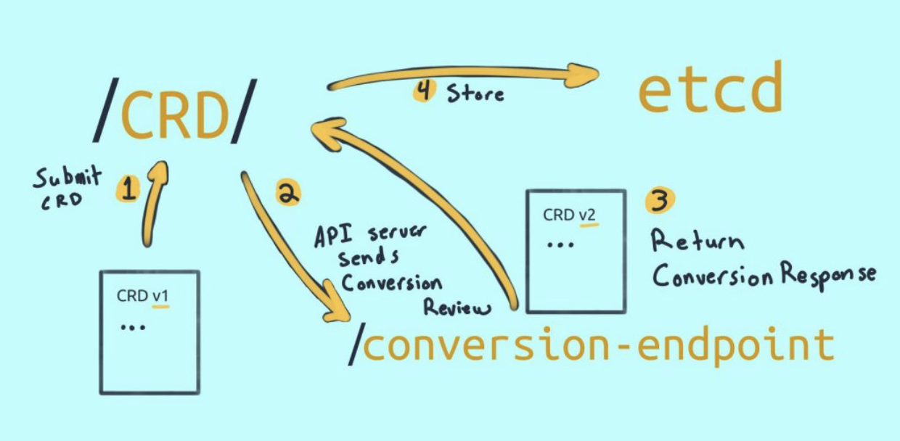
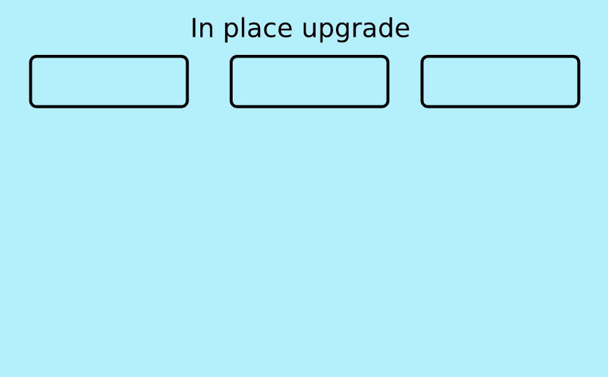
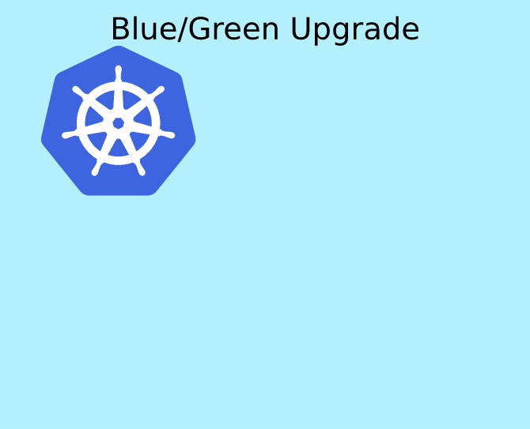
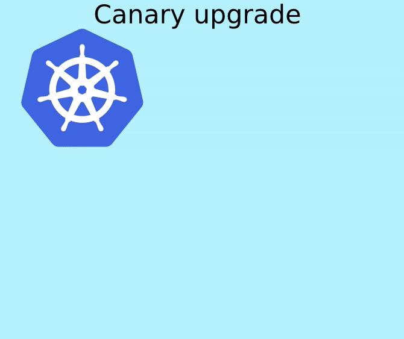

# [k8s] Living with Kubernetes
> date - 2022.03.01  
> keyworkd - kubernetes, k8s, cluster upgrade  
> `Living with Kubernetes` 시리즈를 정리  

<br>

## API Lifecycles and You
Kubernetes API의 강점, Custom Resources(CR)로 확장, API depreacted를 다룬다

### API Groups and Extensions
```sh
/apis/{GROUP}/{VERSION}/

# VERSION - v1, v1beta2, v1alpha2...
# GROUP - core, apps, scheduling.k8s.io, networking.k8s.io...
```
* Kubernetes API는 Kubernetes의 가장 강력한 부분
* 예측 가능하고 확장 가능한 strong contracts well-designed API
* declarative data로 control loop를 실행
  * Kubernetes scheduler, GitOps 등의 핵심
  * 다양한 use-case로 발전
    * Kubernetes를 사용해 [Cluster-API](https://github.com/kubernetes-sigs/cluster-api)로 배포
    * [Vitess](https://vitess.io)로 대규모 DB를 실행
* [different groups](https://kubernetes.io/docs/reference/using-api/#api-groups)으로 구성
  * 기존에는 group이 없는 `/apis/{VERSION}/` 였으나 한계가 있어서 group 추가
  * Predictable API patterns
  * Progressive adoption of features by users
  * Independently defining resource scope and maturity
  * Unique API paths for specific use cases(e.g. pod/logs)

<br>

### [CustomResourceDefinitions(CRD)](https://kubernetes.io/docs/tasks/extend-kubernetes/custom-resources/custom-resource-definitions)
```
/apis/{GROUP}/{VERSION}/namespaces/{NAMESPACE}/{RESOURCES}/{RESOURCE}
```
* namespace로 Kubernetes resource 분리해서 REST API처럼 예측 가능한 작업을 수행할 수 있다
* Custom Resources(CRs)를 이용해 API Group을 만들어 원하는 기능을 Kubernetes API에 통합시킬 수 있다
  * control loop 등 Kubernetese process에 통합
  * [aggregation API](https://kubernetes.io/docs/concepts/extend-kubernetes/api-extension/apiserver-aggregation) server로 Kubernetes API처럼 사용
  * Kubernetes service endpoint로 request를 proxy
  * state storage, version lifecycle를 담당하는 cluster 내부에서 서비스를 실행해야 한다

#### Example
```yaml
# /apis/example.io/v1/namespaces/{NAMESPACE}/socks/{SOCK}

apiVersion: apiextensions.k8s.io/v1
kind: CustomResourceDefinition
metadata:
  name: socks.example.io
spec:  
  group: example.io  
  versions: v1  
  scope: Namespaced
  names:    
    kind: Sock    
    plural: socks  
```

```sh
$ kubectl get socks
```

<br>

### CRD vs AGGREGATION
* CRD
  * handled by kube-api-server
  * conversion by external webhook
  * storage in etcd
* AGGREGATION
  * forwarded to external endpoint
  * conversion by endpoint
  * storage external

<br>

### Version and Lifecycles
```
v1alpha1 -> v1alpha2 -> v1beta1 -> v1
```
* alpha
  * experimental
  * not enabled by default
  * 호환성 보장 X
  * v1alpha1, v1alpha2...
* beta
  * well tested
  * enabled by default
  * 구현 변경 가능성 O
  * v1beta1...
* stable
  * 구현 변경 가능성 X
  * v1...


<br>

## Upgrading Kubernetes and Validating Manifests
* Kubernetes API 호환성을 [Deprecated API Migration Guide](https://kubernetes.io/docs/reference/using-api/deprecation-guide/)에서 확인 필요

### [pluto](https://github.com/FairwindsOps/pluto)
* helm release 및 Kubernetes object가 deprecated/removed API를 사용하지 않는지 검증하기 위한 tool
* GitOps 관리하거나 [velero](https://github.com/vmware-tanzu/velero)로 backup한 manifest 파일을 대상으로 사용

```sh
$ pluto detect-files -d [directory]

## Helm Detection
$ pluto detect-helm -o wide

## example
$ pluto detect-files -t k8s=v1.22.2  -d ./

NAME                                     KIND                      VERSION                          REPLACEMENT                 REMOVED   DEPRECATED
kafka-pdb                                PodDisruptionBudget       policy/v1beta1                   policy/v1                   false     true
...
```
* API version 차이 이상을 확인해야 하는 경우 [kubeval](https://www.kubeval.com), [conftest](https://github.com/open-policy-agent/conftest) 사용


<br>

### Custom Resources
* `CustomResourceDefinitions`에 여러 버전을 정의하여 호환성 제공
```yaml
apiVersion: apiextensions.k8s.io/v1
kind: CustomResourceDefinition
metadata:
  name: socks.example.io
spec:  
  group: example.io  
  versions:
  - name: v1beta1
    served: true
    storage: true
    schema:
      ...
  - name: v1
    served: true
    storage: false
    schema:
      ... 
  scope: Namespaced
  names:    
    kind: Sock    
    plural: socks  
```

#### conversion webhook
<div align="center">
  
</div>

* webhook을 사용해 유연한 conversion CR lifecycle 관리
* [conversion webwook](https://kubernetes.io/docs/tasks/extend-kubernetes/custom-resources/custom-resource-definition-versioning)을 사용하면 `etcd`에 object를 저장할 수 있고, default API pattern을 사용하므로 simple 해진다

```yaml
apiVersion: apiextensions.k8s.io/v1
kind: CustomResourceDefinition
metadata:
  name: socks.example.io
spec:
  ...
  conversion:
    strategy: webhook
    conversionReviewVersions: ["v1","v1beta1"]
    clientConfig:
        service:
          namespace: default
          name: example-conversion-webhook-server
          path: /crdconvert
        caBundle: "Ci0tLS0tQk...<base64-encoded PEM bundle>...tLS0K"
...
```


<br>

## Cluster Upgrades
* security, bug fix를 위해 정기적인 upgrade 필요
* management kubernetes를 선택하면 upgrade에 대한 비용을 최소화하여 business value에 집중할 수 있다

<br>

### Upgrade strategy
* In place
* Blue/Green
* Rolling
* Canary

<br>

### Control plane component
* API server
  * 1번째로 upgrade
* etcd
  * optional
* controller manager
* scheduler
* add-ons controller
  * cloud provider

<br>

### Data plane component
* kubelet, container runtime, networking, logging, storage driver로 구성
* 최소한 kube-proxy, CNI plugin upgrade 필요
* host OS, container runtime 등은 독립적으로 upgrade 가능하여 bug fix, 보안 패치 등에 신속한 조치 가능

<br>

### Upgrade scenario
1. Control plane
2. Data plane and nodes
3. Add-ons
4. Workloads

<br>

## In-place upgrades
<div align="center">
  
</div>

* 모든 components 일괄 upgrade
  * traffic이 있는 cluster라면 components의 정상 동작 확인에 주의 필요
* configuration management로 원하는 버전의 configuration을 push하고 모든 API server가 upgrade되면 끝난다
  * rolling upgrade와 다름
* package update(e.g. yum), config management automation(e.g. Ansible), VM/container image로 구성
* rollback을 포함하여 자동화하는 것을 권장
  * 처음인 경우 test 환경에서 수동으로 진행해보면 많은 도움이 된다

<br>

### Scenario
1. API server upgrade
2. controller manager, scheduler upgrade
3. 대상 worker node cordon, drain
4. worker node upgrade
5. 3 ~ 4 반복

<br>

### Benefits
* cluster의 규모와 상관 없이 빠르다
* 수동으로 진행시 upgrade process를 더 많은 제어할 수 있다
* 여러 환경(on-prem or cloud)에서 적합
* 비용 측면에서 가장 저렴하다
* external traffic routing(Load Balancer, DNS) 등의 리소스를 수정하지 않아도 된다

<br>

### Restrictions
* 모든 API server, controller가 동시에 upgrade되면 downtime 발생
* 한번에 하나의 버전씩 upgrade를 진행해야하므로 상당한 시간이 소요된다
  * e.g. 1.18 -> 1.19 -> 1.20
* 각 단계를 수동으로 검증하면 상당한 시간이 소요되고, 실수가 발생할 수 있다
* scheme changes 같은 upgrade는 rollback이 불가능하므로 rollback plan test 필요


<br>

## Blue/Green upgrades
<div align="center">
  
</div>

* 원하는 버전의 **new cluster를 병렬로 구성**
* GitOps, CD(continuous delivery)를 통해 workload 이전 가능
  * 아니면 [Velero](https://velero.io)로 workload를 backup하여 이전
* new cluster의 안정성 확인 후 external traffic routing(DNS, Load Balancer)을 이용해 traffic shift
  * maintenance window, low utilization time에 traffic shift 가능
  * old cluster로 rollback 가능
* cluster 수가 적거나, 규모가 작을 경우 훌륭한 전략

<br>

### Scenario
1. new cluster 생성
2. new cluster로 workload 복사
3. traffic shift
4. old cluster 제거

<br>

### Benefits
* traffic shift 전에 cluster에 대한 사전 검증 가능
* 한번에 여러 버전 upgrade 가능
  * e.g. 1.18 -> 1.20
* 테스트하기 어려운 인프라의 다른 부분을 변경할 수 있다
  * 리전 변경, AZ 추가, instance type 변경, add-on upgrade 등
* in-place upgrade보다 새로운 cluster 설정이 더 쉽다
* rollback이 쉽고 안전하다

<br>

### Restrictions
* migration 기간 동안 평소보다 더 많은 비용 발생
* large scale cluster의 경우 완전한 cluster 구성을 위한 computing resource를 확보하기 어려울 수 있다
* traffic shift시 많은 endpoint를 한번에 전환하기 쉽지 않을 수 있다
  * Load Balancer의 pre-warmup 필요
* 동시 실행 가능한 workload로 변경 필요(batch job 등)


<br>

## Rolling upgrades
<div align="center">
  
</div>

* 신규 component 하나 생성 후 기존 component 하나 제거하는 방식을 모든 이전 component가 제거될 때까지 반복
* blue/Ggreen upgrades와 달리 external traffic routing(DNS, Load Balancer) 설정이 변경되지 않는다
* upgrade 전에 다른 cluster에서 test 필요
* [AWS managed node groups](https://docs.aws.amazon.com/ko_kr/eks/latest/userguide/managed-node-update-behavior.html), [kOps](https://kops.sigs.k8s.io/operations/updates_and_upgrades), [Cluster-API](https://cluster-api.sigs.k8s.io/tasks/upgrading-clusters.html) 등에서 사용
* 속도와 비용 사이에 균형이 잘 잡혀있는 upgrade strategy

<br>

### Scenario
1. 새로운 버전의 API server 추가
2. 기존 버전의 controller manager 제거
3. 새로운 버전의 controller manager 추가
4. 1 ~ 3 반복
5. 새로운 버전의 worker node 추가
6. 기존 버전의 worker node cordon, drain
7. 5 ~ 6 반복

<br>

### Benefits
* in-place upgrades 보다 더 안전한 roll-outs, rollback
* blue/green upgrades 보다 더 적은 비용
* 문제 발생시 일시 중지 가능

<br>

### Restrictions
* large scale cluster에서는 많은 시간 소요
* roll-out 중에 controller, daemonset, plugin upgrade가 필요할 수 있다
* AZ(availability zone) 추가 등 architecture 변경 불가

<br>

### Data plane upgrade Pod 이사
* 신규 버전의 worker node 추가 후 cordon, drain 사용

```sh
## node group의 label 확인
$ kubectl get no --show-labels | grep "node-group"

...
node-group=group1, version=v1
...
node-group=group1, version=v2

## 이전 버전의 node group cordon
$ kubectl get no -l node-group=group1,version=v1 | grep -v "NAME" | awk '{print $1}' | xargs -I {} kubectl cordon {}

## 이전 버전의 node group drain으로 pod 이사
$ kubectl get no -l node-group=group1,version=v1 | grep -v "NAME" | awk '{print $1}' | xargs -I {} kubectl drain --delete-emptydir-data --ignore-daemonsets --skip-wait-for-delete-timeout=0 {}
```


<br>

## Canary upgrades
<div align="center">
  
</div>

* new cluster에 대한 소량의 traffic 제공하며 검증
* blue/green + rolling upgrades로 생각할 수 있다

<br>

### Scenario
1. small scale green cluster 생성
2. external traffic routing(DNS, Load Balancer) or service mesh로 old cluster의 traffic 일부를 전달
3. 점진적으로 traffic shifting
4. new cluster scale-out, old cluster scale-in

<br>

### Benefits
* traffic shift 전에 cluster에 대한 사전 검증 가능
* 한번에 여러 버전 upgrade 가능
  * e.g. 1.18 -> 1.20
* 일정 규모로 나눠서(e.g. team, service) 진행 가능
* 증가하는 traffic으로 인한 error를 최소화
* 테스트하기 어려운 인프라의 다른 부분을 변경할 수 있다
  * 리전 변경, AZ 추가, instance type 변경, add-on upgrade 등
* cluster를 scale-out하면서 진행하므로 비용 효율적이다

<br>

### Restrictions
* 점진적으로 진행되므로 많은 시간이 소요되고, scale이 50% 이상 증가할 수 있다
* 어떤 cluster에서 error가 발생하는지 알야아해서 application debugging이 어려울 수 있다
* 가장 복잡한 upgrade strategy


<br>

## Multi-cluster Management
* 관리자는 수십 ~ 수백개의 cluster를 관리하고 배포하는 가장 좋은 방법을 찾아야한다
* multiple cluster를 사용하는 이유?
  * application environments, region이 다를 경우
  * compute needs or security boundaries가 다를 경우
* sprawl 이슈는 artifact를 생성하여 maintenance burden을 runtime에서 build time으로 전환하여 해결
  * configuration management 등의 lifecycle management를 자동화를 위해 AMI(Amazon Machine Image)로 많은 Amazon EC2(Amazon Elastic Compute Cloud)instance를 배포하고, Auto Scaling Group으로 동일한 resource group을 관리
* kubernetes cluster를 실행하는데 필요한 모든 리소스(binary + configuration)를 묶을 수 있는 방법이 없으므로 자동화 및 추가 관리 계층을 사용하는 것이 최선의 방법

<br>

### Multi-cluster Needs
Kubernetes control plane 관리를 위해 필요한 요소
* Configuration and default service
* Cluster discovery
* Access and security
* Patching and lifecycle management

#### Configuration and default service
* [Terraform](https://www.terraform.io), [eksctl](https://eksctl.io), [Cluster API](https://cluster-api.sigs.k8s.io), [kubespray](https://github.com/kubernetes-sigs/kubespray) 등의 install tool에 많은 영향을 많는 부분
* 제공되는 Kubernetes version, default service 등의 공통 기반으로 시작
* compute resources, storage, networking 옵션을 추가하여 configuration 확장
  * node label 추가
  * install add-on
    * [metrics server](https://github.com/kubernetes-sigs/metrics-server)
    * [AWS Load Balancer Controller](https://github.com/kubernetes-sigs/aws-load-balancer-controller)
    * [fluent-bit](https://github.com/fluent/fluent-bit)
  * cluster 간 ConfigMap, Secret 동기화
* centralized repository(monorepo)는 cluster가 증가에 따라 규모가 커지므로 upgrade 및 common configuration의 변경을 test하기 어렵다
  * common configuration repository와 cluster 마다 repository 구성 
  * [Flux](https://fluxcd.io), [Config Sync](https://cloud.google.com/anthos-config-management/docs/config-sync-overview), [GitOps](https://www.weave.works/technologies/gitops) controller을 사용하여 common configuration repository의 변경 사항을 multi-cluster에 적용

#### Cluster discovery
* cluster의 담당자가 누구인지, cluster에서 어떤 서비스가 실행되고 있는지, cluster 내부의 service가 어떻게 서로를 찾을 수 있는지 알아낼 방법 필요
  * CMDB(configuration management database)와 유사
  * managed cluster에서는 제공되고, self-managed cluster에서는 직접 관리 필요
    * custom resource를 사용해 자동화
    * cluster deploy centralized tool에서 관리
* service, endpoint에 대한 정보를 저장할 단일 저장소와 저장소의 정보를 조회하고, 필요한 endpoint를 호출할 방법 필요
  * cross-cluster communication과 service-to-service discovery에 service mesh나 DNS를 사용
  * [external-dns](https://github.com/kubernetes-sigs/external-dns), [admiral](https://github.com/istio-ecosystem/admiral), [kubefed](https://github.com/kubernetes-sigs/kubefed) 등을 활용

#### Access and security
security concerns for multi-cluster
* **authentication** - cluster access
  * SSO(Single Sign-On) 이용
  * [dex](https://github.com/dexidp/dex), [aws-iam-authenticator](https://github.com/kubernetes-sigs/aws-iam-authenticator) 활용
* **authorization** - cluster에서 수행할 수 있는 권한 부여
  * RBAC or CI/CD workflows or GitOps로 권한 관리
  * Kubernetes access log를 RBAC resource definition로 변환할 수 있는 [audit2rbac](https://github.com/liggitt/audit2rbac) 활용
  [rbac-tool](https://github.com/alcideio/rbac-tool), [rbac-audit](https://github.com/cyberark/kubernetes-rbac-audit)로 RBAC permissions audit
  * service account, role binding으로 workload의 권한 관리 필요
    * GKE - [Workload Identity](https://cloud.google.com/kubernetes-engine/docs/how-to/workload-identity)
    * Amazon EKS - [IRSA(IAM roles for service accounts)](https://docs.aws.amazon.com/ko_kr/eks/latest/userguide/iam-roles-for-service-accounts.html)
* **managing secrets**
  * native secret을 생성하여 모든 cluster sync
    * 특정 cluster에서 제외하려면 복잡해진다
  * cloud provider's secret management service or [Hashicorp Vault](https://www.vaultproject.io/docs/platform/k8s)를 centralize secret storage로 사용
    * SSO와 마찬가지로 secret management를 중앙 집중화하면 Pod의 runtime에 access할 수 있다

#### Patching and lifecycle management
* 한번에 많은 cluster upgrade를 수행하면 configuration이 잘못되거나, dependent resources에 과부하가 걸리면 위험할 수 있다
  * e.g. 모든 cluster가 pull image 수행시 container registry의 부하로 slow rollout 발생
* coordinating cluster upgrade는 good idea로 metrics and automation이 key point


<br>

## Debug Clusters in 8 Commands
* 아래의 명령어로 cluster의 문제점을 확인하기 위한 정보를 수집

<br>

```sh
$ kubectl version --short
```
* cluster debug를 위해 version 확인이 가장 중요

<br>

```sh
$ kubectl cluster-info
```
* cluster 실행 위치와 CoreDNS 실행 여부 확인
* cloud의 cluster라면 cloud provider's health dashboard 확인

<br>

```sh
$ kubectl get componentstatus
```
* scheduler, controller-manager, etcd node가 정상인지 확인
* `kubectl get --raw '/healthz?verbose'`로 대체 가능하나 scheduler, controller-manager는 확인 불가

<br>

```sh
$ kubectl api-resources -o wide --sort-by name
```
* CRD와 각 리소스의 API version 확인

<br>

```sh
$ kubectl get events -A
```
* cluster event로 문제 발생 전후에 어떤 일이 발생했는지 확인

<br>

```sh
$ kubectl get nodes -o wide
```
* Node의 os, kernel, container runtime 등의 정보 확인

<br>

```sh
$ kubectl get pods -A -o wide
```
* Pod의 정보 확인

<br>

```sh
$ kubectl run a --image alpine --command -- /bin/sleep 1d
```
* 간단한 Pod를 실행시켜 정보 확인


<br>

## 12 Commands to Debug Your Workloads
troubleshooting은 3단계로 구분
* Workloads won't run
* Cannot access workloads
* Debug specific pods

### Workloads won't run
```sh
$ kubectl get events --field-selector type=Warning --all-namespaces
```
* event를 확인하여 cluster의 특이점을 발견한다

<br>

```sh
$ kubectl get nodes -o wide --label-columns topology.kubernetes.io/zone
```
* `Ready`가 아닌 Node를 식별
* `topology.kubernetes.io/zone`을 사용해 특정 zone에 문제가 있는지 확인

<br>

```sh
$ kubectl resource-capacity --pods --util --sort cpu.util
```
* [kube-capacity](https://github.com/robscott/kube-capacity)로 어떤 `Pod`가 필요한 것 보다 더 많은 리소스를 사용하고 있는지 파악
* `kubectl krew install resource-capacity`로 설치

<br>

```sh
$ kubectl get all --show-labels
```
* 문제가 있는 resource의 type 등의 정보를 확인

<br>

```sh
$ kubectl lineage pod ${POD}
```
* [kube-lineage](https://github.com/tohjustin/kube-lineage)로 dependency를 확인하여 문제 식별
* `kubectl krew install lineage`로 설치

<br>

```sh
$ kail -l ${LABEL}
```
* [kail](https://github.com/boz/kail)로 label 기반으로 workload의 모든 log 확인
* `brew install boz/repo/kail`로 설치

<br>

### Cannot access workloads
```sh
$ kubectl get service -o wide
```
* `Service`의 type에 따른 external ip, load balancer 여부와 사용하는 label 확인하여 traffic routing 문제 파악

<br>

```sh
$ kubectl get endpointslices -o wide
```
* `EndpointSlices`로 Service에 연결된 Pod IP 확인
* endpoint가 없는 서비스가 있으면 Pod와 label이 일치하는지 확인 필요

<br>

```sh
$ kubectl port-forward deploy ${DEPLOYMENT} ${LOCAL_PORT}:${POD_PORT}
```

<br>

### Debug specific pods
```sh
$ kubectl debug -it --image=debian ${POD}
```
* [ephemeral containers](https://kubernetes.io/docs/concepts/workloads/pods/ephemeral-containers/)를 활용한 `debug` command 사용
* `exec`는 Pod에 debugging tool이 설치되어 있어야 하지만 `debug`는 실행 중인 Pod에 `--image`로 debugging tool container를 mount하여 사용
* [Debug Running Pods](https://kubernetes.io/docs/tasks/debug-application-cluster/debug-running-pod/) 참고

<br>

```sh
$ kubectl label pod ${POD} app-
```
* Pod의 label 제거하여 replication controller, service와 관련 없는 Pod로 만든다
* 부족한 Pod는 새로운 Pod로 대체되고, 기존 Pod로 troubleshooting

<br>

```sh
$ kubectl blame pod
```
* [kubectl-blame](https://github.com/knight42/kubectl-blame)으로 Pod manifest의 변경 사항을 확인
* `kubectl krew install blame`로 설치

<br>

### Etc
* [eBPF](https://ebpf.io/)를 활용한 tool
  * [inspektor-gadget](https://github.com/kinvolk/inspektor-gadget)
    * 도구 모음
  * [kubectl-capture](https://github.com/sysdiglabs/kubectl-capture)
    * [sysdig-inspect](https://github.com/draios/sysdig-inspect)에 활용할 수 있는 capture file 생성
* UI tool
  * [k9s](https://github.com/derailed/k9s)
  * [Lens](https://k8slens.devl)


<br><br>

> #### Reference
> * [Living with Kubernetes: API Lifecycles and You](https://thenewstack.io/living-with-kubernetes-api-lifecycles-and-you/)
> * [Living with Kubernetes: Cluster Upgrades](https://thenewstack.io/living-with-kubernetes-cluster-upgrades/)
> * [Living with Kubernetes: Multicluster Management](https://thenewstack.io/living-with-kubernetes-multicluster-management/)
> * [Living with Kubernetes: Debug Clusters in 8 Commands](https://thenewstack.io/living-with-kubernetes-debug-clusters-in-8-commands/)
> * [Living with Kubernetes: 12 Commands to Debug Your Workloads](https://thenewstack.io/living-with-kubernetes-12-commands-to-debug-your-workloads/)
