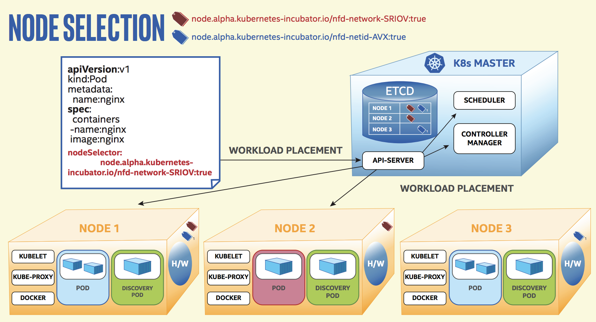

# [k8s] Node Feature Discovery(NFD)
> date - 2019.01.15  
> keyword - kubernetes, heterogeneous cluster  
> 이기종 클러스터에서 배포를 용이하게 하기 위한 node-feature-discovery에 대해서 정리

<br>

## NFD란?
* k8s의 deploy mechanism을 이용해 `heterogeneous cluster에서 deploy를 용이`하게 하기 위해 개발 
  * `Node에서 사용 가능한 HW feature/configuration을 탐색 후 node labels에 추가` 후 label을 [node affinity](https://kubernetes.io/docs/concepts/configuration/assign-pod-node/#alpha-feature-in-kubernetes-v12-node-affinity)에서 사용해 deploy할 Node를 지정
  * 시간이 지남에 따라 새로운 spec의 machine이 추가되면서 homogeneous 발생
  * deploy시 k8s는 machine간 homogeneous은 고려하지 않고, cpu, memory request에 따라 Node를 선택
    * ex) turbo boost를 사용한 cpu overclocking은 application에 따라 성능상 이점이나 문제가 생길 수 있다
* 몇몇 feature는 NFD container의 directory/file에 의존하므로 volume mount가 필요
  * [template spec](https://github.com/kubernetes-sigs/node-feature-discovery/blob/master/node-feature-discovery-daemonset.yaml.template) 참고



<br>

## Feature discovery

### Feature labels
* label pattern
```
<namespace>/<source name>-<feature name>[.<attribute name>]

## example
Labels:
  feature.node.kubernetes.io/cpu-hardware_multithreading=true
  feature.node.kubernetes.io/cpuid-ADX=true
  feature.node.kubernetes.io/iommu-enabled=true
  ...
```

<br>

### Feature sources
* CPU
* [CPUID](http://man7.org/linux/man-pages/man4/cpuid.4.html) for x86/Arm64 CPU details
* IOMMU
* Kernel
* Local
* Memory
* Network
* Pstate([Intel P-State driver](https://www.kernel.org/doc/Documentation/cpu-freq/intel-pstate.txt))
* RDT([Intel Resource Director Technology](https://www.intel.com/content/www/us/en/architecture-and-technology/resource-director-technology.html))
* Storage
* System

> 자세한 내용은 [Feature source](https://www.intel.com/content/www/us/en/architecture-and-technology/resource-director-technology.html) 참조


<br><br>

> #### Reference
> * [node-feature-discovery - GitHub](https://github.com/kubernetes-sigs/node-feature-discovery)
> * [node-feature-discovery - docker image](https://quay.io/repository/kubernetes_incubator/node-feature-discovery)
> * [Enhanced Platform Awareness in Kubernetes](https://builders.intel.com/docs/networkbuilders/enhanced-platform-awareness-in-kubernetes-application-note.pdf)
