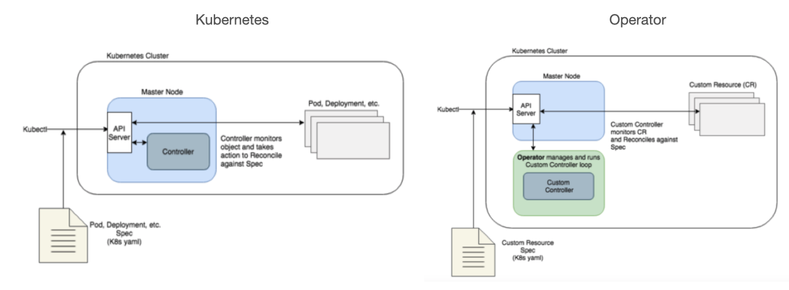

# [k8s] Kubernetes Operator
> date - 2021.10.20  
> keyworkd - kubernetes, k8s, operator, helm  
> Kubernetes Operator에 대해 알아보자  

<br>

## Operator
<div align="center">
  
</div>

* Kubernetes cluster 위에서 동작하며 `Custom Resource`를 사용하여 Kubernetes와 동일한 방법으로 application을 관리하는 방법
* 해당 시스템의 도메인 지식을 가지고 있는 현실 세계의 운영자(operator) concept
* Deployment 등의 기본 리소스 이외의 `Custrom Resource`도 Kubernetes의 control loop에 따라 동작하도록 만들어주는 Kubernetes extension으로 복잡한 application의 생성, 설정, 관리하기 위한 **custom controller**라고 할 수 있다
* Operator가 관리하는 application의 lifecycle 자동화를 위한 도메인 지식이 Kubernetes controller 개념을 기반으로 구현되기 때문에 control loop에 대한 이해 필요
  * **control loop**는 current state와 desired state를 감시하여 current state가 desired state가 될 수 있게 끊임없이 sync하도록 동작
  * Operator를 어떻게 개발하느냐에 따라 `Custom Resource`가 생성될 때 동작하는 방법이 다르다
  * DB, monitoring system 같은 stateful application의 경우는 kubernetes에 없는 scaling, upgrade에 필요한 도메인별 지식 필요
* Operator는 application을 지속적으로 monitoring하고, 자동으로 backup, restore, upgrade, high availability 작업을 수행


<br>

## Use case
* application의 data backup, restore
* DB schema, 설정 변경에 따른 application code upgrade
* cluster 전체 또는 일부에서 장애 시뮬레이션을 통한 가용성 테스트
* 내부 멤버 선출 절차 없이 분산 애플리케이션의 리더를 선택

<br>

## 예시로 이해하는 Operator
* cluster에 구성할 수 있는 SampleDB라는 `Custom Resource`
* Operator의 controller 부분이 포함된 Pod의 실행을 보장하는 `Deployment`
* Operator code의 container image
* control plane을 query하여 어떤 SampleDB 리소스가 구성되어 있는지 알아내는 controller code
* Operator의 핵심은 API server에 구성된 리소스와 current state를 일치시키는 방법을 알려주는 code
  * 새 SampleDB를 추가하면 Operator는 `PersistentVolumeClaims`을 설정하여 SampleDB를 실행하는 `StatefulSet` 및 초기 구성을 처리하는 `Job`을 제공
  * SampleDB를 삭제하면 Operator는 snapshot을 생성한 다음 `StatefulSet`과 volume도 제거되었는지 확인한다
* Operator는 정기적인 DB backup도 관리
  * Operator는 각 SampleDB 리소스에 대해 DB에 연결하고 backup을 수행할 수 있는 `Pod`를 생성하는 시기를 결정
  * 이 `Pod`가 사용할 DB 연결 정보 및 credentials은 `ConfigMap`, `Secret`를 이용
* Operator는 관리하는 리소스에 견고한 자동화를 제공하는 것을 목표로 하기 때문에 추가 지원 code가 있다
  * DB가 이전 버전을 실행 중인지 확인하고, 실행 중인 경우 upgrade를 위한 `Job`을 생성한다


<br>

## Deploy Operator 
* `Custom Resource Definition`과 custom controller(controlplane 외부에 위치)를 cluster에 추가


<br>

## Usage Operator
* Operator가 배포되었다면 Operator가 사용하는 `Custom Resource`를 추가, 수정, 삭제하여 사용할 수 있다
```sh
## 구성된 DB 찾기
$ kubectl get SampleDB

## 일부 설정을 수동으로 변경하기
$ kubectl edit SampleDB/example-database
```


<br>

## Operator 개발

<br>

### SDK
[OperatorHub.io](https://operatorhub.io/)에 원하는 Operator가 없다면 아래의 SDK를 이용해 구현할 수 있다

* [Charmed Operator Framework](https://juju.is/)
* [kubebuilder](https://book.kubebuilder.io/)
* [KubeOps (.NET operator SDK)](https://buehler.github.io/dotnet-operator-sdk/)
* [KUDO (Kubernetes Universal Declarative Operator)](https://kudo.dev/)
* [Metacontroller along with WebHooks that you implement yourself](https://metacontroller.github.io/metacontroller/intro.html)
* [Operator Framework](https://operatorframework.io/)
* [shell-operator](https://github.com/flant/shell-operator)

<br>

### Best practices

#### 1. Develop one Operator per application
* Airflow는 MySQL, Redis와 함꼐 사용되지만 모두를 다루는 단일 Operator가 아니라 3개의 Operator를 개발
* 각 application의 도메인 전문성과 관련되어 문제를 더 잘 분리할 수 있다

#### 2. Use an SDK like kubebuilder
* low level API 사용하기 보다는 Operator 개발을 위한 SDK를 사용하여 개발

#### 3. Use declarative APIs
* `imperative` API가 아닌 `declarative` API로 설계
* `declarative` API를 사용하면 사용자는 desired state만 표현하고, Operator는 이를 달성하는데 필요한 모든 단계를 수행
* `imperative` API를 사용하면 사용자는 desired state를 달성하기 위한 모든 작업을 명확하고 순서대로 지정해야 한다

#### 4. Compartmentalize features via multiple controllers
* application에는 scaling, backup, restore, monitoring 같은 다양한 기능이 있으며, Operator는 각 기능을 구체적으로 처리하는 여러 controller로 구성되어야 한다
  * application을 생성, 관리하는 main controller
  * backup을 담당하는 backup controller
  * restore를 담당하는 restore controller
* controller의 책임 분리는 더 나은 추상화와 더 간단한 sync loop를 통해 개발 프로세스를 단순화한다
  * 각 controller의 명확한 책임 분리를 위해 특정 CRD를 사용

#### 5. Use asynchronous sync loops
* sync loop에서 error를 감지하면 현재 sync를 종료하고 error를 반환하고 queue에 resync를 예약
* sync loop로 인해 application이 block되면 안된다
* long-running 작업을 시작하고 monitoring하는 controller는 작업을 synchronous하게 기다리지 말고, sleep 후 나중에 다시 확인


#### 6. application에 대한 logging, monitoring 활성화
* application-, node-, cluster-level log aggregation
  * Fluend, Google Stackdriver 등을 이용해 모든 application log를 aggregation
* metrics에 적절한 label 지정
  * aggregation, analysis를 위해 metrics에 label 추가
* metrics을 HTTP endpoint로 노출하여 더 나은 통합 방법 제공
  * application-specific [exporters](https://prometheus.io/docs/instrumenting/exporters/)를 사용해 Prometheus-style metrics 노출


<br>

> #### Declarative(선언적) vs Imperative(명령적)
> * Declarative - 원하는 상태를 정의하고, 현재 상태가 되도록 하는 것을 의미
> * Imperative - 지정한 상태로 만들어 버리는 것을 의미
> Kubernetes는 둘다 지원하지만 `Declarative`를 권장


<br>

## Operator를 통한 배포와 helm을 통한 배포의 차이
* operator와 helm이 동일한 role을 가진 것처럼 보이지만 약간 다른 작업을 수행하기 때문에 Operator와 Helm을 함께 사용하는게 좋다

<br>

### Helm
* package manager로 application의 install-update-delete lifecycle을 처리
* Helm chart는 간단한 application 배포시에 유용
* operator를 helm으로 배포 가능
* chart 작성을 위해 [Sprig library](https://github.com/Masterminds/sprig)와 Go template engine을 사용

<br>

### Operator
* custom resource controller로 보통 kubernetes cluster의 application deployment, lifecycle, 설정을 관리하도록 구현
  * stateful workload 등의 복잡한 workload에 대한 자동화를 위해 사용
* helm chart로 배포하는 것보다 더 많은 작업을 수행
  * application의 복잡한 요구 사항을 helm chart로 표현하기에는 어렵다
* kubernetes cluster의 application 관리를 위해 operator를 사용하는 추세
* 자동화, 복잡한 배포 등을 조정하는 complex runbooks을 관리하기 위한 SRE 담당

<br>

### 그렇다면?
* application을 배포만 한다면? `Helm`
* 기본 설정만 사용한다면? `Helm`
* custom configuration을 사용하거나 특별한 application을 배포해야 한다면? `Operator`


<br>

## Conclusion
Operator에 대해 정리하면
1. Kubernetes `Custom Resource Definition(CRD)`을 사용해 `Custom Resource(CR)`를 정의한다
2. `CRD`로 정의된 `CR`을 생성
3. custom controller를 구현
4. custom controller는 Kubernetes의 Watch API를 통해 `CR`을 감지한다
5. custom controller는 `CR`의 설정에 맞는 Pod 생성 등의 작업을 수행한다

그리고 필요에 따라 `Operator`와 `Helm`을 함께 사용하자


<br><br>

> #### Reference
> * [Operator pattern - Kubernetes Docs](https://kubernetes.io/docs/concepts/extend-kubernetes/operator/)
> * [Difference between Kubernetes prometheues operator vs helm chart](https://stackoverflow.com/questions/59561391/difference-between-kubernetes-prometheues-operator-vs-helm-chart)
> * [When to use Kubernetes operators vs. Helm charts](https://searchitoperations.techtarget.com/tip/When-to-use-Kubernetes-operators-vs-Helm-charts)
> * [Best practices for building Kubernetes Operators and stateful apps](https://cloud.google.com/blog/products/containers-kubernetes/best-practices-for-building-kubernetes-operators-and-stateful-apps)

<br>

> #### Further reading
> * [CNCF Operator White Paper - Review Version](https://github.com/cncf/tag-app-delivery/blob/eece8f7307f2970f46f100f51932db106db46968/operator-wg/whitepaper/Operator-WhitePaper_v1-0.md)
> * [Custom Resources - Kubernetes Docs](https://kubernetes.io/docs/concepts/extend-kubernetes/api-extension/custom-resources/)
