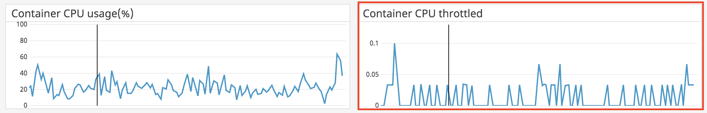
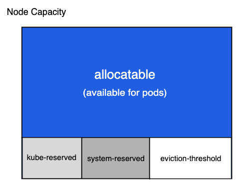
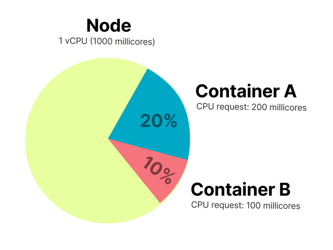
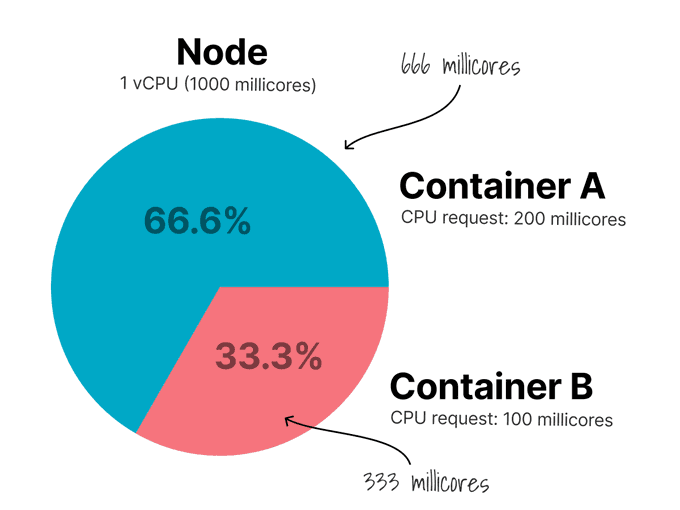
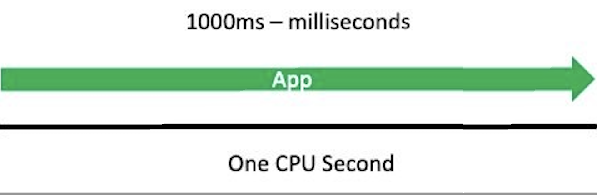
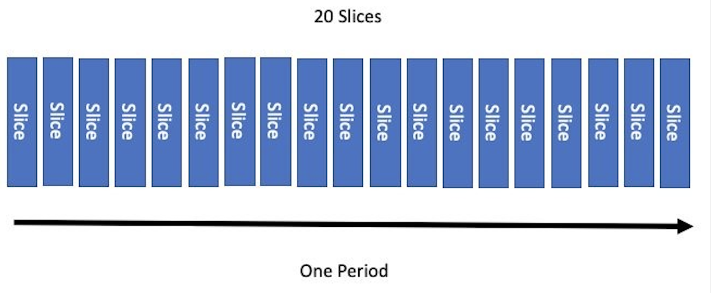
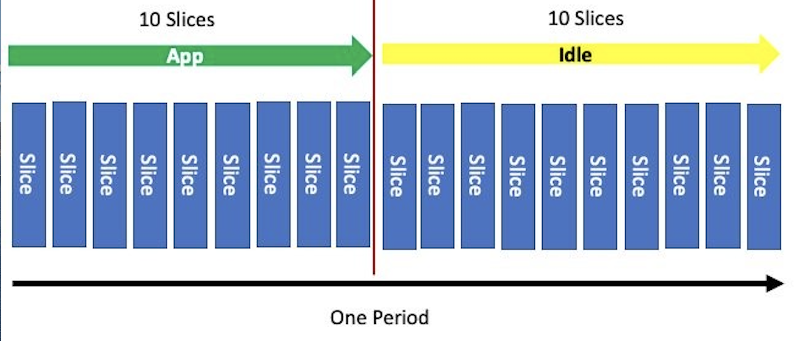
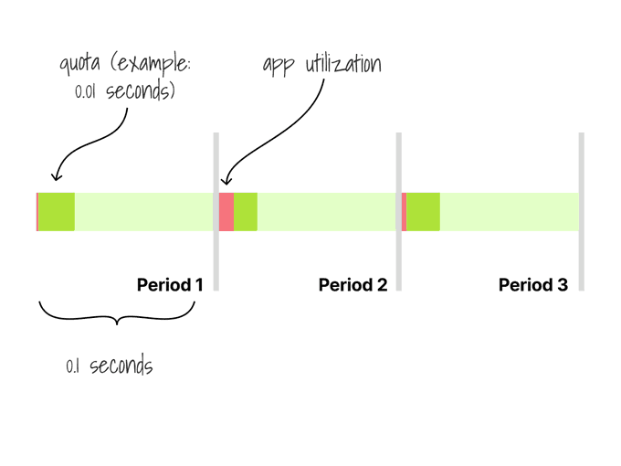
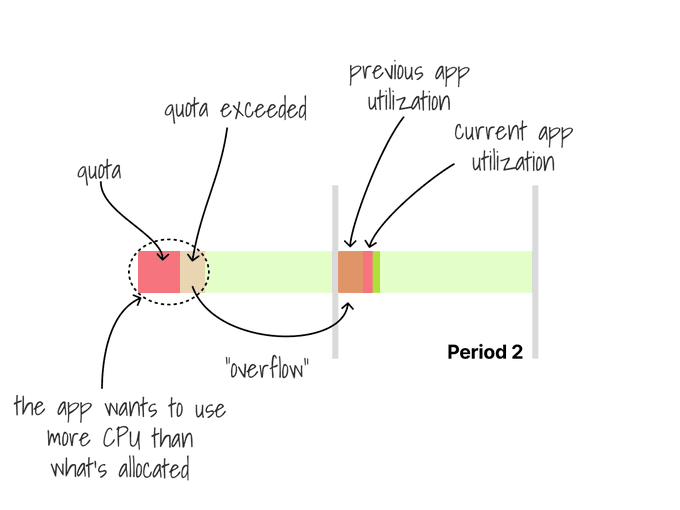
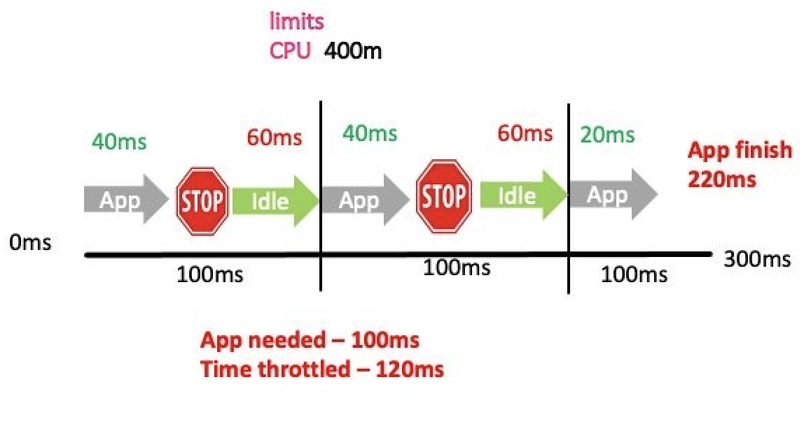

# [k8s] Understanding resource limit in kubernetes
> date - 2019.08.17  
> keyworkd - kubernetes, docker, cpu, memory  
> kubernetes cluster의 container resource management와 cgroup(control group)의 관계에 대해 정리

<br>

## Intro
<div align="center">
  
</div>

* Datadog에서 kubernetes cluster의 container CPU metrics monitoring을 위한 dashboard를 만드는 중 CPU 사용량은 request에 도달하지 않는데 CPU throttling이 발생하는 것을 `kubernetes.cpu.cfs.throttled.seconds`을 통해 확인하게 되었고, 의문이 생겨서 알아본 것을 정리


<br>

## Node capacity
<div align="center">
  
</div>

node capacity는 4가지로 구분
* kube-reserved
* system-reserved
* eviction-threshold
* allocatable(available for pods)

Node에서 Pod가 리소스를 많이 사용하더라도 k8s가 사용하는만큼은 확보하고 있다  
Pod가 리소스를 모두 사용해 starvation(기아 상태)가 되더라도 k8s가 Node를 제어할 수 있어 Pod eviction 등의 조치로 대응할 수 있다  
즉 EC2 instance CPU 100%로 SSH 접속도 되지 않는 문제가 발생하지 않는다는 것  


<br>

## 리소스 구분
* `CPU` 같이 **기다려서 사용 가능한 compressible**과 `memory`, `disk` 같이 **기다려도 사용 불가능한 incompressible** 2가지로 구분

<br>

### 리소스 부족시 동작
해당 리소스가 부족하다면?

| Type | Behavior |
|:--|:--|
| compressible | throttle <br>e.g. CPU throttling with CFS(Completely Fair Scheduler) |
| incompressible | eviction <br>e.g. Pod restart with OOM(Out Of Memory) Killter |


<br>

## Memory
* **Total memory of container = Resident Set Size(RSS) + Page Cache Usage**
  * docker에서는 swap까지 포함하지만 kubernetes에서는 기본적으로 **swap off**

<br>

### RSS
* **주어진 동안 process가 사용하는 RAM의 양**
  * swap out된 memory 제외
  * Library의 page가 실제 memory에 있는 경우 shared libary의 memory 포함
  * 모든 stack, heap memory 포함
* e.g. Java process
  * native heap/non-heap(thread stack, native memory allocation)
  * JVM thread configuration, thread count, component 동작에 영향을 받는다

<br>

### Page cache
* Disk에서 읽어온 **block을 caching을 위한 RAM 영역**
* 모든 I/O는 일반적으로 성능상의 이유로 cache를 통해 동작
* 파일의 read/write 마다 관련된 block이 Page cache에 caching된다
  * 즉, read/write 파일이 많을수록 커진다
  * kernel은 page cache에 사용 가능한 여분의 메모리를 사용하지만 모자랄 경우 성능이 저하될 수 있다
* Docker의 overlayfs storage driver는 page cache를 공유
  * 서로 다른 cgroup의 process가 동일한 파일(Disk의 동일한 block)을 읽은 경우 caching에 필요한 memory를 cgroup간 분할한다
  * 하나의 cgroup process가 종료될 경우 memory page 비용을 분할하지 않기 때문에 다른 쪽의 memory 사용량이 증가할 수 있다


<br>

### memory request, limit를 cgroup에서 살펴보자
* 아래와 같이 memory request, limit 설정
```yaml
resources:
  requests:
    memory: 2Gi
  limits:
    memory: 4Gi
```

<br>

* cgroup은 `/proc`, `/sys`에서 확인할 수 있다
* container의 PID namespace 내부에서 root process의 PID는 1이지만 namespace 외부에서 cgroup을 찾을 수 있는 **system-level PID**가 존재

```sh
$ ps ax | grep java

15521 ?        Ssl   25:25 java -jar app.jar
...

$ cat /proc/15521/cgroup

8:memory:/kubepods/burstable/podb1d9/704b8ac
5:cpuset:/kubepods/burstable/podb1d9/704b8ac
4:cpu,cpuacct:/kubepods/burstable/podb1d9/704b8ac
...
```
* cgroup의 경로를 확인할 수 있다
* cgroup은 **계층 구조**를 가진다
  * kubepods, burstable cgroup의 모든 항목을 **상속** 받는다
* 마지막 `podb1d9/704b8ac`로 실제 memory cgroup을 `/sys/fs/cgroup/memory`에서 확인할 수 있다

<br>

> burstable - kubernetes QoS class

<br>

### limit는 어떻게 설정될까?
* [How Pods with resource limits are run](https://kubernetes.io/docs/concepts/configuration/manage-compute-resources-container/#how-pods-with-resource-limits-are-run)을 보면 container runtime이 docker일 때 memory limit 설정에 `--memory`를 사용

```sh
$ docker inspect 707764b8ac2c --format '{{.HostConfig.Memory}}'
4294967296  # 4Gi
```

* docker의 HostConfig.Memory는 **memory cgroup의 `memory.limit_in_bytes`** attribute 사용
```sh
$ ls -l /sys/fs/cgroup/memory/kubepods/burstable/podb1d9/704b8ac
total 0

-rw-r--r--. 1 root root 0 Jul 10 00:23 memory.limit_in_bytes
...

$ cat /sys/fs/cgroup/memory/kubepods/burstable/podb1d9/704b8ac/memory.limit_in_bytes
4294967296  # 4Gi
```

<br>

### request는 어떻게 설정될까?
```sh
$ cat /sys/fs/cgroup/memory/kubepods/burstable/podb1d9/704b8ac/memory.soft_limit_in_bytes
9223372036854771712  # unlimit
```

<br>

### memory limit는 cgroup에 설정되고, request는 설정되지 않는다
* host에 memory pressure가 발생하면 kernel이 특정 container를 **OOM Kill** 시킬 수 있다
* memory limit
  * cgroup에 설정되어 **초과하면 OOM Killed**
* memory request
  * **kubernetes scheduler에서 Pod가 deploy될 Node를 선택**하는데 사용하고, cgroup에는 설정되지 않는다
* 실제로 2Gi memory를 사용하는 Pod에 request를 1Gi로 설정해서 scheduling되면 여유 memory만큼 다른 Pod가 scheduling되는데 2Gi를 사용하게 되면 host(k8s node)에 memory pressure가 발생하므로 QoS class에 따라 Pod eviction이 발생하므로 올바른 request/limit 설정이 중요하다


<br>

## CPU
* physical core, physical core의 hyper-thread, EC2 vCPU에 관계 없이 **host OS에서 제공하는 CPU**
* memory와 달리 압축 가능한 리소스로 throttling 가능
* container에 CPU limit를 설정하면 실제로 Host CPU에서 container의 CPU time을 제한한다
* container에 Host의 CPU의 합보다 적은 limit를 설정하더라도 Host의 모든 CPU를 사용한다
  * e.g. 8 CPU host에 cpu limit 4인 container라면 4에 해당하는 cpu time을 사용하지만 모든 CPU에 분산된다
  * host에 single container로 실행될 경우 CPU 점유율은 최대 50%

<br>

### CPU request, limit를 cgroup에서 살펴보자
* 아래와 같이 CPU request, limit 설정
```yaml
resources:
  requests:
    cpu: 500m
  limits:
    cpu: 750m
```
* suffix `m` - thousandth of a core
* 2000m - 2 core

<br>

* cgroup 경로 확인
```sh
$ ps ax | grep java

15521 ?        Ssl   25:25 java -jar app.jar
...

$ cat /proc/15158/cgroup

5:cpuset:/kubepods/burstable/podb1d9/704b8ac
4:cpu,cpuacct:/kubepods/burstable/podb1d9/704b8ac
```

<br>

### request는 어떻게 설정될까?
* [How Pods with resource limits are run](https://kubernetes.io/docs/concepts/configuration/manage-compute-resources-container/#how-pods-with-resource-limits-are-run)을 보면 container runtime이 docker일 때 CPU request 설정에 `--cpu-shares`를 사용

```sh
$ docker inspect 707764b8ac2c --format '{{.HostConfig.CpuShares}}'
512
```

* docker의 HostConfig.CpuShares는 **cpu,cpuacct cgroup의 `cpu.shares`** attribute 사용
```sh
$ ls -l /sys/fs/cgroup/cpu,cpuacct/kubepods/burstable/podb1d9/704b8ac

total 0

-rw-r--r--. 1 root root 0 Jul 10 00:23 cpu.shares
...

$ cat /sys/fs/cgroup/cpu,cpuacct/kubepods/burstable/podb1d9/704b8ac/cpu.shares
512
```

<br>

#### request를 500m으로 설정했는데 왜 512일까?
* CPU cgroup은 1 CPU를 1024 shares로 계산하고, kubernetes는 1000으로 계산하기 때문
* max cpu shares가 1024면(= 1 CPU Node)

| cpu request | cpu share | rate |
|:--|:--|:--|
| 50m | 51(= 1024 * 0.05) | 5% |
| 250m | 256(= 1024 * 0.25) | 25% |
| 1000m | 1024(= 1024 * 1)| 100% |

<br>

### memory와는 다르게 cpu request는 cgroup에 설정된다
* memory soft limit에 대한 kernel 동작은 kubernetes에 유용하지 않지만, `cpu.shares`는 유용하기 때문
* Host에 몇개의 container가 존재하고 할당된 cpu-shares가 몇인지가 중요한 요소

#### container가 2개일 때
<div align="center">
  
  
</div>

* Container A CPU request: 200m
* Container B CPU request: 100m
* CPU request 비율이 2:1이므로 CPU를 2:1 비율로 나누어 오른쪽처럼 사용할 수 있게 된다 
* 즉 Node에 CPU가 부족하거나, 여유로울 때 cpu share의 비율만큼 나누어 사용하기 때문에 보장받아야할 CPU가 된다

<br>

### limit는 어떻게 설정될까?
* container runtime이 docker일 때 CPU limit 설정에 `--cpu-period, --cpu-quota`를 사용

```sh
$ docker inspect 707764b8ac2c --format '{{.HostConfig.CpuShares}} {{.HostConfig.CpuQuota}} {{.HostConfig.CpuPeriod}}'
512 75000 100000
```

* docker의 HostConfig.CpuQuota, HostConfig.CpuPeriod는 **cpu,cpuacct cgroup의 `cpu.cfs_period_us`, `cpu.cfs_quota_us`** attribute 사용
```sh
$ cat /sys/fs/cgroup/cpu,cpuacct/kubepods/burstable/podb1d9/704b8ac/cpu.cfs_period_us
100000  # 100ms

$ cat /sys/fs/cgroup/cpu,cpuacct/kubepods/burstable/podb1d9/704b8ac/cpu.cfs_quota_us
75000  # 75ms
```
* `cpu-period` - 기본적으로 **100000µs(100ms)로 설정**되며(kubelet에서 수정 가능) container의 **CPU utilization을 추적**
* `cpu-quota` - container가 **cpu-period 동안 사용할 수 있는 cpu time**
* 두 설정은 kernel의 CFS(Completely Fair Scheduler, default linux CPU scheduler)를 제어

<br>

### 어떻게 cpu-period, cpu-quota가 cpu limit를 구현할까?
* cpu request와 limit가 서로 다른 control system을 사용해 구현되기 때문

<br>

#### cpu request는 cpu shares system을 사용
* cpu shares는 각 CPU core를 **1024개의 slice로 나누어 process에 비례적으로 분배**
  * e.g. 1024개의 slice가 있고 2개의 process에 cpu.shares가 각각 512면 사용 가능한 시간의 절반이 할당된다
* cpu shares system은 **limit를 적용할 수 없다**
  * 할당량 초과 사용을 막을 수 없기 때문에 다른 process의 CPU time stealing 발생
* 하나의 process라도 share를 사용하지 않으면 다른 process가 자유로워지는 이슈가 있어서 **cpu bandwidth control system** 도입
  * **100ms(0.1초)의 시간**과 process가 **CPU에서 실행될 수 있는 최대 slices**를 정의
  * process는 `cpu.cfs_period_us`의 시간동안 `cpu.cfs_quota_us`의 slice만큼 cpu time을 사용할 수 있다

<br>

#### Kubernetes CPU limit 변환
single thread application에서 transaction을 완료하는데 1초의 CPU time이 필요할 때 cpu limit: 1000m으로 설정하면
```yaml
resoruces:
  limits:
    cpu: 1000m
```
<div align="center">
  
</div>

1000ms(1s) 동안 실행 허용되어 매초마다 제한 없이 전체 CPU time을 사용한다  
여기서 CPU time 1초를 `period`라고 한다

<br>

| | |
|:--|:--|
| quota | CPU를 사용할 수 있는 시간<br> CPU limit으로 quota 설정<br>10m이면 10ms만큼만 CPU 사용 |
| period | quota를 통해 설정된 사용 가능한 CPU time이 복구되는 주기 |

* `period`마다 `quota` 만큼의 시간을 사용하고 quota를 초과해서 CPU time을 사용하려고하면 throttle 발생
* 0.1 CPU 사용 = 100ms 동안 10ms CPU time을 사용

<div align="center">
  
</div>

* 절반의 period만 실행 -> slice의 절반을 사용하도록 quota를 설정
```yaml
resoruces:
  limits:
    cpu: 500m
```

<div align="center">
  
</div>
total share=1000m으로 500m으로 설정하면 500m/1000m = 50% 사용, 200m으로 설정하면 200m/1000m = 20% 사용한다  

| CPU limit | Description |
|:--|:--|
| 1000m | 1 CPU core의 100%를 100ms(period)마다 사용 |
| 4000m | 4 CPU core의 100%인 총 400%를 100ms(period)마다 사용 |
| 500m | 1 CPU core의 50%를 100ms(period)마다 사용 |

<br>

### CPU share slice가 모든 container에 분배
<div align="center">
  
  
  <div align="center">
    
  </div>
</div>

> period: 100ms, quota: 10ms = 0.1초마다 0.01초 동안만 CPU 사용 = CPU limit: 100m

* memory limit를 초과하면 container process가 OOM Killing 대상이 되는 반면, process는 **기본적으로 설정된 CPU quota를 초과할 수 없으며**, 할당량을 초과해 CPU time을 사용하려고 시도할 경우 evict되지 않고 **throttling** 된다
  * CFS 할당량의 동작방식으로 인해 지정된 기간 동안 할당량을 초과하는 container는 다음 기간까지 실행될 수 없다
  * CPU 작업에 일시적인 대기가 발생하고, 그로 인한 성능 저하로 latency가 증가
* throttle 발생은 container_cpu_cfs_throttled_periods_total metrics로 확인 가능

| Metrics | Description |
|:--|:--|
| container_cpu_cfs_throttled_periods_total | 사용 가능한 총 period(container_cpu_cfs_periods_total) 대비 throttling 된 period 수 |
| container_cpu_cfs_throttled_seconds_total / 10 | period 당 throttling(throttling per period)<br>container_cpu_cfs_throttled_seconds_total가 초단위이므로 10으로 나누면 100ms(period와 동일) |
| container_cpu_usage_seconds_total * 10 | 증가시켜야할 limit 수치<br>e.g. 200ms * 10 = 2000m |

<br>

> #### Throttling?
> * CPU, GPU 등이 지나치게 과열될 때 기기의 손상 방지를 위해 강제로 클럭과 전압을 낮추거나 전원을 꺼서 발열을 줄이는 기능
> * 성능을 위한 오버클럭이 디바이스에 무리를 주는 것을 방지하기 위해 강제로 성능을 낮추는 조절 방식

<br>

### CPU limit, request는 cgroup에 설정된다
| | |
|:--|:--|
| cpu request | cgroup에 `cpu.shares`로 설정<br>kubernetes scheduler에서 Pod가 deploy될 Node를 선택하는데 사용 |
| cpu limit | cgroup에 `cpu.cfs_period_us`, `cpu.cfs_quota_us`로 설정 |

<br>

#### cpu request는 host의 CPU를 초과할 수 없다
* host와 동등한 CPU가 보장
* cpu.shares는 **가중치** -> 과한 로드가 발생한다면?
  * cpu.shares가 동일한 경우 과도한 로드(여유 CPU cycle이 없을 때)의 모든 container는 동일한 CPU scheduling 우선 순위를 가진다
  * 다른 container보다 가중치가 높은 경우 CPU scheduling 우선 순위가 높아지고, 과도한 로드에서 다른 container보다 효과적으로 더 많은 cpu time이 scheduling 된다 


<br>

## container의 적절한 CPU는?
* application의 특성, 성능, Node의 성능, 비용 등 여러 요인에 따라 달라진다
* CPU limit를 설정하면 node의 CPU가 여유로워도 container에 불필요한 CPU throttle을 발생시켜 문제를 야기할 수 있어 설정하지 않는 편이 더 좋을 수도 있다
* monitoring을 통해 application의 리소스 사용 패턴을 파악 후, 성능과 비용의 균형점을 찾고, cluster의 리소스를 최대한 활용하고 다른 container와 조화를 이루도록 request, limit를 적절히 설정하는게 중요
* container CPU throttling은 CPU-intensive application의 중요한 요인
* CPU cgroup의 `cpu.stat`를 통해 scheduler periods 수, container throttled 수, cumulative throttle time(ns)을 확인할 수 있다
```sh
$ cat /sys/fs/cgroup/cpu,cpuacct/cpu.stat
```


<br>

## Guaranteed or Burstable?
* burstable QoS class는 다른 container에서 사용되지 않는 여유 CPU time을 추가로 사용할 수 있다
  * 예측 불가능한 리소스를 효율적으로 사용 가능
* 최악의 시나리오는 특정 burstable container가 과도한 load를 유발하여 다른 container에 영향을 미치는 것
* kubernetes를 처음 사용하는 경우라면 `Guaranteed` QoS class를 사용해 예측 가능성을 확보하는게 좋다
* container의 리소스 사용률을 이해하고, CPU 측면에서 overprovisioning 되었다면 burstable QoS class로 리소스를 효율적으로 사용할 수 있다


<br>

## Conclusion
* CPU request는 사용률만큼 설정
  * CPU request는 application의 thread/process 수보다는 낮게 설정
  * 성능을 원한다면 CPU limit는 설정하지 않고, 일관된 성능이 필요하다면 설정한다
* 리소스 사용률을 초적화하는 것은 쉽지 않기 때문에 10% 미만의 사용률을 보이는데 최적화에 많은 시간을 보내고 있다면 사용량에 따른 과금 모델을 가지는 serverless를 고려
* request, limit 설정에 정답은 없지만 CPU limit 설정은 anti pattern
  * Always set memory limit == request
  * Never set CPU limit
* 평균적으로 2개의 CPU를 사용하며 가끔 3개를 사용하면 CPU request = 2, CPU limit = x, memory limit == request로 설정


<br><br>

> #### Reference
> * [Pod CPU Throttling - stack overflow](https://stackoverflow.com/questions/54099425/pod-cpu-throttling)
> * [Managing Compute Resources for Containers](https://kubernetes.io/docs/concepts/configuration/manage-compute-resources-container/#how-pods-with-resource-limits-are-run)
> * [Understanding resource limits in kubernetes: cpu time](https://medium.com/@betz.mark/understanding-resource-limits-in-kubernetes-cpu-time-9eff74d3161b)
> * [understanding resource limits in kubernetes: memory](https://medium.com/@betz.mark/understanding-resource-limits-in-kubernetes-memory-6b41e9a955f9)
> * [스토틀링 - 나무위키](https://namu.wiki/w/%EC%8A%A4%EB%A1%9C%ED%8B%80%EB%A7%81)
> * [Kubernetes Container Resource Requirements - Part 1: Memory](https://medium.com/expedia-group-tech/kubernetes-container-resource-requirements-part-1-memory-a9fbe02c8a5f)
> * [Kubernetes Container Resource Requirements — Part 2: CPU](https://medium.com/expedia-group-tech/kubernetes-container-resource-requirements-part-2-cpu-83ca227a18b1)
> * [You can't have both high utilization and high reliability](https://home.robusta.dev/blog/kubernetes-utilization-vs-reliability)
> * [Using Prometheus to Avoid Disasters with Kubernetes CPU Limits](https://aws.amazon.com/ko/blogs/containers/using-prometheus-to-avoid-disasters-with-kubernetes-cpu-limits)
> * [Kubernetes resources under the hood — Part 1](https://medium.com/directeam/kubernetes-resources-under-the-hood-part-1-4f2400b6bb96)
> * [Kubernetes resources under the hood — Part 2](https://medium.com/directeam/kubernetes-resources-under-the-hood-part-2-6eeb50197c44)
> * [Kubernetes resources under the hood — Part 3](https://medium.com/directeam/kubernetes-resources-under-the-hood-part-3-6ee7d6015965)

<br>

> #### Further reading
> * [Understanding Linux Container Scheduling](https://engineering.squarespace.com/blog/2017/understanding-linux-container-scheduling)
> * [Resource Management Guide - Redhat](https://access.redhat.com/documentation/en-us/red_hat_enterprise_linux/6/html/resource_management_guide/index)
