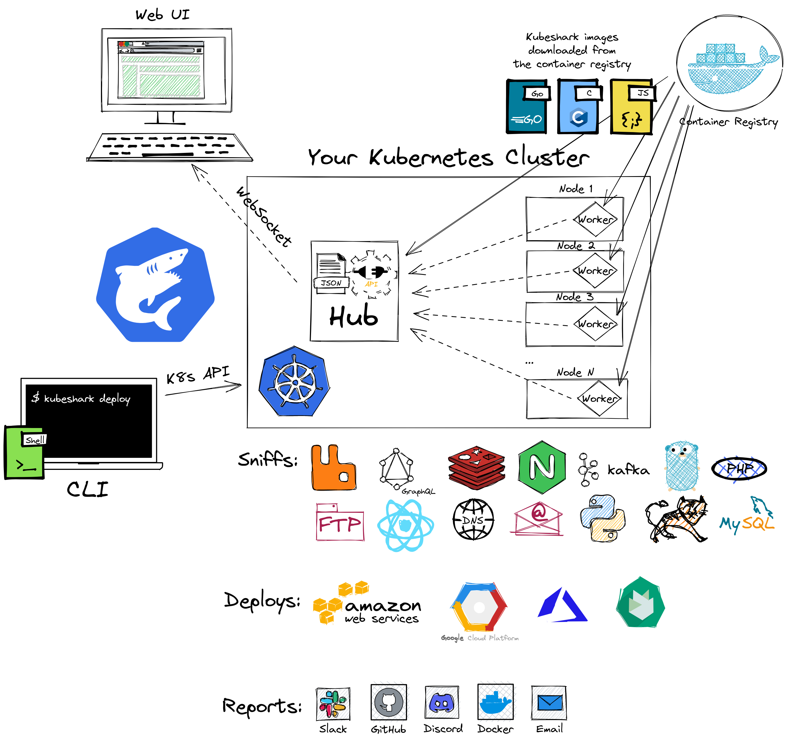
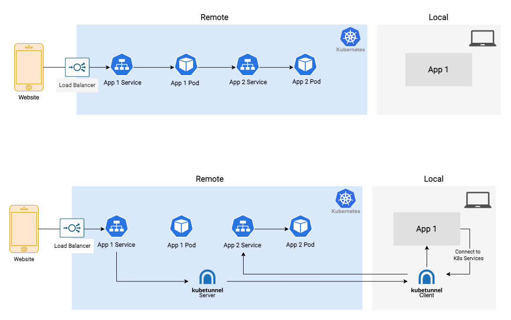

# [k8s] Useful kubernetes utility
> date - 2021.04.23  
> keyworkd - kubernetes, kubectl, k8s, krew, kubectx, kubens  
> kubernetes cluster 사용시(deploy, secure, monitor...)에 유용한 tool 정리  

<br>

## Toc
* [krew](#krew)
* [kubectx + kubens](#kubectx-+-kubens)
* [kubeswitch](#kubeswitch)
* [kube-ps1](#kube-ps1)
* [kubectl-aliases](#kubectl-aliases)
* [kubectl-neat](#kubectl-neat)
* [Kubetail](#kubetail)
* [Kube No Trouble - kubent](#kube-no-trouble---kubent)
* [kubectl-view-secret](#kubectl-view-secret)
* [kubectl-whoami](#kubectl-whoami)
* [kube-lineage](#kube-lineage)
* [kube-tree](#kube-tree)
* [실습하기에 좋은 무료 서비스](#실습하기에-좋은-무료-서비스)
* [kubeshark](#kubeshark)
* [kubectl-graph](#kube-graph)
* [KubeTunnel](#kubetunnel)

<br>

## krew
* [krew](./krew.md) 참고


<br>

## kubectx + kubens
* `kubectl config(kubectl config current-context)` command를 사용하여 context, namespace를 전환하는 것은 귀찮음이 따르지만 `kubectx`, `kubens`를 사용하면 편리하다
* kubectx - kubectl context를 관리하고 전환하는 tool
* kubens - Kubernetes namespace를 전환하는 tool

<br>

### Install
* kubectl plugins
```sh
$ kubectl krew install ctx
$ kubectl krew install ns
```
> shell completion script는 설치되지 않으니 필요하다면 다른 방법 이용

<br>

* Homebrew
```sh
$ brew install kubectx
```

<br>

### Usage
* kubectx
```sh
USAGE:
  kubectx                   : list the contexts
  kubectx <NAME>            : switch to context <NAME>
  kubectx -                 : switch to the previous context
  kubectx -c, --current     : show the current context name
  kubectx <NEW_NAME>=<NAME> : rename context <NAME> to <NEW_NAME>
  kubectx <NEW_NAME>=.      : rename current-context to <NEW_NAME>
  kubectx -d <NAME>         : delete context <NAME> ('.' for current-context)
                              (this command won't delete the user/cluster entry
                              that is used by the context)
  kubectx -u, --unset       : unset the current context

## example
$ kubectx 
oregon
minikube

$ kubectx minikube
Switched to context "minikube".

$ kubectx -
Switched to context "oregon".

$ kubectx dublin=gke_ahmetb_europe-west1-b_dublin
Context "dublin" set.
Aliased "gke_ahmetb_europe-west1-b_dublin" as "dublin".
```

<br>

* kubens
```sh
USAGE:
  kubens                    : list the namespaces
  kubens <NAME>             : change the active namespace
  kubens -                  : switch to the previous namespace
  kubens -c, --current      : show the current namespace

## example
$ kubens
default
kube-public
kube-system

$ kubens kube-system        
Context "oregon" modified.
Active namespace is "kube-system".
```

<br>

### Interactive mode
* [fzf](https://github.com/junegunn/fzf) 사용
* `fzf`를 사용하지 않으려면 `KUBECTX_IGNORE_FZF=1` environment variable을 설정
* `fzf`를 이용한 interactive mode를 유지하며 display만 필요한 경우 아래처럼 사용
```sh
$ kubectx | cat
```


<br>

## kubeswitch
* kubectx의 대체품으로 설계되어 모든 kubeconfig 파일에 대한 단일 창
* context를 전역적으로 변경하는 kubectx와 다르게 터미널마다 context 유지

### Install
```sh
$ brew install danielfoehrkn/switch/switch

## add .zshrc
$ INSTALLATION_PATH=$(brew --prefix switch) && source $INSTALLATION_PATH/switch.sh
```

<br>

### Usage
* change context
```sh
$ switch
```

* chage namesapce
```sh
$ switch ns
```

<br>

### kubectx vs kubeswitch
* kubeswitch는 kubectx + kubens 보다 기능이 많아서 더 유용하다

| | kubectx | kubeswitch |
|:--:|:--:|:--:|
| Context search | O | O |
| Multiple kubeconfig | X | O |
| Config alias | O | O |
| Multiple terminal | X | O |


<br>

## kube-ps1
* kubectl에 구성된 Kubernetes context, namespace를 prompt에 추가할 수 있는 script
* 여러 cluster 사용시 prompt에서 현재 context를 직관적으로 확인할 수 있어서 유용
```sh
$ (⎈ |minikube:default) 
```

<br>

### Install
```sh
$ brew install kube-ps1

$ cat >> ~/.zshrc << EOF
source "/usr/local/opt/kube-ps1/share/kube-ps1.sh"
PS1='$(kube_ps1)'$PS1
EOF
```


<br>

## kubectl-aliases
* kubectl에 대한 `alias`를 생성하는 script

<br>

### Install
```sh
$ curl -sS -o ~/.kubectl_aliases https://raw.githubusercontent.com/ahmetb/kubectl-aliases/master/.kubectl_aliases

$ cat >> ~/.zshrc << EOF
[ -f ~/.kubectl_aliases ] && source ~/.kubectl_aliases
function kubectl() { echo "+ kubectl $@">&2; command kubectl $@; }
EOF
```

<br>

### Syntax explanation
| Category | Keyword | Description |
|:--|:--|:--|
| | k | kubectl |
| | sys | --namespace kube-system |
| commands | g | get |
| | d | describe |
| | rm | delete |
| | a | apply -f |
| | ak | apply -k |
| | k | kustomize |
| | ex | exec -i -t |
| | lo | logs -f |
| resources | po | pod |
| | dep | deployment |
| | ing | ingress |
| | svc | service |
| | cm | configmap |
| | sec | secret |
| | ns | namespace |
| | no | node |
| flags | oyaml | -o yaml |
| | ojson | -o json |
| | owide | -o wide |
| | all | --all or --all-namespaces depending on the command |
| | sl | --show-labels |
| | w | -w/--watch |
| value flags<br>(should be at the end) | n | -n/--namespace |
| | f | -f/--filename |
| | l | -l/--selector |

<br>

### Examples
```sh
alias k='kubectl'
alias kg='kubectl get'
alias kgpo='kubectl get pod'

alias ksysgpo='kubectl --namespace=kube-system get pod'

alias krm='kubectl delete'
alias krmf='kubectl delete -f'
alias krming='kubectl delete ingress'
alias krmingl='kubectl delete ingress -l'
alias krmingall='kubectl delete ingress --all-namespaces'

alias kgsvcoyaml='kubectl get service -o=yaml'
alias kgsvcwn='watch kubectl get service --namespace'
alias kgsvcslwn='watch kubectl get service --show-labels --namespace'

alias kgwf='watch kubectl get -f'
...
```


<br>

## kubectl-neat
* Kubernetes manifests에서 일부 정보를 제거해 readability를 향상시켜주는 tool

<br>

### Install
```sh
$ kubectl krew install neat
```

<br>

### Examples
```sh
$ kubectl get pod [pod name] -o yaml | kubectl neat

$ kubectl get pod [pod name] -o yaml | kubectl neat -o json

$ kubectl neat get -- pod [pod name] -o yaml

$ kubectl neat get -- svc -n default [service name] -o json
```


<br>

## Kubetail
* 여러 Pod의 log를 하나의 stream으로 aggregate(tail/follow)할 수 있는 script
* `kubectl logs -f`를 실행하는 것과 동일하지만 여러 Pod에 적용된다

<br>

### Install
```sh
$ brew tap johanhaleby/kubetail && brew install kubetail
```

<br>

### Examples
```sh
$ kubetail app1

$ kubetail app1 -c container1

$ kubetail app1,app2

$ kubetail "^app1|.*my-demo.*" --regex

$ kubetail app2 -c container1 -n namespace1
```


<br>

## Kube No Trouble - kubent
* Easily check your cluster for use of deprecated APIs
* cluster upgrade 전에 API version 확인하여 조치하기에 유용하다
* 리소스 배포 방법에 따라 사용되지 않는 deprecated API를 감지
  * file - local manifests(yaml, json)
  * kubectl - `kubectl.kubernetes.io/last-applied-configuration` annotation
  * Helm v2 - `Tiller` manifests(Secret, ConfigMap)
  * Helm v3 - `Helm` manifests(Secret, ConfigMap)

<br>

### Install
```sh
$ sh -c "$(curl -sSL https://git.io/install-kubent)"

>>> kubent installation script <<<
> Detecting latest version
> Downloading version 0.4.0
> Done. kubent was installed to /usr/local/bin/..
```

<br>

### Usage
* kubectl의 current-context에 대하여 `kubent`가 동작
```sh
$ ./kubent

10:58AM INF >>> Kube No Trouble `kubent` <<<
10:58AM INF version 0.4.0 (git sha 3d82a3f0714c97035c27374854703256b3d69125)
10:58AM INF Initializing collectors and retrieving data
10:58AM INF Retrieved 199 resources from collector name=Cluster
10:58AM INF Retrieved 0 resources from collector name="Helm v2"
10:58AM INF Retrieved 0 resources from collector name="Helm v3"
10:58AM INF Loaded ruleset name=custom.rego.tmpl
10:58AM INF Loaded ruleset name=deprecated-1-16.rego
10:58AM INF Loaded ruleset name=deprecated-1-22.rego
...
```

#### Use in CI
* CI에서 아래의 script로 실행
```sh
if ! OUTPUT="$(kubent)"; then       # check for non-zero return code first
  echo "kubent failed to run!"
elif [ -n "${OUTPUT}" ]; then       # check for empty stdout
  echo "Deprecated resources found"
fi
```


<br>

## kubectl-view-secret
* easy secret decoding

secret 확인시 다음의 번거로운 절차가 필요 없다
1. `kubectl get secret <secret> -o yaml`
2. Copy base64 encoded secret
3. `echo "b64string" | base64 -d `

<br>

### Install
```sh
$ kubectl krew install view-secret
```

<br>

### Usage
* print secret keys
```sh
$ kubectl view-secret <secret>

## example
$ kubectl view-secret cry-panda-mariadb

Multiple sub keys found. Specify another argument, one of:
-> mariadb-password
-> mariadb-root-password
```

* decode specific entry
```sh
$ kubectl view-secret <secret> <key>

## example
$ kubectl view-secret cry-panda-mariadb mariadb-password

8NnXey6nED
```

* decode all contents
```sh
$ kubectl view-secret <secret> -a/--all

## example
$ kubectl view-secret cry-panda-mariadb -a

mariadb-password=8NnXey6nED
mariadb-root-password=6CvYS8fqzc
```

* 다른 namespace 사용
```sh
$ kubectl view-secret <secret> -n/--namespace <namespace>
```

* 다른 context 사용
```sh
$ kubectl view-secret <secret> -c/--context <context>
```

*  다른 kubeconfig 사용
```sh
$ kubectl view-secret <secret> -k/--kubeconfig <kubeconfig>
```

* suppress info output
```sh
$ kubectl view-secret <secret> -q/--quit
```


<br>

## kubectl-whoami
* show the subject that's currently authenticated as
* OIDC provider를 통해 인증시에 subject 확인시에 유용

<br>

### Install
```sh
$ kubectl krew install whoami
```

<br>

### Usage
```sh
$ kubectl whoami

kubecfg:certauth:admin
```

* 다른 context에서 확인
```sh
$ kubectl whoami --context <context>

## example
$ kubectl whoami --context docker-desktop

kubecfg:certauth:admin
```

* service account token 사용
```sh
$ kubectl whoami --token <token>
```


<br>

## kube-lineage
* A CLI tool to display all dependencies or dependents of an object in a Kubernetes cluster


<br>

### Install
```sh
$ kubectl krew install lineage
```

<br>

### Usage
* `ClusterRole`의 dependency 조회
```sh
$ kubectl lineage clusterrole [ClusterRole name]

## example
## -o, --oupput - wide | split | split-wide
$ kubectl lineage clusterrole system:metrics-server -o wide
NAMESPACE     NAME                                                     READY   STATUS    AGE    RELATIONSHIPS
              ClusterRole/system:metrics-server                        -                 100d   []
              └── ClusterRoleBinding/system:metrics-server             -                 100d   [RoleBindingRole]
...
```

* `Pod`의 dependency 조회
```sh
$ $ kubectl lineage pod [Pod name]

## example
## --dependencies, -D - list object dependencies instead of dependents. not support helm
$ kubectl lineage pod coredns-6fb4cf484b-8bmpz -D
NAMESPACE     NAME                                                                 READY   STATUS         AGE
kube-system   Pod/coredns-6fb4cf484b-8bmpz                                         1/1     Running        100d
              ├── Node/ip-10-xxx-xxx-xxx.ap-xxxxx-x.compute.internal               True    KubeletReady   100d
...
```

* `Helm Release`의 dependency 조회
```sh
$ $ kubectl lineage helm [Helm Release name]

## example
$ kubectl lineage helm kube-state-metrics -n monitoring-system
NAMESPACE           NAME                                                             READY   STATUS     AGE
monitoring-system   kube-state-metrics                                               True    Deployed   25m
                    ├── ClusterRole/kube-state-metrics                               -                  25m
                    │   └── ClusterRoleBinding/kube-state-metrics                    -                  25m
monitoring-system   │       └── ServiceAccount/kube-state-metrics                    -                  25m
...
```

* `Deployment`의 dependency 조회
```sh
$ kubectl lineage deploy/[Deployment name] 

## example
$ kubectl lineage deploy/coredns -o split --show-group
NAME                      READY   UP-TO-DATE   AVAILABLE   AGE
deployment.apps/coredns   2/2     2            2           100d
...
```


<br>

## kube-tree
* browse Kubernetes object hierarchies as a tree
* [kube-lineage](https://github.com/tohjustin/kube-lineage)와 비슷하지만 ownerReference를 통해 Kubernetes objcet 간의 관계를 탐색

<br>

### Install
```sh
$ kubectl krew install tree
```

<br>

### Usage
* Deployment 조회
```sh
$ kubectl tree deployment [deployment name]

## example
$ kubectlr tree deployment app
NAMESPACE  NAME                          READY  REASON  AGE
default    Deployment/app                -              507d
default    ├─ReplicaSet/app-6d56795c89   -              25h
default    ├─ReplicaSet/app-6f9f5bd5d5   -              22h
default      ├─Pod/app-6f9f5bd5d5-262jl  True           22h
default      └─Pod/app-6f9f5bd5d5-d4q7w  True           22h
```


<br>

## 실습하기에 좋은 무료 서비스
* [Kubernetes Interactive Tutorial](https://kubernetes.io/docs/tutorials/kubernetes-basics/create-cluster/cluster-interactive)
* [Okteto starter plan](https://cloud.okteto.com)


<br>

## kubeshark
* Kubernetes용 API Traffic Viewer
* eBPF를 이용하여 cluster 내부의 container와 Pod 간에 ingress/egress API traffic과 payload에 대한 visibility 제공
  * HTTP/1, HTTP/2, AMQP, Apache KAfka, Redis, gRPC over HTTP/2, GraphQL over HTTP/1.1 & HTTP/2
* Chrome Dev Toos + TCPDump + Wireshark 조합이라고 생각하면 된다
* 유사한 tool로 [Caretta](https://github.com/groundcover-com/caretta), [k8spacket](https://github.com/k8spacket/k8spacket)가 있으며 이 둘은 Grafana를 연동할 수 있다

<br>

### Architecture
* CLI + Hub + Worker로 구성

<div align="center">
  
</div>

#### [CLI](https://github.com/kubeshark/kubeshark) 
* k8s API를 통해 cluster와 통신하는 client로 Hub를 배포하는데 사용

#### [Hub](https://github.com/kubeshark/hub)
* cluster에 배포되는 Pod로 worker deployment를 조율하며, worker에서 스니핑 & 해부된 정보를 수신하여 중앙에 수집하여 웹 브라우저에 표시
* [WebSocket](https://developer.mozilla.org/en-US/docs/Web/API/WebSockets_API)으로 worker와 통신

#### [Worker](https://github.com/kubeshark/worker)
* cluster의 모든 node가 kubeshark에 포함되도록 하기 위해 `DaemonSet`으로 배포
* network sniffer, kernel tracing 등이 구현되어 있으며, WebSocket으로 수집된 traffic을 Hub에 전송

<br>

### Install
```sh
$ sh <(curl -Ls https://kubeshark.co/install)
```

<br>

### Usage
* 현재 namespace의 API traffic을 real time으로 streaming
```sh
$ kubeshark tap
```

* 특정 Pod에 사용
```sh
$ kubeshark tap [pod name]

## example
$ kubeshark tap catalogue-b87b45784-sxc8q
```

* regex로 여러 Pod에 사용
```sh
$ kubeshark tap "[regex]"

## example
$ kubeshark tap "(catalo*|front-end*)"
```

* Namespace에 사용
```sh
$ kubeshark tap -n "[namespace]"
```

* 모든 namespace에 사용
```sh
$ kubeshark tap -A
```

* Clean Up
```sh
$ kubeshark clean

## only a certain namespace
$ kubeshark clean -n [namespace]
```


<br>

## kube-graph
* Visualize Kubernetes resource & relationship
* 시각화를 위해 [Graphviz](https://graphviz.org), [Neo4j](https://neo4j.com), [ArangoDB](https://www.arangodb.com) 필요

<br>

### Install
```sh
$ kubectl krew install graph
```

<br>

### Usage
* Graphviz를 사용하여 시각화

```sh
$ kubectl graph pods --field-selector status.phase=Running -n kube-system | dot -T svg -o pods.svg

$ open pods.svg
```

<br>

## KubeTunnel
* Kubernetes에 연결된 상태에서 local에서 선호하는 IDE로 개발할 때 사용
* container build/push/deploy를 기다릴 필요 없는 빠른 개발 가능
* local에서 실행할 수 없는 대규모 시스템에서 쉽게 개발할 수 있다
* kubetunnel Pod를 생성하고 모든 트래픽이 해당 Pod로 이동하도록 Service 변경, Pod를 통해 트래픽이 local로 전달
<div align="center">
  
</div>

<br>

### Install
```sh
$ brew tap we-dcode/tap
$ brew install kubetunnel
```

<br>

### Usage
#### 1. Installing the Operator
```sh
$ kubetunnel install 
```

#### 2. create tunnel
```sh
$ sudo -E kubetunnel create-tunnel -p '8080:80' <service name>
```

#### 3. cleanup
```sh
$ kubectl get kubetunnel -n <requested namespace>
$ kubectl delete kubetunnel <name>

## uninstall operator
$ helm ls -n <operator-namespace>
$ helm uninstall <release-name> -n <operator-namespace>
```


<br>

## [kubectl-view-utilization](https://github.com/etopeter/kubectl-view-utilization)
* cluster resource 사용률을 보여주는 plugin
* bash + awk + kubectl로 동작
* cluster capacity를 추정하고 overprovisioned resource를 확인시 사용

<br>

### Install
```sh
$ kubectl krew install view-utilization

## brew
$ brew tap etopeter/tap
$ brew install kubectl-view-utilization
```

<br>

### Usage
* 기본적으로 current context에서 동작하며 `--context`로 context를 변경할 수 있다
```sh
$ kubectl view-utilization
Resource      Requests  %Requests        Limits  %Limits   Allocatable   Schedulable         Free
CPU              54822         69         18053       22         79100         24278        24278
Memory    214502998016         66  229927550976       71  321488551936  106985553920  91561000960
```
* Allocatable - 할당 가능한 resource
* Schedulable(= allocatable - requests) - pod schedule에 사용할 수 있는 resource

#### readable format
```sh
$ kubectl view-utilization -h
Resource   Req   %R   Lim   %L  Alloc  Sched  Free
CPU         54  69%    18  22%     79     24    24
Memory    200G  66%  214G  71%   299G   100G   85G
```

#### label filter
* `topology.kubernetes.io/zone=ap-northeast-2a` label로 조회
```sh
$ kubectl view-utilization -h -l topology.kubernetes.io/zone=ap-northeast-2a
Resource  Req   %R  Lim   %L  Alloc  Sched  Free
CPU        12  54%  5.5  23%     23     10    10
Memory    47G  52%  51G  56%    90G    43G   39G
```

#### nodes 별 조회
```sh
$ kubectl view-utilization nodes
CPU   : ▂▁▂▁▂▂▂▁▃▃
Memory: ▅▆▂▇▇▇▆▇▅▂
                                                  CPU                                   Memory
Node                                              Requests  %Requests  Limits  %Limits     Requests  %Requests       Limits  %Limits
ip-10-0-0-16.ap-northeast-1.compute.internal      2125         26    3400       42   6315573248         19   8642363392       26
...
```

#### namespaces 별 조회
```sh
$ kubectl view-utilization namespaces -h
             CPU        Memory
Namespace     Req  Lim   Req   Lim
analitics     6.6   10   14G   21G
kube-system   3.5  4.2  5.1G  7.6G
lt             13   21   27G   42G
monitoring   0.35  3.5  1.8G  3.5G
qa             13   21   27G   42G
rc            6.6   10   14G   21G
```

#### json format으로 조회
```sh
$ kubectl view-utilization -o json
{
  "CPU": {
    "requested": 43740,
    "limits": 71281,
    "allocatable": 60800,
    "schedulable": 17060,
    "free": 0
  },
  "Memory": {
    "requested": 94942265344,
    "limits": 148056834048,
    "allocatable": 254661525504,
    "schedulable": 159719260160,
    "free": 106604691456
  }
}
```

<br><br>

> #### Reference
> * [Useful Tools for Better Kubernetes Development](https://blog.usejournal.com/useful-tools-for-better-kubernetes-development-87820c2b9435)
> * [ahmetb/kubectx - GitHub](https://github.com/ahmetb/kubectx)
> * [jonmosco/kube-ps1 - GitHub](https://github.com/jonmosco/kube-ps1)
> * [ahmetb/kubectl-aliases - GitHub](https://github.com/ahmetb/kubectl-aliases)
> * [itaysk/kubectl-neat - GitHub](https://github.com/itaysk/kubectl-neat)
> * [johanhaleby/kubetail - GitHub](https://github.com/johanhaleby/kubetail)
> * [doitintl/kube-no-trouble - GitHub](https://github.com/doitintl/kube-no-trouble)
> * [elsesiy/kubectl-view-secret - GitHub](https://github.com/elsesiy/kubectl-view-secret)
> * [rajatjindal/kubectl-whoami - GitHub](https://github.com/rajatjindal/kubectl-whoami)
> * [tohjustin/kube-lineage - GitHub](https://github.com/tohjustin/kube-lineage)
> * [ahmetb/kubectl-tree - GitHub](https://github.com/ahmetb/kubectl-tree)
> * [kubeshark/kubeshark - GitHub](https://github.com/kubeshark/kubeshark)
> * [kubectl-graph](https://github.com/steveteuber/kubectl-graph)
> * [Best three tools for working with many Kubernetes contexts](https://home.robusta.dev/blog/switching-kubernets-context)
> * [kubeswitch](https://github.com/danielfoehrKn/kubeswitch)
> * [we-dcode/kubetunnel - GitHub](https://github.com/we-dcode/kubetunnel)
> * [groundcover-com/caretta - GitHub](https://github.com/groundcover-com/caretta)
> * [k8spacket - GitHub](https://github.com/k8spacket/k8spacket)
> * [etopeter/kubectl-view-utilization - GitHub](https://github.com/etopeter/kubectl-view-utilization)
