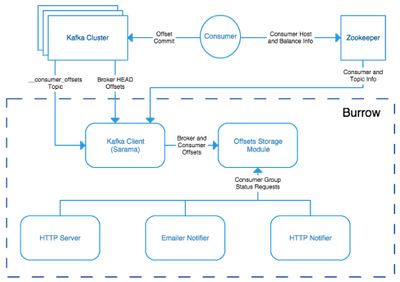

# [Kafka] Burrow - Kafka Consumer Lag Checking
> date - 2021.11.17  
> keyworkd - kubernetes, kafka, lag  
> kafka consumer lag checking을 위한 burrow에 대해 정리

<br>

## Burrow란?
* Apache Kafka Consumer lag checking을 위한 monitoring OSS
* thresholds가 아닌 sliding window로 lag을 평가

<br>

### Consumer Lag?
* broker에 저장된 data와 consumer가 처리한 data의 차이를 나타내는 지표
* Lag이 증가한다는 것은 consumer throughput에 이슈가 있다는 것을 의미한다
* kafka의 `__consumer_offsets` topic을 consum하면 어떤 consumer group이 어느 offset까지 처리했는지 알 수 있다


<br>

## Burrow Design
burrow는 module식 설계로 아래와 같은 구조를 가진다

<div align="center">
  
</div>

* Clusters
  * 주기적으로 topic list, partition에 대한 HEAD(latest) offset을 가져오는 kafka client를 실행
* Consumers
  * repository(kafka의 `__consumer_offsets` topic, zookeeper 등)에서 consumer group에 대한 정보를 가져온다
* Storage
  * 모든 정보를 burrow에 저장
* Evaluator
  * [consumer lag evaluation rules](https://github.com/linkedin/Burrow/wiki/Consumer-Lag-Evaluation-Rules)에 따라 consumer group lag을 평가
* Notifier
  * 조건에 맞으면 notify(email, http 등)
* HTTP Server
  * [HTTP Endpoint](https://github.com/linkedin/Burrow/wiki/HTTP-Endpoint) 제공


<br>

## Getting Started
* [Dockerfile](https://github.com/linkedin/Burrow/blob/master/Dockerfile)로 build한 image를 [config/burrow.toml](https://github.com/linkedin/Burrow/blob/v1.3.6/config/burrow.toml), [Configuration](https://github.com/linkedin/Burrow/wiki/Configuration)를 참고하여 k8s에 배포

```yaml
apiVersion: apps/v1
kind: Deployment
...
      containers:
        - name: burrow
          image: my-image/burrow:1.3.6
          ports:
            - name: burrow-port
              containerPort: 8000
          readinessProbe:
            httpGet:
              port: burrow-port
              path: /burrow/admin
          livenessProbe:
            httpGet:
              port: burrow-port
              path: /burrow/admin
          volumeMounts:
            - name: burrow-config
              mountPath: /etc/burrow/burrow.toml
              subPath: burrow.toml
              readOnly: true
      volumes:
        - name: burrow-config
          configMap:
            name: burrow-config
---
apiVersion: v1
kind: ConfigMap
metadata:
  name: burrow-config
...
data:
  burrow.toml: |-
    [general]
    ...

    [logging]
    ...

    [zookeeper]
    servers=["zookeeper-0:2181", "zookeeper-1:2181", "zookeeper-2:2181"]
    ...

    [client-profile.test]
    client-id="burrow-test"
    kafka-version="0.10.0"

    [cluster.test]
    class-name="kafka"
    servers=["broker-0:9092", "broker-1:9092", "broker-2:9092"]
    client-profile="test"
    ...

    [consumer.test]
    class-name="kafka"
    cluster="test"
    servers=["broker-0:9092", "broker-1:9092", "broker-2:9092"]
    client-profile="test"
    offsets-topic="__consumer_offsets"
    ...

    [httpserver.default]
    address=":8000"
    ...
```

* Call Burrow API 
```sh
$ curl http://burrow-url:8000/v3/kafka
```

<br><br>

> #### Reference
> * [linkedin/Burrow - GitHub](https://github.com/linkedin/Burrow)
> * [Monitoring Kafka with Burrow - Part 1](https://community.cloudera.com/t5/Community-Articles/Monitoring-Kafka-with-Burrow-Part-1/ta-p/245987)
