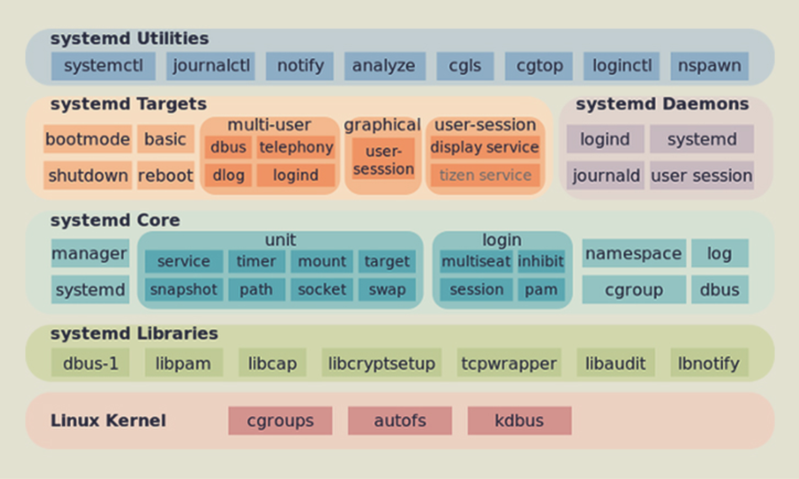
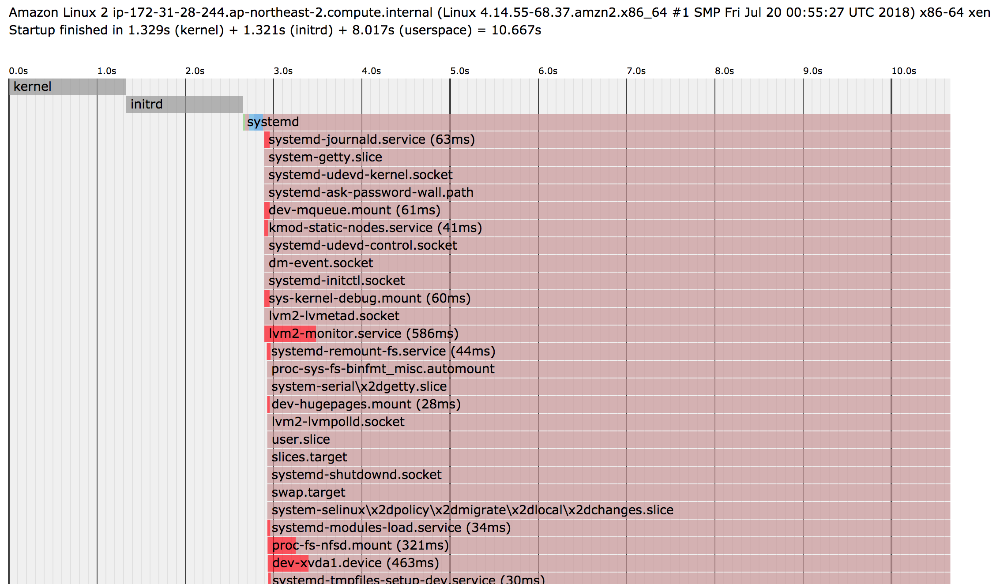

# [Linux] systemctl
> date - 2018.08.06    
> keyword - linux, systemctl
> chkconfig에 대해 정리하다가 알게된 systemctl에 정리

<br>

```sh
# Amazon Linix 2 AMI
$ sudo chkconfig nginx on
알림: 'systemctl enable nginx.service'에 요청을 전송하고 있습니다.
Created symlink from
/etc/systemd/system/multi-user.target.wants/nginx.service to /usr/lib/systemd/system/nginx.service.
```
* Amazon Linix 2 AMI에서는 chkconfig 사용시 `systemctl`로 전송해준다

<br>

## systemctl이란?
* 오랫동안 daemon이라는 background 프로그램은 inits cript를 사용해 구동해왔다
  * init script는 읽고 해석, 변경에 어려움이 있다
* RHEL 7/CentOS 7에 도입된 [Systemd](https://github.com/systemd/systemd)라는 서비스 관리 애플리케이션이 init script를 대체
  * 최신 리눅스 배포판에서는 필요한 서비스를 시작하는 역할은 systemd가 맡고 있을 가능성이 높다
* systemd를 관리하는 명령어가 `systemctl`



### Linux의 기본 뼈대 프로세스
* Linux는 OS라서 부팅되는 과정에서 리눅스 커널이 부팅된 후 `시스템을 초기화`하고 기타 서비스들을 위한 `환경을 조성하고, 시작`시켜주는 일을 하는 process가 필요
* CentOS 6까지는 SysV라고 해서 init process가 담당
  * 커널이 메모리에 로딩되면 가장 먼저 실행되는 process로 init process를 실행
  * init process는 init script, init 설정 등을 기반으로 RunLevel이나 각 서비스별 실행 스크립트를 실행
* RHEL 7/CentOS 7에서부터 SysV의 init 프로세스를 버리고 systemd로 변경


### Systemd가 제공하는 기능
* 시스템 부팅 프로세스
* Service Management
* cgroup을 이용한 프로세스 자원관리
* 서비스 프로세스 관리
* Performance Management
  * profiles
  * tuning
  * optimized

> daemon 프로그램들을 위한 로깅, 자원할당, 부팅관리 등 Systemd로 모두 할 수 있디

<br>

> #### Systemd의 가장 큰 불만 중 하나는..?
> * 할 수 있는 일이 너무 많다는 것
> * 보통 유닉스 프로그램은 보통 1가지 일을 하되, 아주 잘하는 것을 목표로 만들어진다

---

<br>

## Service Management

### Unit
* `systemd`에서 작업 대상
* systemd가 관리하는 방법을 알고 있는 리소스
* 나타내는 리소스 유형으로 분류되며 단위 파일로 알려진 파일로 정의
* 유형은 파일 끝에 있는 접미어에서 유추할 수 있다
  * 서비스 관리 작업의 경우 `.service`
* 서비스 관리 명령을 사용할 때 `.service` 생략 가능

```sh
# 아래 2개는 같다
$ systemctl start nginx.service
$ systemctl start nginx  # .service 생략
```


### 주요 명령어
* systemctl
* systemd-analyze
* systemd-cgls
* systemd-cgtop
* systemd-loginctl


### 실행중인 서비스 조회하기
```sh
$ systemctl list-units --type=service  # or $ systemctl

# example
$ systemctl list-units --type=service

UNIT                             LOAD   ACTIVE SUB     DESCRIPTION
amazon-ssm-agent.service         loaded active running amazon-ssm-agent
atd.service                      loaded active running Job spooling tools
auditd.service                   loaded active running Security Auditing Service
chronyd.service                  loaded active running NTP client/server
cloud-config.service             loaded active exited  Apply the settings specified in
cloud-final.service              loaded active exited  Execute cloud user/final scripts
cloud-init-local.service         loaded active exited  Initial cloud-ini
...

LOAD   = Reflects whether the unit definition was properly loaded.
ACTIVE = The high-level unit activation state, i.e. generalization of SUB.
SUB    = The low-level unit activation state, values depend on unit type.

43 loaded units listed. Pass --all to see loaded but inactive units, too.
To show all installed unit files use 'systemctl list-unit-files'.
```


### 서비스 상태 확인하기
```sh
$ systemctl status <service name>

# example
$ systemctl status nginx.service
● nginx.service - The nginx HTTP and reverse proxy server
   Loaded: loaded (/usr/lib/systemd/system/nginx.service; enabled; vendor preset: disabled)
   Active: active (running) since 수 2018-08-15 04:04:53 UTC; 8min ago
  Process: 3080 ExecStart=/usr/sbin/nginx (code=exited, status=0/SUCCESS)
  Process: 3061 ExecStartPre=/usr/sbin/nginx -t (code=exited, status=0/SUCCESS)
  Process: 3058 ExecStartPre=/usr/bin/rm -f /run/nginx.pid (code=exited, status=0/SUCCESS)
 Main PID: 3086 (nginx)
   CGroup: /system.slice/nginx.service
           ├─3086 nginx: master process /usr/sbin/nginx
           └─3087 nginx: worker process

 8월 15 04:04:53 ip-172-31-28-244.ap-northeast-2.compute.internal systemd[1]: Start...
 8월 15 04:04:53 ip-172-31-28-244.ap-northeast-2.compute.internal nginx[3061]: ngin...
 8월 15 04:04:53 ip-172-31-28-244.ap-northeast-2.compute.internal nginx[3061]: ngin...
 8월 15 04:04:53 ip-172-31-28-244.ap-northeast-2.compute.internal systemd[1]: Faile...
 8월 15 04:04:53 ip-172-31-28-244.ap-northeast-2.compute.internal systemd[1]: Start...
Hint: Some lines were ellipsized, use -l to show in full.
```


### 부팅시 서비스 활성화(자동 실행)
```sh
$ systemctl enable <service name>

# example
$ systemctl enable nginx.service
Failed to execute operation: The name org.freedesktop.PolicyKit1 was not provided by any .service files

# root 영역에 symlink를 생성하므로 sudo 권한 필요
$ sudo systemctl enable nginx.service
Created symlink from /etc/systemd/system/multi-user.target.wants/nginx.service to /usr/lib/systemd/system/nginx.service.

# 자동 시작을 위한 symlink가 생성되었다
$ ls -al /etc/systemd/system/multi-user.target.wants/ | grep nginx.service
lrwxrwxrwx  1 root root   37  8월  5 17:34 nginx.service -> /usr/lib/systemd/system/nginx.service

```
* 자동 시작을 위해 default target에 symlink가 생성


### 부팅시 서비스 비활성화(자동 실행 X)
```sh
$ systemctl disable <service name>

# example
$ systemctl disable nginx.service
Failed to execute operation: The name org.freedesktop.PolicyKit1 was not provided by any .service files

# root 영역의 symlink를 제거하므로 sudo 권한 필요
$ sudo systemctl disable nginx.service
Removed symlink /etc/systemd/system/multi-user.target.wants/nginx.service.
```
* `systemctl enable`로 생성된 symlink가 제거됨을 볼 수 있다


### 서비스 시작하기
```sh
$ systemctl start <service name>

# example
$ systemctl start nginx.service
Failed to start nginx.service: The name org.freedesktop.PolicyKit1 was not provided by any .service files
See system logs and 'systemctl status nginx.service' for details.

$ sudo systemctl start nginx.service  # sudo 필요
```


### 서비스 중지하기
```sh
$ systemctl stop <service name>

# example
$ systemctl stop nginx.service
Failed to stop nginx.service: The name org.freedesktop.PolicyKit1 was not provided by any .service files
See system logs and 'systemctl status nginx.service' for details.

$ sudo systemctl stop nginx.service  # sudo 필요
```


### 서비스 재시작하기
```sh
$ systemctl restart <service name>

# example
$ systemctl restart nginx.service
Failed to restart nginx.service: The name org.freedesktop.PolicyKit1 was not provided by any .service files
See system logs and 'systemctl status nginx.service' for details.

$ sudo systemctl restart nginx.service  # sudo 필요
```


### 서비스 리로드
```sh
$ systemctl reload <service name>

# example
$ systemctl reload nginx.service
Failed to restart nginx.service: The name org.freedesktop.PolicyKit1 was not provided by any .service files
See system logs and 'systemctl status nginx.service' for details

$ sudo systemctl reload nginx.service  # sudo 필요
```


### 서비스 리로드 or 재시작
* reload 기능이 있는지 확실하지 않으면 사용
* 가능한 경우 reload, 아니면 restart
```sh
$ systemctl reload-or-restart <service name>

# example
$ systemctl reload-or-restart nginx.service
Failed to reload-or-restart nginx.service: The name org.freedesktop.PolicyKit1 was not provided by any .service files
See system logs and 'systemctl status nginx.service' for details.

$ sudo systemctl reload-or-restart nginx.service  # sudo 필요
```


### 서비스 활성화 여부 조회
```sh
$ systemctl is-enabled <service name>

# example
$ systemctl is-enabled nginx.service
disabled
```


### 서비스 실행 여부 조회
```sh
$ systemctl is-active <service name>

# example
$ systemctl is-active nginx.service
active
```


### 서비스 실패 여부 확인
```sh
$ systemctl is-failed <service name>

# example
$ systemctl is-failed nginx.service
active
```


### systemd 재시작
```sh
$ systemctl daemon-reload
Failed to execute operation: The name org.freedesktop.PolicyKit1 was not provided by any .service files

$ sudo systemctl daemon-reload  # sudo 필요
```

> sudo 권한이 필요하다고, 명시적으로 알려주면 편했을거 같은데, apt, yum 등은 permission 문제라고 알려주는데...

---

<br>

## Unit Management

### active unit 조회
* active unit만 표시하므로 전부 loaded, active
```sh
$ systemctl list-units

UNIT                             LOAD   ACTIVE SUB       DESCRIPTION
proc-sys-fs-binfmt_misc.automount loaded active waiting   Arbitrary Executable File Forma
sys-devices-platform-serial8250-tty-ttyS1.device loaded active plugged   /sys/devices/pla
-.mount                          loaded active mounted   /
dev-mqueue.mount                 loaded active mounted   POSIX Message Queue File System
brandbot.path                    loaded active waiting   Flexible branding
chronyd.service                  loaded active running   NTP client/server
cloud-init.service               loaded active exited    Initial cloud-init
...
```
* UNIT
  * systemd unit name
* LOAD
  * unit의 설정이 systemd에 의해 파생되었는지 여부
  * 로드된 unit 구성은 메모리에 유지
* ACTIVE
  * 활성 상태 여부
* SUB
  * 자세한 정보를 나타내는 하위 레벨 상태
  * unit type, state, unit이 실행되는 실제 방법에 따라 다르다
* DESCRIPTION
  * 간단한 설명

### 현재 systemd가 로드한 모든 unit 조회
* 일부 장치는 실행 후 비활성화 상태가 되고 시스템에서 로드하려고 시도한 일부 장치는 발견되지 않을 수 있다
```sh
$ systemctl list-units --all

UNIT                             LOAD   ACTIVE SUB       DESCRIPTION
-.mount                        loaded    active   mounted   /
dev-mqueue.mount               loaded    active   mounted   POSIX Message Queue File Sy
proc-sys-fs-binfmt_misc.mount  loaded    inactive dead      Arbitrary Executable File F
sys-kernel-debug.mount         loaded    active   mounted   Debug File System
tmp.mount                      loaded    inactive dead      Temporary Directory
var-lib-nfs-rpc_pipefs.mount   loaded    active   mounted   RPC Pipe File System
systemd-ask-password-console.path loaded    inactive dead      Dispatch Password Reques
brandbot.service               loaded    inactive dead      Flexible Branding Service
chronyd.service                loaded    active   running   NTP client/server
```
* loaded, inactive인 것도 보인다


### systemd에서 사용 가능한 모든 unit 조회
* list-units은 systemd가 메모리로 로드한 unit만 표시
```sh
$ systemctl list-unit-files

# example
$ systemctl list-unit-files

UNIT FILE                                     STATE
dev-mqueue.mount                              static
crond.service                                 enabled
nginx.service                                 disabled
...
```
* UNIT FILE
  * systemd가 알고 있는 resource의 표현
* STATE
  * enabled - 활성화
  * disabled - 비활성화
  * static - unit을 enable시키는데 사용되는 install section이 없다
  * masked - 자동/수동으로 시작 불가능


### 구동에 실패한 unit 조회
```sh
$ systemctl list-units --state=failed  # systemctl --failed

0 loaded units listed. Pass --all to see loaded but inactive units, too.
To show all installed unit files use 'systemctl list-unit-files'.
```


### 모든 active unit 조회
```sh
$ systemctl list-units --state=active
UNIT                             LOAD   ACTIVE SUB       DESCRIPTION
-.mount                          loaded active mounted   /
dev-mqueue.mount                 loaded active mounted   POSIX Message Queue File System
...
```


### inactive unit 조회
```sh
$ systemctl list-units --all --state=inactive

 UNIT                             LOAD      ACTIVE   SUB  DESCRIPTION
  proc-sys-fs-binfmt_misc.mount    loaded    inactive dead Arbitrary Executable File Form
● display-manager.service          not-found inactive dead display-manager.service
  dm-event.service                 loaded    inactive dead Device-mapper event daemon
  dmraid-activation.service        loaded    inactive dead Activation of DM RAID sets
● exim.service                     not-found inactive dead exim.service
...
```


### running unit 조회
```sh
$ systemctl list-units --type=service --state=running
UNIT                       LOAD   ACTIVE SUB     DESCRIPTION
amazon-ssm-agent.service   loaded active running amazon-ssm-agent
atd.service                loaded active running Job spooling tools
auditd.service             loaded active running Security Auditing Service
chronyd.service            loaded active running NTP client/server
...

LOAD   = Reflects whether the unit definition was properly loaded.
ACTIVE = The high-level unit activation state, i.e. generalization of SUB.
SUB    = The low-level unit activation state, values depend on unit type.

20 loaded units listed. Pass --all to see loaded but inactive units, too.
To show all installed unit files use 'systemctl list-unit-files'.
```


### unit file 내용 확인
```sh
$ systemctl cat <service name>

# example
$ systemctl cat nginx.service

# /usr/lib/systemd/system/nginx.service
[Unit]
Description=The nginx HTTP and reverse proxy server
After=network.target remote-fs.target nss-lookup.target

[Service]
Type=forking
PIDFile=/run/nginx.pid
# Nginx will fail to start if /run/nginx.pid already exists but has the wrong
# SELinux context. This might happen when running `nginx -t` from the cmdline.
# https://bugzilla.redhat.com/show_bug.cgi?id=1268621
ExecStartPre=/usr/bin/rm -f /run/nginx.pid
ExecStartPre=/usr/sbin/nginx -t
ExecStart=/usr/sbin/nginx
ExecReload=/bin/kill -s HUP $MAINPID
KillSignal=SIGQUIT
TimeoutStopSec=5
KillMode=process
PrivateTmp=true

[Install]
WantedBy=multi-user.target
```


### unit 의존성 확인
* 각 unit은 서로간의 의존관계를 가지고 있다 
```sh
$ systemctl list-dependencies

default.target
● ├─display-manager.service
● ├─network.service
● ├─systemd-readahead-collect.service
● ├─systemd-readahead-replay.service
● ├─systemd-update-utmp-runlevel.service
● └─multi-user.target
●   ├─amazon-ssm-agent.service
●   ├─atd.service
●   ├─auditd.service
...
```

#### 특정 unit의 의존성 확인
* 특정 서비스에 대해 활성화된 서비스
```sh
$ systemctl list-dependencies <unit name>

# example
$ systemctl list-dependencies nginx.service

nginx.service
● ├─-.mount
● ├─system.slice
● └─basic.target
●   ├─rhel-autorelabel-mark.service
●   ├─rhel-autorelabel.service
●   ├─rhel-configure.service
●   ├─rhel-dmesg.service
●   ├─rhel-loadmodules.service
●   ├─selinux-policy-migrate-local-changes@targeted.service
●   ├─paths.target
●   ├─slices.target
...
```

#### 모든 종속성 unit 조회
```sh
$ systemctl list-dependencies --all <unit name>

# example
$ systemctl list-dependencies --all nginx.service

nginx.service
● ├─-.mount
● │ └─system.slice
● │   └─-.slice
● ├─system.slice
● │ └─-.slice
● └─basic.target
●   ├─rhel-autorelabel-mark.service
●   │ ├─system.slice
●   │ │ └─-.slice
●   │ └─local-fs.target
●   │   ├─-.mount
●   │   │ └─system.slice
●   │   │   └─-.slice
●   │   ├─rhel-import-state.service
...
```

#### 역방향 모든 종속성 unit 조회
```sh
$ systemctl list-dependencies --reverse <unit name>

# example
$ systemctl list-dependencies --reverse nginx.service
nginx.service

$ systemctl list-dependencies --reverse sockets.target
sockets.target
● └─basic.target
●   ├─amazon-ssm-agent.service
●   ├─atd.service
●   ├─brandbot.service
●   ├─chronyd.service
●   ├─nginx.service
...
```

#### 지정한 unit 이전에 시작하는 종속된 unit 조회
```sh
$ systemctl list-dependencies --before <unit name>

# example
$ systemctl list-dependencies --before nginx.service

nginx.service
● └─shutdown.target
●   ├─systemd-reboot.service
●   └─final.target
●     └─systemd-reboot.service
```

#### 지정한 unit 이후에 시작하는 종속된 unit 조회
```sh
$ systemctl list-dependencies --after <unit name>

# example
$ systemctl list-dependencies --after nginx.service

nginx.service
● ├─-.mount
● ├─system.slice
● ├─systemd-journald.socket
● ├─tmp.mount
● ├─basic.target
● │ ├─rhel-import-state.service
● │ ├─systemd-ask-password-plymouth.path
● │ ├─paths.target
● │ │ ├─brandbot.path
● │ │ ├─systemd-ask-password-console.path
● │ │ └─systemd-ask-password-wall.path
● │ ├─slices.target
...
```


### unit의 systemd 정보 확인
* low-level properties 조회
```sh
$ systemctl show <unit name>

# example
$ systemctl show nginx.service

Type=forking
Restart=no
PIDFile=/run/nginx.pid
NotifyAccess=none
RestartUSec=100ms
TimeoutStartUSec=1min 30s
TimeoutStopUSec=5s
WatchdogUSec=0
WatchdogTimestampMonotonic=0
StartLimitInterval=10000000
StartLimitBurst=5
StartLimitAction=none
...
```

#### 단일 property 표시
```sh
$ systemctl show <unit name> -p <property name>

# example
$ systemctl show nginx.service -p Type

Type=forking
```


### unit masking
* /dev/null에 링크하여 `자동/수동으로 완전히 시작 불가능`한 상태로 표시

```sh
$ systemctl mask <unit name>

# example
$ systemctl list-unit-files | grep nginx
nginx.service                                 disabled

$ sudo systemctl mask nginx.service  # sudo 필요

Created symlink from /etc/systemd/system/nginx.service to /dev/null.

# check
$ systemctl list-unit-files | grep nginx
nginx.service                          masked

# 시작하려고 하면
$ sudo systemctl start nginx.service
Failed to start nginx.service: Unit is masked.
```


### unit unmasking
```sh
$ systemctl unmask <unit name>

# example
$ sudo systemctl unmask nginx.service  # sudo 필요

Removed symlink /etc/systemd/system/nginx.service.
```

---

<br>

## Unit File 편집
* Systemd는 `/usr/lib/systemd/system`에 Unit File 보관
* 커스터마이징을 위해 해당 파일을 직접 수정하지 말고, `/etc/systemd/system/<unit name>.d`에 `.conf`로 끝나는 설정파일을 만들면 된다
* 이런 과정은 번거롭고, 실수도 많기 때문에 systemd에서 제공하는 기능을 사용하자

```sh
$ systemctl edit <unit name>

# example
$ sudo systemctl edit nginx.service
```
* 위 명령어는 다음을 수행
  1. `/etc/systemd/system/nginx.service.d` 생성
  2. 시스템에 등록된 편집기 오픈
  3. 내용을 입력하고 저장하면 1에서 생성한 디렉토리에 override.conf를 생성하고 내용을 읽는다
    * systemctl daemon-reload는 불필요
* /usr/lib/systemd/system/nginx.service Unit File 자체를 편집하고 싶다면 `-full`을 사용

```sh
$ systemctl edit <service name> --full

# example
$ sudo systemctl edit nginx.service --full  # sudo 필요
```

### 편집한 내용 제거
```sh
$ sudo rm -r /etc/systemd/system/nginx.servicd.d

# --full mode 내용 지우기
$ sudo rm /etc/systemd/system/nginx.service

# reload 필요
$ systemctl daemon-reload
```

### 수동으로 편집하기
```sh
$ sudo vi /usr/lib/systemd/system/nginx.service  # unit 내용 수정

$ sudo systemctl daemon-reload

$ sudo systemctl restart nginx
```

* `daemon-reload 없이 restart하면 변경 내용이 적용되지 않는다`
* daemon-reload는 unit을 reload/restart하지 않고 systemd가 변경을 인식하도록 한다
  * systemd의 모든 unit 파일이 reload되고 dependency tree가 다시 구성된다

---

<br>

## target 으로 System State(Runlevel) 조정하기

### target
* 시스템 상태, 동기화 지점을 설명하는 특수 unit file
* 동시에 서비스들을 시작하는 걸 허용하기 위한 그룹 메커니즘
  * unit을 grouping
  * target에 따라 부팅시 시작되는 unit이 달라진다
* 접미사 `.target` 사용
* 기존 SysV init의 run level과 같은 개념
* systemd의 default target은 `default.target`
  * 실제로는 다중 사용자 모드인 `multi-user.target`
* init system이 runlevel을 사용하는 것처럼 시스템을 특정 상태로 가져오기 위해 사용
* 특정 기능을 사용할 수 있는 경우 해당 상태를 생성하는데 필요한 unut 대신 원하는 상태 지정
  * ex) swap을 사용할 준비가 되었음을 나타내기 위해 사용하는 swap.target
    * 이 프로세스의 일부인 unit은 `WantedBy=`, `RequiredBy=swap.target`로 동기화 할수 있다
    * swap을 사용할 수 있어야 하는 unit은 `Wants=`, `Requires=`, `After=`로 조건을 지정해 관계를 나타낼 수 있다


### default target 조회
```sh
$ systemctl get-default

graphical.target
```

### target list 조회
* active target만 표시하므로 전부 loaded, active
```sh
$ systemctl list-units --type=target

UNIT                  LOAD   ACTIVE SUB    DESCRIPTION
basic.target          loaded active active Basic System
cloud-config.target   loaded active active Cloud-config availability
cloud-init.target     loaded active active Cloud-init target
cryptsetup.target     loaded active active Local Encrypted Volumes
getty.target          loaded active active Login Prompts
graphical.target      loaded active active Graphical Interface
local-fs-pre.target   loaded active active Local File Systems (Pre)
local-fs.target       loaded active active Local File Systems
multi-user.target     loaded active active Multi-User System
network-online.target loaded active active Network is Online
network-pre.target    loaded active active Network (Pre)
...
```


### 활성화 되지 않은 target(rescue, emergency 등) 리스트 조회
```sh
$ systemctl list-units --type=target --all
 UNIT                   LOAD      ACTIVE   SUB    DESCRIPTION
  basic.target           loaded    active   active Basic System
  cloud-config.target    loaded    active   active Cloud-config availability
  cloud-init.target      loaded    active   active Cloud-init target
  cryptsetup.target      loaded    active   active Local Encrypted Volumes
  emergency.target       loaded    inactive dead   Emergency Mode
  final.target           loaded    inactive dead   Final Step
  getty-pre.target       loaded    inactive dead   Login Prompts (Pre)
  getty.target           loaded    active   active Login Prompts
  graphical.target       loaded    active   active Graphical Interface
  local-fs-pre.target    loaded    active   active Local File Systems (Pre)
 ...

31 loaded units listed.
To show all installed unit files use 'systemctl list-unit-files'.
```


### default target 변경
```sh
$ systemctl set-default <target name>

# example
# 설치시 default target은 multi-user.target이며 부팅시 X-Windows로 로그인 하려면 graphical.target으로 설정
$ sudo systemctl set-default graphical.target

Removed symlink /etc/systemd/system/default.target.
Created symlink from /etc/systemd/system/default.target to /usr/lib/systemd/system/graphical.target.

$ systemctl get-default

graphical.target
```


### Isolating Target
* 관련된 모든 unit을 시작하고, 종속성 트리의 일부가 아닌 모든 unit을 중지할 수 있다
* 필요한 명령을 적절하게 분리하여 호출
* runleve을 변경하는 것과 유사

```sh
$ systemctl isolate <target name>

# example
$ sudo systemctl isolate runlevel3.target  # or multi-user.target

$ sudo systemctl isolate graphical.target  # or runlevel5.target
```

| Run Level | Target Units | Description |
|:--|:--|:--|
| 0 | runlevel0.target <br>poweroff.target | Shutdown and power off |
| 1 | runlevel1.target <br>rescue.target | Set up a rescue shell |
| 2, 3, 4 | runlevel[234].target <br>multi-user.target | Set up a nongraphical multi-user shell |
| 5 | runlevel5.target <br>graphical.target | Set up a graphical multi-user shell |
| 6 |runlevel6.target <br>reboot.target | Shutdown and reboot the system |

---

<br>

## 부팅 상태 분석
* systmed의 주요 기능 중 하나는 부팅 과정을 관리하고 정보를 제공하는 것

### 부팅 시간 정보
```sh
$ systemd-analyze

Startup finished in 1.329s (kernel) + 1.321s (initrd) + 8.017s (userspace) = 10.667s
```


### 부팅 과정에 각 서비스별 초기화하는데 걸린 시간
* 소요시간순으로 정렬해서 보여준다
```sh
$ systemd-analyze blame

2.871s update-motd.service
2.023s network.service
1.211s cloud-init.service
 870ms cloud-init-local.service
 819ms postfix.service
 734ms cloud-config.service
 599ms cloud-final.service
 586ms lvm2-monitor.service
 463ms dev-xvda1.device
 321ms proc-fs-nfsd.mount
 274ms systemd-journal-flush.service
 274ms systemd-udev-trigger.service
 271ms rhel-readonly.service
 219ms plymouth-quit.service
 214ms plymouth-quit-wait.service
 145ms systemd-udev-settle.service
  99ms gssproxy.service
  82ms chronyd.service
  76ms sshd.service
  75ms auditd.service
  75ms sysstat.service
  75ms rhel-dmesg.service
  64ms rpc-statd-notify.service
...    
```

### 부팅 과정 분석 html 파일로 덤프
* 부팅시 시간이 많이 걸리는 서비스들은 빨강색으로 표시
* 부팅 과정에서 소비되는 시간을 측정해 개선점을 찾게 해준다
```sh
$ systemd-analyze plot > plot.html

# example
$ systemd-analyze plot
<?xml version="1.0" standalone="no"?>
<!DOCTYPE svg PUBLIC "-//W3C//DTD SVG 1.1//EN" "http://www.w3.org/Graphics/SVG/1.1/DTD/svg11.dtd">
<svg width="1147px" height="2550px" version="1.1" xmlns="http://www.w3.org/2000/svg">
...
```

* plot.html



      
### 시간을 많이 잡아먹는 서비스들을 트리 형태로 조회
```sh
$ systemd-analyze critical-chain

The time after the unit is active or started is printed after the "@" character.
The time the unit takes to start is printed after the "+" character.

graphical.target @8.009s
└─multi-user.target @8.009s
  └─update-motd.service @5.137s +2.871s
    └─network-online.target @5.135s
      └─cloud-init.service @3.914s +1.211s
        └─network.service @1.889s +2.023s
          └─network-pre.target @1.889s
            └─cloud-init-local.service @1.019s +870ms
              └─basic.target @947ms
                └─paths.target @947ms
                  └─brandbot.path @947ms
                    └─sysinit.target @946ms
                      └─systemd-update-utmp.service @932ms +14ms
                        └─auditd.service @855ms +75ms
                          └─systemd-tmpfiles-setup.service @831ms +23ms
                            └─local-fs.target @831ms
                              └─local-fs-pre.target @831ms
                                └─lvm2-monitor.service @245ms +586ms
                                  └─lvm2-lvmetad.service @310ms
                                    └─lvm2-lvmetad.socket @244ms
                                      └─-.slice
```
* `@ <time>` - unit이 활성화, 시작된 후 시간
* `+ <time>` - unit이 시작될 때까지의 시간

#### 특정 서비스를 트리 형태로 조회
```sh
$ systemd-analyze critical-chain <unit naem>

# example
$ systemd-analyze critical-chain nginx.service

The time after the unit is active or started is printed after the "@" character.
The time the unit takes to start is printed after the "+" character.

nginx.service +183ms
└─network.target @3.913s
  └─network.service @1.889s +2.023s
    └─network-pre.target @1.889s
      └─cloud-init-local.service @1.019s +870ms
        └─basic.target @947ms
          └─paths.target @947ms
            └─brandbot.path @947ms
              └─sysinit.target @946ms
                └─systemd-update-utmp.service @932ms +14ms
                  └─auditd.service @855ms +75ms
                    └─systemd-tmpfiles-setup.service @831ms +23ms
                      └─local-fs.target @831ms
                        └─local-fs-pre.target @831ms
                          └─lvm2-monitor.service @245ms +586ms
                            └─lvm2-lvmetad.service @310ms
                              └─lvm2-lvmetad.socket @244ms
                                └─-.slice
```

---

<br>

## Using Shortcuts for Important Events

### rescue
* 시스템 복구 등의 이유로 single user mode로 진입할 필요가 있을 경우
```sh
$ sudo systemctl rescue

Broadcast message from ec2-user@ip-172-31-28-244.ap-northeast-2.compute.internal on pts/0 (수 2018-08-15 07:27:13 UTC):

The system is going down to rescue mode NOW!
```
> 그리고 접속이 끊겼다.. 그 후 접속이 안돼서 리부팅...


### emergency
* 파일 시스템이 깨졌다 등의 이유로 single user mode로 진입할 수 없을 떄
* emergency로 들어가면 부팅시 최소의 기능으로만 부팅(root 파일 시스템은 read only로 마운트, 다른 파일 시스템은 마운트를 안하는 등)하므로 응급 복구 가능
```sh
$ sudo systemctl emergency

Connection to xxx.xxx.xxx.xxx closed by remote host.
```
> 그리고 또 접속이 끊겼다...


### 시스템 정지
```sh
$ sudo systemctl halt

Connection to xxx.xxx.xxx.xxx closed by remote host.
```
> EC2 dashboard에서도 stop으로 변경됨을 볼 수 있었다


### 시스템 종료
```sh
$ sudo systemctl poweroff

Connection to xxx.xxx.xxx.xxx closed by remote host.
```
> EC2 dashboard에서도 stop으로 변경됨을 볼 수 있었다


### 시스템 재시작
```sh
$ sudo systemctl reboot  # or reboot

Connection to xxx.xxx.xxx.xxx closed by remote host.
```

---

<br>

### service와 systemctl 비교

| service | systemctl | 설명 |
|:--|:--|:--|
| service <service name> start | systemctl start <service name>.service | 서비스 시작 |
| service <service name> stop | systemctl stop <service name>.service | 서비스 중지 |
| service <service name> restart | systemctl restart <service name>.service | 서비스 재시작 |
| service <service name> condrestart | systemctl try-restart <service name>.service | 서비스가 구동중일 경우 재시작 |
| service <service name> reload | systemctl reload <service name>.service | 설정 재구동 |
| service <service name> status | systemctl status <service name>.service <br> systemctl is-active <service name>.service | 서비스 구동 여부 조회 |
| service --status-all | systemctl list-units --type service --all | 모든 서비스의 상태 조회 |

### chkconfig와 systemctl 비교
| chkconfig | systemctl | 설명 |
|:--|:--|:--|
| chkconfig <service name> on | systemctl enable <service name>.service | 서비스 활성화(부팅시 자동 구동) |
| chkconfig <service name> off | systemctl disable <service name>.service | 서비스 비활성화 |
| chkconfig --list <service name> | systemctl status <service name>.service <br> systemctl is-enabled <service name>.service | 서비스의 활성화 여부 조회 |
| chkconfig --list | systemctl list-unit-files --type service | 모든 서비스의 현재 활성화 여부 조회 |
| chkconfig --list | systemctl list-dependencies --after | 지정한 target 이후에 시작하는 서비스 조회 |
| chkconfig --list | systemctl list-dependencies --before | 지정한 target 이전에 시작하는 서비스 조회 |

---

<br>

## journalctl
* systemd-journald 를 제어하는 tool
* systemd의 서비스 로그를 확인할 수 있다
* `systemd-journald.service`를 통해 systemd의 정보를 이용

### 자세한 systemd error log 조회
```sh
$ journalctl -xn

-- Logs begin at 토 2018-08-04 01:36:46 UTC, end at 수 2018-08-15 08:03:44 UTC. --
 8월 15 08:03:31 ip-172-31-28-244.ap-northeast-2.compute.internal dhclient[2992]: XMT: So
 8월 15 08:03:36 ip-172-31-28-244.ap-northeast-2.compute.internal dhclient[2992]: XMT: So
 8월 15 08:03:44 ip-172-31-28-244.ap-northeast-2.compute.internal sshd[3232]: Accepted pu
 8월 15 08:03:44 ip-172-31-28-244.ap-northeast-2.compute.internal systemd[1]: Created sli
...
```

### 마지막 error log line 보기
```sh
$ journalctl -xe

-- now idle as services might still be busy with completing start-up.
--
-- Kernel start-up required 1121354 microseconds.
--
-- Initial RAM disk start-up required 1650662 microseconds.
--
-- Userspace start-up required 7513737 microseconds.
 8월 15 08:03:31 ip-172-31-28-244.ap-northeast-2.compute.internal dhclient[2992]: XMT: So
 8월 15 08:03:36 ip-172-31-28-244.ap-northeast-2.compute.internal dhclient[2992]: XMT: So
 8월 15 08:03:44 ip-172-31-28-244.ap-northeast-2.compute.internal sshd[3232]: Accepted pu
 8월 15 08:03:44 ip-172-31-28-244.ap-northeast-2.compute.internal systemd[1]: Created sli
...
```

### 짤리는 페이지 개행하기
```sh
$ journalctl -xn --no-pager | less

...
8월 15 08:03:44 ip-172-31-28-244.ap-northeast-2.compute.internal sshd[3232]: pam_unix(sshd:session): session opened for user ec2-user by (uid=0)
8월 15 08:03:44 ip-172-31-28-244.ap-northeast-2.compute.internal dhclient[2992]: XMT: Solicit on eth0, interval 16160ms.
8월 15 08:04:00 ip-172-31-28-244.ap-northeast-2.compute.internal dhclient[2992]: XMT: Solicit on eth0, interval 30960ms.
8월 15 08:04:31 ip-172-31-28-244.ap-northeast-2.compute.internal dhclient[2992]: XMT: Solicit on eth0, interval 59850ms.
8월 15 08:05:31 ip-172-31-28-244.ap-northeast-2.compute.internal dhclient[2992]: XMT: Solicit on eth0, interval 117800ms.
```

### unit의 log 조회
```sh
$ journalctl -u <unit>

## example
$ journalctl -u nginx.service
```

### 최근 log 조회
* `tail`처럼 결과를 확인할 수 있다
* default 10
```sh
$ journalctl -n <count>

## example - nginx unit의 최근 log 50줄 조회
$ journalctl -u nginx.service -n 50
```

### Following Logs
* `tail -f`처럼 결과를 확인할 수 있다
```sh
$ journalctl -f

## example - nginx unit의 최근 log 50줄을 following mode로 조회
$ journalctl -u nginx.service -n 50 -f
```

### 특정 level의 log 조회
* emerg
* alert
* crit
* err
* warning
* notice
* info
* debug

```sh
$ journalctl -p <level>

## example
$ journalctl -p crit
```

### 기간별 log 조회

#### 특정 기간 log 조회
* today
* yesterday
* tomorrow
```sh
$ journalctl --since=today

## example - nginx unit의 오늘 log 조회
$ journalctl -u nginx.service --since today
```

#### 일정 기간 사이의 log 조회
* 시간 생략시 `00:00:00`
```sh
$ journalctl --since "<start at>" --until "<end at>"

## example - 2018-12-03 07:30:00 ~ 2018-12-05 22:30:00의 log 조회
$ journalctl --since "2018-12-03 07:30:00" --until "2018-12-05 22:30:00"

$ journalctl --since "2018-12-03" --until "2018-12-05"
```

### 마지막 부팅 후 로그 조회
```sh
$ journalctl -b
```

### journalctl이 log를 위해 사용하는 disk 용량 조회
```sh
$ journalctl --disk-usage
```

### 오래된 log 삭제하기
* disk usage based delete
```sh
$ journalctl --vacuum-size=<size>

# 1GB를 차지하면 이전 항목 제거
$ journalctl --vacuum-size=1G
```

* time based delete
```sh
$ journalctl --vacuum-time=<time>

# 1년된 항목 제거
$ journalctl --vacuum-time=1years
```

---

<br><br>

> #### Reference
> * [How To Use Systemctl to Manage Systemd Services and Units](https://www.digitalocean.com/community/tutorials/how-to-use-systemctl-to-manage-systemd-services-and-units)
> * [CENTOS 7 SYSTEMD 이해하기](http://linux.systemv.pe.kr/centos-7-systemd-%EC%9D%B4%ED%95%B4%ED%95%98%EA%B8%B0/)
> * [red hat doc - systemd service](https://access.redhat.com/documentation/en-us/red_hat_enterprise_linux/7/html/system_administrators_guide/sect-managing_services_with_systemd-services)
> * [RHEL/CentOS 7 systemctl 사용법](https://www.lesstif.com/pages/viewpage.action?pageId=24445064)
> * [Do systemd unit files have to be reloaded when modified?](https://serverfault.com/questions/700862/do-systemd-unit-files-have-to-be-reloaded-when-modified)
> * [How To Use Journalctl to View and Manipulate Systemd Logs](https://www.digitalocean.com/community/tutorials/how-to-use-journalctl-to-view-and-manipulate-systemd-logs#active-process-monitoring)
* [systemd - System and Service Manager - Github](https://github.com/systemd/systemd)
* [Systemd Wiki](https://www.freedesktop.org/wiki/Software/systemd/)
