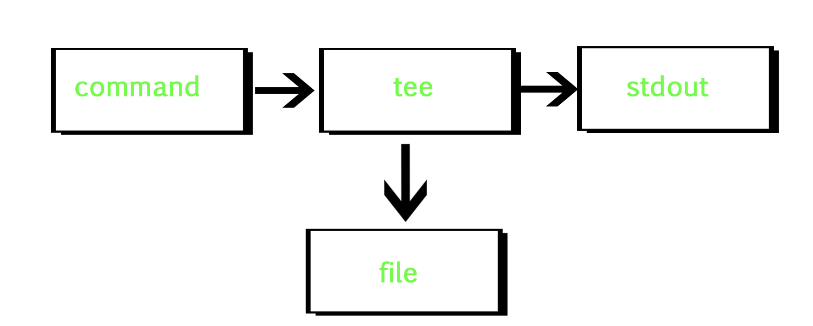

# [Linux] tee - pipe fitting
> date - 2021.06.29  
> keyworkd - linux, tee, stdout  
> tee command에 대해 정리  

<br>

## tee?
<div align="center">
  
</div>

* stdin을 stdout에 복사하여 0개 이상의 파일로 복사
* output은 buffering되지 않는다


<br>

### Usage
```sh
$ tee [-ai] [file ...]
```
* `-a` - append
* `-i` - ignore `SIGINT` signal


<br>

## Example

### stdout과 file로 출력
```sh
$ echo "hello" | tee hello.txt    
hello

$ ls
hello.txt
```

<br>

### multi line을 stdout과 file로 출력
```
$ tee tee-multiline.txt << EOF
Multi line test
1
2
3
EOF

Multi line test
1
2
3

$ ls
tee-multiline.txt
```

<br>

### 파일 복사
```sh
## overwrite
$ cat [source file] | tee [destination file]

## append
$ cat [source file] | tee -a [destination file]
```


<br><br>

> #### Reference
> * [tee (command) - WIKIPEDIA](https://en.wikipedia.org/wiki/Tee_(command))
