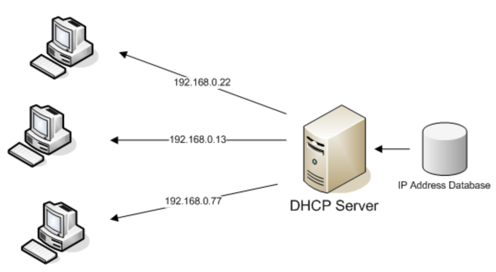
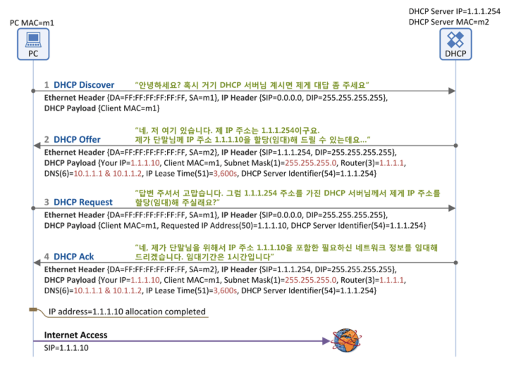

# [Network] About DHCP
> date - 2019.01.01  
> keyword - network, dhcp  
> Network에서 자주 접하는 DHCP에 대해 정리  

 

## DHCP(Dynamic Host Configuration Protocol)란?
* IP Network에 사용되는 Network Protocol
* 표준은 [RFC 2131](https://www.rfc-editor.org/info/rfc2131)에 명시
* IP 주소를 DHCP Server가 중앙집중식으로 관리하는 Client/Server 모델 사용

 

### IP Network란?
* DHCP Server가 IP 주소와 기타 정보를 다른 End Point와 효율적으로 연결하기 위해 네트워크의 각 호스트에 자동 할당하는 시스템
* IP 외에 subnet mask, Gateway 주소, DNS 주소 및 관련 설정 매개변수 값을 할당
* Device의 부팅 후 DHCP Server에 IP 주소를 요청하면 DHCP Server가 현재 사용 가능한 IP 주소를 배정
* 머신의 수가 많아지거나, 기존에 배정했던 IP를 사용하지 않게 되거나 하는 경우 IP 관리가 어렵기 때문에 DHCP를 통해 편리하게 관리할 수 있다

 

## DHCP 기본 원리
* DCHP를 통한 IP는 영구적으로 할당하는게 아니고 IP Lease Time을 통해 일정 기간 동안 Device가 IP를 사용하도록 한다
  * IP Lease Time 이후 사용하고자 한다면 IP Address Renewal을 DHCP로 요청
  * 사용안한다면 IP Address Release를 수행

 

### 1. DHCP Discover
* Client -> DHCP Server
* 동일 Subent에 broadcasting하여 DHCP Server를 찾는다
* 주요 파라미터
  * Client MAC

 

### 2. DHCP Offer
* DHCP Server -> Client
* DHCP Server가 Client에게 존재를 알림
  * 할당할 IP 등의 네트워크 정보 포함
* Client가 보낸 Broadcast Flag에 따라 `Broadcasting or Unicasting`
  * 1 - Broadcast
  * 0 - Unicast
* 주요 파라미터
  * Client MAC
  * Your IP - Client에 할당할 IP
  * Subnet Mask(Option 1)
  * Router(Option 3) - Client의 Gateway IP
  * DNS - DNS IP
  * IP Lease Time(Option 51) - Client가 IP를 사용할 수 있는 기간
  * DHCP Server Identifier(Option 54) - 2개 이상의 DHCP Server가 Offer를 보낼 수 있으므로 구분자로 DHCP Server의 IP를 전송

 

### 3. DHCP Request
* Client -> DHCP Server
* Broadcasting
* Client가 DHCP Server의 존재를 알고, 할당받을 Network 정보를 알았으니, DHCP Server를 선택해 Network 정보 할당 요청
* 주요 파라미터
  * Client MAC
  * Requested IP Address(Option 50) - 할당받을 IP, DHCP Offer의 Your IP
  * DHCP Server Identifier(Option 54)

 

### 4. DHCP Ack
* DHCP Server -> Client
* Client가 보낸 Broadcast Flag에 따라 `Broadcasting or Unicasting`
* DHCP Server가 Client에게 할당한 Network 정보를 전달해주는 메시지
* 주요 파라미터
  * DHCP Offer와 동일

 

## DHCP 구성 요소

### DHCP Server
* IP 및 관련 설정 정보를 보유한 Network Device
* 일반적으로 Router or Server

 

### DHCP Client
* DHCP Server에서 설정 정보를 받는 endpoint 
* PC, 모바일, IoT 등
* 보통 DHCP 정보를 자동으로 수신할 수 있도록 지원

 

### IP Address Pool
* DHCP Client에서 사용할 수 있는 IP의 범위
* 일반적으로 IP는 순차적으로 할당

 

### Subnet
* Subnet으로 IP Network를 관리할 수 있다

 

### Lease
* DHCP Client가 IP 정보를 보유할 수 있는 시간
* 만료시 Client가 갱신한다

 

### DHCP Relay
* Network에서 broadcast된 Client 메시지를 수신받은 뒤 설정된 Server로 전달하는 Router or Host
* 그후 Server는 Client에 Response를 전송하는 Relay Agent로 되돌려 보낸다
  * 각 Subnet에 서버를 보유하지 않고도 DHCP Server를 중앙 집중할 수 있다

 

## DHCP의 장점

### 정확한 IP 설정시 실수 최소화
* 직접 설정시 오타로 인한 실수 방지

 

### IP 충돌 감소
* IP는 Network에서 연결된 Device당 1개씩만 유효해야 한다
  * IP 중복시 충돌이 발생해 연결이 해제될 수 있다
* IP를 수동으로 할당시 중복으로 인한 충돌이 발생할 확률이 높은데 DHCP를 사용하면 방지할 수 있다
  * 어딘가에 기록하고 수동으로 관리하는 비용도 존재

 

### IP 관리 자동화
* 관리자가 수동으로 IP를 할당, 해제해야 하는데 어떤 Device가 어떤 IP를 사용하는지, 언제 사용을 안하는지 추적하기 어렵다
* DHCP는 단일지점에서 모든 Device를 관리할 수 있도록 자동화 및 중앙집중화해 준다

 

### 효율적인 변경 관리
* IP Address, 범위, End Point의 변경이 쉽다
* `DHCP를 사용하는 IP 지정 시스템 변경` 혹은 `Network Device Upgrade/교체`
  * 새로운 DHCP Server의 IP로 설정한뒤 전파하면 끝

 

## DHCP의 단점

### DHCP는 인증 X
* 어떤 Client도 접속할 수 있다
  * 비인증 Client에 IP 주소 할당 가능
* DHCP Server의 진본성 확인 수단 X

 

### 중앙집중식 Client/Server 모델로 인한 문제
* DHCP Server에 이상이 생기면 문제 발생
* DHCP Server 1대일 경우 SPOF(Single point of failure)가 된다

 

## DHCP 보안을 위한 방법
* Relay Agent Information Option
  * DHCP 메시지가 Network에 도착했을 때 태그화를 통해 Network Access를 관리
* NAC(Network Access Control) 사용

  

> #### Reference
> * ["IP 관리의 시작과 끝"··· DHCP의 정의·작동원리](http://www.ciokorea.com/t/22076/%EB%94%94%EC%A7%80%ED%84%B8%20%EB%94%94%EB%B0%94%EC%9D%B4%EC%8A%A4/39337)
> * [RFC 2131](https://www.rfc-editor.org/info/rfc2131)
> * [DHCP 프로토콜 기본 원리](https://www.netmanias.com/ko/post/blog/5348/dhcp-ip-allocation-network-protocol/understanding-the-basic-operations-of-dhcp)
