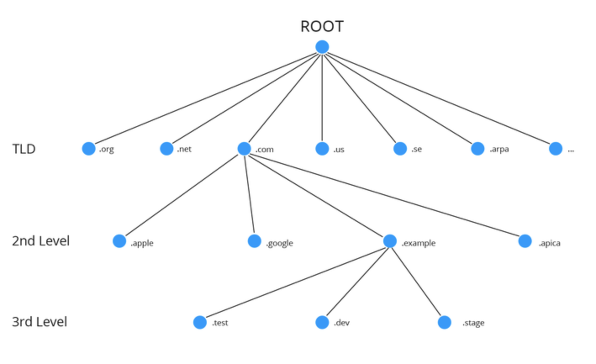
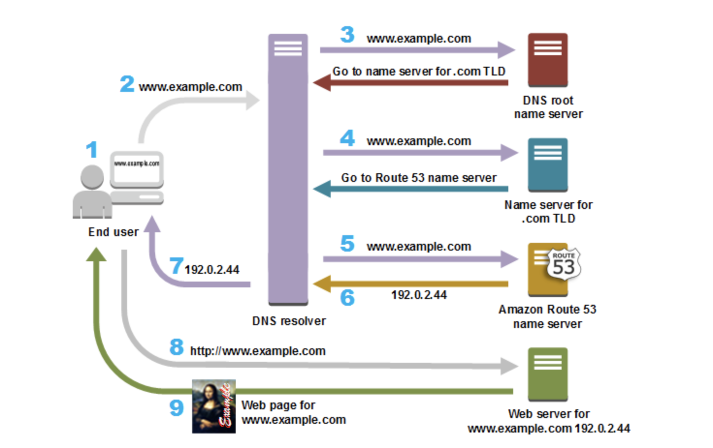

# [Network] About DNS
> date - 2019.06.02  
> keyword - network, dns, dns record  
> DNS에 대해 너무 막연하게 알고 있어서 DNS record마다의 차이도 잘 몰라서 이참에 DNS에 대해 알아보기로 함

<br>

## DNS(Domain Name System)란?
* 사람이 읽을 수 있는 domain name(e.g. www.google.com)을 머신이 읽을 수 있는 IP adress(e.g. 192.0.0.1)로 변환해 컴퓨터가 서로 통신할 수 있도록 한다
* 이름과 숫자 간의 매핑을 관리해 마치 전화번호부와 같은 기능을 한다
* domain name에 대한 IP address 요청을 **query**라고 부른다


<br>

## DNS 서비스 유형

### Authoritative DNS
* Public DNS name을 관리하는데 사용하는 업데이트 메커니즘을 제공
  * 이를 통해 DNS query에 응답해 domain name을 IP address로 변환
* domain에 대한 최종 권한이 있으며 `Recursive DNS` 서버에 IP address를 제공할 책임이 있다
  * e.g. AWS Route 53

<br>

### Recursive DNS
* Client는 `Authoritative DNS`에 직접 query를 하는 대신 recursive DNS(or resolver)에 연결하는 경우가 일반적
* DNS record를 소유하고 있지 않지만 **사용자 대신 DNS 정보를 가져올 수 있는 중간자 역할**을 한다
* **캐시**된 DNS 정보를 가지고 있는 경우 DNS query에 응답하고 아니라면 하나 이상의 `Authoritative DNS`에 query


<br>

## Domain name 체계
* 3 단계로 구분



<br>

### TLD(Top-Level Domain)
* 가장 높은 단계의 domain
* domain의 목적, 종류, 국가를 나타낸다
* 국제 인터넷주소 관리 기구인 ICANN(The Internet Corporation for Assigned Names and Numbers)에서 관리

| 이름 | 정의 | 설명 | 예시 |
|:--|:--|:--|:--|
| gTLD() | 일반 TLD | 전세계 누구나 사용 가능 | com, net, org |
| ccTLD() | 국가 코드 TLD | 국가/지역 등을 나타냄<br>해당 국가, 지역의 단체나 개인만 취득 가능 | kr, jp, cn |
| New gTLD() | 신규 일반 TLD | gTLD의 수량적 한계로 등장<br>브랜드명, 일반 명사 등 아무거나 사용 가능 | xyz, bar, actor |

<br>

### SLD(Second-Level Domain)
* domain name을 등록한 조직을 나타낸다
* e.g. ac, co

<br>

### Domain Name
* naver, google 등 임의로 지정할 수 있는 자율적인 이름
* e.g. naver.com(domain name.gTLD), ibk.co.kr(domain name.SLD.gTLD)


<br>

## DNS query flow



> Route 53일 경우에...

1. 사용자가 웹 브라우저의 주소 표시줄에 www.example.com을 입력
2. www.example.com에 대한 요청은 인터넷 케이블 공급업체 등의 인터넷 서비스 제공업체(ISP)가 관리하는 `DNS resolver`로 라우팅
  * local에 설정된 name server에 따라 다름
3. `DNS resolver`가 `root name server`에 전달하면 `root name server`는 .com `TLD name server`로 요청하라고 응답
4. `DNS resolver`가 .com `TLD name server`로 요청하면 .com `TLD name server`는 Route 53 name server로 요청하라고 응답
5. `DNS resolver`가 Route 53 name server에 요청
6. Route 53 name server는 IP address를 응답
7. `DNS resolver`는 IP address를 웹 브라우저로 반환하고 IP address를 TTL(Time to Live)동안 캐싱
8. 웹 브라우저는 `DNS resolver`로부터 얻은 IP address로 요청
9. 웹 서버는 요청에 대해 웹 페이지를 반환하고, 웹 브라우저는 이 페이지를 표시한다


<br>

## DNS record 종류
* Resource Record
  * domain name 또는 DNS Zone과 관련된 정보를 갖는 record
  * name, class, type, TTL, RD Length, RD(Resource Data)로 구성
* Query Record
  * name, class, type로 구성

<br>

| field | description |
|:--|:--|
| name | domain name |
| class | 인터넷 이외의 네트워크를 고려해 네트워크 식별용으로 사용<br>e.g. IN(인터넷) |
| type | 어떤 종류의 정보가 지원되는지를 나타낸다<br>e.g. A, CNAME, MX |

<br>

### A(Address Mapping records)
* host에 대한 IP address(IPv4)를 지정
* domain name을 IP address로 변환하는데 사용
  * e.g. a.com -> 192.23.22.1

```
브라우저: a.com의 IP address는?
name server: 11.22.33.44
```

<br>

### AAAA(IP Version 6 Address records)
* host에 대한 IP address(IPv6)를 지정
* A record와 같은 방식으로 동작하며 차이점은 IP address type


<br>

### CNAME(Canonical Name)
* original DNS query를 resolve하기 위해 query해야하는 domain name을 지정
* domain name의 **alias**를 만드는데 사용
  * e.g. a.com -> b.com
* 외부 domain을 alias로 만드는 경우 유용
* A record로 대체하면 performance overhead를 줄일 수 있다
  * A record보다 많은 데이터가 전송되기 때문

```
브라우저: b.com의 IP address는?
name server: a.com과 같습니다
브라우저: a.com의 IP address는?
name server: 11.22.33.44

or

브라우저: b.com의 IP address는?
name server: a.com과 같고, 11.22.33.44 입니다
```

#### Example. web server, name server, mail server 등이 하나의 IP address로 운영하는 경우

| name | type| value |
|:--|:--|:--|
| www.my.com | CNAME | my.com |
| ns.my.com | CNAME | my.com |
| mail.my.com | CNAME | my.com |
| my.com | A | 1.20.0.1 |

```
www.my.com ---> my.com ---> 1.20.0.1
ns.my.com ---> my.com ---> 1.20.0.1
mail.my.com ---> my.com ---> 1.20.0.1
```
* 각 도메인에 대해 my.com을 CNAME을 설정하면 IP address 변경시 my.com만 수정해주면 되니 관리하기 쉽다

<br>

### HINFO(Host Information)
* host에 대한 general information을 얻는데 사용
  * CPU 및 OS type
  * host간 통신에서 특정 OS protocol을 사용할 수 있는지에 대한 정보 제공
* public server에서는 보안 때문에 사용하지 않는다

<br>

### ISDN(Integrated Services Digital Network)
* host의 ISDN address를 지정
  * ISDN address - country code, national destination code, ISDN subscriber number 및 ISDN subaddress(optional)로 구성된 전화번호
* A record 기능의 변형이라고 생각하자

<br>

### MX(Mail exchanger)
* domain name에 mail exchange server를 지정
* SMTP(Simple Mail Transfer Protocol)에서 **mail을 적절한 host로 routing**하는데 사용
* 일반적으로 domain name에 둘 이상의 mail exchange server가 있으며 각 domain에 우선 순위가 설정되어 있다

```
# [priority] [mail server host name]

10 mailserver.example.com. 
20 mailserver2.example.com.
```

<br>

### NS(Name Server)
* host에 대한 authoritative name server를 지정

```
# [name server]

ns1.amazon.com 
ns2.amazon.org 
ns3.amazon.net 
ns4.amazon.co.uk
```

<br>

### PTR(Reverse-lookup Pointer records)
* forward DNS resolution(A, AAAA record)과 달리 IP address를 기반으로 domain name을 조회하는데 사용

<br>

### SOA(Start of Authority)
* DNS Zone의 core information을 지정
  * primary name server
  * email of domain administrator
  * domain serial number 
  * refreshing the zone과 관련된 여러 timer

```
# [authority-domain] [domain-of-zone-admin] [zone-serial-number] [refresh-time] [retry-time] [expire-time] [negative caching TTL] 

ns.example.net. hostmaster.example.com. 1 7200 900 1209600 86400
```

<br>

### TXT(Text)
* 비정형 임의의 텍스트 문자열을 저장
* SPF(Sender Policy Framework)에서 가짜 전자 메일이 보내지는 것을 막기 위해 사용
* DKIM(DomainKeys Identified Mail) 설정에도 사용

```
"google-site-verification=6P08Ow5E-8Q0m6vQ7FMAqAYIDprkVV8fUf_7hZ4Qvc8"
```


<br>

## Domain 관련 유용한 사이트
* [Whois](https://whois.kr/kor/main.jsp)
  * domain의 모든 정보 확인
* [Dig web Interface](https://digwebinterface.com/)
  * domain의 name server 정보 확인
* [Online DNS Record Viewer](http://dns-record-viewer.online-domain-tools.com/)
  * DNS record 정보 확인


<br><br>

> #### Reference
> * [DNS란 무엇입니까?](https://aws.amazon.com/ko/route53/what-is-dns/)
> * [List of DNS record types - Wikipedia](https://en.wikipedia.org/wiki/List_of_DNS_record_types)
> * [Online DNS Record Viewer](http://dns-record-viewer.online-domain-tools.com/)
