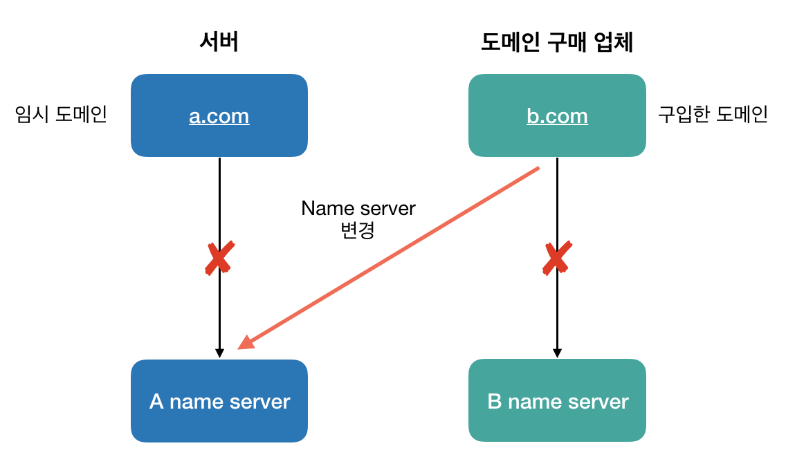

# [Network] 도메인 연결하기
> date - 2019.06.09  
> keyword - domain  
> 도메인과 서버를 다른 업체에서 사용하는 경우에는 **도메인 연결** 필요

 

## As-is
* 각자 name server를 사용

 

## To-be
* 2가지 방법이 있다

 

### 1. name server 변경
* 구입한 도메인이 사용하는 name server를 변경한다

* 일정 시간동안 도메인 연결이 원활하지 않을 수 있다
* 운영/관리 측면에서 효과적

> name server는 보통 1 ~ 4차까지 운영한다

 

### 2. 기존 name server에 정보 추가
* 구입한 도메인이 사용하는 name server를 변경하지 않고, 기존에 사용하던 name server 정보를 추가

* 도메인 연결 문제는 없다
* 운영/관리 측면에서 비효율적

 

## 검색에 영향을 주지 않고 site의 도메인 변경하기
1. 새로운 site에서 사용할 도메인 생성 후 연결
2. 구 site에서 새로운 site로 redirection(HTTP 301) 설정
  * SEO에 영향을 미치지 않기 위해
3. 새로운 site를 [Google Web Master Tool](https://search.google.com/search-console/about?hl=ko&utm_source=wmx&utm_medium=wmx-welcome)에 등록
4. [Google Web Master Tool](https://search.google.com/search-console/about?hl=ko&utm_source=wmx&utm_medium=wmx-welcome)에서 구 site에 대하여 **주소 변경** 신청
