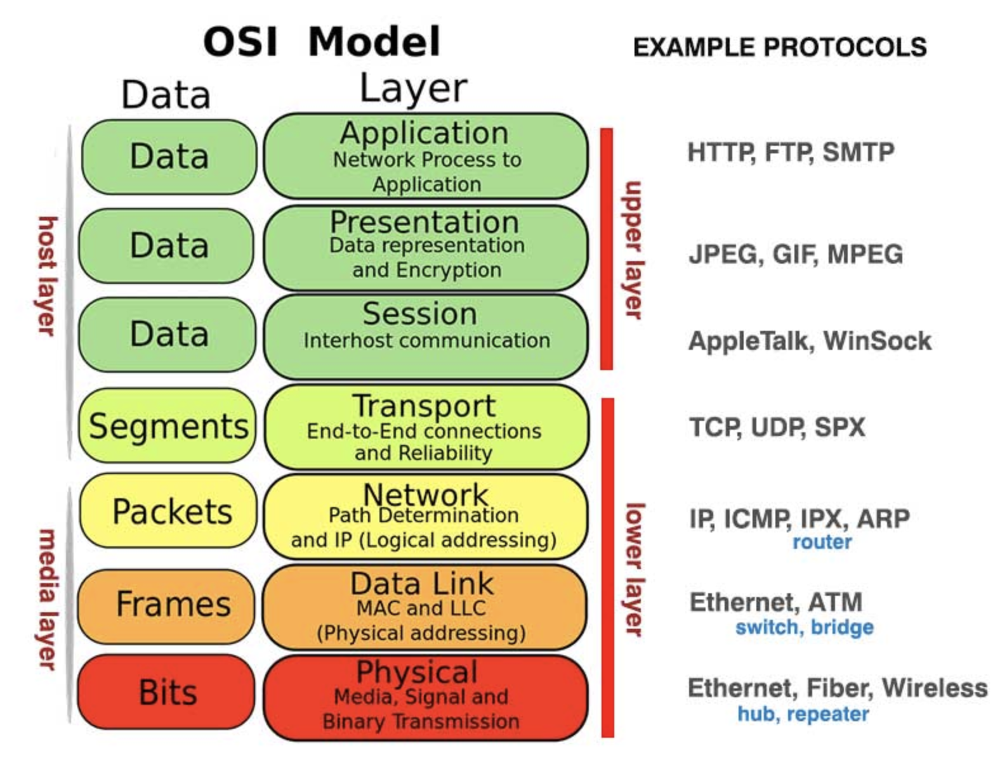

# [Network] ping
> date - 2018.11.19  
> keyword - ping, ICMP  
> 인터넷 연결을 확인할 때 자주 사용하는 ping에 대해 정리

 

## ping?
* ICMP(Internet Control Message Protocol) protocol을 사용
* 주로 IP를 가지고 있는 장비에 인터넷이 연결되어 있는지 확인할 때 사용
* ping 공격을 막으려면 firewall에서 IMCP를 막는다
  * ping으로 서버를 scan해서 target으로 잡을 수 있으므로 방지하는게 좋다

> `$ telnet <IP> <PORT>`도 많이 사용  
> ping이 되고 특정 port로 telnet이 안돼면 port가 막힌 것

 

## ICMP(Internet Control Message Protocol)란?

* host server와 internet gateway 사이의 연결을 확인하고 에러 메시지를 받을 때 사용하는 protocol
* 데이터를 주고 받거나 application을 위해 사용되지 않는다

 

## ping은 port를 사용할까?
* ping은 Network Layer의 ICMP protocol을 사용하기 때문에 상위 계층인 Transport Layer인 TCP/UDP의 port와는 관련이 없다
* 즉 ping에는 `port라는 개념이 없다`
