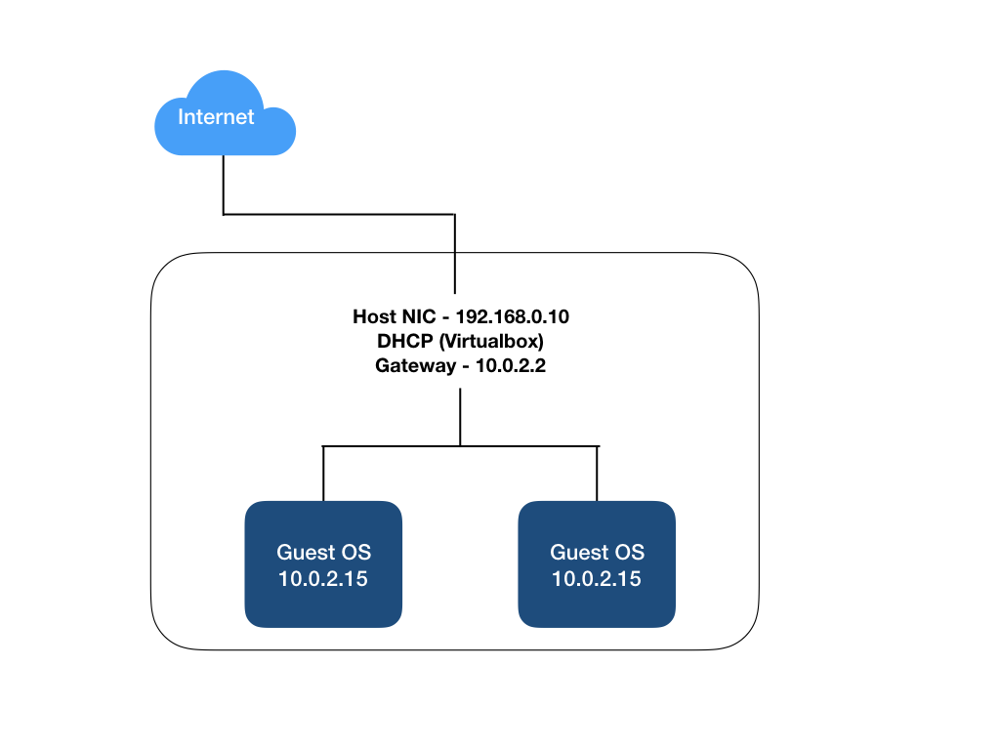
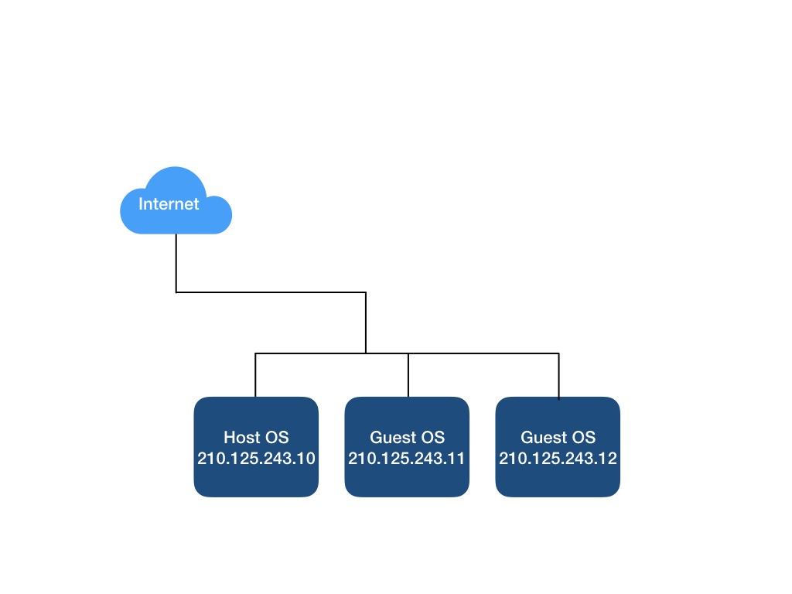
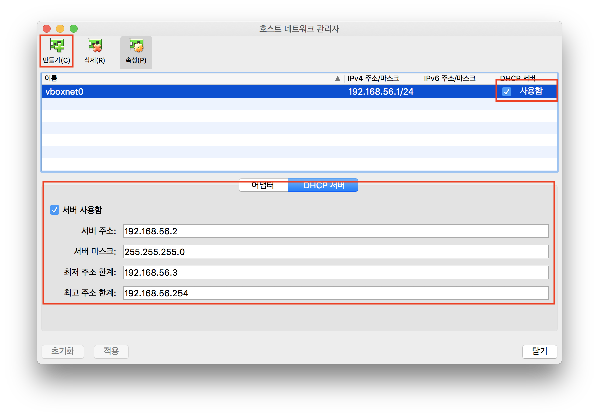
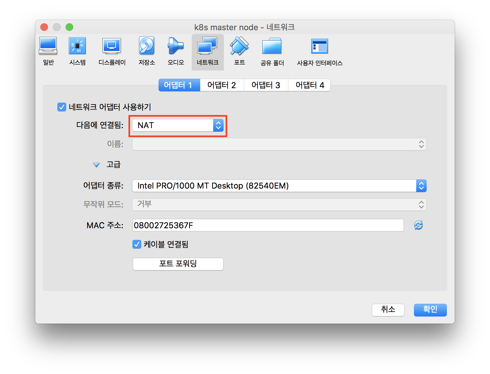
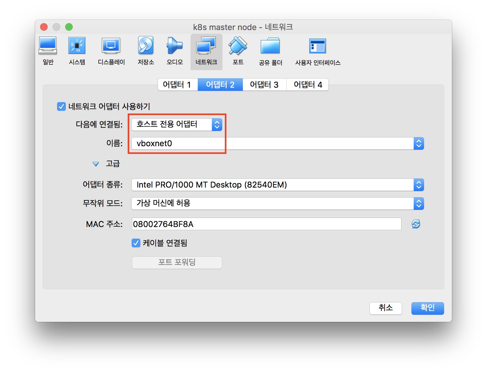
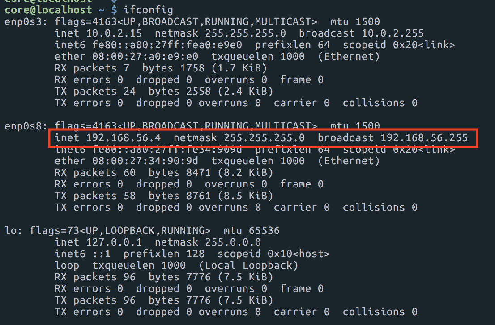

# [Network] VirtualBox Host OS, Guest OS와 통신하기
> date - 2018.12.22  
> keyword - virtual box, network  
> VirtualBox에 CoreOS와 kubeadm을 사용해 K8S cluster를 구성하던 중 master node에 join해야 하는데 네트워크 설정이 안돼어 있어서 Virtual Box에서 네트워크 설정하는 방법을 정리

<br>

## 설정해야 하는 이유
* VirtualBox가 제공하는 윈도우를 통해서 작업하는게 여간 불편한게 아니다
  * 무엇보다 가장 중요한 복붙이 안됀다
  * 미리 잘 짜놓은 스크립트를 일일이 타이핑할 수는 없지 않은가
* cluster에서는 Guest OS간 통신이 필요하다


<br>

## 네트워크 구성에 대해 이해를 해보자

### NAT(Network address translation)


* 네트워크 주소 변환
* IP 패킷의 TCP/UDP port와 source, destination의 IP address 등을 재기록하면서 라우터를 통해 네트워크 트래픽을 주고 받는 기술
* 패킷에 변화가 생기기 때문에 IP나 TCP/UDP의 checksum도 다시 계산되어 재기록 필요
* 각각의 Virtual Machine은 `각각의 Virtual Network에 할당`되어 10.0.2.2 라는 Gateway를 경유해 internet에 연결
  * 각각 독립적인 Network라서 DHCP 사용시 동일한 IP(10.0.2.15)를 할당 받는다
* 하나의 공유기에 연결된 머신처럼 `상호간의 연결을 지원하지 않는다`
  * Bridget, Internal, Host Only Network를 추가로 구성해 Guest OS간 연결 가능

#### NAT를 이용하는 이유?
* 사설 네트워크에 속한 여러개의 호스트가 하나의 Public IP address를 사용하여 인터넷에 접속하기 위함
* NAT가 혹스트 간의 통신에 있어서 복잡성을 증가시킬 수 있으므로 네트워크 성능에 영향을 줄 수 있다


<br>

### Bridget Networking


* 실제 Public IP를 여러개 부여 가능
* 외부 Gateway를 이용해 인터넷에 연결 가능
* 위 그림에서는 모든 Guest OS를 Host OS와 동일한 네트워크로 구성했으나, 격리된 네트워크 설계 가능


<br>

### Internal Networking


* vboxnet0로 격리된 네트워크로 동작
  * 필요시 vboxnet2 등 virtual network 추가 가능
* VM간 통신은 지원하면서 외부의 격리를 통해 보안 강화
* Host Network와 분리되어 동작하므로 Internet 연결 지원 X


<br>

### Host Only Networking


* Internal Networking과 비슷하지만 Host OS와 연결이 가능
* DHCP 설정 가능
* Host OS는 net0(실제 NIC)를 통해 Internet과 연결, net1(Virtual NIC)를 통해 Guest OS와 연결 가능
  * Guest OS는 Host와 연결이 가능하지만 Internet 연결은 불가능
  * Guest OS에 2개의 NIC를 부여해서 해결
    * NIC1 - nat
    * NIC2 - Host Only Networking


<br>

> #### NIC란?
> * Network Interface Card
> * Network 케이블을 연결하는 매개체 역할
>   * Network 케이블로부터 데이터 수신
>   * 케이블을 통해 데이터 전송
>   * 케이블과 컴퓨터 사이의 데이터 흐름 제어 


<br>

## DHCP로 Host OS에서 Guest OS로 접근 네트워크 설정
* `DHCP`, `Host Only Adapter`를 사용해서 Host OS에서 Guest OS로 접근
  * DHCP라서 IP가 자동으로 할당

### 1. Host Only Network 설정
* `메뉴 - 파일 - 호스트 네트워크 관리자`에서 추가한다



<br>

### 2. Guest OS에 Adapter 추가
* `설정 - 네트워크 - 어댑터`에서 설정한다




<br>

### 3. Guest OS에 접속하여 IP를 확인



<br>

### 4. 확인한 IP로 SSH 접근
```sh
## Host OS
$ ssh core@192.168.56.4

Last login: Sat Dec 22 05:58:18 UTC 2018 on tty1
Container Linux by CoreOS stable (1911.4.0)
Update Strategy: No Reboots
core@localhost ~ $
```

<br>

### 5. 위와 같은 방법으로 다른 Guest OS에도 같게 설정하면 Guest OS간에서도 통신이 가능하다

```sh
## Guest Os1 - 192.168.56.4
$ core@localhost ~ $ ssh core@192.168.56.3

Last login: Sat Dec 22 05:57:51 UTC 2018 on tty1
Container Linux by CoreOS stable (1911.4.0)
Update Strategy: No Reboots
core@localhost ~ $
```


<br>

## Static IP로 Host OS에서 Guest OS로 접근 네트워크 설정
TODO: 


<br><br>

> #### Reference
> * [버추얼박스 네트워크 이해 및 구성-완벽 가이드](http://solatech.tistory.com/263)
