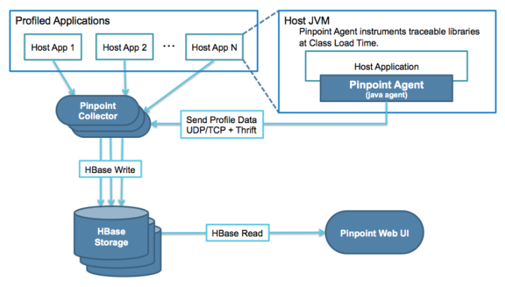
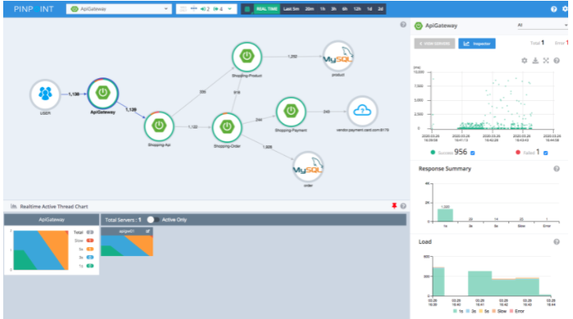
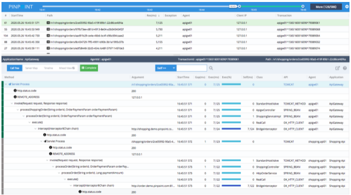
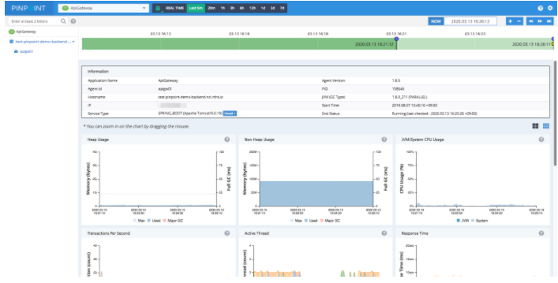

# [Pinpoint] About Pinpoint
> date - 2021.12.07  
> keyworkd - observability, apm, pinpoint  
> pinpoint에 대해 정리

 

## Pinpoint란?

  

서비스는 다양한 외부 서비스와의 통신을 통해 구성되고 각각의 transaction은 black box로 남겨진다  
Pinpoint는 이런 구성요소 간의 transaction flow를 추적하고 문제 영역과 잠재적인 bottleneck을 식별하기 위한 observability를 제공  

 

  

* ServerMap
  * component들의 연관 관계를 시각화
  * 각 노드를 클릭하면 현재 상태와 transaction count에 대한 세부 정보 표시
* Realtime Active Thread Chart
  * realtime으로 application 내부의 active thread를 monitoring
* Request/Response Scatter Chart
  * 시간 경과에 따른 traffic pattern을 시각화하여 잠재적인 문제를 식별
  * Drag시 call stack view로 이동

 

## CallStack

  

* distributed environment의 모든 transaction에 대해 code-level의 가시성을 확보
* transaction single view에서 bottlenecks과 points of failure를 식별

 

## Inspector

  

* CPU usage, memory/garbage collection, TPS, JVM arguments 등에 대한 세부 정보를 확인할 수 있다

  

> #### Reference
> * [Pinpoint Docs](https://pinpoint-apm.github.io/pinpoint/2.2.2/overview.html)
> * [대규모 분산 시스템 추적 플랫폼, Pinpoint - Naver D2](https://d2.naver.com/helloworld/1194202)
> * [pinpoint-apm/pinpoint - GitHub](https://github.com/pinpoint-apm/pinpoint)
> * [pinpoint-apm/pinpoint-docker - GitHub](https://github.com/pinpoint-apm/pinpoint-docker)
> * [pinpoint-apm/pinpoint-kubernetes - GitHub](https://github.com/pinpoint-apm/pinpoint-kubernetes)
