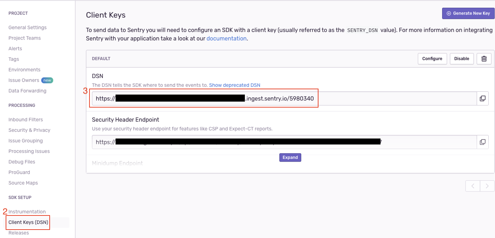
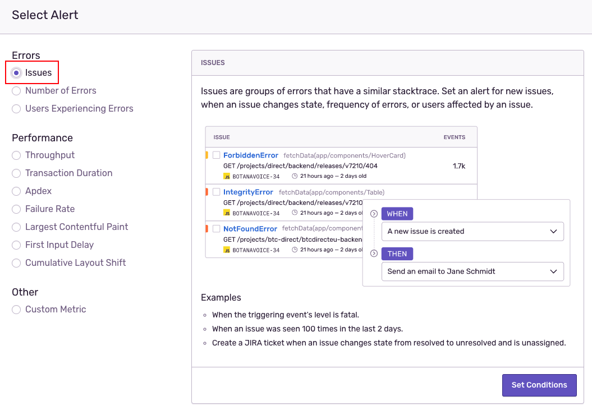
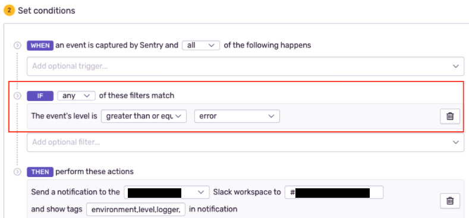

# [Sentry] Sentry integration Spring Boot
> date - 2021.10.17  
> keyworkd - sentry, spring boot, error monitoring  
> error tracing service인 sentry를 spring boot application에 연동하는 법을 정리  

<br>

## Sentry 란?
* error tracing service로 사용자가 경험한 모든 error 들을 수집 및 그룹화하고, 이를 통해 얼마나 자주 error가 발생하고 어디서 UX를 헤치는지 알 수 있게 된다
* 간편한 integration을 통해 사전에 파악 하지 못한 error tracking 가능
  * `Sentry.capture()`로 확인하고 싶은 부분만 확인 가능하나 시스템 전체 에러 error를 확인할 수 없고, 원하는 부분에 일일이 선언 필요
* 다양한 Sentry SDK를 통해 시스템의 error를 쉽게 sentry server로 전달하고 well-made sentry UI를 통해 효과적으로 분석할 수 있다
  * JavaScript, Python, Go, React, Django 등 다양한 언어 및 framework 지원
* [Breadcrumbs](https://docs.sentry.io/product/issues/issue-details/breadcrumbs/)로 사용자가 어떤 action flow(UI 클릭, ajax request 등)에서 에러가 발생했는지 파악 가능
* JavaScript라면 [Source Map](https://docs.sentry.io/platforms/javascript/sourcemaps/)으로 소스 코드의 어느 위치에서 에러가 발생했는지 상세하게 파악 가능
* tag를 활용하여 분류 및 검색 가능
  * key or tag에 environment를 추가하여 error가 어떤 실행 환경(tag: environment)에서 발생한 것인지 명시적으로 확인
    * Java - https://docs.sentry.io/clients/java/config/
  * error 검색시 tag 활용
* Issues 메뉴의 `Enable real-time updates` feature로 real time error 확인 가능


<br>

## 적용 방법
1. Sentry UI에서 project 생성
2. project에서 DSN(Data Source Name) 얻기
3. Logback + Spring Boot dependency 설정
4. Logback 설정 및 HTTP request data 수집을 위한 코드 설정

<br>

> #### Logback 사용 이유?
> ```java
> @Bean
> public HandlerExceptionResolver sentryExceptionResolver() {
>   return new io.sentry.spring.SentryExceptionResolver();
> }
> ```
> * io.sentry.spring.SentryExceptionResolver 설정시 controller가 던진 모든 error가 sentry server로 전달
> * handling exception도 sentry server에 전달되는 이슈가 있음
>   * unhandled exception의 error log를 logback으로 sentry server로 전달 O
>   * handled exception은 sentry server로  전달 X

<br>

### 1. Sentry UI에서 project 생성
* Projects > Create project

<br>

### 2. project에서 DSN(Data Source Name) 찾아서 환경 변수에 설정
* Settings > created project > Client Keys(DSN) > DSN 확인

<div align="center">
  
</div>

* Kubernetes Pod spec의 environment variable 설정
```yaml
...
  - name: SENTRY_DSN
    value: "https://xxxxxx.ingest.sentry.io/xxxxx"
  - name: SENTRY_ENVIRONMENT
    value: "development"
...
```

<br>

### 3. Logback + Spring Boot dependency 설정
* gradle dependency 추가
```gradle
sentryVersion=7.3.0

implementation "io.sentry:sentry-spring-boot-starter-jakarta:${sentryVersion}"
implementation "io.sentry:sentry-logback:${sentryVersion}"
```

#### Spring Boot 3.0 미만이면?
```gradle
implementation "io.sentry:sentry-spring-boot-starter:${sentryVersion}"
implementation "io.sentry:sentry-logback:${sentryVersion}"
```

#### Spring Boot 2.1 미만이면?
```gradle
compile 'io.sentry:sentry-spring:1.7.30'
compile 'io.sentry:sentry-logback:1.7.30'
```

<br>

### 4. Logback 설정 및 HTTP request data 수집을 위한 코드 설정
* logback-spring.xml
```xml
...
  <appender name="Sentry" class="io.sentry.logback.SentryAppender">
    <!-- Optionally change minimum Event level. Default for Events is ERROR -->
    <minimumEventLevel>ERROR</minimumEventLevel>

    <!-- Optionally change minimum Breadcrumbs level. Default for Breadcrumbs is INFO -->
    <minimumBreadcrumbLevel>INFO</minimumBreadcrumbLevel>
  </appender>

  <root level="info">
    <appender-ref ref="Console"/>
    <appender-ref ref="Sentry" />
  </root>
...
```
* minimumEventLevel
  * sentry에 전송되는 minimum event level
* minimumBreadcrumbLevel
  * event가 발생하기까지의 이동 경로
  * Breadcrumbs은 memory에 마지막 100개의 record를 저장하고 event와 함께 전송
  * minimumBreadcrumbLevel 이상의 log를 저장하다 minimumEventLevel의 log가 발생하면 sentry server로 전달
  * 정상 동작하려면 SentryAppender가 모든 log를 수신하여 유지할 log와 event로 전달할 log를 결정해야 한다


#### Spring Boot 2.1 미만이면?
```xml
...
  <appender name="Sentry" class="io.sentry.logback.SentryAppender">
    <filter class="ch.qos.logback.classic.filter.ThresholdFilter">
      <level>WARN</level>
    </filter>
    <!-- Optionally add an encoder -->
    <encoder>
      <pattern>%d{HH:mm:ss.SSS} [%thread] %-5level %logger{36} - %msg%n</pattern>
    </encoder>
  </appender>

  <root level="info">
    <appender-ref ref="Console"/>
    <appender-ref ref="Sentry" />
  </root>
...
```

* Legacy Spring SDK(e.g. io.sentry:sentry-spring:1.7.30)를 사용할 경우 Spring Boot HTTP Data request 수집을 위해 아래 코드 추가
```java
@Bean
public ServletContextInitializer sentryServletContextInitializer() {
  return new io.sentry.spring.SentryServletContextInitializer();
}
```


<br>

## Alert
* plan에 따라 사용 가능한 alert rule에 차이가 있다
<div align="center">
  
</div>


* alert condition은 `when`, `if`, `then` 형식 사용
<div align="center">
  
</div>
위는 발생한 event가 error level 이상이면 slack으로 notification하는 설정


<br>

## Optimization

### 불필요한 error filtering 하기
* 불필요한 error event를 미전송하도록 최적화
```java
@Configuration
public class SentryConfig {

  /**
   * error가 발생했을 때, 어떤 error인지 확인하고, 특정 error는 보내지 않도록 처리
   */
  @Bean
  @Profile({"dev", "staging", "prod"})
  public SentryOptions.BeforeSendCallback beforeSendCallback() {
    return (event, hint) -> {
      if (!event.isErrored()) {
        return null;
      }

    return switch (event.getThrowable()) {
      case null -> null;
      case HttpMessageNotReadableException ignored -> null;
      case MissingServletRequestParameterException ignored -> null;
      case TypeMismatchException ignored -> null;
      case MethodArgumentNotValidException ignored -> null;
      default -> event;
      };
    };
  }

  @Bean
  @Profile({"local", "test"})
  public SentryOptions.BeforeSendCallback nonOpsBeforeSendCallback() {
    return (event, hint) -> null;
  }
}
```

* local에서 sentry 비활성화하기
```yaml
## application-local.yml
sentry:
  enabled: false
```

<br>

### 불필요한 transactions filtering 하기
* performance monitoring이 필요 없는 app이라면 transactions을 미전송하도록 최적화
```yaml
## traces sample rate 수정
sentry:
  traces-sample-rate: 0
```


<br>

## 주의 사항
* plan별로 error capacity가 있어 관리 필요
  * ignore 처리해도 capacity count에 포함되므로 error 발생을 줄이거나 filter를 잘 사용하여 과다한 error event를 줄일 필요가 있음
* Rate Limit 설정 필수
  * DSN 별 Rate Limit 설정 가능
  * 장애 발생시 quota를 급격하게 소모할 수 있기 때문에 반드시 설정
  * 장애 민감도에 따라 적당한 Rate Limit 설정하는 것을 권장


<br>

## Conclusion
* error tracing을 위해 다양한 언어, framework를 지원하는 Sentry라는 선택지를 고려해보면 좋다

<br><br>

> #### Reference
> * [Java Configuration - Sentry Docs](https://docs.sentry.io/platforms/java/configuration/)
> * [Java Logback - Sentry Docs](https://docs.sentry.io/platforms/java/guides/logback/)
> * [Spring Boot - Sentry Docs](https://docs.sentry.io/platforms/java/guides/spring-boot/)
> * [Filtering - Sentry Docs](https://docs.sentry.io/platforms/java/guides/spring/configuration/filtering)
> * [Set Up Performance - Sentry Docs](https://docs.sentry.io/platforms/java/performance)
