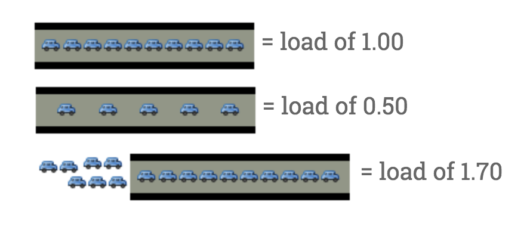

# [OS] About Load Average
> date - 2019.07.31  
> keyword - linux, load  
> monitoring에서 많이 사용되는 metric인 load average란 무엇인지 알아보자  

<br>

## Load
* 1 core CPU는 1차선 도로와 같다
* 도로의 혼잡도를 수치로 나타내면 **특정 시간 동안 얼마나 많은 차가 지나가기 위해 대기 중**인지 파악하는 것



> 자동차 - CPU time 사용 중인 process
> 대기 중인 자동차 - queue에 쌓인 process

### 0.00
* 아무런 차도 없다
* 0.00 ~ 1.00 - 대기 중인 차가 없다
* 바로 지나갈 수 있다

### 1.00
* 도로가 꽉 차있다
* 지금은 문제가 없지만, 조금이라도 늘어나면 문제가 발생한다

### 1.00 이상?
* 대기 중인 차가 있다
* 2.00 - 도로 위의 차만큼 대기 중
* 3.00 - 도로 위의 차의 2배가 대기 중

<br>


## 실제로는?
* **Run queue에서 대기 중인 process(thread)의 평균 수**
  * 대기 중인 process(thread)가 많다는 것은 CPU request에 비해 CPU resource가 부족하다는 것을 의미하므로 **병목** 지점이고, **부하** 상태라고 볼 수 있다
  * CPU 병목 현상은 CPU에서 Running(or Ready to Run)인 process의 특징과 성격에 직접적으로 영향을 받는다는 걸 인지하자
* load avg 1, 5, 15
  * 최근 1분, 5분, 15분 동안 CPU 자원을 할당받기를 기다리는 process(thread)의 평균 수
* unix의 run-queue length
  * 실제로 구동 중인 프로세스 개수와 대기 중인 프로세스 개수의 총합
* CPU load가 1.00 이하인게 좋다
* 가끔은 괜찮지만 높은 값을 유지한다면 문제가 있다고 판단해도 좋다

<br>

### 일반적으로 0.70이 상한선
* 0.70 갓 넘었다면
  * 더 나빠지기 전에 슬슬 무엇이 문제인지 파악해 두자
* 1.00
  * 당장 찾아서 고쳐야 한다
* 5.00
  * 심각, 시스템이 hang에 걸리거나 느려지는 중이니 위험


<br>

## Multi Processors라면?
* multi processors system의 load는 **processor core 개수에 영향을 받는다**
* 100% 사용 중일 때
  * 1 core - 1.00
  * 2 core - 2.00
  * 4 core - 4.00
* multi core system에서는 load가 core 개수를 넘어가서는 안된다
  * **core 개수 = Max Load**
  * 2 processors quad-cores = 4 processors dual-cores = 8 processors single-cores = 8 core


<br>

## Load Average 확인하기
* `uptime`, `top`으로 확인할 수 있다
```sh
$ top
top - 12:53:04 up 20 days, 22:34,  0 users,  load average: 0.53, 0.43, 0.35
Tasks:   5 total,   1 running,   2 sleeping,   0 stopped,   2 zombie
%Cpu(s):  3.3 us,  0.9 sy,  0.0 ni, 94.9 id,  0.0 wa,  0.2 hi,  0.7 si,  0.0 st
...
```
* 최근 1m, 5m, 15m 동안의 load average(실행 대기 중인 프로세스의 평균 개수)가 표시된다
  * 낮을 수록 좋다
  * 높으면 과부하 상태

### core 개수 확인
```sh
$ grep name /proc/cpuinfo | wc -l
```


<br><br>

> #### Reference
> * [Understanding Linux CPU Load - when should you be worried?](https://scoutapm.com/blog/understanding-load-averages)
