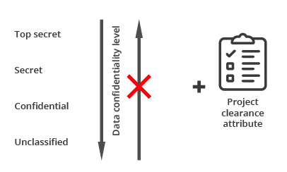
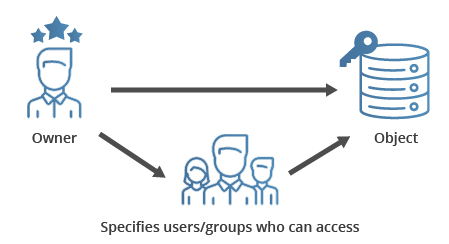
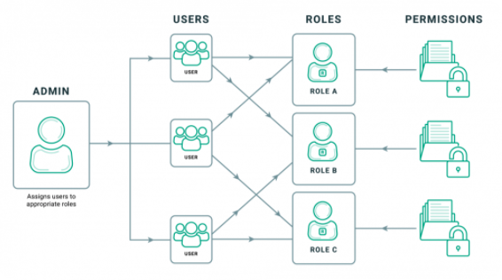

# [Security] About Access Control
> date - 2022.01.24  
> keyword - access control, mac, dac, rbac, abac  
> access control에 대해 정리  

 

## Access Control이란?
* 보호 받는 자원에 대한 특정한 요청을 사전에 규정된 정책에 기초하여, 상세한 수준에서 적절한 권한(permission, priviledge)에 따라 허용/거부하는 절차를 의미
  * process(절차)
  * specific requests(특정한 요청)
  * resources(자원)
  * objects(객체)
  * at a granular level(상세한 수준에서)
  * appropriate permissions(적정한 권한)
  * pre-defined access control policies(사전에 정의된 접근 통제 정책)
* 다양한 access control model이 있다
  * Mandatory Access Control(MAC)
  * Discretionary Access Control(DAC)
  * Role-Based Access Control(RBAC)
  * Attribute-Based Access Control(ABAC)
  * Identity-Based Access Control(IBAC)
  * Rule-Based Access Control(RBAC)
  * History-Based Access Control(HBAC)
  * ...

 

## Permission vs Right vs Privilege

### Permission
* 객체(object)에 대한 접근을 위해 주체(subject)에게 부여된 **사전에 정의된 역할**
* permission은 통상 객체와 연관이 있음
  * 파일 permission, 프린터 permission
* permission은 각기 다른 level로 구분
  * all, read, write, 특수 permission 등

 

### Right
* permission의 범주 위(out of scope)에서 주체에게 부여된 역량을 위미함
* right는 action과 연관이 있고, binary decision(Y/N)
  * 시간을 변경한다, 서버를 내린다 등의 action을 할 수 있는 역량이 right

 

### Privilege
* privilege = permission + right

 

## 종류

### Mandatory Access Control(MAC, 강제적)

  

* 과거 문서 보안에 적용되었던 access control이 컴퓨터로 이동한 것
* 권한 부여는 system admin(시스템 운영자)만 보유(자원 소유자의 접근 권한 부여까지도 제한)
* 사전에 규정된 규칙과 비교하여, 이를 만족하는 subject(주체)에게만 접근 권한을 부여
* subject와 object(객체) 사이에 1:1로 `label` 할당하기 때문에 기밀성에 대한 보장이 강하지만 설정이 복잡하다

 

### Discretionary Access Control(DAC, 임의적)

  

* object(객체) 소유자가 접근 권한을 부여하는 방식
* 통제의 기준이 subject(주체)의 신분이라서 계정 도용에 따른 불법 접근에 취약
* 구현이 용이하고, 사용이 간단하며, object별로 세분화된 access control 가능하여 효율성이 높다는게 장점
* 대표적으로 4가지 구현 방법 존재
  * ACM(Access Control Matrix)
    * 권한을 2차원 matrix로 관리
    * subject와 object의 규모가 증가하면 관리 복잡도가 증가
  * ACL(Access Control List)
    * 가장 많이 사용하는 구현 방법으로 subject list를 관리
    * `ACM(Access Control Matrix)`의 단점을 보완
    * object에 많은 사용자가 권한을 부여 받은 경우 list가 길어진다는 단점이 있다
  * Capability Tickets
    * `ACL(Access Control List)`과 반대로 subject에 접근 가능한 object list를 관리
  * Permission Table
    * RDB로 subject/object/permission table로 관리

 

### Role-Based Access Control(RBAC, 역할 기반)

  

* Role에 권한을 부여하고, User에게 적절한 Role을 할당하여 권한 관리
  * user는 자주 변경되도, role은 자주 변경되지 않는다는 것에 착안한 모델
* `MAC(Mandatory Access Control)`, `DAC(Discretionary Access Control)`의 단점 보완
* 권한 관리의 효율성이 높다
* subject는 여러 role을 할당받을 수 있기 때문에 적절한 role의 개수를 유지하는게 중요하다

 

### Attribute-Based Access Control(ABAC)
* object(객체)와 subject(주체)의 attribute(속성)에 대한 조건을 기술하고, 이를 만족해야 접근 가능한 방식
* 시스템의 다양한 요소를 반영할 수 있어서 표현력과 유연성이 좋은게 장점
* 규모가 커지면 일일이 attribute 적용하기 어렵고, object 접근시 복잡한 attribute를 계산으로 인해 성능이 다소 느리다는 단점

  

> #### Reference
> * [접근 제어의 종류와 구현 방법](https://luniverse.io/2021/02/26/access-control-models/?lang=ko)
> * [What are the Different Types of Access Control Systems?](https://www.sailpoint.com/identity-library/what-are-the-different-types-of-access-control-systems/)
