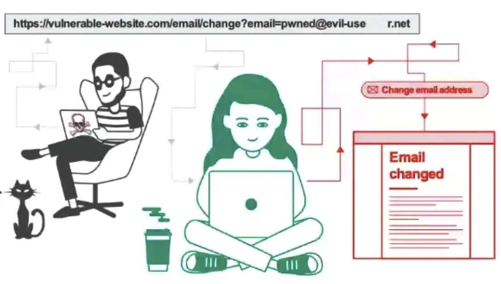

# [Security] CSRF(Cross-Site Request Forgery) attack
> date - 2022.05.08  
> keyworkd - security, web, csrf  
> CSRF(Cross-Site Request Forgery) attack 방지는 대부분의 Web Framework에서 지원하므로 잘 이용하면되지만 알고 사용하는게 좋을 것 같아서 정리  

 

## CSRF(Cross-Site Request Forgery) attack이란?

  

* Cookie의 동작 방식을 이용한 공격 방법
* 특정 서비스에 대한 유저의 신뢰를 이용하는 XSS(Cross-Site Scripting)와 다르게 서비스가 유저의 브라우저에 대해 갖는 신뢰를 이용
* 유저의 session cookie or 다른 인증 정보를 이용하여 유저 모르게 공격자가 의도한 서비스 요청을 처리하는 공격
* REST API 방식은 Cookie, Session에 의존하지 않고, localStorage, request header를 사용하기 때문에 CSRF 공격 불가

 

### 공격 목적
* 다른 유저를 타겟으로 서비스 로직 악용

 

### 전제 조건
* 유저가 보안이 취약한 서비스로부터 인증을 받은 상태
* Cookie 기반으로 Session 정보를 획득할 수 있어야 한다
* 공격자가 서비스에 공격하기 위한 request 정보를 알고 있어야 한다
  * 예상치 못한 파라미터가 있으면 불가능

 

### CSRF 공격에 취약할 수 있는 기능
* 정보(게시글, 회원 정보 등) 생성/수정/삭제 기능

 

### 공격 시나리오
1. 유저는 보안이 취약한 서비스에 로그인한 상태로 인증 정보가 Cookie에 저장
2. 공격자는 서비스에 인증된 브라우저의 사용자가 악성 script 페이지를 누르도록 유도
   * 메일로 악성 script 전달
   * 악성 script를 게시글로 작성하여 다른 유저들이 클릭하도록 유도
3. 악성 script는 Cookie에 저장된 인증 정보로 request를 실행
4. 보안이 취약한 서비스는 인증된 유저로 파단하고 처리

 

### 대응 방안
* Origin, Referrer header에 신뢰된 도메인만 허용
  * 일반적으로 `Referrer` 검증만으로 대부분의 CSRF 공격을 방어할 수 있다
* 기능 수행 전 CSRF token을 발급하여 server에 저장된 token과 request에 포함된 token이 일치하는지 검증

 

## Conclusion
* Cookie를 사용하는 서비스에서는 CSRF(Cross-Site Request Forgery) attack에 대한 조치를 해둬야 안전한 서비스가 될 수 있으니 알아두자!

  

> #### Reference
> * [Understanding CSRF](https://github.com/pillarjs/understanding-csrf)
