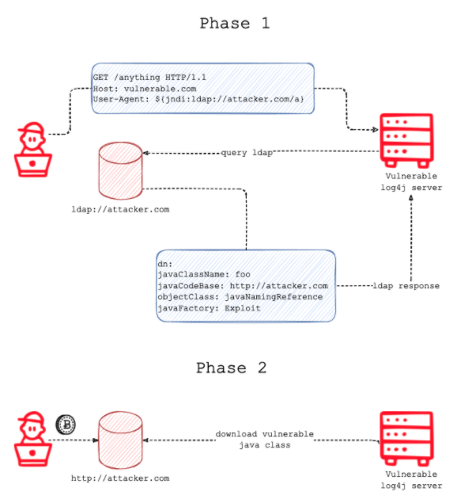

# [Security] CVE-2021-44228 Apache Log4j2 RCE(Remote Code Execution)
> date - 2021.12.13  
> keyworkd - security, cve, log4j  
> CVE-2021-44228 Log4j2 RCE 취약점에 대해 정리

<br>

## Log4j2 RCE(Remote Code Execution)란?
<div align="center">
  
</div>

* [CVE-2021-44228](https://cve.mitre.org/cgi-bin/cvename.cgi?name=CVE-2021-44228)로 0-day vulnerability
  * CVSS score 10으로 가장 높은 심각도
  * 공격 방법이 너무 쉬워서 사상 최악의 취약점
  * 취약 서버에서 a -> b -> c 과정을 거친 후 공격 성공이 아니라 a(${jndi...}) -> 공격 성공!
* `Log4Shell`로 명명
* Log4j2의 JNDI(Java Naming and Directory Interface) 조회 기능에서 발생
* Log4j2를 사용하면서 입력을 Log4j를 통해 logging하는 경우 취약점
* 취약 버전 - Apache Log4j 2.0 ~ 2.14.1
  * log4j-core-<version>.jar 가 해당
  * Logj4 2.0 이하 사용하거나 Log4j로 logging하지 않는 경우에는 예외


<br>

## 대응

### 1. Log4j2 2.15.0 이상으로 upgrade(Recommand)
* Spring Boot + Gradle 기준으로 작성  
* Spring Boot는 기본적으로 logback을 사용하고, `spring-boot-starter-logging`의 `log4j-to-slf4j`, `log4j-api`만으로는 취약하지 않고, `log4j-core`와 함께 사용되면 취약할 수 있다

#### dependency 확인
```sh
$ ./gradlew dependencyInsight --dependency log4j-core
```

* 조치 불필요
```sh
$ ./gradlew dependencyInsight --dependency log4j-core 

> Task :dependencyInsight
No dependencies matching given input were found in configuration ':compileClasspath'
...
```

* 조치 필요
```sh
$ ./gradlew dependencyInsight --dependency log4j-core

> Task :dependencyInsight
org.apache.logging.log4j:log4j-core:2.11.1 (selected by rule)

org.apache.logging.log4j:log4j-core:2.11.1
\--- compile
...
```

#### 조치
* `build.gradle`에 선언
```gradle
ext['log4j2.version'] = '2.15.0'
```

* `gradle.properties`에 선언
```properties
log4j2.version=2.15.0
```

* Spring의 dependency management plugin이 아닌 gradle platform support 사용시
```gradle
implementation(platform("org.apache.logging.log4j:log4j-bom:2.15.0"))
```

* 위의 방법을 사용 못한다면 `resolutionStrategy` 선언
```gradle
configurations.all {
    resolutionStrategy.eachDependency { DependencyResolveDetails details ->
        if (details.requested.group == 'org.apache.logging.log4j') {
            details.useVersion '2.15.0'
        }
    }
}
```

#### Result
```sh
$ ./gradlew dependencyInsight --dependency log4j-core

> Task :dependencyInsight
org.apache.logging.log4j:log4j-core:2.15.0 (selected by rule)

org.apache.logging.log4j:log4j-core:2.11.1 -> 2.15.0
\--- compile
...
```

<br>

### 2. JndiLookup class path에서 제거
* `2.0-beta9 <= ${version} < 2.10.0`의 임시 조치
```sh
$ zip -q -d log4j-core-*.jar org/apache/logging/log4j/core/lookup/JndiLookup.class
```

<br>

### 3. Enable formatMsgNoLookups
* `2.10 <= ${version} <= 2.14.1`의 임시 조치
```sh
## java options
$ java -Dlog4j2.formmatMsgNoLookups=true xxx.jar

## environment variable
LOG4J_FORMAT_MSG_NO_LOOKUPS=true
```

<br>

### 4. log pattern에서 %m대신 %m{nolookups} 사용
* `2.7.0 <= ${version} <= 2.10.0`의 임시 조치


<br><br>

> #### Reference
> * [CVE-2021-44228](https://cve.mitre.org/cgi-bin/cvename.cgi?name=CVE-2021-44228)
> * [Log4J2 Vulnerability and Spring Boot](https://spring.io/blog/2021/12/10/log4j2-vulnerability-and-spring-boot)
> * [20211210-TLP-WHITE_LOG4J](https://gist.github.com/SwitHak/b66db3a06c2955a9cb71a8718970c592)
> * [Log4Shell: RCE 0-day exploit found in log4j 2, a popular Java logging package](https://www.lunasec.io/docs/blog/log4j-zero-day/)
> * [log4j 보안 취약점 동작원리 및 jenkins 서버 확인 방법](https://www.popit.kr/log4j-%EB%B3%B4%EC%95%88-%EC%B7%A8%EC%95%BD%EC%A0%90-%EB%8F%99%EC%9E%91%EC%9B%90%EB%A6%AC-%EB%B0%8F-jenkins-%EC%84%9C%EB%B2%84-%ED%99%95%EC%9D%B8-%EB%B0%A9%EB%B2%95/)
> * [Digging deeper into Log4Shell - 0Day RCE exploit found in Log4j](https://www.fastly.com/blog/digging-deeper-into-log4shell-0day-rce-exploit-found-in-log4j?fbclid=IwAR29ZuoajT_DjlLBJF6_zmlf6_-GUnVvOV9PzA1APdLg1m00HBcONMMLYSE)
