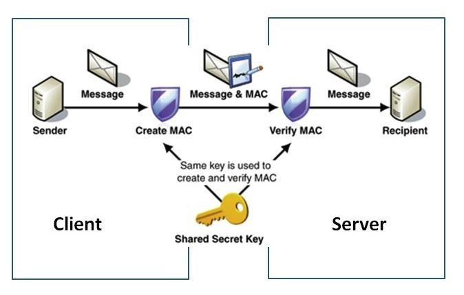

# [Security] What is MAC, HMAC, CMAC?
> date - 2023.01.08  
> keyword - hmac  
> HMAC에 대해 정리    

 

##  MAC(Message Authentication Code)
* 메시지를 인증하기 위해 사용하는 정보
* 비밀 암호화 키를 공유하는 두 당사자 간에 사용
* **사용자 인증과 메시지의 데이터 무결성(진본 확인 or 변조 여부)**을 수행하기 위해 사용

 

## HMAC(Hash-based Message Authentication Code)이란?
* 암호화 hash 함수(sha-256)와 비밀 암호화 키(secret key)를 사용하는 MAC(message authentication code)
* 중간에 가로채도 secret key를 알 수 없으므로 변조할 수 없다
* [RFC 2104](https://www.rfc-editor.org/rfc/rfc2104)에 정의
* 메시지에 timestamp, serial 등 변하는 값을 포함시켜 replay attack을 방지
* REST API 보안에 많이 사용
* block 함수(AES 등)를 사용하면 CMAC(Cipher-based Message Authentication Code)으로 [RFC 4493](https://www.rfc-editor.org/rfc/rfc4493)에 정의

  

1. 사전에 secret key와 사용할 hash 함수를 공유 
2. 송신자는 공유된 secret key를 이용해 메시지의 hash를 만든다
3. hash를 header에 포함하여 메시지와 전달
4. 수신자는 메시지를 secret key를 이용해 hash를 만들어 header의 hash와 비교
5. 일치하지 않으면 변조된 것이므로 사용하지 않고, 일치하면 진본이므로 사용

  

> #### Reference
> * [HMAC](https://ko.wikipedia.org/wiki/HMAC)
> * [RFC 2104](https://www.rfc-editor.org/rfc/rfc2104)
> * [RFC 4493](https://www.rfc-editor.org/rfc/rfc4493)
> * [REST API 제작시 꼭 알고 있어야 할 HMAC 기반 인증](https://www.lesstif.com/ws/rest-api-hmac-87949394.html)
