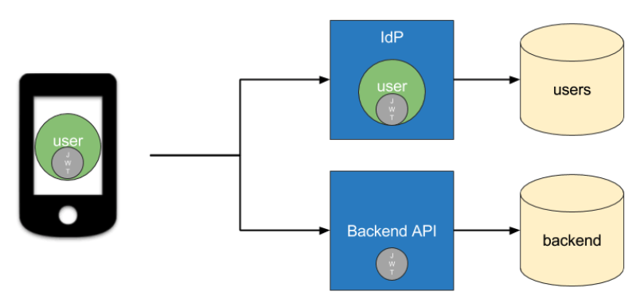
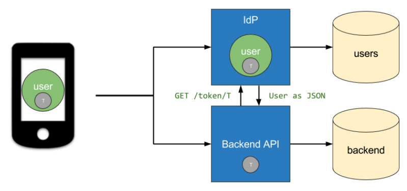
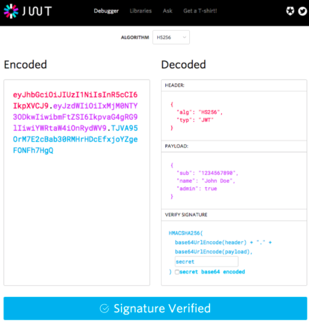
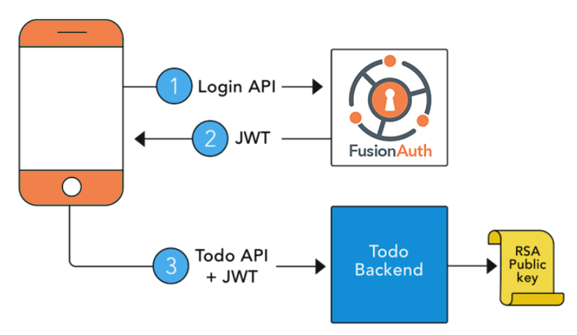

# [Security] JWT(Json Web Token)
> date - 2021.05.16  
> keyworkd - jwt, security, web, authentication, authorization  
> web service 인증시에 많이 사용하는 jwt에 대해 정리  

<br>

## JWT(Json Web Token)란?
* [RFC 7519](https://www.rfc-editor.org/rfc/rfc7519.html)로 JSON object를 이용하여 정보를 안전하게 전달하기 위한 방식
* 특징으로 **compact, self-contained**가 있다
  * Compact
    * **압축을 이용해** size가 작기 때문에 전송 속도가 빠르다
  * Self-contained
    * token의 **payload에 필요한 정보를 담을 수 있어** DB query를 줄일 수 있다
* signed token(digitally sign된 token)으로 `claims`의 무결성을 보장
  * secret(HMAC algorithm) 또는 public/private key(RSA, ECDSA) pair로 sign


<br>

## JWT를 사용하는 경우

### Authorization
* 로그인을 통해 IdP(Identity Provider)에 인증을 하면 이후의 모든 request에 JWT가 포함되어 허용된 resource에 access할 수 있다
  * e.g. SSO(Single Sign On) - 작은 overhead와 여러 도메인에서 쉽게 사용할 수 있는 기능
  * JWT 검증을 위해 IdP(IDentity Provider)에 물어볼 필요가 없다
* 가장 일반적인 시나리오

<br>

### Information Exchange
* ECC/RSA public/private key signing을 통해 sender 확인이 가능하여 정보를 안전하게 전달할 수 있다
* IdP는 header와 payload를 private key를 사용해 JWT에 signing, public key가 있는 모든 service는 JWT의 무결성(content 변조 검증)을 확인할 수 있다
* JWT가 발급되면 IdP(Identity Provider)의 역할은 끝
  * data를 포함하지 않는 문자열인 `Opaque token`은 발급 후 유효성 확인, data fetch시 IdP(Identity Provider) access 필요

<div align="center">
  
  
</div>

<br>

## JWT structure
* compact form, JSON으로 `.`으로 구분된 3가지 부분으로 구성
  * Header
  * Payload
  * Signature
  * e.g. xxxxx.yyyyyyy.zzzzzz
* `SAML`과 같은 XML-based 표준에 비해 간결

<div align="center">
  
</div>

<br>

### Header
```json
{
  "alg": "HS256",
  "typ": "JWT"
}
```
* JWT의 1번째 부분
* **token type**과 **signing algorithm**(HMAC SHA256, RSA)을 가지고 있는 JSON을 `Base64Url`로 encoding
<br>

### Payload
```json
{
  "sub": "12345677890",
  "name": "John Doe",
  "admin": true
}
```
* JWT의 2반째 부분
* entity(typically, the user), additional data인 `Claims`을 가지고 있는 JSON을 `Base64Url`로 encoding
* 무결성(변조 방지)이 보장되지만 누구나 확인할 수 있다
  * 암호화되지 않은 경우 header, payload에 secret information을 포함하지 않아야 한다

#### Claims Type
claims에는 3가지 유형이 있다

* registered claims
  * 권장되는 **predefined claims**으로 claims name은 3글자 사용(payload size의 최소화를 위해)
  * iss(issuer)
    * token issuer
  * exp(expiration time)
    * expiration time으로 만료된 token 거부시 사용
  * sub(subject)
  * aud(audience)
  * [other](https://datatracker.ietf.org/doc/html/rfc7519#section-4.1)
* public claims
  * 자유롭게 정의 가능한 claims
  * 충돌 방지를 위한 방법 필요
    * [IANA JSON Web Token Registry](https://www.iana.org/assignments/jwt/jwt.xhtml)에 정의
    * namespace가 포함된 URI로 정의
* private claims
  * registered, public claims가 아닌 custom claims

<br>

### Signature
* encoded header, encoded payload를 header에 지정된 algorithm으로 sign
```js
HMACSHA256(
  base64UrlEncode(header) + "." +
  base64UrlEncode(payload),
  secret)
```
* message가 변조되지 않았음을 확인하는데 사용
* private key로 sign한 경우 발신자 확인에도 사용


<br>

## JWT는 어떻게 동작하는가?
* authentication에서 user의 credentials로 login시 JWT가 발급된다
* token은 credentials이므로 security issue 방지를 위해 주의 필요
  * e.g. expiration time을 너무 길게 설정하지 않는다, sensitive session data를 browser storage에 저장하지 않는다

```
Authorization: Bearer <token>
```
* 보호된 resource에 접근하기 위해 authentication에서 발급 받은 JWT를 `Authorization header`로 전송
  * Cookie를 사용하지 않으므로 CORS(Cross-Origin Resource Sharing) 이슈는 없다
* stateless authorization mechanism이 될 수 있다
* JWT에 필요한 데이터가 포함되어 있으면 DB query 횟수를 감소시킬 수 있다

<br>

<div align="center">
  
  
</div>
<div align="center">
  
</div>

1. client는 authorization server에 authorization request
   * 다른 authorization flow 중 하나를 통해 수행
   * e.g. [OIDC(OpenID Connect)](https://openid.net/connect/) 호환 application은 [authorization code flow](https://openid.net/specs/openid-connect-core-1_0.html#CodeFlowAuth)를 사용해 `/oauth/authorize` endpoint를 통과
2. 권한이 부여되면 authorization server는 access token을 반환
3. client는 access token을 이용해 보호된 리소스에 access


<br>

## JWT를 사용해야하는 이유는?
SWT(Simple Web Tokens), SAML(Security Assertion Markup Language Tokens)와 비교시 이점

* JSON을 사용하기 때문에 XML보다 간결
  * parsing이 쉽다
  * `SAML`보다 간결하여 HTTP 환경에서 사용하기 좋다
* 단순한 sign
  * `SWT`는 HMAC algorithm을 사용하는 shared secret으로만 symmetrically signed
  * JWT, `SAML` token은 x.509 certificate 형식의 public/private key를 사용하여 sign


<br>

## Holding token
* Client에서 안전한 저장소에 JWT를 저장하여 사용
  * e.g. iOS - keychain
* 브라우저에서 JWT를 localStorage or JavaScript에 access할 수 있는 Cookie에 저장하지 말아야한다
  * Cookie에 저장시 아래의 내용을 적용
    * Cookie는 TLS에서만 전달
    * 악성 JavaScript가 접근할 수 없도록 `HttpOnly` 사용
    * Cookie가 같은 도메인에서만 사용되도록 `SameSite: Lax or Strict` 사용
  * Page reload 전까지 token이 유효하도록 memory에 저장
  * Web worker를 사용해 JavaScript context 외부에 저장


<br>

## Revoke token
JWT는 강제로 만료(revoke)시킬 방법이 없어서 별도의 메커니즘 필요
* 유효성 검증을 위해 모든 JWT 저장
* 짧은 수명을 가진 JWT 사용
* Revoked JWT에 대한 deny list 관리

<br>

### 유효성 검증을 위해 모든 JWT 저장
* 모든 JWT를 관리하는 것은 JWT의 이점이 제거되는 문제점이 있다

<br>

### 짧은 수명을 가진 JWT 사용
* expiration time 일, 월 단위보다는 초, 분, 시 단위로 짧게 유지
* JWT 만료시 재발급을 위해서 refresh token 사용
* 가장 일반적인 솔루션

<br>

> #### Refresh token?
> * JWT 발급을 위해 사용되는 Opaque token
> * IdP에 의해 관리되기 때문에 JWT 메커니즘에서 유연하게 사용 가능

<br>

#### JWT 수명을 감소시키고 JWT를 생성을 수 없도록 refresh token revoke
1. JWT expiration time을 짧게(5 ~ 10m) 설정
2. refresh token expiration time을 길게(2 weeks ~ 2 months) 설정
3. IdP에서 언제든지 refresh token revoke
4. 새 JWT 발급 시도시 refresh token 재발급을 위해 인증 필요

#### 이 방법에는 2가지 문제점이 있다
1. JWT가 유효하지 않을 때까지 refresh token을 사용할 일이 없다
2. JWT의 짧은 expiration time까지의 시간이 존재

그럼? Rotate keys, Revoked JWT에 대한 deny list 관리 사용

<br>

### Rotate keys
* JWT의 signature 검증시마다 IdP에서 key를 가져오는 경우 key가 만료되면 JWT를 무효화

#### key abcd의 `kid`가 있다고 가정
1. backend는 public key list를 IdP에 요청
2. abcd의 kid가 포함된 public key가 리턴되고, 리턴된 key로 JWT의 signature 검증
3. IdP에서 key abcd가 제거되면 제거된 key의 signed JWT의 signature 검증을 할 수 없어 무효화된다
4. 해당 key로 JWT를 발급한 모든 유저에게 영향을 끼친다

backend는 public key list를 IdP에 지속적으로 polling하므로 JWT의 이점이 제거되는 문제가 있다

<br>

### Revoked JWT에 대한 deny list 관리
* refresh token revoke를 backend service에 알리는 distributed event system을 활용해 IdP의 지속적인 polling을 제거
* IdP는 refresh token revoke event를 다른 backend service에 broadcast
* event를 수신한 backend service는 refresh token이 revoke된 유저들을 관리하는 local cache를 갱신
* JWT 검증시 local cache를 이용해 JWT revoke 여부를 결정


<br>

## Conclusion

### JWT 검증
* signature, claims, expiration time를 검증
* server의 secret을 유추하기 매우 어렵기 때문에 보안 측면에서 안전할 것이라 여긴다
* token 발행 방식과 해석 방식만 일치시키면 쉽게 검증할 수 있다

<br>

### JWT 사용시 주의할 점
1. Claims에는 필요한 최소한의 정보만 담는다
   * Claims는 암호화되지 않아 누구나 읽을 수 있기 때문에 보안이 중요한 정보는 포함시키지 않느다
2. 너무 많은 정보 담지 않기
   * Claims의 내용이 많아지면 token의 길이가 길어진다
   * Claims name이 약자를 사용하는 이유
3. token을 강제로 만료시킬 방법이 없다
   * 탈취된 token이라도 expiration time까지 유효하여 고민이 필요한 부분
   * token을 임의로 삭제하는 것은 불가능하므로 expiration time 필수


<br><br>

> #### Reference
> * [Introduction to JSON Web Tokens - jwt.io](https://jwt.io/introduction)
> * [RFC7519](https://tools.ietf.org/html/rfc7519)
