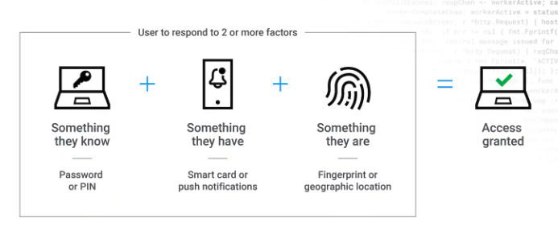

# [Security] What is MFA(Multi-Factor Authentication)?
> date - 2023.01.09  
> keyword - mfa  
> Multi-Factor Authentication에 대해 정리  

 

## MFA란?

  

* 2개 이상의 factor를 이용하여 인증하는 방식
  * 2개면 2FA(two-factor authentication)
* 사용자에게 암호 이외의 추가 정보를 입력하도록 요구하는 다중 단계 로그인 과정
* e.g. 이메일로 전송된 코드 입력, 보안 암호 질문에 응답, 지문 스캔 등
* MFA를 사용하면 암호 유출시 무단 계정 접근을 방지한다
* 사용자들은 다양한 서비스에 하나의 암호를 사용할 수 있어서 암호가 유출된 경우 다른 서비스에서 피해가 발생할 수 있다

 

## Factor
| 구분 | 설명 | 예시 |
|:--|:--|:--|
| knowledge(지식 기반) | 사용자만 알고 있는 정보 | 패스워드, PIN 코드, 미리 설정해놓은 질문 답변 등 |
| possession(소유 기반) | 사용자만 가지고 있는 정보 | SMS 인증, OTP 등 |
| inherence(속성 기반) | 사용자만의 고유한 속성(신체 정보 등) | 지문 스캔, 망막 스캔, 음성 인식, 얼굴 인식 등 |

 

## 적응형 다중 인증이란?
* 비즈니스에 맞게 사용자에게 어떤 인증 요소를 적응할지 결정하여 아래의 요소를 활용해 사용자 인증 단계를 동적으로 증가시키거나 감소시킬 수 있다
  * 로그인 시도 실패 횟수
  * 사용자의 지리적 위치
  * 연속적인 로그인 시도가 일어난 위치 사이의 거리
  * 로그인에 사용되는 디바이스
  * 로그인 시도 날짜 및 시간
  * OS
  * IP 주소

  

> #### Reference
> * [What Is Multi-Factor Authentication (Mfa)?](https://aws.amazon.com/what-is/mfa)
