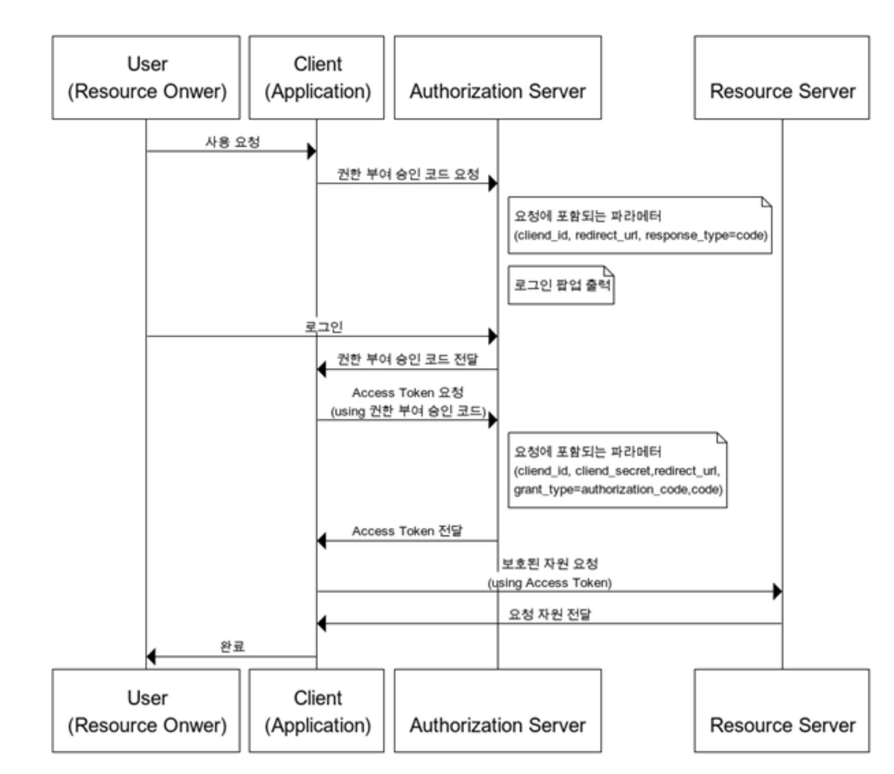
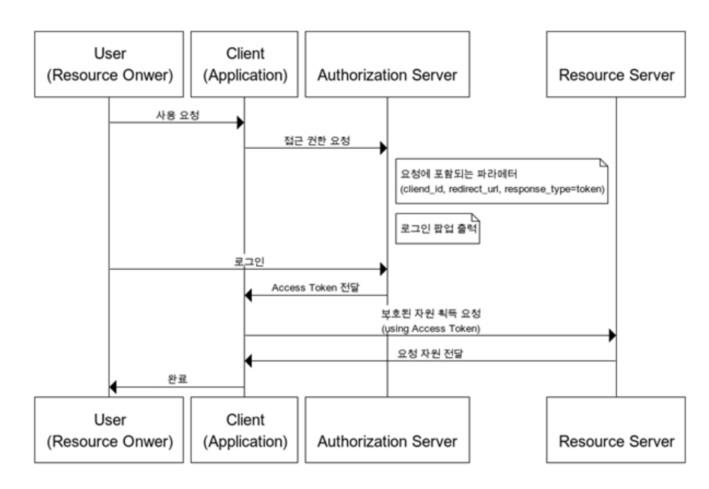
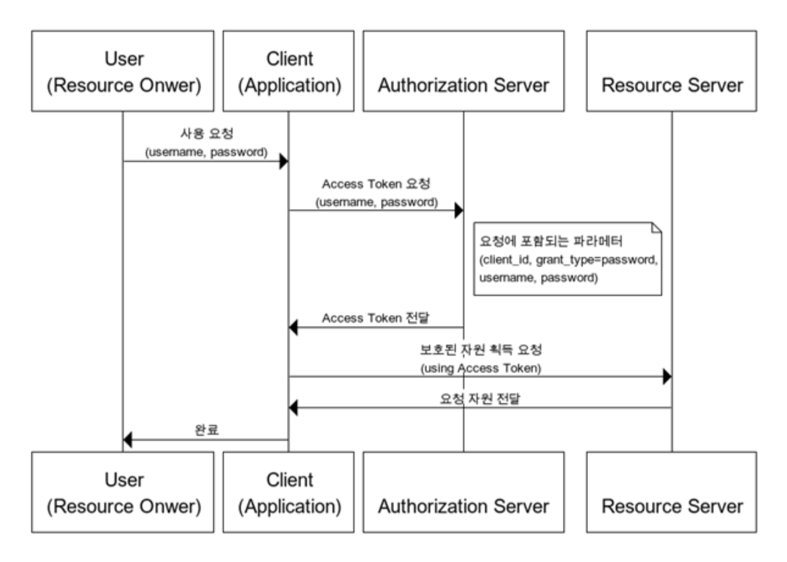
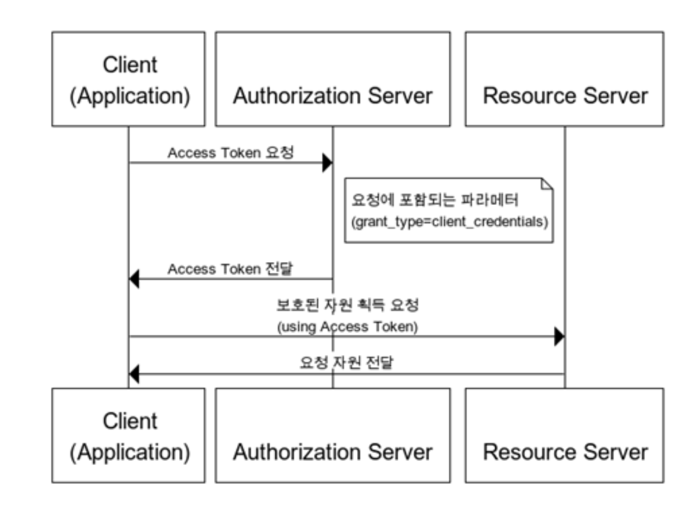

# [Security] What is OAuth 2.0?
> date - 2023.01.08  
> keyword - oauth  
> OAuth 2.0에 대해 정리

 

## OAuth(Open Authorization) 2.0이란?
* 인증을 위한 industry-standard protocol
* web application, desktop application, mobile phone 등 client 개발자 단순성에 중점을 두며 ID/PW 없이도 접근 권한을 받을 수 있도록 만든 표준
* authorization code flow에는 client secret을 넣을 수 있는 서버가 필요
  * 하여 서버 없이도 OAuth 지원을 위해 PKCE 확장이 생겼고, OAuth 2.1에 사용을 의무화
* OAuth 2.1
  * implicit flow는 사용하지 말 것
  * redirect url은 exact match만 사용
  * access token을 query string으로 전달하지 말 것
  * ...
* Google/Facebook 로그인 등은 OAuth2 기반
* PW를 사용함으로써 발생하는 보안 이슈와 불편함을 제거할 수 있다
  * 보안 - PW를 메모장 등에 관리하여 유출 가능성을 차단
  * 불편함 - 다양한 PW를 사용자가 기억해야 한다

 

## 구성
* Resource Owner
  * Google 로그인을 할 사용자 같이 정보에 접근할 수 있는 자격을 승인하는 주체
  * client를 인증하는 역할을 수행하고, 인증이 완료되면 동의를 통해 Authorization Grant(권한 획득 자격)을 client에 부여
* Client
  * Resource Owner의 리소스를 사용하고자 접근 요청을 하는 application
* Resource Server
  * Resource Owner의 정보가 저장되어 있는 서버
* Authorization Server
  * 인증/인가를 수행하는 서버로 client의 접근 자격을 확인하고 access token을 발급하여 권한을 부여
* Authentication
  * 접근 자격이 있는지 검증
* Authorization
  * 자원에 접근할 권한을 부여
* Access Token
  * Resource Server에게서 정보를 가져올 때 사용되는 짧은 만료기간을 가진 token
* Refresh Token
  * access token 만료시 재발급 받기 위한 용도로 사용하는 긴 만료기간을 가진 token
  * access token 만료시 refresh token으로 재발급 받기 때문에 로그인에 대한 불편함을 줄여준다

 

## 권한 부여 방식

### 1. Authorization Code Grant

  

* 가장 기본 방식
* client는 response_type=code, grant_type=authorization_code로 권한 부여 승인을 요청하고, authorization server에서 제공하는 로그인 페이지로 이동하여 로그인 유도
* 로그인시 request의 redirect_url로 authorization code 전달
* authorization code로 authorization server에서 access token 발급
* access token을 사용해 resoruce server에 접근
* refresh token 사용

 

### 2. Implicit Grant

  

* 자격증명을 안전하게 저장하기 힘든 client(e.g. javascript)에게 최적화된 방식
* cluent는 response_type=token으로 권한 부여 승인을 요청하고, authorization server에서 제공하는 로그인 페이지로 이동하여 로그인 유도
* 로그인시 권한 부여 승인 코드 없이 바로 access token 발급되고 url로 전달
* refresh token 사용 불가

 

### 3. Resource Owner Password Credentials Grant

  

* client가 자신의 서비스에서 제공하는 application일 경우에만 사용하는 방식
* cluent는 username, password, grant_type=password로 권한 부여 승인을 요청하고, authorization server는 access token을 발급
* refresh token 사용

 

### 4. Client Credentials Grant

  

* OAuth2에서 가장 간단한 방식
* 자격증명을 안전하게 보관할 수 있는 client에서만 사용
* client는 grant_type=client_credentials로 권한 부여 승인을 요청하고, authorization server는 access token을 발급
  * client의 자격 증명만으로 access token을 획득
* refresh token 사용 불가

  

> #### Reference
> * [OAuth 2.0](https://oauth.net/2)
