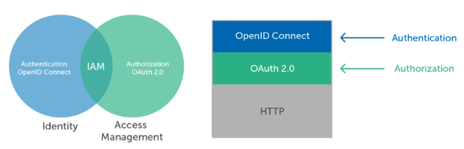
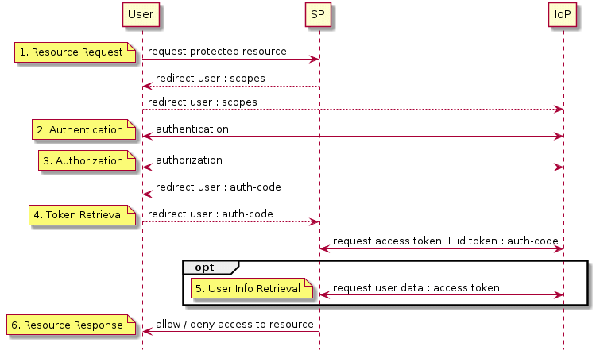
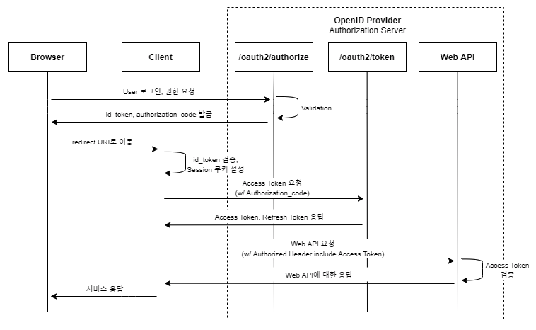

# [Security] What is OIDC(OpenID Connect)?
> date - 2023.01.13  
> keyword - oidc, openid  
> OIDC에 대해 정리  

<br>

## OIDC(OpenID Connect)란?
<div align="center">
  
</div>

* OAuth 2.0 위에서 동작하며 인증 서비스를 제공 -> OAuth 2.0 + 인증 서비스
  * authorization server에서 수행한 인증을 기반으로 사용자의 신원을 확인하고 사용자에 대한 기본 프로필 정보를 얻을 수 있다
* 서로 연계된 서비스(IdP와 SP)간에 사용자의 인증 등을 오픈해주는 기술
  * IdP - Identity Provider
  * SP - Service Provider
* OpenID Foundation에서 관리
* OpenID의 주요 목적이 Authentication, OAuth의 주요 목적은 Authorization
* OIDC를 이용하는 [Dex](https://dexidp.io) 등으로 identity service를 구축할 수 있다
* OAuth의 access token은 권한을 허가해준 token으로 사용자 정보를 담지 않는다
  * access token 발급을 위해 인증을 했으나 access token이 사용자 인증을 위해 사용되어선 안된다
  * id token에는 사용자의 신원 정보가 들어있어 OIDC에서 인증을 위해 사용
* id token은 JWT(Json Web Token)로 payload를 복호화하면 사용자 정보를 알 수 있다
  * OAuth 2.0에서 사용자의 정보를 가져오기 위해 access token을 발급 받은 후 access token을 사용해 사용자 정보를 가져왔지만 OIDC에서는 access token과 함께 전달받은 id token을 복호화하면 되므로 통신 횟수가 절반으로 줄어들게 된다
```json
{
  "iss": "example.com",  // token 발행자
  "sub": "asdfjlsdjfie",  // token의 고유 ID
  "aud": "sssfd3f",  // 토큰을 요청하는 client id
  "exp": 13123123123,  // token의 유효시간
  "iat": 13499343403,  // token의 발행 시간
  "name": "Mike",
  "gender": "male",
  "email": "mike@example.com",
  "picture": "https://example.com/mike/me.jpg"
}
```


<br>

## Scope
* client가 server에 접근할 수 있는 제한 범위에 대한 내용을 scope로 전달
### Standard claims
| Scope | Claims |
|:--|:--|
| openid | 사용자를 고유하게 식별하는 sub claims 반환<br>id token에는 iss, aud, exp, iat 등 claims가 있다 |
| profile | name, family_name, given_name, nickname, picture, updated_at 등의 기본 프로필 정보를 나타내는 claims 반환 |
| email | email, email_verified(bool) claims 반환 |


<br>

## OIDC workflow
<div align="center">
  
</div>
<div align="center">
  
</div>


<br>

## SAML vs OAuth vs OIDC
| | SAML | OAuth | OIDC |
|:--|:--|:--|:--|
| 표준 | open authentication, authorization | open authorization | open authentication |
| 목적 | enterprise application SSO | API authorization | SSO |
| format | XML | JSON | JSON |


<br><br>

> #### Reference
> * [Welcome to OpenID Connect](https://openid.net/connect)
> * [OpenID Specifications](https://openid.net/developers/specs/)
> * [OpenID Connect Scopes](https://auth0.com/docs/get-started/apis/scopes/openid-connect-scopes)
> * [ID Token Structure](https://auth0.com/docs/secure/tokens/id-tokens/id-token-structure)
