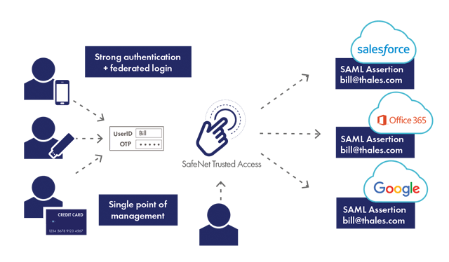
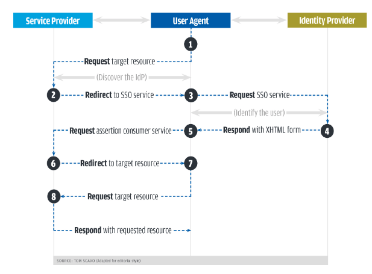

# [Security] What is SAML?
> date - 2023.01.09  
> keyword - saml  
> SAML에 대해 정리  

 

## SAML(Security Assertion Markup Language) 인증이란?

  

* IdP(Identity Provider)를 활용하여 다양한 서비스에서 사용자를 인증하는 방법 중 하나로 SAML이라는 XML 표준 protocol을 사용
  * 일반적으로 서로 다른 회사에서 만든 시스템과 사용자가 관련된 경우 두 시스템이 사용자에 대한 정보를 교환하는데 사용
  * 시스템 간에 동일한 규칙을 따르게 하여 복잡한 통합 작업을 단순화
  * message 구문을 정의하고 message 내용을 안전하게 처리하는 방법을 안내
  * `<Response>`를 받으면 `<Assertion>`를 찾아야함
  * 디지털 서명이 어떻게 생겼는지 등 보안에 필요한 정보 제공
* IdP가 사용자를 인증한 다음 SP(Service Provider)에게 인증 토큰을 전달
* SAML을 사용하면 SAML protocol을 지원하는 application에서 사용자에게 SSO(Single Sign-On)를 제공할 수 있다
  * Okta를 사용해 이메일에 access 했다면 Web Browser SSO Profile을 사용한 것
* IdP와 SP 사이에서 사용자 정보, 로그인 및 속성 정보를 전달
* 사용자 경험 개선 및 PW 분실 감소, 보안 강화 효과를 볼 수 있다
  * SSO를 사용해 로그인하면 IdP가 SAML 속성을 SP에게 전달하기 때문에 사용자는 1번만 로그인하면 된다
* OpenID, OAuth, Web Service Federation으로 대체할 수 있다
* SSO에는 3가지 주체가 존재
  * 사용자 - application을 사용하려는 사람
  * SP(Service Provider) - application 자체
  * IdP(Identity Provider) - 사용자가 인증에 사용할 중앙 서비스

 

## Workflow

  

1. 사용자가 서비스에 접근할 때 마다 SAML IdP가 인증 프로세스를 전달 받는다
2. 사용자가 자격 증명(e.g. password, OTP 등)을 입력하면 IdP가 확인
3. IdP가 SAML assertion 형식으로 접근 또는 거부 응답을 전달
4. 인증에 성공하면 사용자에게 리소스에 대한 접근 권한을 부여

 

## SAML assertion이란?
IdP가 사용자 인증을 위해 SP에게 전달하는 XML 문서
* Authentication assertions - 사용자의 identity 검증 후 로그인한 시각, 사용한 인증 protocol(MFA 등)을 제공
* Attribution assertions - 사용자에 관한 정보를 제공하는 데이터인 SAML attributes을 SP에게 전달
* Authorization assertions - 서비스를 이용할 수 있는 권한 보유 여부와 인증 수준, IdP의 요청 거부 여부를 확인

 

## SAML vs OAuth
| SAML | OAuth |
|:--:|:--:|
| 네트워크를 통해 여러 서비스에서 자격 증명을 공유할 수 있도록 하는 표준 | 모바일 플랫폼에서 SAML의 결함을 보완하기 위해 개발|
| XML | JSON |

  

> #### Reference
> * [SAML(보안 검증 마크업 언어)이란?](https://www.oracle.com/kr/security/cloud-security/what-is-saml)
> * [Identity provider (SAML)](https://en.wikipedia.org/wiki/Identity_provider_(SAML))
> * [A gentle introduction to SAML](https://ssoready.com/blog/engineering/a-gentle-intro-to-saml)
