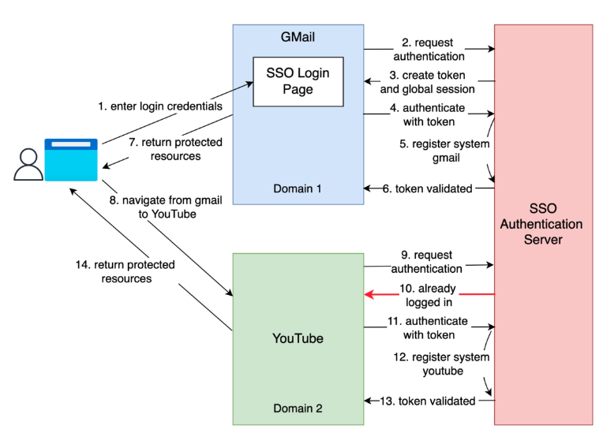

# [Security] What is SSO(Single Sign-On)?
> date - 2023.01.10  
> keyword - sso  
> SSO에 대해 정리  

 

## SSO(Single Sign-On)란?
* 여러 서비스를 한번의 로그인만으로 이용하도록 하는 인증 체계
* 사용자가 하나의 ID를 사용하여 여러 서비스에 로그인할 수 있다.
  * Google 로그인 1번으로 Gmail, Drive, Youtube 등을 모두 이용할 수 있다
* 인증 기능을 제공하는 IdP(Identity Provider)와 서비스를 제공하는 SP(Service Provider)로 구성된다
* SAML(Security Assertion Markup Language), OAuth(Open Authorization), OIDC(OpenID Connect) 등 표준으로 구현할 수 있다

 

## 왜 필요한가?(이점)
* 여러 서비스마다 로그인을 해야하는 짜증나는 일을 없앨 수 있다
* 오랫동안 잊어버린 암호 여러개를 기억하거나, 찾거나, 보안 질문에 답변하기 위해 어린 시절 애완 동물의 이름 입력 같은 것이 불필요해진다

 

## Workflow

  

1. 사용자가 Gmail에 방문. Gmail은 사용자가 로그인하지 않은 것을 발견하고 SSO Authentication Server로 redirection. SSO Authentication Server에서도 사용자가 로그인하지 않은 것을 찾는다. 사용자를 로그인 자격 증명을 입력하는 SSO 로그인 페이지로 redirection
2. 사용자는 자격 증명을 입력하여 로그인 시도
3. SSO Authentication Server는 자격 증명의 유효성을 검사하고 사용자에 대한 전역 세션을 만들고 토큰을 만든다
4. Gmail은 SSO Authentication Server에게 토큰 유효성 검증 요청
5. Authentication Server는 Gmail 서비스를 등록
6. Gmail에게 token vaild 전달
7. Gmail은 보호된 리소스를 사용자에게 전달
8. 사용자는 Gmail에서 Youtube와 같은 다른 Google 서비스로 이동
9. Youtube는 사용자가 로그인하지 않은 것을 확인한 다음 인증을 요청
10. SSO Authentication Server는 사용자가 이미 로그인한 것을 확인하고 토큰을 전달
11. Youtube는 SSO Authentication Server에게 토큰 유효성 검증 요청
12. SSO Authentication Server는 Youtube 서비스를 등록
13. Youtube에게 token vaild 전달
14. Youtube는 보호된 리소스를 사용자에게 전달
15. 프로세스가 완료되고 사용자는 자신의 계정에 접근할 수 있다

  

> #### Reference
> * [What is SSO(Single Sign-On?)](https://twitter.com/alexxubyte/status/1523691173327507456?t=031XdLLEpKAmwDZv6ghweQ&s=19)
