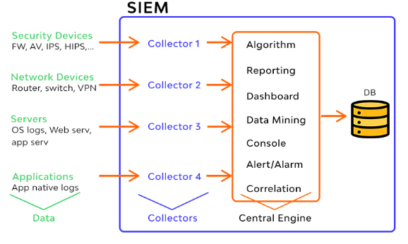

# [Security] SIEM(Security Information And Event Management)
> date - 2022.07.04  
> keyworkd - security, siem  
> SIEM에 대해 정리  

 

## SIEM이란?

  

* network에 대한 보안 위협을 탐지하기 위해 시스템의 로그 수집, 저장, 분석하기 위한 시스템
  * compliance, 공격 탐지, 차단을 위해 보안 위협을 실시간으로 모니터링
* SIM(Security Information Management) + SEM(Security Event Management)
* host, application 등에서 생성되는 log, event를 수집하여 분석
* SIEM solution - ArcSight ESM, IBM QRadar, Splunk 등

 

## SIEM process
1. Collect data
2. Aggregate data
3. Analyze data
4. Detect security breaches
5. Alert about the detected breach

  

> #### Reference
> * [What's Security Information And Event Management Technology? - SIEM Part 1](https://www.wallarm.com/what/siem-whats-security-information-and-event-management-technology-part-1)
