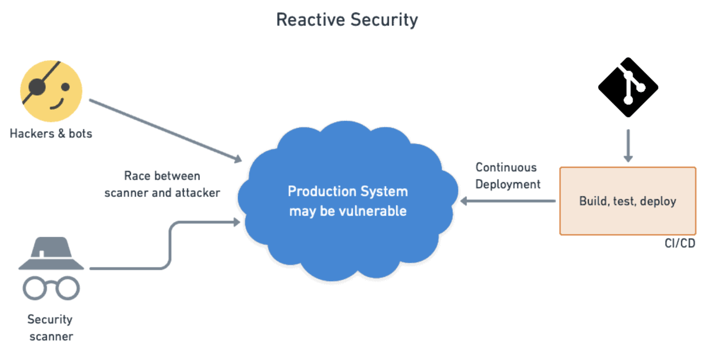
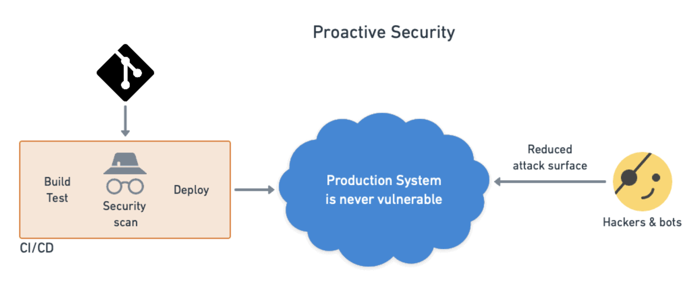

# [Security] How to find and fix container vulnerabilities
> date - 2022.06.20  
> keyworkd - security, container, vulnerabilities  
> container vulnerabilities를 찾고, 수정하는 방법에 대해 정리  

<br>

## CVE(Common Vulnerability and Exposure)란?
* 대중적으로 알려져있고 영향을 미칠 수 있는 SW 취약점을 의미
* linux kernel 보안 취약점 등 다양한 보안 취약점이 해당


<br>

## Reactive vs Proactive Security
<div align="center">
  
  
</div>

* Reactive - 사후 조치 성격의 보안으로 이미 배포된 서비스에 대하여 조치
* Proactive - 사전 예방적인 보안으로 서비스 배포 전에 조치


<br>

## How to find container vulnerabilities
* DevSecOps
  * 전제 - SDLC(Software Development Life Cycle)에서 각 구성원이 보안을 책임진다는 것으로 보안 운영 측면에서 운영과 개발을 통합
  * 목표 - DevOps process에서 가능한 한 빨리 security control, process를 통합하여 development process의 각 단계에 보안을 추가하는 것
    * e.g. CI/CD pipeline에서 critical level vulnerability 발견시 pipeline 중단 또는 검토
* Container give you a software supply chain
  * 예를 들어 VM에 SSH로 연결하여 배포하는 것은 정확히 무엇이 실행되는지 알 수 없기 때문에 debugging 어렵고 권장하지 않는 프로세스
  * container는 하나의 software supply chain으로 자리 잡았으며 deploy 전 build, test, scan 등으로 구성된 pipeline의 각 단계에서 요구 사항을 충족하는지 확인 가능
* vulnerability scanning & patch
  * 꼭 해야하는 boring best pratices 중 하나
  * container image는 immutable이므로 live container가 아닌 container registry에 patch된 image를 upload하는 방식으로 진행하면 source code와 동일한 rollout process를 사용
  * [Amazon ECR(Elastic Container Registry)](https://docs.aws.amazon.com/ko_kr/AmazonECR/latest/userguide/image-scanning.html) 같은 container registry에서 제공하는 vulnerability scanners 사용
  * [grype](https://github.com/anchore/grype), [trivy](https://github.com/aquasecurity/trivy) 같은 OSS vulnerability scanners 사용

<br>

### vulnerability scanners는 수정되지 않을 CVE를 나열
* 실제로 보안 취약점이 아닌 것
* stable release 범위에서 수정할 수 없는 것
* 너무 사소한 것이므로 고칠 의미가 없는 것
* upstream maintainer가 수정 사항을 release하지 않기로 결정한 것

#### 수정가능한 항목만 표시
* [grype](https://github.com/anchore/grype), [trivy](https://github.com/aquasecurity/trivy) 사용시
```sh
$ grype --only-fixed

$ trivy --ignore-unfixed
```


<br>

## How to fix container vulnerabilities
* 불필요한 의존성이라면 제거
* 패치된 버전으로 업그레이드
  * 패치된 버전이 적용된 base image가 릴리즈될 때까지 기다렸다가 적용
  * 신규 base image가 release 전이라면 아래 구문 사용
```dockerfile
RUN apt-get update && apt-get upgrade -y ...
```

<br>

### 필요한 의존성을 가진 base image 사용
* 불필요한 의존성으로 인해 공격 범위가 넓어지므로 필요한 의존성만을 가지는 base image 선택도 중요
* [grype](https://github.com/anchore/grype)를 사용하여 base image의 취약점을 비교

| image | vulnerabilities |
|:--|:--|
| python:3.10.5 | 1066 |
| python:3.10.5-slim | 86 |
| python:3.10.5-alpine | 0 |


<details>
<summary>details</summary>
<div markdown="1">

#### python:3.10.5
```sh
$ grype python:3.10.5
 ✔ Vulnerability DB        [no update available]
 ✔ Loaded image
 ✔ Parsed image
 ✔ Cataloged packages      [430 packages]
 ✔ Scanned image           [1066 vulnerabilities]
NAME                          INSTALLED              FIXED-IN     TYPE  VULNERABILITY     SEVERITY   
apt                           2.2.4                               deb   CVE-2011-3374     Negligible  
binutils                      2.35.2-2                            deb   CVE-2018-9996     Negligible  
...
```

#### python:3.10.5-slim
```sh
$ grype python:3.10.5-slim
 ✔ Vulnerability DB        [no update available]
 ✔ Pulled image
 ✔ Loaded image
 ✔ Parsed image
 ✔ Cataloged packages      [108 packages]
 ✔ Scanned image           [86 vulnerabilities]
NAME              INSTALLED           FIXED-IN     TYPE  VULNERABILITY     SEVERITY
apt               2.2.4                            deb   CVE-2011-3374     Negligible
bsdutils          1:2.36.1-8+deb11u1               deb   CVE-2022-0563     Negligible
...
```

#### python:3.10.5-alpine
```sh
$ grype python:3.10.5-alpine
 ✔ Vulnerability DB        [no update available]
 ✔ Pulled image
 ✔ Loaded image
 ✔ Parsed image
 ✔ Cataloged packages      [39 packages]
 ✔ Scanned image           [0 vulnerabilities]
No vulnerabilities found
```
</div>
</details>


<br>

## Conclusion
* 지금까지 container vulnerabilities 찾고, 수정하는 방법에 대해 알아보았다
* vulnerability scanning & patch는 꼭 해야하는 boring best pratices 중 하나임을 기억하자

<br><br>

> #### Reference
> * [The security scanner that cried wolf](https://pythonspeed.com/articles/docker-security-scanner/)
> * [Exploring container security: How containers enable passive patching and a better model for supply chain security](https://cloud.google.com/blog/products/containers-kubernetes/exploring-container-security-how-containers-enable-passive-patching-and-a-better-model-for-supply-chain-security)
> * [Continuous Container Vulnerability Testing with Trivy](https://semaphoreci.com/blog/continuous-container-vulnerability-testing-with-trivy)
> * [Amazon ECR(Elastic Container Registry)](https://docs.aws.amazon.com/ko_kr/AmazonECR/latest/userguide/image-scanning.html)
> * [grype](https://github.com/anchore/grype)
> * [trivy](https://github.com/aquasecurity/trivy)
> * [docker-library/python CVE-2021-45960 vulnerability in python 3.9-slim #699](https://github.com/docker-library/python/issues/699)
