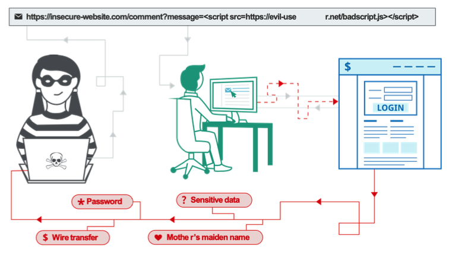
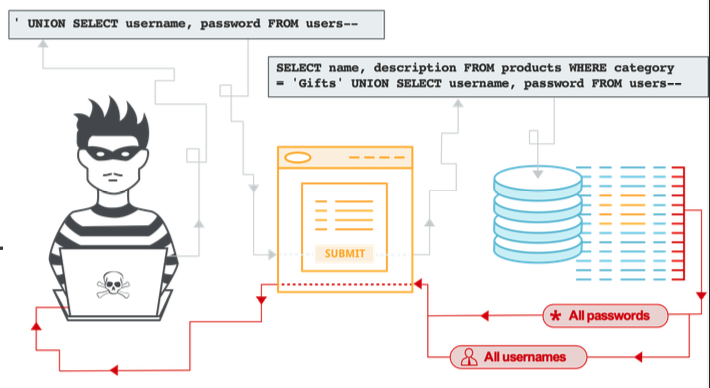

# [Security] Major Vulnerability Case
> date - 2023.05.21  
> keyworkd - security, vulnerability  
> 주요 취약점에 대해 정리

 

## Index
* [XSS(Cross-Site Scripting)](#xsscross-site-scripting)
* [SQL Injection](#sql-injection)
* [검증되지 않은 redirect/forward](#검증되지-않은-redirectforward)
* [OS 명령 실행](#os-명령-실행)
* [XXE Injection](#xxe-injection)
* [SSRF](#ssrfserver-side-request-forgery)
* [CSRF](#csrfcross-site-request-forgery)
* [악성 코드 업로드](#악성-코드-업로드)
* [시스템 파일 다운로드](#시스템-파일-다운로드)
* [파라미터 조작을 통한 어뷰징](#파라미터-조작을-통한-어뷰징)
* [비인증 상태로 중요 페이지 접근 가능성](#비인증-상태로-중요-페이지-접근-가능성)

 

## XSS(Cross-Site Scripting)

  

* 웹 서비스에 Javascript 등 script를 실행할 수 있는 코드를 삽입하여 다른 사용자에게 공격자가 의도한 script를 실행하게 하는 공격 방법

 

### 공격 목적
* 브라우저 취약점을 이용한 사용자 PC 탈취
* script를 이용하여 타인의 인증 정보 탈취

 

### 취약할 수 있는 기능
* 입력 값이 HTML에 랜더링되는 기능

 

### 대응 방안
* `<`, `>`, `(`, `)`, `#`, `&` 등 사용자의 입력 값 검증

 

## SQL Injection

  

* 서비스 내 보안 허점을 의도적으로 공격하여, 이상한 SQL을 실행되게 함으로써 DB를 조작하는 공격으로, 데이터 유출 발생

 

### 공격 목적
* DB에 저장된 개인 정보 등의 데이터 획득
* 사용자들에게 악성 코드 배포를 위한 데이터 조작

 

### 취약할 수 있는 기능
* 사용자 입력 데이터가 SQL에 사용되는 기능

 

### 대응 방안
* `'`, `"`, `=`, `<>`, `()`, `#`, `;` 등 사용자의 입력 값 검증
* JDBC를 사용한다면 PreparedStatement 사용

 

## 검증되지 않은 redirect/forward
* 입력 값에 따라 사용자를 redirect/forward하여 악성 사이트로 이동시키거나 시스템을 우회할 수 있는 취약점

 

### 공격 목적
* 사용자들에게 악성 코드 배포
* 시스템을 우회하여 정상적으로 접근 불가능한 리소스에 접근하여 정보 획득

 

### 취약할 수 있는 기능
* 로그인, 로그아웃 같은 페이지 이동 기능

 

### 대응 방안
* 신뢰할 수 있는 도메인으로만 redirect되도록 사용자 입력 값 검증

 

## OS 명령 실행

  

* system call 같은 시스템 명령어를 사용하는 경우 공격자가 의도한 명령을 수행하는 공격

 

### 공격 목적
* 서버 탈취

 

### 취약할 수 있는 기능
* OS 명령어를 사용하는 기능

 

### 대응 방안
* 사용자 입력 값 검증
* `|`, `[]`, `=`, `$`, `&` 등 사용자의 입력 값 검증

 

## XXE Injection

  

* XML Parser의 DTD(External Entities) 옵션이 설정되어 있는 경우 parser가 XML을 읽는 중 외부 참조가 가능한 데이터를 파싱하여 공격자가 의도한 요청을 수행하게 되는 취약점

 

### 공격 목적
* 서버 시스템 파일 조회
* 서비스 장애
* 내부 시스템 조회

 

### 취약할 수 있는 기능
* 엑셀 업로드 기능
* XML을 입력 받아 데이터를 파싱하는 기능

 

### 대응 방안
* 사용자 입력 데이터에 External Entities 확인

 

## SSRF(Server-side request forgery)

  

* 공격자에 의해 전달된 악의적인 데이터 또는 조작된 인자값을 서버가 처리할 때 해당 서버가 의도하지 않게 내부 리소스를 읽거나 서버 권한으로 악의적인 요청을 보내도록하는 취약점

 

### 공격 목적
* 내부 시스템 조회

 

### 취약할 수 있는 기능
* 다른 도메인의 데이터를 조회하는 기능

 

### 대응 방안
* 내부 도메인은 호출할 수 없도록 사용자의 입력 값 검증

 

## CSRF(Cross-Site Request Forgery)
* [CSRF(Cross-Site Request Forgery)](./../csrf.md) 참고

 

## 악성 코드 업로드

  

* 악성 script를 업로드 후 실행하여 시스템 권한을 획득할 수 있는 취약점

 

### 공격 목적
* 서버 탈취
* 사용자 세션 탈취
* 악성코드 배포

 

### 취약할 수 있는 기능
* 파일 업로드 기능

 

### 대응 방안
* 파일 업로드 확장자 검증

 

## 시스템 파일 다운로드

  

* 파일 다운로드시 파일명 매개변수를 변조하여 시스템 파일을 획득할 수 있는 취약점

 

### 공격 목적
* 서버 시스템 파일 조회

 

### 취약할 수 있는 기능
* 파일 다운로드 기능

 

### 대응 방안
* 파일 다운로드시 파일명, 경로 검증

 

## 파라미터 조작을 통한 어뷰징

  

* 파라미터를 변조하여 인증/결제 우회 등 악위적인 행위를 수행할 수 있는 취약점

 

### 공격 목적
* 개인정보 탈취
* 결제 금액 변조를 통한 이득

 

### 취약할 수 있는 기능
* 사용자 정보 조회 기능
* 결제 기능
* 인증/권한으로 제한된 기능

 

### 대응 방안
* 입력 데이터 처리 전 검증 후 기능 수행

 

## 비인증 상태로 중요 페이지 접근 가능성

  

* 로그인하지 않은 상태나 권한 없는 페이지 URL 호출을 이용해 직접 접근하는 취약점

 

### 공격 목적
* 권한으로 제어되지 않은 기능을악용하여 시스템 우회

 

### 취약할 수 있는 기능
* 인증으로 제한된 기능

 

### 대응 방안
* 접근 가능 페이지별로 인증/권한 검증 후 접근 허용

 

## Conclusion
* 알려진 주요 취약점에 대해 사전 조치를 하여 안전한 서비스가 될 수 있도록 하자

  

> #### Reference
> * [Web Security Academy](https://portswigger.net/web-security/all-labs)
> * [Cross-site scripting](https://portswigger.net/web-security/cross-site-scripting)
> * [Server-side request forgery (SSRF)](https://portswigger.net/web-security/ssrf)
> * [SQL injection](https://portswigger.net/web-security/sql-injection)
> * [XML external entity (XXE) injection](https://portswigger.net/web-security/xxe)
