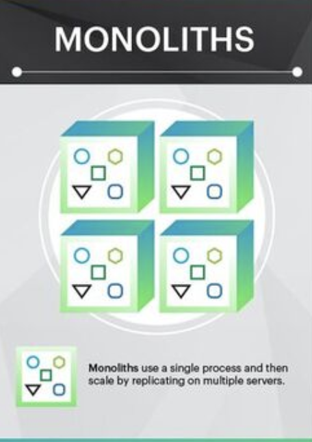
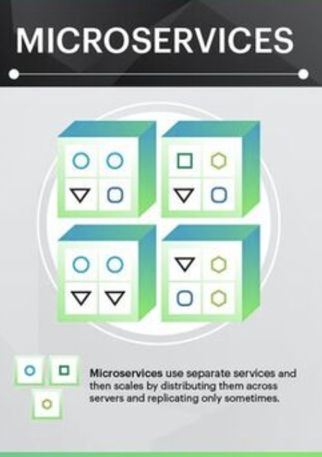
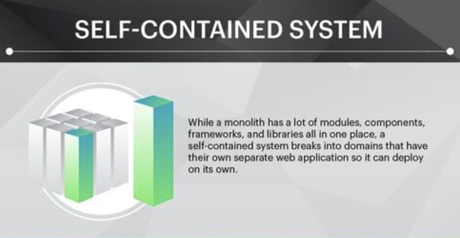

# [Architecture] Monolithic, Micro Service Architecture, Self-Contained System
> date - 2018.11.08  
> keyword - Monolithic, MSA, SCS  
> Monolithic, Micro Service Architecture, Self-Contained System에 대해 정리

 

## Monolithic

* 다양한 기능을 하는 하나의 큰 SW
* 하나의 웹서버로 회원가입, 정보 조회, 메일 발송, 통계 확인 등 안돼는게 없다

 

### 장점

#### 초기 개발이 빠르다
* 어디에서 무엇을 가져와야 하는지에 대한 제약사항이 없기 때문에 새로운 기능 추가가 상대적으로 쉽다

#### Cross-cutting Issue에 대한 고민이 상대적으로 덜 복잡
* 사용자의 신용카드사용 청구, 배송 추적과 같은 다른 워크플로우가 있다면 매우 간단하게 구현
* 필요한 데이터가 함께 있기 때문에
* 메시징과 큐, 적절한 소스를 찾기 위해 별도의 단계를 거치지 않는다

#### 모든 문제가 1번에 해결
* application logging, 속도 제한, 보안 기능을 설정 등

 

### 단점

#### 변경이 너무 어렵다
* 복잡도가 높아 side effect 추론이 어렵다
* 작은 변경이 커다란 문제를 가져올 수 있다
* 기존 기술(버전, 언어, framework)외에 새로운 기술을 쓰기 어렵다

#### 확장성 확보가 어렵다
* 일부분 확장 불가
* 하나의 작은 기능을 수정해도 전체 배포 필요
* 특정 기능에 트래픽이 몰려도 전체를 확장(scale up/out)해야 한다
* 고성능 리소스를 사용하고 있다면 작은 기능의 확장에도 비용 소모가 같다

 

## Micro Service Architecture(MSA)

* 기능별로 서비스를 분리하고 독립적으로 동작하게 구성
* 자체적으로 DB를 갖고 다른 시스템과 연동
* 함께 동작하면 사용자에게 지속적인 경험을 제공할 수 있고, 뒤에서는 개별적으로 동작
* 쪼개는 범위와 전략은 서비스에 따라 다름
  * 무조건 잘게 쪼갠다고 좋지 않음

 

### 장점

#### 유지보수가 빠르고 이해가 빠르다
* 각 Micro Service는 하나의 주된 목적이 존재
* 동작에 대한 추론이 단순 명료
* 개발이 신속해지고 test suit가 포괄적이면서 신속해지며, 적절한 도구만 있으면 다운타임 없이 다른 애플리케이션에 영향을 주지 않고 deploy 가능

#### 분리를 통한 독립성
* 한 micro service가 다운되도 다른 micro service에 영향을 미치지 않는다
* 다운 타임 최소화
  * 주문 시스템이 다운되도, 재고 확인이 가능
* 확장이 필요한 경우 필요한 시스템에 대해서만 비용 지불
* 각 micro service에 적절한 기술 사용이 가능해져서 유연한 조직 구성 가능

 

### 단점

#### 인프라 자동화 필요
* 운영상의 복잡성을 가지고 있다
* 관리할께 많아지고 테스트가 어려워진다
* 수백개의 애플리케이션을 실행하고 있는 형태라 하나의 서버에서 관리할 수 있는 형태가 아니므로 수동으로 배포하기 힘들다

#### Cross-cutting Issue
* 데이터 획득이 어려울 수 있다
* 한곳에서 다른 곳으로 메시징하는 경우(ex. 유저 정보가 모든 곳에 필요한 경우) 메시지를 전달하는 새로운 Micro Service가 필요할 수 있다
* 모든 데이터가 한곳에 있는 모노리스에 대비해 어려움이 있을 수 있다

> 개선과 관리가 쉽고 운영조직의 어려움을 DevOps 조직에서 관리할 수 있다

 

## Self-Contained System(SCS)

* Monolithic과 MSA 중간 쯤에 있는 블록형 아키텍처

* 여러개의 Micro Service를 하나의 Entity로 나타내면서도 Monolithic 보다는 작은 규모를 가지는 형태
* 매우 연관성이 높아 타이트한 커플링이 필요한 Micro Service가 있다면 Self-Contained System으로 변경

 

### 장점
* 두 형태의 장점을 모두 가진다
* Cross-cutting Issue가 매우 쉽게 제어되면서도 MSA의 확장, 수정, 배포의 이점을 누릴 수 있다
* client에서 필요한 데이터를 내부적으로 가지고 있기 때문에 복잡한 메시징, 표준 데이터 형태에 고민하지 않아도 된다

 

### 단점
* 아키텍처 정의가 어렵다
* MSA와 SCS의 모호한 경계 존재
* 서비스 분리 작업이 어렵다
* 어떤 기능을 내부/외부에 둘지 선택 문제

> Self-Contained System은 Micro Service를 지향하는 조직에 적합
> Monolithic -> Self-Contained System으로 가는 과정은 MSA를 채택하게되는 중요한 첫걸음

 

> #### Reference
> * [Microservices, Monoliths, and Self-Contained Systems: Time to Break it Down](https://blog.appdynamics.com/engineering/microservices-monoliths-and-self-contained-systems-time-to-break-it-down/)
