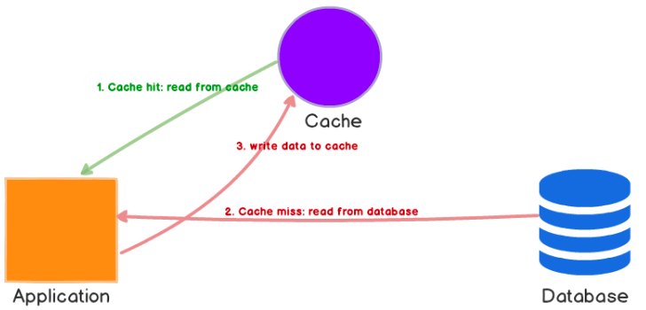
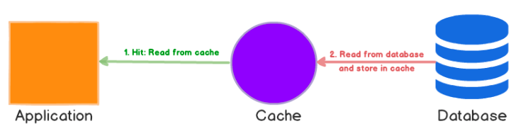
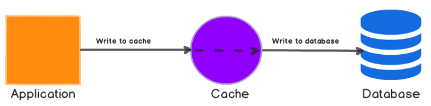
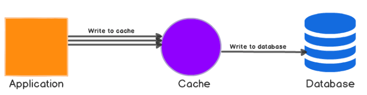

# [Server] Cache & Caching Strategies
> date - 2022.07.02  
> keyworkd - server, cache, strategy  
> cache와 cache strategy에 대해 정리  

<br>

## Cache란?
* 느린 component를 빠른 중간 component로 대체하는 것
* 한번 전달 받은 data를 어딘가에 저장해두고 다시 사용할 때 꺼내 쓴다면 반복적으로 data 요청할 필요가 없다
* 반복적으로 사용하는 data를 빠르게 사용할 수 있고(응답 시간 감소), network 전송량을 감소시켜 비용 효율적이다
* 일반적으로 enterprise에서 L1 cache와 L2 cache로 나누어진다
  * L1 cache - local cache
  * L2 cache - global cache
* system performance를 높이는 가장 쉬운 방법 중 하나


<br>

### Local Cache
* client side에서 유저가 가장 가까이 접하는 cache는 browser cache
* server side에서는 [Caffeine](https://github.com/ben-manes/caffeine) 같은 library로 구현
  * async loading, refresh 사용

<br>

### Global Cache
* Redis 같은 In-Memory DB를 사용하여 구현
  * Redis에서 여러건 조회시 `Loop + GET`은 network latency로 인해서 느리므로 `MGET`을 사용


<br>

## Cache Strategy
data access pattern에 따라 선택

* [Cache-Aside](#cache-aside)
* [Read-through](#read-through)
* [Write-through](#write-through)
* [Write-Around](#write-around)
* [Write-Back](#write-backwrite-behind)
* [Adding TTL](#adding-ttl)
* [Refresh Ahead](#refresh-ahead)

<br>

### Cache-Aside
<div align="center">
  
</div>

<br>

* Lazy loading
  * 필요할 때에만 data를 caching
* 동일한 data에 대한 **read-heavy** workload에 적합

#### cache hit(data가 cache에 있을 때)
1. cache에 data를 요청
2. cache에 있는 data를 응답

#### cache miss(data가 cache에 없을 때)
1. cache에 data를 요청
2. cache에 data가 없음
3. DB에서 data를 가져와서 응답
4. data를 caching


#### Pros
* 사용한 데이터만 caching
* cache의 장애가 서비스에 치명적이지 않다
  * cache 장애시 DB의 data 사용하므로 DB로 부하 이동
* application이 cache에 data를 write하므로 cache의 data model은 DB의 data model과 다를 수 있다
  * 필요한 data만 가공하여 caching

#### Cons
* 처음 요청시 항상 cache miss 발생
  * warming(or pre-heating)을 통해 미리 caching하여 처리 가능
* cache miss시 latency가 증가
  * cache에 data 요청 시간
  * DB에 data 요청 시간
  * data caching 시간
* cache miss시에만 data를 cache에 쓰면 data의 유효 기간이 경과할 수 있다
  * DB의 data가 변경되면 cache의 data와 불일치 발생
  * `Write-through` or `TTL` 구현 필요

<br>

```
data = get_data(1000)

get_data(data_id)
  data = cache.get(data_id)

  if data == null  // cache miss
    data = db.get(data_id)
    cache.set(data_id, data)
  
  return data
```

<br>

### Read-through
<div align="center">
  
</div>

<br>

* Lazy loading
* cache는 DB와 in-line으로 배치
* cache miss시 DB에서 data를 caching하고 application에 반환
* 동일한 data에 대한 **read-heavy** workload에 적합
* library, stand-alone cache provider가 caching

#### Pros
* Cache-Aside와 동일
* `Cache-Aside`와 달리 cache의 data model은 DB의 data model과 다를 수 없다

#### Cons
* Cache-Aside와 동일

<br>

### Write-through
<div align="center">
  
</div>

<br>

* data는 cache에 write 후 DB에 write(**synchronous**)
  1. application은 cache에 data write
  2. cache는 DB에 data wirte
  3. cache가 data를 application으로 응답
* cache는 DB와 in-line으로 배치
* `Read-through`와 같이 사용면 `Read-through`의 모든 이점을 얻을 수 있고, data 일관성이 보장되므로 data invalidation을 고려하지 않아도 된다
  * e.g. [DynamoDB Accelerator(DAX)](https://aws.amazon.com/dynamodb/dax)

#### Pros
* cache의 data가 항상 최신이므로 data 유효 기간이 없다
* 모든 data의 변경에 DB와 cache에 변경이 필요하여 latency가 증가

#### Cons
* cache node 장애(or scaling)시 추가되는 node에는 data에 변경이 발생되기 전까지 cache에서 data가 누락
  * `Lazy loading` 구현하여 최소화 가능
* 대부분의 data는 자주 사용되지 않으며, 그런 data가 cache 공간을 차지하므로 리소스 낭비 발생
  * `TTL`을 사용하여 리소스 낭비 최소화 가능

<br>

```
save_data(data_id, value)
  data = db.save(data_id, value)
  cache.set(data_id, data)
```

<br>

### Write-Around
* data는 DB에 write, 접근한 data만 caching
* `Read-through` or `Cache-Aside`와 결합 가능

<br>

### Write-Back(=Write-behind)
<div align="center">
  
</div>

<br>

* data를 cache write, 약간의 지연 후에 DB에 write(**asynchronous**)
* **write-heavy** workload에 적합
* `Read-through`와 결합하면 cache에서 항상 최신 data가 유지되므로, **read/write-heavy** workload에 적합
* DB의 downtime에 강하다
* DB에 대한 batch processing이 지원되는 경우 write를 줄일 수 있으므로 비용 절감 효과를 볼 수 있다
  * [DynamoDB Accelerator(DAX)](https://aws.amazon.com/dynamodb/dax)는 `Write-through`이므로 write-heavy workload일 경우 비용이 많아질 수 있다
* spike traffic을 대응하기 위해 `Cache-Aside` + `Write-Back`을 사용
  * cache 장애시 data loss 발생
* MySQL InnoDB engine은 내부에서 `Write-Back` cache 사용
  * query는 memory에 기록되고 disk로 flush

<br>

### Adding TTL
`Lazy loading`은 유효 기간으로 인한 data 불일치를 허용하지만, empty node로 인해 실패하지 않는다  
`Write-through`는 최신 data를 항상 유지하지만, empty node로 실패할 수 있으며 리소스 낭비가 발생할 수 있다  
각 write에 `TTL(Time to Live)`을 추가하면 각 전략의 이점을 얻을 수 있다  

<br>

```
cache.set(data_id, data, 300)
```

<br>

### Refresh Ahead
* cache가 만료되기 전에 최근에 사용된 data는 reload
* 어떤 data에 접근이 필요한지 예측할 수 있다면 성능을 개선할 수 있다
  * 예측이 실패한다면 리소스 낭비가 발생

<br>

## Conclusion
* data type과 access pattern에 적절한 cache strategy를 선택하는게 중요하다


<br><br>

> #### Reference
> * [Caffeine - A high performance caching library for Java](https://github.com/ben-manes/caffeine)
> * [Caching strategies - Amazon ElastiCache for Redis Docs](https://docs.aws.amazon.com/AmazonElastiCache/latest/red-ug/Strategies.html)
> * [What is Caching?](https://medium.com/system-design-blog/what-is-caching-1492abb92143)
> * [Caching Strategies and How to Choose the Right One](https://codeahoy.com/2017/08/11/caching-strategies-and-how-to-choose-the-right-one/)
