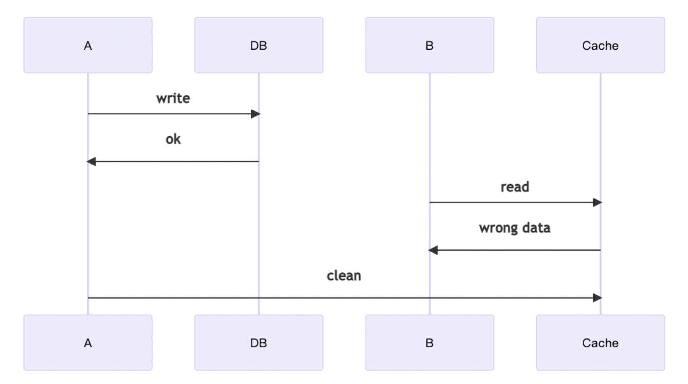

# [Server] Cache & Caching Strategies
> date - 2022.07.02  
> keyworkd - server, cache, strategy  
> cache와 cache strategy에 대해 정리  

<br>

## Cache란?
* 느린 component를 빠른 중간 component로 대체하는 것
* **더 가까운(빠른) 임시 저장소**로 data를 복사하여 저장해두고 사용하는 것이 caching
* 한번 전달 받은 data를 어딘가에 저장해두고 다시 사용할 때 꺼내 쓴다면 반복적으로 data 요청할 필요가 없다
* 반복적으로 사용하는 data를 빠르게 사용할 수 있고(응답 시간 감소), network 전송량을 감소시켜 비용 효율적이다
* 일반적으로 enterprise에서 L1 cache와 L2 cache로 나누어진다
  * L1 cache - local cache
  * L2 cache - global cache
* system performance를 높이는 가장 쉬운 방법 중 하나
* data를 여러 곳에 저장하므로 data 불일치는 불가피하며 data 불일치와 trade off로 Disk I/O로 인한 성능 병목을 memory로 해결하려는 접근
  * 휘발성 data를 memory에 caching

<br>

### Local Cache
* client side에서 유저가 가장 가까이 접하는 cache는 browser cache
* server side에서는 [Caffeine](https://github.com/ben-manes/caffeine) 같은 library로 구현
  * async loading, refresh 사용
  * 별도의 infrastructure 불필요하며 application memory를 사용하므로 접근 속도가 매우 빠르다
  * application의 memory 사용량이 증가하여 `OOM`이 발생할 수 있고, 여러 application 간의 data 정합성(consistency)을 보장할 수 없다
* 변경이 거의 없는 data or 동일 data를 매우 빈번하게 사용하는 경우 유용

<br>

### Global Cache
* Redis 같은 In-Memory DB를 사용하여 구현
  * Redis에서 여러건 조회시 `Loop + GET`은 network latency로 인해서 느리므로 `MGET`을 사용
* 여러 application이 동일한 곳을 사용하기 때문에 data 정합성은 local cache에 비해 유리
* 별도의 infrastructure 필요
* network를 사용하므로 local cache보다 느리다
  * local cache보다 멀기 때문


<br>

## Cache 사용시 고려 사항
* 변경에 민감한 data인가?
* 연산이 비싼 data인가?
* 얼마나 자주 사용되는 data인가?

<br>

### 변경에 민감한 data인가?
* 티켓팅 등 재고가 중요한 경우 data의 변화가 실시간으로 반영되는 것이 중요하다면 변경이 자주 발생하므로 caching의 의미가 없다
* 재고 같은 경우 빠르게 반영되지 않는다면 이후 재고 부족으로 강제 취소될 수 있으므로 UX에 안좋은 영향이 발생할 수 있다
* 실시간으로 반영되지 않더라도 UX에 큰 영향이 없는 SNS 피드 같은 data일 때 유용

<br>

### 연산이 비싼 data인가?
* data를 만들기 위해 필요한 연산이 비쌀수록 반복적인 수행을 줄이는 것이 중요
* 적절한 TTL(Time-To-Live)을 설정하여 cache hit ratio를 높이면 성능을 높이면서, 리소스를 절감할 수 있다

<br>

### 얼마나 자주 사용되는 data인가?
* 연산이 비쌀수록 cache의 효과는 좋아지지만 사용량이 미비하다면 caching하는 의미가 없을 수 있다
* cache miss ratio가 높아져 효과가 떨어지게 된다


<br>

## Cache 설계하기
* memory는 disk보다 성능이 좋지만, 비싸고 용량이 적기 때문에 어떤 data를 얼마나, 어떻게 저장할 것인지가 중요
* 무분별하게 사용하면 Out Of Memory error가 발생하거나 리소스 낭비가 발생하게 된다

<br>

### 어떤 data를 얼마나 저장할 것인가?
* 수많은 data 중 cache에 저장할 때 효과가 높은 data를 저장해야한다
* 자주 변경되는 data 보다는 변경에 민감하지 않은 data가 좋다
* 거의 변경이 일어나지 않는 data라면 global cache 보다는 local cache를 이용하면 더 빠르고 효율적

<br>

### 어떻게 저장할 것인가?
* data에 따라 적절한 **data structure**를 사용하여 저장해야하며 TTL 등을 이용한 갱신 방법도 중요
  * 단건 저장보다는 list or hash, bitmap 사용
* TTL이 길면 길수록 raw data의 접근이 줄어들어 성능을 높일 수 있지만, 그 사이 data 변경이 발생할 수 있다면 정합성은 상대적으로 떨어지게된다
* event 등으로 data 변경을 추적할 수 있는 경우, TTL을 길게 가져가고 변경이 발생하는 즉시 event를 이용해 갱신하여 정합성을 보장할 수 있다
  * 그렇지 않은 경우 TTL을 짧게 가져가 갱신을 자주하여 정합성을 보장한다


<br>

## Cache Strategy
data access pattern에 따라 선택

* [Cache Aside](#cache-asidelazy-loading)
* [Read through](#read-through)
* [Write through](#write-through)
* [Write Around](#write-around)
* [Write Back](#write-backwrite-behind-delayed-write)
* [Adding TTL](#adding-ttl)
* [Refresh Ahead](#refresh-ahead)

<div align="center">
  
</div>

<br>

### Cache Aside(=Lazy loading)
<div align="center">
  
</div>

<br>

* **Read Strategies**
* 필요할 때 data를 caching
* cache에서 data fetching -> cache miss시 DB에서 data fetching
  * e.g. Spring cache
* 동일한 data에 대한 **read-heavy** workload에 적합
* cache miss ratio가 낮거나 `cache miss + DB data fetching의 latency`가 허용되는 경우 사용

#### cache hit(data가 cache에 있을 때)
1. cache에 data를 요청
2. cache에 있는 data를 응답

#### cache miss(data가 cache에 없을 때)
1. cache에 data를 요청
2. cache에 data가 없음
3. DB에서 data를 가져와서 응답
4. data를 caching


#### Pros
* 사용한 데이터만 caching
* cache의 장애가 서비스에 치명적이지 않다
  * cache 장애시 DB의 data 사용하므로 DB로 부하 이동
* application이 cache에 data를 write하므로 cache의 data model은 DB의 data model과 다를 수 있다
  * 필요한 data만 가공하여 caching

#### Cons
* 처음 요청시 항상 cache miss 발생
  * warming(or pre-heating)을 통해 미리 caching하여 처리 가능
* cache miss시 latency가 증가
  * cache에 data 요청 시간
  * DB에 data 요청 시간
  * data caching 시간
* cache miss시에만 data를 cache에 쓰면 data의 유효 기간이 경과할 수 있다
  * DB의 data가 변경되면 cache의 data와 불일치 발생
  * `Write through` or `TTL` 구현 필요

<br>

```
data = get_data(1000)

get_data(data_id)
  data = cache.get(data_id)

  if data == null  // cache miss
    data = db.get(data_id)
    cache.set(data_id, data)
  
  return data
```

<br>

### Read through
<div align="center">
  
</div>

<br>

* **Read Strategies**로 cache와 DB를 in-line으로 배치
* cache miss시 DB에서 data를 caching하고 application에 반환
* `cache aside`와 다르게 cache가 data fetching을 수행
* 동일한 data에 대한 **read-heavy** workload에 적합
* library, stand-alone cache provider가 caching
  * application code에서 DB에서의 data fetching을 추상화하고, 추상화 layer에서 자동으로 caching & data fetching 처리
  * e.g. Hibernate Cache

#### Pros
* `Cache Aside`와 동일
* `Cache Aside`와 달리 cache의 data model은 DB의 data model과 다를 수 없다

#### Cons
* Cache-Aside와 동일

<br>

### Write through
<div align="center">
  
</div>

<br>

* **Write Strategies**
* data는 cache에 write 후 **즉시** DB에 write(**synchronous**)
  1. application은 cache에 data write
  2. cache는 DB에 data wirte
  3. cache가 data를 application으로 응답
* cache는 DB와 in-line으로 배치
* **data 일관성(loss 허용 X)이 중요한 write-heavy** workload에 적합
* `Read through`와 같이 사용하면 `Read through`의 모든 이점을 얻을 수 있고, data 일관성이 보장되므로 data invalidation을 고려하지 않아도 된다
  * e.g. [DynamoDB Accelerator(DAX)](https://aws.amazon.com/dynamodb/dax)

#### Pros
* cache의 data가 항상 최신이므로 data 유효 기간이 없다
* 모든 data의 변경에 DB와 cache에 변경이 필요하여 latency가 증가

#### Cons
* cache node 장애(or scaling)시 추가되는 node에는 data에 변경이 발생되기 전까지 cache에서 data가 누락
  * `Lazy loading` 구현하여 최소화 가능
* 대부분의 data는 자주 사용되지 않으며, 그런 data가 cache 공간을 차지하므로 리소스 낭비 발생
  * `TTL`을 사용하여 리소스 낭비 최소화 가능

<br>

```
save_data(data_id, value)
  data = db.save(data_id, value)
  cache.set(data_id, data)
```

<br>

### Write Around
* **Write Strategies**
* data는 DB에 write, 접근한 data만 caching
* `Read through` or `Cache Aside`와 결합 가능
* DB에 write한 data가 cache에서 즉시 사용되지 않은 경우 사용

<br>

### Write Back(=Write behind, delayed write)
<div align="center">
  
</div>

<br>

* **Write Strategies**
* data를 cache write, 약간의 **지연 후**에 그동안 발생한 data를 DB에 write(**asynchronous**)
  * `Write through`는 즉시 DB에 wirte하고, `Write Back`은 지연 후 모아서 write하는게 다르다
* cache 장애시 data loss가 발생하므로 약간의 **data loss가 허용되는 write-heavy** workload에 적합
* `Read through`와 결합하면 cache에서 항상 최신 data가 유지되므로, **read/write-heavy** workload에 적합
* DB의 downtime에 강하다
* DB에 대한 batch processing이 지원되는 경우 write를 줄일 수 있으므로 비용 절감 효과를 볼 수 있다
  * [DynamoDB Accelerator(DAX)](https://aws.amazon.com/dynamodb/dax)는 `Write through`이므로 write-heavy workload일 경우 비용이 많아질 수 있다
* spike traffic을 대응하기 위해 `Cache Aside` + `Write Back`을 사용
* MySQL InnoDB engine은 내부에서 `Write Back` cache 사용
  * query는 memory에 기록되고 disk로 flush

<br>

### Adding TTL
`Lazy loading`은 유효 기간으로 인한 data 불일치를 허용하지만, empty node로 인해 실패하지 않는다  
`Write through`는 최신 data를 항상 유지하지만, empty node로 실패할 수 있으며 리소스 낭비가 발생할 수 있다  
각 write에 `TTL(Time to Live)`을 추가하면 각 전략의 이점을 얻을 수 있다  

<br>

```
cache.set(data_id, data, 300)
```

<br>

### Refresh Ahead
* cache가 만료되기 전에 최근에 사용된 data는 reload
* 어떤 data에 접근이 필요한지 예측할 수 있다면 성능을 개선할 수 있다
  * 예측이 실패한다면 리소스 낭비가 발생


<br>

## Usage
| Cache Strategies | Description |
|:--|:--|
| Cache Aside + Write Through | data 일관성을 보장하고, read시 세밀한 제어가 가능하지만 즉각적인 DB wirte로 부하가 발생할 수 있다 |
| Cache Aside + Write Back | DB write를 지연시키므로 특히 spike write traffic에 강하며, read시 세밀한 제어 가능 |
| Read Through + Write Through | Read through의 모든 이점을 사용하며, data 일관성을 보장하므로 data invalidation 불필요 | 
| Read Through + Write Back | 최신 data가 cache에 항상 유지되므로 read/write-heavy workload에 적합하며, DB write를 지연시키므로 특히 spike write traffic에 강하며, DB에 대해 fault tolerance를 가지지만 cache fault시 data loss 위험이 있다 |

<br>

### Cache Aside + Write Around + TTL + clean cache
* `Cache Aside + Write Around + TTL`로 구성시 최신 data는 DB에 write되므로 TTL에 따라 data 불일치 발생
* TTL을 길게 설정하면 data 불일치 시간이 증가하여 cache 효율이 떨어지게되고, TTL을 짧게 설정하면 data 일관성은 지켜지나 cache가 의미 없어진다
  * TTL 1s -> 1s 이내에 접근이 없으면 caching의 가치가 없다
* 이를 cache invalidation(clean cache)으로 개선

#### Read
* cache에서 data fetching --(cache miss)--> DB에서 data fetching -> cache update + TTL(long time)

#### Wirte
* DB에 write -> cache invalidation(clean cache)

#### Potential problems
* write DB -> clean cache 사이 시간동안 불일치 발생

<div align="center">
  
</div>

* write DB 이후 process가 중단되어 clean cache가 발생하지 않으면 TTL로 인한 만료 전까지 불일치 발생

<div align="center">
  
</div>


* (A) cache miss 후 DB에서 읽기 -> (B)DB에 write 후 clean cache -> (A)cache write하면 불일치 발생

<div align="center">
  
</div>

#### Improve
* case 1, 3은 write DB 이후 즉시 clean cache하는 방식으로 불일치를 최소화할 수 있다
* `Cache Aside + Write Around + TTL + clean cache`는 단순한 구현으로 비교적 높은 수준의 일관성을 달성할 수 있다
* 간단하지만 올바르게 구현되면 신뢰성이 높다

<br>

* data 불일치의 원인 중 하나는 여러 사용자가 cache와 DB에 접근할 수 있기 때문으로 동시에 write가 일어나면 작업 순서에 따라 불일치 발생한다. 아래의 방법으로 data write를 제한하여 불일치를 효과적으로 회피할 수 있다

### Read Through

#### Read
* cache에서 data fetching --(cache miss)--> cache가 write DB에서 data fetching -> cache update -> cache가 data 반환

#### Wirte
* 일반적으로 `Write Through` or `Write Back`와 함께 사용

#### Potential problems
* 모든 cache가 `Read Through`를 지원하지 않으므로 구현 필요

#### Improve
<div align="center">
  
</div>

* Redis 같은 cache를 `DAL(Data Access Layer)`로 사용, cache와 DB를 조정하는 API server 존재
* application은 cache 작동 방식, DB가 어디에 있는지와 상관 없이 API를 사용하여 DAL에서 data를 사용

<br>

### Write Through

#### Read
* 일반적으로 `Read Throug`h와 함께 사용

#### Wirte
* write cache -> cache가 write DB


#### Potential problems
* 모든 cache가 `Write Through`를 지원하지 않으므로 구현 필요
* data loss 가능성이 있어 data persistence에 적합하지 않음
  * cache는 data 조작에 사용하도록 설계되지 않았다(e.g. RDB의 ACID 보장 등 부재)

#### Improve
* `Read Through`와 마찬가지로 `DAL` 구현
* ACID & data persistence가 중요하다면 `Write Back` 사용

<br>

### Write Back (Write Behind)

#### Read
* 일반적으로 `Read through`와 같이 사용

#### Wirte
* write cache -> cache가 write DB

#### Potential problems
* 모든 cache가 `Write Back`을 지원하지 않으므로 구현 필요
* `Read Through`, `Write Through`와 비슷해 보이나 `Write Through`의 문제를 해결하기 위해 구현이 다르다

<div align="center">
  
</div>

* `Write Through`와 다르게 cache가 아닌 message queue를 사용해 `DAL` 구현
* message queue를 올바르게 사용하기 위한 도메인 지식과 리소스 필요

#### Improve
* message queue를 사용해 변경 사항을 추적에 안정성을 보장
* 단건의 변경이 담긴 message를 모아 일괄로 처리하여 DB access를 줄일 수 있다
* DB의 insert -> delete, delete -> insert는 다른 의미를 가지므로 message의 순서 보장 필요
  * e.g. kafka -> partition key 사용
* `write back`의 구현 복잡도는 높기 때문에 복잡성을 감당할 수 없다면 `cache aside`를 사용하는게 더 나은 선택

<br>

### Double Delete

#### Read
* cache에서 data fetching --(cache miss)--> DB에서 data fetching -> cache update -> cache가 data 반환
* cache aside와 동일

#### Wirte
* clean cache -> write DB -> 대기 후 clean cache

#### Potential problems
* cache aside의 edge case로 인한 data 불일치를 해소
* 대기 시간 동안 불일치가 발생하며, cache aside edge case2의 위험성이 있다

#### Improve
* graceful shutdown으로 cache aside edge case2 개선 가능


<br>

## Conclusion
* data type과 access pattern에 적절한 cache strategy를 선택하는게 중요하다
* 일반적으로 일관성(consistency)이 중요하지 않은 경우 cache invalidation으로 충분하며, 구현이 쉽다(e.g. CDN)
* 일관성이 중요해지면 `cache aside` or `double delete`로 대부분의 요구사항을 충족시킬 수 있으며, 더 중요해지면 `read through`, `write through`, `write back` 같은 더 복잡한 구현이 필요하며 더 많은 비용이 발생
* 일관성을 더 향상시키기 위해 consensus algorithms 같은 기술을 사용해 data 일관성을 보장할 수 있으나, 대부분의 경우 cache aside or double delete로 충분


<br><br>

> #### Reference
> * [Caffeine - A high performance caching library for Java](https://github.com/ben-manes/caffeine)
> * [Caching strategies - Amazon ElastiCache for Redis Docs](https://docs.aws.amazon.com/AmazonElastiCache/latest/red-ug/Strategies.html)
> * [What is Caching?](https://medium.com/system-design-blog/what-is-caching-1492abb92143)
> * [Caching Strategies and How to Choose the Right One](https://codeahoy.com/2017/08/11/caching-strategies-and-how-to-choose-the-right-one/)
> * [Consistency between Cache and Database, Part 1](https://lazypro.medium.com/consistency-between-cache-and-database-part-1-f64f4a76720)
> * [Consistency between Cache and Database, Part 2](https://lazyprro.medium.com/consistency-between-cache-and-database-part-2-e28fc7f8a7c3)

<br>

> #### Further reading
> * [TAO: The power of the graph](https://engineering.fb.com/2013/06/25/core-data/tao-the-power-of-the-graph/)
> * [Cache made consistent: Meta’s cache invalidation solution](https://engineering.fb.com/2022/06/08/core-data/cache-invalidation/)
